<h1>Table of Contents<span class="tocSkip"></span></h1>
<div class="toc" style="margin-top: 1em;"><ul class="toc-item"><li><span><a href="#Analysis-of-serum-mutational-antigenic-profiling" data-toc-modified-id="Analysis-of-serum-mutational-antigenic-profiling-1">Analysis of serum mutational antigenic profiling</a></span><ul class="toc-item"><li><span><a href="#Configure-analysis" data-toc-modified-id="Configure-analysis-1.1">Configure analysis</a></span><ul class="toc-item"><li><span><a href="#Import-Python-modules-/-packages" data-toc-modified-id="Import-Python-modules-/-packages-1.1.1">Import Python modules / packages</a></span></li><li><span><a href="#Get-config-variables" data-toc-modified-id="Get-config-variables-1.1.2">Get config variables</a></span></li><li><span><a href="#Get-sera-information" data-toc-modified-id="Get-sera-information-1.1.3">Get sera information</a></span></li><li><span><a href="#Get-list-of-samples" data-toc-modified-id="Get-list-of-samples-1.1.4">Get list of samples</a></span></li></ul></li><li><span><a href="#Align-sequencing-and-count-mutations" data-toc-modified-id="Align-sequencing-and-count-mutations-1.2">Align sequencing and count mutations</a></span><ul class="toc-item"><li><span><a href="#Run-dms2_batch_bcsubamp" data-toc-modified-id="Run-dms2_batch_bcsubamp-1.2.1">Run <code>dms2_batch_bcsubamp</code></a></span></li><li><span><a href="#Plot-sequencing-and-mutation-counts-summaries" data-toc-modified-id="Plot-sequencing-and-mutation-counts-summaries-1.2.2">Plot sequencing and mutation counts summaries</a></span><ul class="toc-item"><li><span><a href="#Reads-and-barcodes-per-sample" data-toc-modified-id="Reads-and-barcodes-per-sample-1.2.2.1">Reads and barcodes per sample</a></span></li><li><span><a href="#Coverage-across-gene" data-toc-modified-id="Coverage-across-gene-1.2.2.2">Coverage across gene</a></span></li><li><span><a href="#Mutation-frequencies" data-toc-modified-id="Mutation-frequencies-1.2.2.3">Mutation frequencies</a></span></li><li><span><a href="#Check-for-oxidative-damage" data-toc-modified-id="Check-for-oxidative-damage-1.2.2.4">Check for oxidative damage</a></span></li></ul></li><li><span><a href="#Renumber-to-standard-HA-numbering" data-toc-modified-id="Renumber-to-standard-HA-numbering-1.2.3">Renumber to standard HA numbering</a></span></li></ul></li><li><span><a href="#Compute-immune-selection-on-mutations" data-toc-modified-id="Compute-immune-selection-on-mutations-1.3">Compute immune selection on mutations</a></span><ul class="toc-item"><li><span><a href="#Samples-to-compare-for-each-selection" data-toc-modified-id="Samples-to-compare-for-each-selection-1.3.1">Samples to compare for each selection</a></span></li><li><span><a href="#Choose-measure-of-immune-selection" data-toc-modified-id="Choose-measure-of-immune-selection-1.3.2">Choose measure of immune selection</a></span></li><li><span><a href="#Compute-immune-selection" data-toc-modified-id="Compute-immune-selection-1.3.3">Compute immune selection</a></span></li><li><span><a href="#Get-all-selection-information-in-one-data-frame" data-toc-modified-id="Get-all-selection-information-in-one-data-frame-1.3.4">Get all selection information in one data frame</a></span></li></ul></li><li><span><a href="#Analyze-immune-selection" data-toc-modified-id="Analyze-immune-selection-1.4">Analyze immune selection</a></span><ul class="toc-item"><li><span><a href="#Examine-all-samples-and-choose-ones-to-retain" data-toc-modified-id="Examine-all-samples-and-choose-ones-to-retain-1.4.1">Examine all samples and choose ones to retain</a></span><ul class="toc-item"><li><span><a href="#Plot-site-level-selection-for-all-samples" data-toc-modified-id="Plot-site-level-selection-for-all-samples-1.4.1.1">Plot site-level selection for all samples</a></span></li><li><span><a href="#Choose-samples-to-retain-based-on-infectivity-remaining" data-toc-modified-id="Choose-samples-to-retain-based-on-infectivity-remaining-1.4.1.2">Choose samples to retain based on infectivity remaining</a></span></li><li><span><a href="#Listing-of-retained-samples" data-toc-modified-id="Listing-of-retained-samples-1.4.1.3">Listing of retained samples</a></span></li></ul></li><li><span><a href="#Compute-serum-average-from-retained-samples" data-toc-modified-id="Compute-serum-average-from-retained-samples-1.4.2">Compute serum average from retained samples</a></span></li><li><span><a href="#Choose-averaging-method-for-downstream-use" data-toc-modified-id="Choose-averaging-method-for-downstream-use-1.4.3">Choose averaging method for downstream use</a></span></li><li><span><a href="#Identify-sites-of-&quot;significant&quot;-selection" data-toc-modified-id="Identify-sites-of-&quot;significant&quot;-selection-1.4.4">Identify sites of "significant" selection</a></span><ul class="toc-item"><li><span><a href="#Cutoff-for-significance" data-toc-modified-id="Cutoff-for-significance-1.4.4.1">Cutoff for significance</a></span></li><li><span><a href="#Identify-significant-sites" data-toc-modified-id="Identify-significant-sites-1.4.4.2">Identify significant sites</a></span></li><li><span><a href="#List-significant-sites-for-each-serum" data-toc-modified-id="List-significant-sites-for-each-serum-1.4.4.3">List significant sites for each serum</a></span></li><li><span><a href="#Get-significant-sites-for-each-serum-group" data-toc-modified-id="Get-significant-sites-for-each-serum-group-1.4.4.4">Get significant sites for each serum group</a></span></li></ul></li><li><span><a href="#Plot-serum-average-selection" data-toc-modified-id="Plot-serum-average-selection-1.4.5">Plot serum-average selection</a></span><ul class="toc-item"><li><span><a href="#Choose-sites-to-zoom-in-on" data-toc-modified-id="Choose-sites-to-zoom-in-on-1.4.5.1">Choose sites to zoom-in on</a></span></li><li><span><a href="#Compact-plots-of-replicate-average-selection" data-toc-modified-id="Compact-plots-of-replicate-average-selection-1.4.5.2">Compact plots of replicate-average selection</a></span></li><li><span><a href="#Compact-plots-showing-each-replicate" data-toc-modified-id="Compact-plots-showing-each-replicate-1.4.5.3">Compact plots showing each replicate</a></span></li><li><span><a href="#Whole-gene-logo-plots-of-replicate-average-selection" data-toc-modified-id="Whole-gene-logo-plots-of-replicate-average-selection-1.4.5.4">Whole-gene logo plots of replicate-average selection</a></span></li></ul></li></ul></li></ul></li></ul></div>

# Analysis of serum mutational antigenic profiling
This Python Jupyter notebook analyzes mutational antigenic profiling of serum against virus carrying the A/Perth/2009 (H3N2) HA.

## Configure analysis
We first configure the analysis by importing packages and getting information on the samples that we will analyze.

### Import Python modules / packages
Import modules / packages.
In particular, we use:

 - [plotnine](https://plotnine.readthedocs.io) for ggplot2-like plotting syntax
 - [dmslogo](https://jbloomlab.github.io/dmslogo/) to draw sequence logo plots
 - [dms_tools2](https://jbloomlab.github.io/dms_tools2/) for much of the analysis


```python
import os
import math
import collections
import itertools
import warnings
import subprocess

import yaml
import pandas as pd

from IPython.display import display, HTML

import matplotlib.pyplot as plt
import plotnine as p9  # shorter name instead of import *

import dms_tools2
from dms_tools2.ipython_utils import showPDF
from dms_tools2.plot import COLOR_BLIND_PALETTE_GRAY as PALETTE

import dmslogo
```

Turn on interactive matplotlib plotting:


```python
plt.ion()  # turn on interactive plotting
```

Print versions of Bloom lab software:


```python
print(f"Using dms_tools2 version {dms_tools2.__version__}")
print(f"Using dmslogo version {dmslogo.__version__}")
```

    Using dms_tools2 version 2.4.8
    Using dmslogo version 0.1.0


Set data frame display options:


```python
pd.set_option('display.max_colwidth', 200)
```

Ignore warnings that can clutter notebook:


```python
warnings.simplefilter('ignore')
```

### Get config variables
Read the variables from the config file.
These variables specify input / output paths and key parameters for analysis:


```python
configfile = 'config.yaml'

with open(configfile) as f:
    config = yaml.safe_load(f)

print(f"Read the following configuration from {configfile}:")
display(HTML(pd.Series(config)
             .to_frame('value')
             .to_html()
             ))
```

    Read the following configuration from config.yaml:


<table border="1" class="dataframe">
  <thead>
    <tr style="text-align: right;">
      <th></th>
      <th>value</th>
    </tr>
  </thead>
  <tbody>
    <tr>
      <th>serum_info</th>
      <td>data/serum_info.yaml</td>
    </tr>
    <tr>
      <th>sample_list</th>
      <td>data/sample_list.csv</td>
    </tr>
    <tr>
      <th>refseq</th>
      <td>data/Perth09_HA_reference.fa</td>
    </tr>
    <tr>
      <th>renumbering_scheme</th>
      <td>data/H3renumbering_scheme.csv</td>
    </tr>
    <tr>
      <th>alignspecs</th>
      <td>1,285,38,40 286,567,33,34 568,852,34,30 853,1137,34,31 1138,1422,36,29 1423,1701,39,44</td>
    </tr>
    <tr>
      <th>R1trim</th>
      <td>200</td>
    </tr>
    <tr>
      <th>R2trim</th>
      <td>165</td>
    </tr>
    <tr>
      <th>ncpus</th>
      <td>16</td>
    </tr>
    <tr>
      <th>use_existing</th>
      <td>yes</td>
    </tr>
    <tr>
      <th>analysis_nb</th>
      <td>analysis_notebook.ipynb</td>
    </tr>
    <tr>
      <th>countsdir</th>
      <td>results/codoncounts</td>
    </tr>
    <tr>
      <th>renumbcountsdir</th>
      <td>results/renumbered_codoncounts</td>
    </tr>
    <tr>
      <th>diffseldir</th>
      <td>results/diffsel</td>
    </tr>
    <tr>
      <th>fracsurvivedir</th>
      <td>results/fracsurvive</td>
    </tr>
    <tr>
      <th>avgdiffseldir</th>
      <td>results/avgdiffsel</td>
    </tr>
    <tr>
      <th>avgfracsurvivedir</th>
      <td>results/avgfracsurvive</td>
    </tr>
  </tbody>
</table>


### Get sera information
Read information on the sera that are being mapped.

For each serum sample below, we get:
  - *serum*: the abbreviation used for that serum in the experiments
  - *serum_description*: description of the serum
  - *serum_group*: group to which the serum belongs
  - *serum_name*: a short informative name
  - *serum_species*: species from which the serum is derived
  - *serum_vaccination*: any relevant information on vaccination status (some serum are paired pre- and post-vaccination)


```python
with open(config['serum_info']) as f:
    sera = (pd.DataFrame(yaml.safe_load(f))
            .transpose()
            .add_prefix('serum_')
            .rename_axis('serum')
            .reset_index()
            )

assert len(sera) == len(sera['serum'].unique()), 'sera not unique'

print(f"Read the following sera information from {config['serum_info']}:")
display(HTML(sera.to_html(index=False)))
```

    Read the following sera information from data/serum_info.yaml:


<table border="1" class="dataframe">
  <thead>
    <tr style="text-align: right;">
      <th>serum</th>
      <th>serum_description</th>
      <th>serum_group</th>
      <th>serum_name</th>
      <th>serum_species</th>
      <th>serum_vaccination</th>
    </tr>
  </thead>
  <tbody>
    <tr>
      <td>mock</td>
      <td>no-serum control</td>
      <td>mock</td>
      <td>no-serum</td>
      <td>NaN</td>
      <td>NaN</td>
    </tr>
    <tr>
      <td>plasmid</td>
      <td>plasmid used as control to estimate sequencing error rate</td>
      <td>plasmid</td>
      <td>plasmid</td>
      <td>NaN</td>
      <td>NaN</td>
    </tr>
    <tr>
      <td>5A01</td>
      <td>site B-targeting monoclonal antibody 5A01 from Seth Zost and Scott Hensley</td>
      <td>antibody</td>
      <td>antibody-5A01</td>
      <td>NaN</td>
      <td>NaN</td>
    </tr>
    <tr>
      <td>4F03</td>
      <td>site E-targeting monoclonal antibody 4F03 from Seth Zost and Scott Hensley</td>
      <td>antibody</td>
      <td>antibody-4F03</td>
      <td>NaN</td>
      <td>NaN</td>
    </tr>
    <tr>
      <td>f9267neg</td>
      <td>Lakdawala lab ferret, before infection</td>
      <td>ferret</td>
      <td>Pitt-1-preinf</td>
      <td>ferret</td>
      <td>pre</td>
    </tr>
    <tr>
      <td>f9267d23</td>
      <td>Lakdawala lab ferret, 23 days after infection by Perth/2009 with our HA</td>
      <td>ferret</td>
      <td>Pitt-1-postinf</td>
      <td>ferret</td>
      <td>post</td>
    </tr>
    <tr>
      <td>f9435neg</td>
      <td>Lakdawala lab ferret, before infection</td>
      <td>ferret</td>
      <td>Pitt-2-preinf</td>
      <td>ferret</td>
      <td>pre</td>
    </tr>
    <tr>
      <td>f9435d23</td>
      <td>Lakdawala lab ferret, 23 days after infection by Perth/2009 with our HA</td>
      <td>ferret</td>
      <td>Pitt-2-postinf</td>
      <td>ferret</td>
      <td>post</td>
    </tr>
    <tr>
      <td>f9437neg</td>
      <td>Lakdawala lab ferret, before infection</td>
      <td>ferret</td>
      <td>Pitt-3-preinf</td>
      <td>ferret</td>
      <td>pre</td>
    </tr>
    <tr>
      <td>f9437d23</td>
      <td>Lakdawala lab ferret, 23 days after infection by Perth/2009 with our HA</td>
      <td>ferret</td>
      <td>Pitt-3-postinf</td>
      <td>ferret</td>
      <td>post</td>
    </tr>
    <tr>
      <td>WHOCCPerth</td>
      <td>ferret infected by Melbourne WHO CC with their Perth/2009 strain</td>
      <td>ferret</td>
      <td>WHO</td>
      <td>ferret</td>
      <td>post</td>
    </tr>
    <tr>
      <td>WHOCCVic</td>
      <td>ferret infected by Melbourne WHO CC with their Victoria/2011 strain</td>
      <td>ferret</td>
      <td>WHO-Victoria2011</td>
      <td>ferret</td>
      <td>post</td>
    </tr>
    <tr>
      <td>VIDD1</td>
      <td>collected at Hutch in 2/2010 from person born in 1989</td>
      <td>VIDD_sera</td>
      <td>2010-age-21</td>
      <td>human</td>
      <td>NaN</td>
    </tr>
    <tr>
      <td>VIDD2</td>
      <td>collected at Hutch in 1/2009 from person born in 1956</td>
      <td>VIDD_sera</td>
      <td>2009-age-53a</td>
      <td>human</td>
      <td>NaN</td>
    </tr>
    <tr>
      <td>VIDD3</td>
      <td>second sample collected at Hutch in 3/2009 from person born in 1956</td>
      <td>VIDD_sera</td>
      <td>2009-age-53b</td>
      <td>human</td>
      <td>NaN</td>
    </tr>
    <tr>
      <td>VIDD4</td>
      <td>collected at Hutch in 11/2008 from person born in 1945</td>
      <td>VIDD_sera</td>
      <td>2009-age-64</td>
      <td>human</td>
      <td>NaN</td>
    </tr>
    <tr>
      <td>VIDD5</td>
      <td>collected at Hutch in 6/2009 from person born in 1944</td>
      <td>VIDD_sera</td>
      <td>2009-age-65</td>
      <td>human</td>
      <td>NaN</td>
    </tr>
    <tr>
      <td>557v1</td>
      <td>collected before 2015/2016 vaccine from person born in 1990</td>
      <td>Hensley_sera</td>
      <td>2015-age-25-prevacc</td>
      <td>human</td>
      <td>pre</td>
    </tr>
    <tr>
      <td>557v2</td>
      <td>collected after 2015/2016 vaccine from person born in 1990</td>
      <td>Hensley_sera</td>
      <td>2015-age-25-vacc</td>
      <td>human</td>
      <td>post</td>
    </tr>
    <tr>
      <td>574v1</td>
      <td>collected before 2015/2016 vaccine from person born in 1986</td>
      <td>Hensley_sera</td>
      <td>2015-age-29-prevacc</td>
      <td>human</td>
      <td>pre</td>
    </tr>
    <tr>
      <td>574v2</td>
      <td>collected after 2015/2016 vaccine from person born in 1986</td>
      <td>Hensley_sera</td>
      <td>2015-age-29-vacc</td>
      <td>human</td>
      <td>post</td>
    </tr>
    <tr>
      <td>589v1</td>
      <td>collected before 2015/2016 vaccine from person born in 1967</td>
      <td>Hensley_sera</td>
      <td>2015-age-48-prevacc</td>
      <td>human</td>
      <td>pre</td>
    </tr>
    <tr>
      <td>589v2</td>
      <td>collected after 2015/2016 vaccine from person born in 1967</td>
      <td>Hensley_sera</td>
      <td>2015-age-48-vacc</td>
      <td>human</td>
      <td>post</td>
    </tr>
    <tr>
      <td>571v1</td>
      <td>collected before 2015/2016 vaccine from person born in 1966</td>
      <td>Hensley_sera</td>
      <td>2015-age-49-prevacc</td>
      <td>human</td>
      <td>pre</td>
    </tr>
    <tr>
      <td>571v2</td>
      <td>collected after 2015/2016 vaccine from person born in 1966</td>
      <td>Hensley_sera</td>
      <td>2015-age-49-vacc</td>
      <td>human</td>
      <td>post</td>
    </tr>
    <tr>
      <td>VIDD5andlow4F03</td>
      <td>collected at Hutch in 6/2009 from person b1944 with 4F03 at low stringency</td>
      <td>serum_mAb_spike</td>
      <td>2009-age-65-with-low-4F03</td>
      <td>human</td>
      <td>NaN</td>
    </tr>
    <tr>
      <td>VIDD5andmid4F03</td>
      <td>collected at Hutch in 6/2009 from person b1944 with 4F03 at medium stringency</td>
      <td>serum_mAb_spike</td>
      <td>2009-age-65-with-mid-4F03</td>
      <td>human</td>
      <td>NaN</td>
    </tr>
    <tr>
      <td>VIDD5andhi4F03</td>
      <td>collected at Hutch in 6/2009 from person b1944 with 4F03 at high stringency</td>
      <td>serum_mAb_spike</td>
      <td>2009-age-65-with-hi-4F03</td>
      <td>human</td>
      <td>NaN</td>
    </tr>
  </tbody>
</table>


### Get list of samples
Read information about all of the samples that we have deep sequenced.

For each sample, we have information on the serum to which it corresponds, the virus library, the date of sequencing, the serum dilution, the percent infectivity, and the location of the FASTQ files on the Hutch server:


```python
samples = pd.read_csv(config['sample_list'])

assert len(samples) == len(samples['sample'].unique()), 'non-unique samples'

print(f"Read the following samples from {config['sample_list']}:")
display(HTML(samples.to_html(index=False)))
```

    Read the following samples from data/sample_list.csv:


<table border="1" class="dataframe">
  <thead>
    <tr style="text-align: right;">
      <th>sample</th>
      <th>serum</th>
      <th>library</th>
      <th>date</th>
      <th>serum_dilution</th>
      <th>percent_infectivity</th>
      <th>R1</th>
    </tr>
  </thead>
  <tbody>
    <tr>
      <td>L4-589v1</td>
      <td>589v1</td>
      <td>lib1</td>
      <td>2018-11-14</td>
      <td>0.074</td>
      <td>13.8200</td>
      <td>/shared/ngs/illumina/jmlee34/181114_D00300_0647_BHNCNYBCX2/Unaligned/Project_jmlee34/Sample_expt01/*R1*.fastq.gz</td>
    </tr>
    <tr>
      <td>L4-571v1</td>
      <td>571v1</td>
      <td>lib1</td>
      <td>2018-11-14</td>
      <td>0.074</td>
      <td>19.6200</td>
      <td>/shared/ngs/illumina/jmlee34/181114_D00300_0647_BHNCNYBCX2/Unaligned/Project_jmlee34/Sample_expt03/*R1*.fastq.gz</td>
    </tr>
    <tr>
      <td>L4-571v2</td>
      <td>571v2</td>
      <td>lib1</td>
      <td>2018-11-14</td>
      <td>0.074</td>
      <td>5.4800</td>
      <td>/shared/ngs/illumina/jmlee34/181114_D00300_0647_BHNCNYBCX2/Unaligned/Project_jmlee34/Sample_expt04/*R1*.fastq.gz</td>
    </tr>
    <tr>
      <td>L4-574v1</td>
      <td>574v1</td>
      <td>lib1</td>
      <td>2018-11-14</td>
      <td>0.074</td>
      <td>9.4800</td>
      <td>/shared/ngs/illumina/jmlee34/181114_D00300_0647_BHNCNYBCX2/Unaligned/Project_jmlee34/Sample_expt05/*R1*.fastq.gz</td>
    </tr>
    <tr>
      <td>L4-WHOCCPerth</td>
      <td>WHOCCPerth</td>
      <td>lib1</td>
      <td>2018-11-14</td>
      <td>0.074</td>
      <td>2.3200</td>
      <td>/shared/ngs/illumina/jmlee34/181114_D00300_0647_BHNCNYBCX2/Unaligned/Project_jmlee34/Sample_expt06/*R1*.fastq.gz</td>
    </tr>
    <tr>
      <td>L4-589v2</td>
      <td>589v2</td>
      <td>lib1</td>
      <td>2018-11-14</td>
      <td>0.0035</td>
      <td>4.5800</td>
      <td>/shared/ngs/illumina/jmlee34/181114_D00300_0647_BHNCNYBCX2/Unaligned/Project_jmlee34/Sample_expt09/*R1*.fastq.gz</td>
    </tr>
    <tr>
      <td>L4-557v1</td>
      <td>557v1</td>
      <td>lib1</td>
      <td>2018-11-14</td>
      <td>0.03</td>
      <td>6.9000</td>
      <td>/shared/ngs/illumina/jmlee34/181114_D00300_0647_BHNCNYBCX2/Unaligned/Project_jmlee34/Sample_expt10/*R1*.fastq.gz</td>
    </tr>
    <tr>
      <td>L4-f9267neg</td>
      <td>f9267neg</td>
      <td>lib1</td>
      <td>2018-11-14</td>
      <td>0.003</td>
      <td>100.0000</td>
      <td>/shared/ngs/illumina/jmlee34/181114_D00300_0647_BHNCNYBCX2/Unaligned/Project_jmlee34/Sample_expt15/*R1*.fastq.gz</td>
    </tr>
    <tr>
      <td>L4-f9267d23</td>
      <td>f9267d23</td>
      <td>lib1</td>
      <td>2018-11-14</td>
      <td>0.003</td>
      <td>4.3600</td>
      <td>/shared/ngs/illumina/jmlee34/181114_D00300_0647_BHNCNYBCX2/Unaligned/Project_jmlee34/Sample_expt16/*R1*.fastq.gz</td>
    </tr>
    <tr>
      <td>L4-f9435neg</td>
      <td>f9435neg</td>
      <td>lib1</td>
      <td>2018-11-14</td>
      <td>0.004</td>
      <td>100.0000</td>
      <td>/shared/ngs/illumina/jmlee34/181114_D00300_0647_BHNCNYBCX2/Unaligned/Project_jmlee34/Sample_expt17/*R1*.fastq.gz</td>
    </tr>
    <tr>
      <td>L4-f9437neg</td>
      <td>f9437neg</td>
      <td>lib1</td>
      <td>2018-11-14</td>
      <td>0.009</td>
      <td>100.0000</td>
      <td>/shared/ngs/illumina/jmlee34/181114_D00300_0647_BHNCNYBCX2/Unaligned/Project_jmlee34/Sample_expt19/*R1*.fastq.gz</td>
    </tr>
    <tr>
      <td>L4-f9437d23</td>
      <td>f9437d23</td>
      <td>lib1</td>
      <td>2018-11-14</td>
      <td>0.009</td>
      <td>8.7700</td>
      <td>/shared/ngs/illumina/jmlee34/181114_D00300_0647_BHNCNYBCX2/Unaligned/Project_jmlee34/Sample_expt20/*R1*.fastq.gz</td>
    </tr>
    <tr>
      <td>Lib4mock-A</td>
      <td>mock</td>
      <td>lib1</td>
      <td>2018-11-14</td>
      <td>NaN</td>
      <td>100.0000</td>
      <td>/shared/ngs/illumina/jmlee34/181114_D00300_0647_BHNCNYBCX2/Unaligned/Project_jmlee34/Sample_expt21/*R1*.fastq.gz</td>
    </tr>
    <tr>
      <td>WTplasmid-A</td>
      <td>plasmid</td>
      <td>lib1</td>
      <td>2018-11-14</td>
      <td>NaN</td>
      <td>NaN</td>
      <td>/shared/ngs/illumina/jmlee34/181114_D00300_0647_BHNCNYBCX2/Unaligned/Project_jmlee34/Sample_expt22/*R1*.fastq.gz</td>
    </tr>
    <tr>
      <td>L5-f9267neg</td>
      <td>f9267neg</td>
      <td>lib2</td>
      <td>2019-01-16</td>
      <td>0.003</td>
      <td>100.0000</td>
      <td>/shared/ngs/illumina/jmlee34/190116_D00300_0668_AHVHCFBCX2/Unaligned/Project_jmlee34/Sample_expt02/*R1*.fastq.gz</td>
    </tr>
    <tr>
      <td>L5-f9435neg</td>
      <td>f9435neg</td>
      <td>lib2</td>
      <td>2019-01-16</td>
      <td>0.01</td>
      <td>100.0000</td>
      <td>/shared/ngs/illumina/jmlee34/190116_D00300_0668_AHVHCFBCX2/Unaligned/Project_jmlee34/Sample_expt03/*R1*.fastq.gz</td>
    </tr>
    <tr>
      <td>L5-f9437neg</td>
      <td>f9437neg</td>
      <td>lib2</td>
      <td>2019-01-16</td>
      <td>0.025</td>
      <td>100.0000</td>
      <td>/shared/ngs/illumina/jmlee34/190116_D00300_0668_AHVHCFBCX2/Unaligned/Project_jmlee34/Sample_expt04/*R1*.fastq.gz</td>
    </tr>
    <tr>
      <td>L5-VIDD1</td>
      <td>VIDD1</td>
      <td>lib2</td>
      <td>2019-01-16</td>
      <td>0.018</td>
      <td>5.9500</td>
      <td>/shared/ngs/illumina/jmlee34/190116_D00300_0668_AHVHCFBCX2/Unaligned/Project_jmlee34/Sample_expt06/*R1*.fastq.gz</td>
    </tr>
    <tr>
      <td>L5-WHOCCPerth</td>
      <td>WHOCCPerth</td>
      <td>lib2</td>
      <td>2019-01-16</td>
      <td>0.03</td>
      <td>1.8800</td>
      <td>/shared/ngs/illumina/jmlee34/190116_D00300_0668_AHVHCFBCX2/Unaligned/Project_jmlee34/Sample_expt11/*R1*.fastq.gz</td>
    </tr>
    <tr>
      <td>L5-f9267d23</td>
      <td>f9267d23</td>
      <td>lib2</td>
      <td>2019-01-16</td>
      <td>0.0007</td>
      <td>5.3500</td>
      <td>/shared/ngs/illumina/jmlee34/190116_D00300_0668_AHVHCFBCX2/Unaligned/Project_jmlee34/Sample_expt12/*R1*.fastq.gz</td>
    </tr>
    <tr>
      <td>L5-WHOCCVic</td>
      <td>WHOCCVic</td>
      <td>lib2</td>
      <td>2019-01-16</td>
      <td>0.01</td>
      <td>3.9000</td>
      <td>/shared/ngs/illumina/jmlee34/190116_D00300_0668_AHVHCFBCX2/Unaligned/Project_jmlee34/Sample_expt14/*R1*.fastq.gz</td>
    </tr>
    <tr>
      <td>L5-VIDD5</td>
      <td>VIDD5</td>
      <td>lib2</td>
      <td>2019-01-16</td>
      <td>0.0035</td>
      <td>5.2400</td>
      <td>/shared/ngs/illumina/jmlee34/190116_D00300_0668_AHVHCFBCX2/Unaligned/Project_jmlee34/Sample_expt15/*R1*.fastq.gz</td>
    </tr>
    <tr>
      <td>L5-VIDD4</td>
      <td>VIDD4</td>
      <td>lib2</td>
      <td>2019-01-16</td>
      <td>0.0067</td>
      <td>0.8700</td>
      <td>/shared/ngs/illumina/jmlee34/190116_D00300_0668_AHVHCFBCX2/Unaligned/Project_jmlee34/Sample_expt18/*R1*.fastq.gz</td>
    </tr>
    <tr>
      <td>L5-VIDD2</td>
      <td>VIDD2</td>
      <td>lib2</td>
      <td>2019-01-16</td>
      <td>0.015</td>
      <td>2.0300</td>
      <td>/shared/ngs/illumina/jmlee34/190116_D00300_0668_AHVHCFBCX2/Unaligned/Project_jmlee34/Sample_expt19/*R1*.fastq.gz</td>
    </tr>
    <tr>
      <td>L5-VIDD3</td>
      <td>VIDD3</td>
      <td>lib2</td>
      <td>2019-01-16</td>
      <td>0.018</td>
      <td>1.7300</td>
      <td>/shared/ngs/illumina/jmlee34/190116_D00300_0668_AHVHCFBCX2/Unaligned/Project_jmlee34/Sample_expt20/*R1*.fastq.gz</td>
    </tr>
    <tr>
      <td>L5-f9435d23</td>
      <td>f9435d23</td>
      <td>lib2</td>
      <td>2019-01-16</td>
      <td>0.0025</td>
      <td>1.8800</td>
      <td>/shared/ngs/illumina/jmlee34/190116_D00300_0668_AHVHCFBCX2/Unaligned/Project_jmlee34/Sample_expt21/*R1*.fastq.gz</td>
    </tr>
    <tr>
      <td>L5-f9437d23</td>
      <td>f9437d23</td>
      <td>lib2</td>
      <td>2019-01-16</td>
      <td>0.0055</td>
      <td>1.7000</td>
      <td>/shared/ngs/illumina/jmlee34/190116_D00300_0668_AHVHCFBCX2/Unaligned/Project_jmlee34/Sample_expt24/*R1*.fastq.gz</td>
    </tr>
    <tr>
      <td>Lib5mock-A</td>
      <td>mock</td>
      <td>lib2</td>
      <td>2019-01-16</td>
      <td>NaN</td>
      <td>100.0000</td>
      <td>/shared/ngs/illumina/jmlee34/190116_D00300_0668_AHVHCFBCX2/Unaligned/Project_jmlee34/Sample_expt25/*R1*.fastq.gz</td>
    </tr>
    <tr>
      <td>WTplasmid-B</td>
      <td>plasmid</td>
      <td>lib2</td>
      <td>2019-01-16</td>
      <td>NaN</td>
      <td>NaN</td>
      <td>/shared/ngs/illumina/jmlee34/190116_D00300_0668_AHVHCFBCX2/Unaligned/Project_jmlee34/Sample_WTplasmid-2e5/*R1*.fastq.gz</td>
    </tr>
    <tr>
      <td>L4-f9435d23</td>
      <td>f9435d23</td>
      <td>lib1</td>
      <td>2019-01-16</td>
      <td>0.01</td>
      <td>3.4500</td>
      <td>/shared/ngs/illumina/jmlee34/190116_D00300_0668_AHVHCFBCX2/Unaligned/Project_jmlee34/Sample_expt27/*R1*.fastq.gz</td>
    </tr>
    <tr>
      <td>L4-VIDD4</td>
      <td>VIDD4</td>
      <td>lib1</td>
      <td>2019-01-16</td>
      <td>0.016</td>
      <td>10.7400</td>
      <td>/shared/ngs/illumina/jmlee34/190116_D00300_0668_AHVHCFBCX2/Unaligned/Project_jmlee34/Sample_expt29/*R1*.fastq.gz</td>
    </tr>
    <tr>
      <td>L4-VIDD3</td>
      <td>VIDD3</td>
      <td>lib1</td>
      <td>2019-01-16</td>
      <td>0.03</td>
      <td>5.9800</td>
      <td>/shared/ngs/illumina/jmlee34/190116_D00300_0668_AHVHCFBCX2/Unaligned/Project_jmlee34/Sample_expt31/*R1*.fastq.gz</td>
    </tr>
    <tr>
      <td>L4-WHOCCVic</td>
      <td>WHOCCVic</td>
      <td>lib1</td>
      <td>2019-01-16</td>
      <td>0.025</td>
      <td>1.2600</td>
      <td>/shared/ngs/illumina/jmlee34/190116_D00300_0668_AHVHCFBCX2/Unaligned/Project_jmlee34/Sample_expt32/*R1*.fastq.gz</td>
    </tr>
    <tr>
      <td>L4-VIDD1</td>
      <td>VIDD1</td>
      <td>lib1</td>
      <td>2019-01-16</td>
      <td>0.07</td>
      <td>4.0800</td>
      <td>/shared/ngs/illumina/jmlee34/190116_D00300_0668_AHVHCFBCX2/Unaligned/Project_jmlee34/Sample_expt35/*R1*.fastq.gz</td>
    </tr>
    <tr>
      <td>L4-VIDD2</td>
      <td>VIDD2</td>
      <td>lib1</td>
      <td>2019-01-16</td>
      <td>0.035</td>
      <td>3.7400</td>
      <td>/shared/ngs/illumina/jmlee34/190116_D00300_0668_AHVHCFBCX2/Unaligned/Project_jmlee34/Sample_expt37/*R1*.fastq.gz</td>
    </tr>
    <tr>
      <td>Lib4mock-B</td>
      <td>mock</td>
      <td>lib1</td>
      <td>2019-01-16</td>
      <td>NaN</td>
      <td>100.0000</td>
      <td>/shared/ngs/illumina/jmlee34/190116_D00300_0668_AHVHCFBCX2/Unaligned/Project_jmlee34/Sample_expt38/*R1*.fastq.gz</td>
    </tr>
    <tr>
      <td>WTplasmid-C</td>
      <td>plasmid</td>
      <td>lib1</td>
      <td>2019-01-16</td>
      <td>NaN</td>
      <td>NaN</td>
      <td>/shared/ngs/illumina/jmlee34/190116_D00300_0668_AHVHCFBCX2/Unaligned/Project_jmlee34/Sample_WT-pHH-plasmid/*R1*.fastq.gz</td>
    </tr>
    <tr>
      <td>L5-589v1</td>
      <td>589v1</td>
      <td>lib2</td>
      <td>2019-03-06</td>
      <td>0.07</td>
      <td>20.3200</td>
      <td>/shared/ngs/illumina/jmlee34/190306_D00300_0692_BHWH52BCX2/Unaligned/Project_jmlee34/Sample_expt01/*R1*.fastq.gz</td>
    </tr>
    <tr>
      <td>L5-557v2</td>
      <td>557v2</td>
      <td>lib2</td>
      <td>2019-03-06</td>
      <td>0.002</td>
      <td>0.8100</td>
      <td>/shared/ngs/illumina/jmlee34/190306_D00300_0692_BHWH52BCX2/Unaligned/Project_jmlee34/Sample_expt02/*R1*.fastq.gz</td>
    </tr>
    <tr>
      <td>L5-571v2</td>
      <td>571v2</td>
      <td>lib2</td>
      <td>2019-03-06</td>
      <td>0.04</td>
      <td>1.0900</td>
      <td>/shared/ngs/illumina/jmlee34/190306_D00300_0692_BHWH52BCX2/Unaligned/Project_jmlee34/Sample_expt04/*R1*.fastq.gz</td>
    </tr>
    <tr>
      <td>L5-574v1</td>
      <td>574v1</td>
      <td>lib2</td>
      <td>2019-03-06</td>
      <td>0.05</td>
      <td>7.5700</td>
      <td>/shared/ngs/illumina/jmlee34/190306_D00300_0692_BHWH52BCX2/Unaligned/Project_jmlee34/Sample_expt05/*R1*.fastq.gz</td>
    </tr>
    <tr>
      <td>L5-574v2</td>
      <td>574v2</td>
      <td>lib2</td>
      <td>2019-03-06</td>
      <td>0.0035</td>
      <td>1.1100</td>
      <td>/shared/ngs/illumina/jmlee34/190306_D00300_0692_BHWH52BCX2/Unaligned/Project_jmlee34/Sample_expt06/*R1*.fastq.gz</td>
    </tr>
    <tr>
      <td>L5-4F03-c1</td>
      <td>4F03</td>
      <td>lib2</td>
      <td>2019-03-06</td>
      <td>0.3</td>
      <td>22.9900</td>
      <td>/shared/ngs/illumina/jmlee34/190306_D00300_0692_BHWH52BCX2/Unaligned/Project_jmlee34/Sample_expt13/*R1*.fastq.gz</td>
    </tr>
    <tr>
      <td>L5-4F03-c3</td>
      <td>4F03</td>
      <td>lib2</td>
      <td>2019-03-06</td>
      <td>1.5</td>
      <td>3.7100</td>
      <td>/shared/ngs/illumina/jmlee34/190306_D00300_0692_BHWH52BCX2/Unaligned/Project_jmlee34/Sample_expt14/*R1*.fastq.gz</td>
    </tr>
    <tr>
      <td>L6-589v2</td>
      <td>589v2</td>
      <td>lib3</td>
      <td>2019-03-06</td>
      <td>0.0015</td>
      <td>4.0600</td>
      <td>/shared/ngs/illumina/jmlee34/190306_D00300_0692_BHWH52BCX2/Unaligned/Project_jmlee34/Sample_expt15/*R1*.fastq.gz</td>
    </tr>
    <tr>
      <td>L6-557v1</td>
      <td>557v1</td>
      <td>lib3</td>
      <td>2019-03-06</td>
      <td>0.02</td>
      <td>1.5700</td>
      <td>/shared/ngs/illumina/jmlee34/190306_D00300_0692_BHWH52BCX2/Unaligned/Project_jmlee34/Sample_expt16/*R1*.fastq.gz</td>
    </tr>
    <tr>
      <td>L6-557v2</td>
      <td>557v2</td>
      <td>lib3</td>
      <td>2019-03-06</td>
      <td>0.002</td>
      <td>1.6400</td>
      <td>/shared/ngs/illumina/jmlee34/190306_D00300_0692_BHWH52BCX2/Unaligned/Project_jmlee34/Sample_expt17/*R1*.fastq.gz</td>
    </tr>
    <tr>
      <td>L6-VIDD2</td>
      <td>VIDD2</td>
      <td>lib3</td>
      <td>2019-03-06</td>
      <td>0.015</td>
      <td>6.2200</td>
      <td>/shared/ngs/illumina/jmlee34/190306_D00300_0692_BHWH52BCX2/Unaligned/Project_jmlee34/Sample_expt18/*R1*.fastq.gz</td>
    </tr>
    <tr>
      <td>L6-VIDD3</td>
      <td>VIDD3</td>
      <td>lib3</td>
      <td>2019-03-06</td>
      <td>0.025</td>
      <td>1.1200</td>
      <td>/shared/ngs/illumina/jmlee34/190306_D00300_0692_BHWH52BCX2/Unaligned/Project_jmlee34/Sample_expt19/*R1*.fastq.gz</td>
    </tr>
    <tr>
      <td>L6-VIDD1</td>
      <td>VIDD1</td>
      <td>lib3</td>
      <td>2019-03-06</td>
      <td>0.03</td>
      <td>3.6800</td>
      <td>/shared/ngs/illumina/jmlee34/190306_D00300_0692_BHWH52BCX2/Unaligned/Project_jmlee34/Sample_expt20/*R1*.fastq.gz</td>
    </tr>
    <tr>
      <td>L6-f9267d23</td>
      <td>f9267d23</td>
      <td>lib3</td>
      <td>2019-03-06</td>
      <td>0.0015</td>
      <td>1.6900</td>
      <td>/shared/ngs/illumina/jmlee34/190306_D00300_0692_BHWH52BCX2/Unaligned/Project_jmlee34/Sample_expt21/*R1*.fastq.gz</td>
    </tr>
    <tr>
      <td>L6-f9435d23</td>
      <td>f9435d23</td>
      <td>lib3</td>
      <td>2019-03-06</td>
      <td>0.005</td>
      <td>3.0400</td>
      <td>/shared/ngs/illumina/jmlee34/190306_D00300_0692_BHWH52BCX2/Unaligned/Project_jmlee34/Sample_expt22/*R1*.fastq.gz</td>
    </tr>
    <tr>
      <td>L6-WHOCCPerth</td>
      <td>WHOCCPerth</td>
      <td>lib3</td>
      <td>2019-03-06</td>
      <td>0.03</td>
      <td>4.1000</td>
      <td>/shared/ngs/illumina/jmlee34/190306_D00300_0692_BHWH52BCX2/Unaligned/Project_jmlee34/Sample_expt23/*R1*.fastq.gz</td>
    </tr>
    <tr>
      <td>L6-WHOCCVic</td>
      <td>WHOCCVic</td>
      <td>lib3</td>
      <td>2019-03-06</td>
      <td>0.01</td>
      <td>3.6200</td>
      <td>/shared/ngs/illumina/jmlee34/190306_D00300_0692_BHWH52BCX2/Unaligned/Project_jmlee34/Sample_expt24/*R1*.fastq.gz</td>
    </tr>
    <tr>
      <td>Lib5mock-B</td>
      <td>mock</td>
      <td>lib2</td>
      <td>2019-03-06</td>
      <td>NaN</td>
      <td>100.0000</td>
      <td>/shared/ngs/illumina/jmlee34/190306_D00300_0692_BHWH52BCX2/Unaligned/Project_jmlee34/Sample_Lib5mock/*R1*.fastq.gz</td>
    </tr>
    <tr>
      <td>Lib6mock-A</td>
      <td>mock</td>
      <td>lib3</td>
      <td>2019-03-06</td>
      <td>NaN</td>
      <td>100.0000</td>
      <td>/shared/ngs/illumina/jmlee34/190306_D00300_0692_BHWH52BCX2/Unaligned/Project_jmlee34/Sample_Lib6mock/*R1*.fastq.gz</td>
    </tr>
    <tr>
      <td>WTplasmid-D</td>
      <td>plasmid</td>
      <td>lib2</td>
      <td>2019-03-06</td>
      <td>NaN</td>
      <td>NaN</td>
      <td>/shared/ngs/illumina/jmlee34/190306_D00300_0692_BHWH52BCX2/Unaligned/Project_jmlee34/Sample_WTplasmid/*R1*.fastq.gz</td>
    </tr>
    <tr>
      <td>WTplasmid-E</td>
      <td>plasmid</td>
      <td>lib3</td>
      <td>2019-03-06</td>
      <td>NaN</td>
      <td>NaN</td>
      <td>/shared/ngs/illumina/jmlee34/190306_D00300_0692_BHWH52BCX2/Unaligned/Project_jmlee34/Sample_WTplasmid/*R1*.fastq.gz</td>
    </tr>
    <tr>
      <td>L5-589v2</td>
      <td>589v2</td>
      <td>lib2</td>
      <td>2019-03-06</td>
      <td>0.0015</td>
      <td>4.6800</td>
      <td>/shared/ngs/illumina/jmlee34/190306_D00300_0692_BHWH52BCX2/Unaligned/Project_jmlee34/Sample_sel01/*R1*.fastq.gz</td>
    </tr>
    <tr>
      <td>L5-557v1</td>
      <td>557v1</td>
      <td>lib2</td>
      <td>2019-03-06</td>
      <td>0.02</td>
      <td>2.3100</td>
      <td>/shared/ngs/illumina/jmlee34/190306_D00300_0692_BHWH52BCX2/Unaligned/Project_jmlee34/Sample_sel03/*R1*.fastq.gz</td>
    </tr>
    <tr>
      <td>L5-571v1</td>
      <td>571v1</td>
      <td>lib2</td>
      <td>2019-03-06</td>
      <td>0.074</td>
      <td>11.8600</td>
      <td>/shared/ngs/illumina/jmlee34/190306_D00300_0692_BHWH52BCX2/Unaligned/Project_jmlee34/Sample_sel04/*R1*.fastq.gz</td>
    </tr>
    <tr>
      <td>L5-5A01</td>
      <td>5A01</td>
      <td>lib2</td>
      <td>2019-03-06</td>
      <td>0.025</td>
      <td>1.3600</td>
      <td>/shared/ngs/illumina/jmlee34/190306_D00300_0692_BHWH52BCX2/Unaligned/Project_jmlee34/Sample_sel07/*R1*.fastq.gz</td>
    </tr>
    <tr>
      <td>L5-4F03-c2</td>
      <td>4F03</td>
      <td>lib2</td>
      <td>2019-03-06</td>
      <td>0.7</td>
      <td>4.7100</td>
      <td>/shared/ngs/illumina/jmlee34/190306_D00300_0692_BHWH52BCX2/Unaligned/Project_jmlee34/Sample_sel09/*R1*.fastq.gz</td>
    </tr>
    <tr>
      <td>L5-VIDD5-low4F03</td>
      <td>VIDD5andlow4F03</td>
      <td>lib2</td>
      <td>2019-03-06</td>
      <td>0.0035+0.3</td>
      <td>5.0000</td>
      <td>/shared/ngs/illumina/jmlee34/190306_D00300_0692_BHWH52BCX2/Unaligned/Project_jmlee34/Sample_sel14/*R1*.fastq.gz</td>
    </tr>
    <tr>
      <td>L5-VIDD5-mid4F03</td>
      <td>VIDD5andmid4F03</td>
      <td>lib2</td>
      <td>2019-03-06</td>
      <td>0.0035+0.7</td>
      <td>0.4600</td>
      <td>/shared/ngs/illumina/jmlee34/190306_D00300_0692_BHWH52BCX2/Unaligned/Project_jmlee34/Sample_sel15/*R1*.fastq.gz</td>
    </tr>
    <tr>
      <td>L5-VIDD5-hi4F03</td>
      <td>VIDD5andhi4F03</td>
      <td>lib2</td>
      <td>2019-03-06</td>
      <td>0.0035+1.5</td>
      <td>0.0400</td>
      <td>/shared/ngs/illumina/jmlee34/190306_D00300_0692_BHWH52BCX2/Unaligned/Project_jmlee34/Sample_sel16/*R1*.fastq.gz</td>
    </tr>
    <tr>
      <td>L4-574v2</td>
      <td>574v2</td>
      <td>lib1</td>
      <td>2019-03-06</td>
      <td>0.008</td>
      <td>1.5400</td>
      <td>/shared/ngs/illumina/jmlee34/190306_D00300_0692_BHWH52BCX2/Unaligned/Project_jmlee34/Sample_sel17/*R1*.fastq.gz</td>
    </tr>
    <tr>
      <td>L4-557v2</td>
      <td>557v2</td>
      <td>lib1</td>
      <td>2019-03-06</td>
      <td>0.005</td>
      <td>1.5300</td>
      <td>/shared/ngs/illumina/jmlee34/190306_D00300_0692_BHWH52BCX2/Unaligned/Project_jmlee34/Sample_sel20/*R1*.fastq.gz</td>
    </tr>
    <tr>
      <td>L4-5A01</td>
      <td>5A01</td>
      <td>lib1</td>
      <td>2019-03-06</td>
      <td>0.07</td>
      <td>4.3200</td>
      <td>/shared/ngs/illumina/jmlee34/190306_D00300_0692_BHWH52BCX2/Unaligned/Project_jmlee34/Sample_sel23/*R1*.fastq.gz</td>
    </tr>
    <tr>
      <td>L4-4F03-c2</td>
      <td>4F03</td>
      <td>lib1</td>
      <td>2019-03-06</td>
      <td>1</td>
      <td>3.4700</td>
      <td>/shared/ngs/illumina/jmlee34/190306_D00300_0692_BHWH52BCX2/Unaligned/Project_jmlee34/Sample_sel24/*R1*.fastq.gz</td>
    </tr>
    <tr>
      <td>L4-4F03-c3</td>
      <td>4F03</td>
      <td>lib1</td>
      <td>2019-03-06</td>
      <td>2</td>
      <td>0.7800</td>
      <td>/shared/ngs/illumina/jmlee34/190306_D00300_0692_BHWH52BCX2/Unaligned/Project_jmlee34/Sample_sel25/*R1*.fastq.gz</td>
    </tr>
    <tr>
      <td>Lib4mock-C</td>
      <td>mock</td>
      <td>lib1</td>
      <td>2019-03-06</td>
      <td>NaN</td>
      <td>100.0000</td>
      <td>/shared/ngs/illumina/jmlee34/190306_D00300_0692_BHWH52BCX2/Unaligned/Project_jmlee34/Sample_L4mock/*R1*.fastq.gz</td>
    </tr>
    <tr>
      <td>WTplasmid-F</td>
      <td>plasmid</td>
      <td>lib1</td>
      <td>2019-03-06</td>
      <td>NaN</td>
      <td>NaN</td>
      <td>/shared/ngs/illumina/jmlee34/190306_D00300_0692_BHWH52BCX2/Unaligned/Project_jmlee34/Sample_WTplasmid-pool2/*R1*.fastq.gz</td>
    </tr>
    <tr>
      <td>L6-589v1</td>
      <td>589v1</td>
      <td>lib3</td>
      <td>2019-03-26</td>
      <td>0.07</td>
      <td>18.4000</td>
      <td>/shared/ngs/illumina/jmlee34/190326_D00300_0706_AHWYTCBCX2/Unaligned/Project_jmlee34/Sample_expt01/*R1*.fastq.gz</td>
    </tr>
    <tr>
      <td>L6-571v1</td>
      <td>571v1</td>
      <td>lib3</td>
      <td>2019-03-26</td>
      <td>0.074</td>
      <td>27.7400</td>
      <td>/shared/ngs/illumina/jmlee34/190326_D00300_0706_AHWYTCBCX2/Unaligned/Project_jmlee34/Sample_expt05/*R1*.fastq.gz</td>
    </tr>
    <tr>
      <td>L6-571v2</td>
      <td>571v2</td>
      <td>lib3</td>
      <td>2019-03-26</td>
      <td>0.02</td>
      <td>7.7900</td>
      <td>/shared/ngs/illumina/jmlee34/190326_D00300_0706_AHWYTCBCX2/Unaligned/Project_jmlee34/Sample_expt06/*R1*.fastq.gz</td>
    </tr>
    <tr>
      <td>L6-574v1</td>
      <td>574v1</td>
      <td>lib3</td>
      <td>2019-03-26</td>
      <td>0.06</td>
      <td>3.3000</td>
      <td>/shared/ngs/illumina/jmlee34/190326_D00300_0706_AHWYTCBCX2/Unaligned/Project_jmlee34/Sample_expt07/*R1*.fastq.gz</td>
    </tr>
    <tr>
      <td>L6-574v2</td>
      <td>574v2</td>
      <td>lib3</td>
      <td>2019-03-26</td>
      <td>0.003</td>
      <td>1.9200</td>
      <td>/shared/ngs/illumina/jmlee34/190326_D00300_0706_AHWYTCBCX2/Unaligned/Project_jmlee34/Sample_expt08/*R1*.fastq.gz</td>
    </tr>
    <tr>
      <td>L6-f9267neg</td>
      <td>f9267neg</td>
      <td>lib3</td>
      <td>2019-03-26</td>
      <td>0.003</td>
      <td>100.0000</td>
      <td>/shared/ngs/illumina/jmlee34/190326_D00300_0706_AHWYTCBCX2/Unaligned/Project_jmlee34/Sample_expt12/*R1*.fastq.gz</td>
    </tr>
    <tr>
      <td>L6-f9435neg</td>
      <td>f9435neg</td>
      <td>lib3</td>
      <td>2019-03-26</td>
      <td>0.01</td>
      <td>100.0000</td>
      <td>/shared/ngs/illumina/jmlee34/190326_D00300_0706_AHWYTCBCX2/Unaligned/Project_jmlee34/Sample_expt14/*R1*.fastq.gz</td>
    </tr>
    <tr>
      <td>L6-f9437neg</td>
      <td>f9437neg</td>
      <td>lib3</td>
      <td>2019-03-26</td>
      <td>0.025</td>
      <td>100.0000</td>
      <td>/shared/ngs/illumina/jmlee34/190326_D00300_0706_AHWYTCBCX2/Unaligned/Project_jmlee34/Sample_expt16/*R1*.fastq.gz</td>
    </tr>
    <tr>
      <td>L6-5A01</td>
      <td>5A01</td>
      <td>lib3</td>
      <td>2019-03-26</td>
      <td>0.025</td>
      <td>1.0200</td>
      <td>/shared/ngs/illumina/jmlee34/190326_D00300_0706_AHWYTCBCX2/Unaligned/Project_jmlee34/Sample_expt20/*R1*.fastq.gz</td>
    </tr>
    <tr>
      <td>Lib6mock-B</td>
      <td>mock</td>
      <td>lib3</td>
      <td>2019-03-26</td>
      <td>NaN</td>
      <td>100.0000</td>
      <td>/shared/ngs/illumina/jmlee34/190326_D00300_0706_AHWYTCBCX2/Unaligned/Project_jmlee34/Sample_L6mock/*R1*.fastq.gz</td>
    </tr>
    <tr>
      <td>L4-4F03-c1</td>
      <td>4F03</td>
      <td>lib1</td>
      <td>2019-03-26</td>
      <td>0.3</td>
      <td>28.2400</td>
      <td>/shared/ngs/illumina/jmlee34/190326_D00300_0706_AHWYTCBCX2/Unaligned/Project_jmlee34/Sample_sel02/*R1*.fastq.gz</td>
    </tr>
    <tr>
      <td>L6-VIDD5</td>
      <td>VIDD5</td>
      <td>lib3</td>
      <td>2019-03-26</td>
      <td>0.008</td>
      <td>5.5800</td>
      <td>/shared/ngs/illumina/jmlee34/190326_D00300_0706_AHWYTCBCX2/Unaligned/Project_jmlee34/Sample_sel03/*R1*.fastq.gz</td>
    </tr>
    <tr>
      <td>L6-VIDD4</td>
      <td>VIDD4</td>
      <td>lib3</td>
      <td>2019-03-26</td>
      <td>0.015</td>
      <td>0.2600</td>
      <td>/shared/ngs/illumina/jmlee34/190326_D00300_0706_AHWYTCBCX2/Unaligned/Project_jmlee34/Sample_sel05/*R1*.fastq.gz</td>
    </tr>
    <tr>
      <td>L6-f9437d23</td>
      <td>f9437d23</td>
      <td>lib3</td>
      <td>2019-03-26</td>
      <td>0.007</td>
      <td>5.7800</td>
      <td>/shared/ngs/illumina/jmlee34/190326_D00300_0706_AHWYTCBCX2/Unaligned/Project_jmlee34/Sample_sel06/*R1*.fastq.gz</td>
    </tr>
    <tr>
      <td>L6-4F03-c1</td>
      <td>4F03</td>
      <td>lib3</td>
      <td>2019-03-26</td>
      <td>0.3</td>
      <td>23.9100</td>
      <td>/shared/ngs/illumina/jmlee34/190326_D00300_0706_AHWYTCBCX2/Unaligned/Project_jmlee34/Sample_sel08/*R1*.fastq.gz</td>
    </tr>
    <tr>
      <td>L6-4F03-c3</td>
      <td>4F03</td>
      <td>lib3</td>
      <td>2019-03-26</td>
      <td>1.4</td>
      <td>0.8400</td>
      <td>/shared/ngs/illumina/jmlee34/190326_D00300_0706_AHWYTCBCX2/Unaligned/Project_jmlee34/Sample_sel09/*R1*.fastq.gz</td>
    </tr>
    <tr>
      <td>L4-VIDD5</td>
      <td>VIDD5</td>
      <td>lib1</td>
      <td>2019-03-26</td>
      <td>0.0135</td>
      <td>1.7700</td>
      <td>/shared/ngs/illumina/jmlee34/190326_D00300_0706_AHWYTCBCX2/Unaligned/Project_jmlee34/Sample_sel11/*R1*.fastq.gz</td>
    </tr>
    <tr>
      <td>L4-VIDD5-low4F03</td>
      <td>VIDD5andlow4F03</td>
      <td>lib1</td>
      <td>2019-03-26</td>
      <td>0.0135</td>
      <td>0.0300</td>
      <td>/shared/ngs/illumina/jmlee34/190326_D00300_0706_AHWYTCBCX2/Unaligned/Project_jmlee34/Sample_sel12/*R1*.fastq.gz</td>
    </tr>
    <tr>
      <td>L4-VIDD5-mid4F03</td>
      <td>VIDD5andmid4F03</td>
      <td>lib1</td>
      <td>2019-03-26</td>
      <td>0.0135</td>
      <td>0.0037</td>
      <td>/shared/ngs/illumina/jmlee34/190326_D00300_0706_AHWYTCBCX2/Unaligned/Project_jmlee34/Sample_sel13/*R1*.fastq.gz</td>
    </tr>
    <tr>
      <td>L4-VIDD5-hi4F03</td>
      <td>VIDD5andhi4F03</td>
      <td>lib1</td>
      <td>2019-03-26</td>
      <td>0.0135</td>
      <td>0.0016</td>
      <td>/shared/ngs/illumina/jmlee34/190326_D00300_0706_AHWYTCBCX2/Unaligned/Project_jmlee34/Sample_sel14/*R1*.fastq.gz</td>
    </tr>
    <tr>
      <td>L6-4F03-c2</td>
      <td>4F03</td>
      <td>lib3</td>
      <td>2019-03-26</td>
      <td>0.75</td>
      <td>7.1600</td>
      <td>/shared/ngs/illumina/jmlee34/190326_D00300_0706_AHWYTCBCX2/Unaligned/Project_jmlee34/Sample_sel16/*R1*.fastq.gz</td>
    </tr>
    <tr>
      <td>L6-VIDD5-low4F03</td>
      <td>VIDD5andlow4F03</td>
      <td>lib3</td>
      <td>2019-03-26</td>
      <td>0.008</td>
      <td>0.2040</td>
      <td>/shared/ngs/illumina/jmlee34/190326_D00300_0706_AHWYTCBCX2/Unaligned/Project_jmlee34/Sample_sel17/*R1*.fastq.gz</td>
    </tr>
    <tr>
      <td>L6-VIDD5-mid4F03</td>
      <td>VIDD5andmid4F03</td>
      <td>lib3</td>
      <td>2019-03-26</td>
      <td>0.008</td>
      <td>0.0077</td>
      <td>/shared/ngs/illumina/jmlee34/190326_D00300_0706_AHWYTCBCX2/Unaligned/Project_jmlee34/Sample_sel18/*R1*.fastq.gz</td>
    </tr>
    <tr>
      <td>L6-VIDD5-hi4F03</td>
      <td>VIDD5andhi4F03</td>
      <td>lib3</td>
      <td>2019-03-26</td>
      <td>0.008</td>
      <td>0.0032</td>
      <td>/shared/ngs/illumina/jmlee34/190326_D00300_0706_AHWYTCBCX2/Unaligned/Project_jmlee34/Sample_sel19/*R1*.fastq.gz</td>
    </tr>
    <tr>
      <td>Lib4mock-D</td>
      <td>mock</td>
      <td>lib1</td>
      <td>2019-03-26</td>
      <td>NaN</td>
      <td>100.0000</td>
      <td>/shared/ngs/illumina/jmlee34/190326_D00300_0706_AHWYTCBCX2/Unaligned/Project_jmlee34/Sample_L4mock/*R1*.fastq.gz</td>
    </tr>
    <tr>
      <td>WTplasmid-G</td>
      <td>plasmid</td>
      <td>lib1</td>
      <td>2019-03-26</td>
      <td>NaN</td>
      <td>NaN</td>
      <td>/shared/ngs/illumina/jmlee34/190326_D00300_0706_AHWYTCBCX2/Unaligned/Project_jmlee34/Sample_WTplasmid/*R1*.fastq.gz</td>
    </tr>
    <tr>
      <td>WTplasmid-H</td>
      <td>plasmid</td>
      <td>lib3</td>
      <td>2019-03-26</td>
      <td>NaN</td>
      <td>NaN</td>
      <td>/shared/ngs/illumina/jmlee34/190326_D00300_0706_AHWYTCBCX2/Unaligned/Project_jmlee34/Sample_WTplasmid/*R1*.fastq.gz</td>
    </tr>
  </tbody>
</table>


Check that the serum for all samples are in our set of sera:


```python
unknown_sera = set(samples['serum']) - set(sera['serum'])
if unknown_sera:
    raise ValueError(f"samples include unknown sera: {unknown_sera}")
else:
    print('We have information for all sera used for the samples.')
```

    We have information for all sera used for the samples.


## Align sequencing and count mutations
The samples were sequenced using [barcoded subamplicon sequencing](https://jbloomlab.github.io/dms_tools2/bcsubamp.html) to obtain high accuracy.
So we need to process these data to determine the counts of each codon mutation in each sample.

First, create the directory used for the results of this part of the analysis:


```python
os.makedirs(config['countsdir'], exist_ok=True)

print(f"Results from counting mutations go to {config['countsdir']}")
```

    Results from counting mutations go to results/codoncounts


### Run `dms2_batch_bcsubamp`
We process the sequencing data by using [dms2_batch_bcsubamp](https://jbloomlab.github.io/dms_tools2/dms2_batch_bcsubamp.html#dms2-batch-bcsubamp) to generate "codon counts" files that give the counts of each codon mutation for each sample.

First, write the batch file used as input by this program:


```python
bcsubamp_batchfile = os.path.join(config['countsdir'], 'batch.csv')

(samples
 .rename(columns={'sample': 'name'})
 [['name', 'R1']]
 .to_csv(bcsubamp_batchfile)
 )

print(f"Creating batch file {bcsubamp_batchfile}")
```

    Creating batch file results/codoncounts/batch.csv


Now run the program:


```python
cmds = ['dms2_batch_bcsubamp',
        '--batchfile', bcsubamp_batchfile,
        '--refseq', config['refseq'],
        '--alignspecs'] + config['alignspecs'].split() + [
        '--R1trim', str(config['R1trim']),
        '--R2trim', str(config['R2trim']),
        '--outdir', config['countsdir'],
        '--summaryprefix', 'summary',
        '--ncpus', str(config['ncpus']),
        '--use_existing', config['use_existing'],
        ]

print(f"Running dms2_batch_bcsubamp with this command:\n{' '.join(cmds)}")
subprocess.check_output(cmds)
print('Completed running dms2_batch_bcsubamp.')
```

    Running dms2_batch_bcsubamp with this command:
    dms2_batch_bcsubamp --batchfile results/codoncounts/batch.csv --refseq data/Perth09_HA_reference.fa --alignspecs 1,285,38,40 286,567,33,34 568,852,34,30 853,1137,34,31 1138,1422,36,29 1423,1701,39,44 --R1trim 200 --R2trim 165 --outdir results/codoncounts --summaryprefix summary --ncpus 16 --use_existing yes
    Completed running dms2_batch_bcsubamp.


Confirm that all the expected counts files exist:


```python
assert all(os.path.isfile(f) for f in
           config['countsdir'] + '/' + samples['sample'] + '_codoncounts.csv'
           ), 'missing counts files'
```

### Plot sequencing and mutation counts summaries
Running [dms2_batch_bcsubamp](https://jbloomlab.github.io/dms_tools2/dms2_batch_bcsubamp.html#dms2-batch-bcsubamp) created some summary plots.
The prefix on those plots should be as follows:


```python
countsplotprefix = os.path.join(config['countsdir'], 'summary_')
```

#### Reads and barcodes per sample
Total sequencing reads per sample:


```python
showPDF(countsplotprefix + 'readstats.pdf')
```


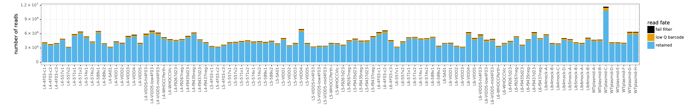


Distribution of sequencing reads per barcode on subamplicons:


```python
showPDF(countsplotprefix + 'readsperbc.pdf')
```


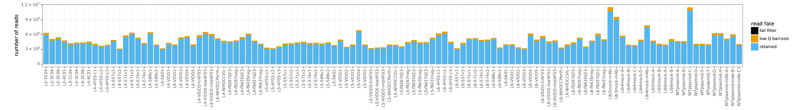


Number of barcoded subamplicons that align and have sufficient reads:


```python
showPDF(countsplotprefix + 'bcstats.pdf')
```


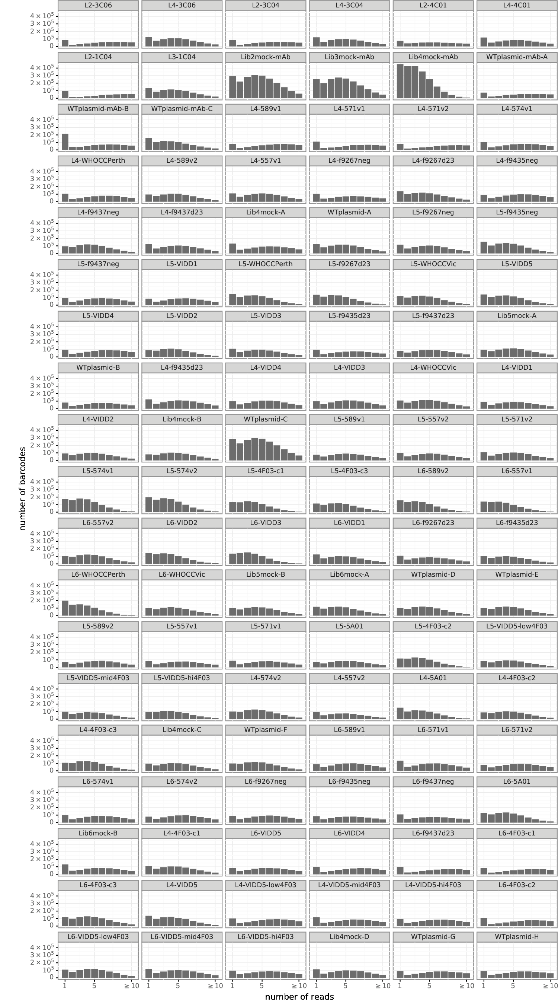


#### Coverage across gene
Depth of valid barcoded subamplicons covering each site in the gene:


```python
showPDF(countsplotprefix + 'depth.pdf')
```


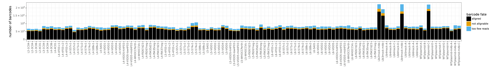


#### Mutation frequencies
The average mutation frequency for each sample, stratifying by codon mutation type:


```python
showPDF(countsplotprefix + 'codonmuttypes.pdf')
```


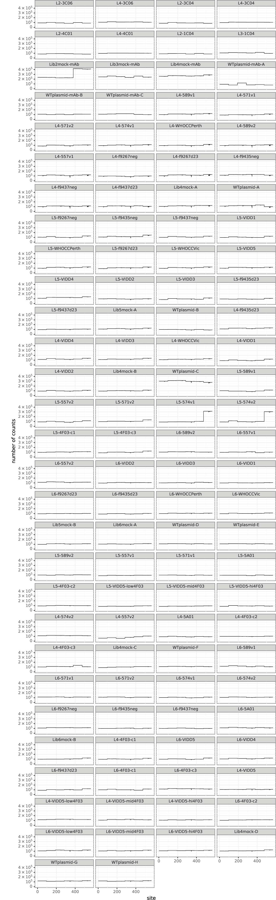


Average mutation frequency per sample, stratifying by number of nucleotide changes per codon mutation:


```python
showPDF(countsplotprefix + 'codonntchanges.pdf')
```


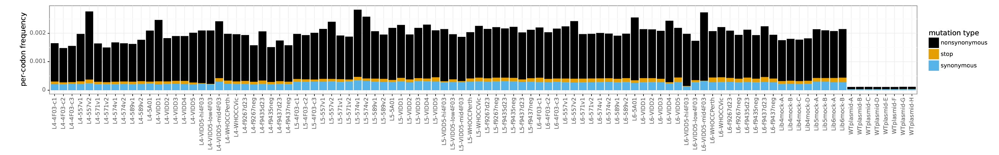


Per-codon mutation frequencies across all sites in gene for each sample:


```python
showPDF(countsplotprefix + 'mutfreq.pdf')
```


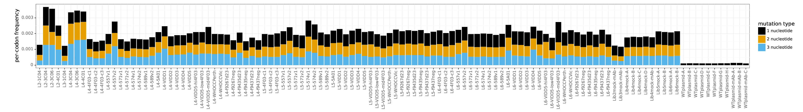


#### Check for oxidative damage
Sometimes there is oxidative damage which manifests as an enrichment of `G`->`T` and `C`->`A` mutations among the single-nucleotide codon mutations.
Check for this by plotting frequencies of different single-nucleotide mutation types:


```python
showPDF(countsplotprefix + 'singlentchanges.pdf')
```


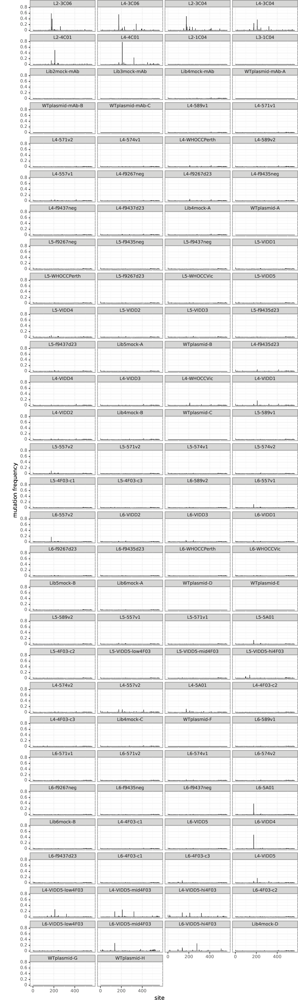


### Renumber to standard HA numbering
The above alignments use sequential 1, 2, ... numbering of the codons.
This is not the standard numbering scheme used for HA, so we use [dms_tools2.utils.renumbSites](https://jbloomlab.github.io/dms_tools2/dms_tools2.utils.html#dms_tools2.utils.renumberSites) to renumber to the standard HA numbering scheme:


```python
dms_tools2.utils.renumberSites(
    renumbfile=config['renumbering_scheme'],
    infiles=list(config['countsdir'] + '/' + samples['sample'] +
                 '_codoncounts.csv'),
    missing='drop',
    outdir=config['renumbcountsdir'])

assert all(os.path.isfile(f) for f in
           config['renumbcountsdir'] + '/' + samples['sample'] +
           '_codoncounts.csv'
           ), 'missing renumbered counts files'

print(f"Renumbered codon counts are in {config['renumbcountsdir']}")
```

    Renumbered codon counts are in results/renumbered_codoncounts


## Compute immune selection on mutations
We will now quantify the immune selection on each mutation by comparing its frequency in each serum-selected sample to an appropriate mock-selected control.

### Samples to compare for each selection
In order to quantify the immune selection, we need to compare each selected sample to the appropriate controls.
Specifically, for each selection, we define three samples:
 - *sel*: the immune-selected sample
 - *mock*: the appropriate mock-selected control for that date and library
 - *err*: the appropriate wildtype plasmid control to estimate sequencing error rates.
 
We call each combination of three such samples a "selection".
For each selection, we also record:
  - *serum_name_formatted*: a version of *serum_name* that also indicates species if non-human
  - *name*: a string indicating the library and the percent infectivity remaining. So for instance, *lib1-5* indicates library 1 with 5% infectivity remaining.
  
Below we construct the data frame with this information on the selections:


```python
selections = (

    # get all immune selected (sel) samples
    samples
    .query('(serum != "mock") & (serum != "plasmid")')
    .rename(columns={'sample': 'sel'})

    # add mock sample for that date and library
    .merge(samples
           .query('serum == "mock"')
           [['sample', 'library', 'date']]
           .rename(columns={'sample': 'mock'})
           )

    # add plasmid sample as error control (err) for that date and library
    .merge(samples
           .query('serum == "plasmid"')
           [['sample', 'library', 'date']]
           .rename(columns={'sample': 'err'})
           )

    # add information about sera
    .merge(sera, validate='many_to_one')

    # add columns with frac survive and informative names for serum and samples
    .assign(
        libfracsurvive=lambda x: x['percent_infectivity'] / 100,
        serum_name_formatted=lambda x:
            x['serum_species'].map(lambda s: '' if pd.isnull(s) or s == 'human'
                                   else s + '-') + x['serum_name'],
        name_formatted=lambda x:
            x['library'] + ', ' + x['percent_infectivity'].apply(
                dms_tools2.utils.sigFigStr, nsig=2) + '% infectivity',
        name=lambda x:
            x['library'] + '-' + x['percent_infectivity'].apply(
                dms_tools2.utils.sigFigStr, nsig=2)
        )

    # drop unneeded columns
    .drop(['R1'], axis='columns')

    # re-order columns a bit so key ones are displayed first
    .set_index(['serum_name_formatted', 'name', 'sel', 'mock', 'err',
                'libfracsurvive'])
    .reset_index()
    )

# make sure no duplicated serum / names
assert len(selections) == len(selections.groupby(['serum_name_formatted',
                                                  'name']))

print(f"Tabulated information for {len(selections)} selections:")
display(HTML(selections.to_html(index=False)))
```

    Tabulated information for 84 selections:


<table border="1" class="dataframe">
  <thead>
    <tr style="text-align: right;">
      <th>serum_name_formatted</th>
      <th>name</th>
      <th>sel</th>
      <th>mock</th>
      <th>err</th>
      <th>libfracsurvive</th>
      <th>serum</th>
      <th>library</th>
      <th>date</th>
      <th>serum_dilution</th>
      <th>percent_infectivity</th>
      <th>serum_description</th>
      <th>serum_group</th>
      <th>serum_name</th>
      <th>serum_species</th>
      <th>serum_vaccination</th>
      <th>name_formatted</th>
    </tr>
  </thead>
  <tbody>
    <tr>
      <td>2015-age-48-prevacc</td>
      <td>lib1-14</td>
      <td>L4-589v1</td>
      <td>Lib4mock-A</td>
      <td>WTplasmid-A</td>
      <td>0.138200</td>
      <td>589v1</td>
      <td>lib1</td>
      <td>2018-11-14</td>
      <td>0.074</td>
      <td>13.8200</td>
      <td>collected before 2015/2016 vaccine from person born in 1967</td>
      <td>Hensley_sera</td>
      <td>2015-age-48-prevacc</td>
      <td>human</td>
      <td>pre</td>
      <td>lib1, 14% infectivity</td>
    </tr>
    <tr>
      <td>2015-age-48-prevacc</td>
      <td>lib2-20</td>
      <td>L5-589v1</td>
      <td>Lib5mock-B</td>
      <td>WTplasmid-D</td>
      <td>0.203200</td>
      <td>589v1</td>
      <td>lib2</td>
      <td>2019-03-06</td>
      <td>0.07</td>
      <td>20.3200</td>
      <td>collected before 2015/2016 vaccine from person born in 1967</td>
      <td>Hensley_sera</td>
      <td>2015-age-48-prevacc</td>
      <td>human</td>
      <td>pre</td>
      <td>lib2, 20% infectivity</td>
    </tr>
    <tr>
      <td>2015-age-48-prevacc</td>
      <td>lib3-18</td>
      <td>L6-589v1</td>
      <td>Lib6mock-B</td>
      <td>WTplasmid-H</td>
      <td>0.184000</td>
      <td>589v1</td>
      <td>lib3</td>
      <td>2019-03-26</td>
      <td>0.07</td>
      <td>18.4000</td>
      <td>collected before 2015/2016 vaccine from person born in 1967</td>
      <td>Hensley_sera</td>
      <td>2015-age-48-prevacc</td>
      <td>human</td>
      <td>pre</td>
      <td>lib3, 18% infectivity</td>
    </tr>
    <tr>
      <td>2015-age-49-prevacc</td>
      <td>lib1-20</td>
      <td>L4-571v1</td>
      <td>Lib4mock-A</td>
      <td>WTplasmid-A</td>
      <td>0.196200</td>
      <td>571v1</td>
      <td>lib1</td>
      <td>2018-11-14</td>
      <td>0.074</td>
      <td>19.6200</td>
      <td>collected before 2015/2016 vaccine from person born in 1966</td>
      <td>Hensley_sera</td>
      <td>2015-age-49-prevacc</td>
      <td>human</td>
      <td>pre</td>
      <td>lib1, 20% infectivity</td>
    </tr>
    <tr>
      <td>2015-age-49-prevacc</td>
      <td>lib2-12</td>
      <td>L5-571v1</td>
      <td>Lib5mock-B</td>
      <td>WTplasmid-D</td>
      <td>0.118600</td>
      <td>571v1</td>
      <td>lib2</td>
      <td>2019-03-06</td>
      <td>0.074</td>
      <td>11.8600</td>
      <td>collected before 2015/2016 vaccine from person born in 1966</td>
      <td>Hensley_sera</td>
      <td>2015-age-49-prevacc</td>
      <td>human</td>
      <td>pre</td>
      <td>lib2, 12% infectivity</td>
    </tr>
    <tr>
      <td>2015-age-49-prevacc</td>
      <td>lib3-28</td>
      <td>L6-571v1</td>
      <td>Lib6mock-B</td>
      <td>WTplasmid-H</td>
      <td>0.277400</td>
      <td>571v1</td>
      <td>lib3</td>
      <td>2019-03-26</td>
      <td>0.074</td>
      <td>27.7400</td>
      <td>collected before 2015/2016 vaccine from person born in 1966</td>
      <td>Hensley_sera</td>
      <td>2015-age-49-prevacc</td>
      <td>human</td>
      <td>pre</td>
      <td>lib3, 28% infectivity</td>
    </tr>
    <tr>
      <td>2015-age-49-vacc</td>
      <td>lib1-5.5</td>
      <td>L4-571v2</td>
      <td>Lib4mock-A</td>
      <td>WTplasmid-A</td>
      <td>0.054800</td>
      <td>571v2</td>
      <td>lib1</td>
      <td>2018-11-14</td>
      <td>0.074</td>
      <td>5.4800</td>
      <td>collected after 2015/2016 vaccine from person born in 1966</td>
      <td>Hensley_sera</td>
      <td>2015-age-49-vacc</td>
      <td>human</td>
      <td>post</td>
      <td>lib1, 5.5% infectivity</td>
    </tr>
    <tr>
      <td>2015-age-49-vacc</td>
      <td>lib2-1.1</td>
      <td>L5-571v2</td>
      <td>Lib5mock-B</td>
      <td>WTplasmid-D</td>
      <td>0.010900</td>
      <td>571v2</td>
      <td>lib2</td>
      <td>2019-03-06</td>
      <td>0.04</td>
      <td>1.0900</td>
      <td>collected after 2015/2016 vaccine from person born in 1966</td>
      <td>Hensley_sera</td>
      <td>2015-age-49-vacc</td>
      <td>human</td>
      <td>post</td>
      <td>lib2, 1.1% infectivity</td>
    </tr>
    <tr>
      <td>2015-age-49-vacc</td>
      <td>lib3-7.8</td>
      <td>L6-571v2</td>
      <td>Lib6mock-B</td>
      <td>WTplasmid-H</td>
      <td>0.077900</td>
      <td>571v2</td>
      <td>lib3</td>
      <td>2019-03-26</td>
      <td>0.02</td>
      <td>7.7900</td>
      <td>collected after 2015/2016 vaccine from person born in 1966</td>
      <td>Hensley_sera</td>
      <td>2015-age-49-vacc</td>
      <td>human</td>
      <td>post</td>
      <td>lib3, 7.8% infectivity</td>
    </tr>
    <tr>
      <td>2015-age-29-prevacc</td>
      <td>lib1-9.5</td>
      <td>L4-574v1</td>
      <td>Lib4mock-A</td>
      <td>WTplasmid-A</td>
      <td>0.094800</td>
      <td>574v1</td>
      <td>lib1</td>
      <td>2018-11-14</td>
      <td>0.074</td>
      <td>9.4800</td>
      <td>collected before 2015/2016 vaccine from person born in 1986</td>
      <td>Hensley_sera</td>
      <td>2015-age-29-prevacc</td>
      <td>human</td>
      <td>pre</td>
      <td>lib1, 9.5% infectivity</td>
    </tr>
    <tr>
      <td>2015-age-29-prevacc</td>
      <td>lib2-7.6</td>
      <td>L5-574v1</td>
      <td>Lib5mock-B</td>
      <td>WTplasmid-D</td>
      <td>0.075700</td>
      <td>574v1</td>
      <td>lib2</td>
      <td>2019-03-06</td>
      <td>0.05</td>
      <td>7.5700</td>
      <td>collected before 2015/2016 vaccine from person born in 1986</td>
      <td>Hensley_sera</td>
      <td>2015-age-29-prevacc</td>
      <td>human</td>
      <td>pre</td>
      <td>lib2, 7.6% infectivity</td>
    </tr>
    <tr>
      <td>2015-age-29-prevacc</td>
      <td>lib3-3.3</td>
      <td>L6-574v1</td>
      <td>Lib6mock-B</td>
      <td>WTplasmid-H</td>
      <td>0.033000</td>
      <td>574v1</td>
      <td>lib3</td>
      <td>2019-03-26</td>
      <td>0.06</td>
      <td>3.3000</td>
      <td>collected before 2015/2016 vaccine from person born in 1986</td>
      <td>Hensley_sera</td>
      <td>2015-age-29-prevacc</td>
      <td>human</td>
      <td>pre</td>
      <td>lib3, 3.3% infectivity</td>
    </tr>
    <tr>
      <td>ferret-WHO</td>
      <td>lib1-2.3</td>
      <td>L4-WHOCCPerth</td>
      <td>Lib4mock-A</td>
      <td>WTplasmid-A</td>
      <td>0.023200</td>
      <td>WHOCCPerth</td>
      <td>lib1</td>
      <td>2018-11-14</td>
      <td>0.074</td>
      <td>2.3200</td>
      <td>ferret infected by Melbourne WHO CC with their Perth/2009 strain</td>
      <td>ferret</td>
      <td>WHO</td>
      <td>ferret</td>
      <td>post</td>
      <td>lib1, 2.3% infectivity</td>
    </tr>
    <tr>
      <td>ferret-WHO</td>
      <td>lib2-1.9</td>
      <td>L5-WHOCCPerth</td>
      <td>Lib5mock-A</td>
      <td>WTplasmid-B</td>
      <td>0.018800</td>
      <td>WHOCCPerth</td>
      <td>lib2</td>
      <td>2019-01-16</td>
      <td>0.03</td>
      <td>1.8800</td>
      <td>ferret infected by Melbourne WHO CC with their Perth/2009 strain</td>
      <td>ferret</td>
      <td>WHO</td>
      <td>ferret</td>
      <td>post</td>
      <td>lib2, 1.9% infectivity</td>
    </tr>
    <tr>
      <td>ferret-WHO</td>
      <td>lib3-4.1</td>
      <td>L6-WHOCCPerth</td>
      <td>Lib6mock-A</td>
      <td>WTplasmid-E</td>
      <td>0.041000</td>
      <td>WHOCCPerth</td>
      <td>lib3</td>
      <td>2019-03-06</td>
      <td>0.03</td>
      <td>4.1000</td>
      <td>ferret infected by Melbourne WHO CC with their Perth/2009 strain</td>
      <td>ferret</td>
      <td>WHO</td>
      <td>ferret</td>
      <td>post</td>
      <td>lib3, 4.1% infectivity</td>
    </tr>
    <tr>
      <td>2015-age-48-vacc</td>
      <td>lib1-4.6</td>
      <td>L4-589v2</td>
      <td>Lib4mock-A</td>
      <td>WTplasmid-A</td>
      <td>0.045800</td>
      <td>589v2</td>
      <td>lib1</td>
      <td>2018-11-14</td>
      <td>0.0035</td>
      <td>4.5800</td>
      <td>collected after 2015/2016 vaccine from person born in 1967</td>
      <td>Hensley_sera</td>
      <td>2015-age-48-vacc</td>
      <td>human</td>
      <td>post</td>
      <td>lib1, 4.6% infectivity</td>
    </tr>
    <tr>
      <td>2015-age-48-vacc</td>
      <td>lib2-4.7</td>
      <td>L5-589v2</td>
      <td>Lib5mock-B</td>
      <td>WTplasmid-D</td>
      <td>0.046800</td>
      <td>589v2</td>
      <td>lib2</td>
      <td>2019-03-06</td>
      <td>0.0015</td>
      <td>4.6800</td>
      <td>collected after 2015/2016 vaccine from person born in 1967</td>
      <td>Hensley_sera</td>
      <td>2015-age-48-vacc</td>
      <td>human</td>
      <td>post</td>
      <td>lib2, 4.7% infectivity</td>
    </tr>
    <tr>
      <td>2015-age-48-vacc</td>
      <td>lib3-4.1</td>
      <td>L6-589v2</td>
      <td>Lib6mock-A</td>
      <td>WTplasmid-E</td>
      <td>0.040600</td>
      <td>589v2</td>
      <td>lib3</td>
      <td>2019-03-06</td>
      <td>0.0015</td>
      <td>4.0600</td>
      <td>collected after 2015/2016 vaccine from person born in 1967</td>
      <td>Hensley_sera</td>
      <td>2015-age-48-vacc</td>
      <td>human</td>
      <td>post</td>
      <td>lib3, 4.1% infectivity</td>
    </tr>
    <tr>
      <td>2015-age-25-prevacc</td>
      <td>lib1-6.9</td>
      <td>L4-557v1</td>
      <td>Lib4mock-A</td>
      <td>WTplasmid-A</td>
      <td>0.069000</td>
      <td>557v1</td>
      <td>lib1</td>
      <td>2018-11-14</td>
      <td>0.03</td>
      <td>6.9000</td>
      <td>collected before 2015/2016 vaccine from person born in 1990</td>
      <td>Hensley_sera</td>
      <td>2015-age-25-prevacc</td>
      <td>human</td>
      <td>pre</td>
      <td>lib1, 6.9% infectivity</td>
    </tr>
    <tr>
      <td>2015-age-25-prevacc</td>
      <td>lib2-2.3</td>
      <td>L5-557v1</td>
      <td>Lib5mock-B</td>
      <td>WTplasmid-D</td>
      <td>0.023100</td>
      <td>557v1</td>
      <td>lib2</td>
      <td>2019-03-06</td>
      <td>0.02</td>
      <td>2.3100</td>
      <td>collected before 2015/2016 vaccine from person born in 1990</td>
      <td>Hensley_sera</td>
      <td>2015-age-25-prevacc</td>
      <td>human</td>
      <td>pre</td>
      <td>lib2, 2.3% infectivity</td>
    </tr>
    <tr>
      <td>2015-age-25-prevacc</td>
      <td>lib3-1.6</td>
      <td>L6-557v1</td>
      <td>Lib6mock-A</td>
      <td>WTplasmid-E</td>
      <td>0.015700</td>
      <td>557v1</td>
      <td>lib3</td>
      <td>2019-03-06</td>
      <td>0.02</td>
      <td>1.5700</td>
      <td>collected before 2015/2016 vaccine from person born in 1990</td>
      <td>Hensley_sera</td>
      <td>2015-age-25-prevacc</td>
      <td>human</td>
      <td>pre</td>
      <td>lib3, 1.6% infectivity</td>
    </tr>
    <tr>
      <td>ferret-Pitt-1-preinf</td>
      <td>lib1-100</td>
      <td>L4-f9267neg</td>
      <td>Lib4mock-A</td>
      <td>WTplasmid-A</td>
      <td>1.000000</td>
      <td>f9267neg</td>
      <td>lib1</td>
      <td>2018-11-14</td>
      <td>0.003</td>
      <td>100.0000</td>
      <td>Lakdawala lab ferret, before infection</td>
      <td>ferret</td>
      <td>Pitt-1-preinf</td>
      <td>ferret</td>
      <td>pre</td>
      <td>lib1, 100% infectivity</td>
    </tr>
    <tr>
      <td>ferret-Pitt-1-preinf</td>
      <td>lib2-100</td>
      <td>L5-f9267neg</td>
      <td>Lib5mock-A</td>
      <td>WTplasmid-B</td>
      <td>1.000000</td>
      <td>f9267neg</td>
      <td>lib2</td>
      <td>2019-01-16</td>
      <td>0.003</td>
      <td>100.0000</td>
      <td>Lakdawala lab ferret, before infection</td>
      <td>ferret</td>
      <td>Pitt-1-preinf</td>
      <td>ferret</td>
      <td>pre</td>
      <td>lib2, 100% infectivity</td>
    </tr>
    <tr>
      <td>ferret-Pitt-1-preinf</td>
      <td>lib3-100</td>
      <td>L6-f9267neg</td>
      <td>Lib6mock-B</td>
      <td>WTplasmid-H</td>
      <td>1.000000</td>
      <td>f9267neg</td>
      <td>lib3</td>
      <td>2019-03-26</td>
      <td>0.003</td>
      <td>100.0000</td>
      <td>Lakdawala lab ferret, before infection</td>
      <td>ferret</td>
      <td>Pitt-1-preinf</td>
      <td>ferret</td>
      <td>pre</td>
      <td>lib3, 100% infectivity</td>
    </tr>
    <tr>
      <td>ferret-Pitt-1-postinf</td>
      <td>lib1-4.4</td>
      <td>L4-f9267d23</td>
      <td>Lib4mock-A</td>
      <td>WTplasmid-A</td>
      <td>0.043600</td>
      <td>f9267d23</td>
      <td>lib1</td>
      <td>2018-11-14</td>
      <td>0.003</td>
      <td>4.3600</td>
      <td>Lakdawala lab ferret, 23 days after infection by Perth/2009 with our HA</td>
      <td>ferret</td>
      <td>Pitt-1-postinf</td>
      <td>ferret</td>
      <td>post</td>
      <td>lib1, 4.4% infectivity</td>
    </tr>
    <tr>
      <td>ferret-Pitt-1-postinf</td>
      <td>lib2-5.3</td>
      <td>L5-f9267d23</td>
      <td>Lib5mock-A</td>
      <td>WTplasmid-B</td>
      <td>0.053500</td>
      <td>f9267d23</td>
      <td>lib2</td>
      <td>2019-01-16</td>
      <td>0.0007</td>
      <td>5.3500</td>
      <td>Lakdawala lab ferret, 23 days after infection by Perth/2009 with our HA</td>
      <td>ferret</td>
      <td>Pitt-1-postinf</td>
      <td>ferret</td>
      <td>post</td>
      <td>lib2, 5.3% infectivity</td>
    </tr>
    <tr>
      <td>ferret-Pitt-1-postinf</td>
      <td>lib3-1.7</td>
      <td>L6-f9267d23</td>
      <td>Lib6mock-A</td>
      <td>WTplasmid-E</td>
      <td>0.016900</td>
      <td>f9267d23</td>
      <td>lib3</td>
      <td>2019-03-06</td>
      <td>0.0015</td>
      <td>1.6900</td>
      <td>Lakdawala lab ferret, 23 days after infection by Perth/2009 with our HA</td>
      <td>ferret</td>
      <td>Pitt-1-postinf</td>
      <td>ferret</td>
      <td>post</td>
      <td>lib3, 1.7% infectivity</td>
    </tr>
    <tr>
      <td>ferret-Pitt-2-preinf</td>
      <td>lib1-100</td>
      <td>L4-f9435neg</td>
      <td>Lib4mock-A</td>
      <td>WTplasmid-A</td>
      <td>1.000000</td>
      <td>f9435neg</td>
      <td>lib1</td>
      <td>2018-11-14</td>
      <td>0.004</td>
      <td>100.0000</td>
      <td>Lakdawala lab ferret, before infection</td>
      <td>ferret</td>
      <td>Pitt-2-preinf</td>
      <td>ferret</td>
      <td>pre</td>
      <td>lib1, 100% infectivity</td>
    </tr>
    <tr>
      <td>ferret-Pitt-2-preinf</td>
      <td>lib2-100</td>
      <td>L5-f9435neg</td>
      <td>Lib5mock-A</td>
      <td>WTplasmid-B</td>
      <td>1.000000</td>
      <td>f9435neg</td>
      <td>lib2</td>
      <td>2019-01-16</td>
      <td>0.01</td>
      <td>100.0000</td>
      <td>Lakdawala lab ferret, before infection</td>
      <td>ferret</td>
      <td>Pitt-2-preinf</td>
      <td>ferret</td>
      <td>pre</td>
      <td>lib2, 100% infectivity</td>
    </tr>
    <tr>
      <td>ferret-Pitt-2-preinf</td>
      <td>lib3-100</td>
      <td>L6-f9435neg</td>
      <td>Lib6mock-B</td>
      <td>WTplasmid-H</td>
      <td>1.000000</td>
      <td>f9435neg</td>
      <td>lib3</td>
      <td>2019-03-26</td>
      <td>0.01</td>
      <td>100.0000</td>
      <td>Lakdawala lab ferret, before infection</td>
      <td>ferret</td>
      <td>Pitt-2-preinf</td>
      <td>ferret</td>
      <td>pre</td>
      <td>lib3, 100% infectivity</td>
    </tr>
    <tr>
      <td>ferret-Pitt-3-preinf</td>
      <td>lib1-100</td>
      <td>L4-f9437neg</td>
      <td>Lib4mock-A</td>
      <td>WTplasmid-A</td>
      <td>1.000000</td>
      <td>f9437neg</td>
      <td>lib1</td>
      <td>2018-11-14</td>
      <td>0.009</td>
      <td>100.0000</td>
      <td>Lakdawala lab ferret, before infection</td>
      <td>ferret</td>
      <td>Pitt-3-preinf</td>
      <td>ferret</td>
      <td>pre</td>
      <td>lib1, 100% infectivity</td>
    </tr>
    <tr>
      <td>ferret-Pitt-3-preinf</td>
      <td>lib2-100</td>
      <td>L5-f9437neg</td>
      <td>Lib5mock-A</td>
      <td>WTplasmid-B</td>
      <td>1.000000</td>
      <td>f9437neg</td>
      <td>lib2</td>
      <td>2019-01-16</td>
      <td>0.025</td>
      <td>100.0000</td>
      <td>Lakdawala lab ferret, before infection</td>
      <td>ferret</td>
      <td>Pitt-3-preinf</td>
      <td>ferret</td>
      <td>pre</td>
      <td>lib2, 100% infectivity</td>
    </tr>
    <tr>
      <td>ferret-Pitt-3-preinf</td>
      <td>lib3-100</td>
      <td>L6-f9437neg</td>
      <td>Lib6mock-B</td>
      <td>WTplasmid-H</td>
      <td>1.000000</td>
      <td>f9437neg</td>
      <td>lib3</td>
      <td>2019-03-26</td>
      <td>0.025</td>
      <td>100.0000</td>
      <td>Lakdawala lab ferret, before infection</td>
      <td>ferret</td>
      <td>Pitt-3-preinf</td>
      <td>ferret</td>
      <td>pre</td>
      <td>lib3, 100% infectivity</td>
    </tr>
    <tr>
      <td>ferret-Pitt-3-postinf</td>
      <td>lib1-8.8</td>
      <td>L4-f9437d23</td>
      <td>Lib4mock-A</td>
      <td>WTplasmid-A</td>
      <td>0.087700</td>
      <td>f9437d23</td>
      <td>lib1</td>
      <td>2018-11-14</td>
      <td>0.009</td>
      <td>8.7700</td>
      <td>Lakdawala lab ferret, 23 days after infection by Perth/2009 with our HA</td>
      <td>ferret</td>
      <td>Pitt-3-postinf</td>
      <td>ferret</td>
      <td>post</td>
      <td>lib1, 8.8% infectivity</td>
    </tr>
    <tr>
      <td>ferret-Pitt-3-postinf</td>
      <td>lib2-1.7</td>
      <td>L5-f9437d23</td>
      <td>Lib5mock-A</td>
      <td>WTplasmid-B</td>
      <td>0.017000</td>
      <td>f9437d23</td>
      <td>lib2</td>
      <td>2019-01-16</td>
      <td>0.0055</td>
      <td>1.7000</td>
      <td>Lakdawala lab ferret, 23 days after infection by Perth/2009 with our HA</td>
      <td>ferret</td>
      <td>Pitt-3-postinf</td>
      <td>ferret</td>
      <td>post</td>
      <td>lib2, 1.7% infectivity</td>
    </tr>
    <tr>
      <td>ferret-Pitt-3-postinf</td>
      <td>lib3-5.8</td>
      <td>L6-f9437d23</td>
      <td>Lib6mock-B</td>
      <td>WTplasmid-H</td>
      <td>0.057800</td>
      <td>f9437d23</td>
      <td>lib3</td>
      <td>2019-03-26</td>
      <td>0.007</td>
      <td>5.7800</td>
      <td>Lakdawala lab ferret, 23 days after infection by Perth/2009 with our HA</td>
      <td>ferret</td>
      <td>Pitt-3-postinf</td>
      <td>ferret</td>
      <td>post</td>
      <td>lib3, 5.8% infectivity</td>
    </tr>
    <tr>
      <td>2010-age-21</td>
      <td>lib2-6.0</td>
      <td>L5-VIDD1</td>
      <td>Lib5mock-A</td>
      <td>WTplasmid-B</td>
      <td>0.059500</td>
      <td>VIDD1</td>
      <td>lib2</td>
      <td>2019-01-16</td>
      <td>0.018</td>
      <td>5.9500</td>
      <td>collected at Hutch in 2/2010 from person born in 1989</td>
      <td>VIDD_sera</td>
      <td>2010-age-21</td>
      <td>human</td>
      <td>NaN</td>
      <td>lib2, 6.0% infectivity</td>
    </tr>
    <tr>
      <td>2010-age-21</td>
      <td>lib1-4.1</td>
      <td>L4-VIDD1</td>
      <td>Lib4mock-B</td>
      <td>WTplasmid-C</td>
      <td>0.040800</td>
      <td>VIDD1</td>
      <td>lib1</td>
      <td>2019-01-16</td>
      <td>0.07</td>
      <td>4.0800</td>
      <td>collected at Hutch in 2/2010 from person born in 1989</td>
      <td>VIDD_sera</td>
      <td>2010-age-21</td>
      <td>human</td>
      <td>NaN</td>
      <td>lib1, 4.1% infectivity</td>
    </tr>
    <tr>
      <td>2010-age-21</td>
      <td>lib3-3.7</td>
      <td>L6-VIDD1</td>
      <td>Lib6mock-A</td>
      <td>WTplasmid-E</td>
      <td>0.036800</td>
      <td>VIDD1</td>
      <td>lib3</td>
      <td>2019-03-06</td>
      <td>0.03</td>
      <td>3.6800</td>
      <td>collected at Hutch in 2/2010 from person born in 1989</td>
      <td>VIDD_sera</td>
      <td>2010-age-21</td>
      <td>human</td>
      <td>NaN</td>
      <td>lib3, 3.7% infectivity</td>
    </tr>
    <tr>
      <td>ferret-WHO-Victoria2011</td>
      <td>lib2-3.9</td>
      <td>L5-WHOCCVic</td>
      <td>Lib5mock-A</td>
      <td>WTplasmid-B</td>
      <td>0.039000</td>
      <td>WHOCCVic</td>
      <td>lib2</td>
      <td>2019-01-16</td>
      <td>0.01</td>
      <td>3.9000</td>
      <td>ferret infected by Melbourne WHO CC with their Victoria/2011 strain</td>
      <td>ferret</td>
      <td>WHO-Victoria2011</td>
      <td>ferret</td>
      <td>post</td>
      <td>lib2, 3.9% infectivity</td>
    </tr>
    <tr>
      <td>ferret-WHO-Victoria2011</td>
      <td>lib1-1.3</td>
      <td>L4-WHOCCVic</td>
      <td>Lib4mock-B</td>
      <td>WTplasmid-C</td>
      <td>0.012600</td>
      <td>WHOCCVic</td>
      <td>lib1</td>
      <td>2019-01-16</td>
      <td>0.025</td>
      <td>1.2600</td>
      <td>ferret infected by Melbourne WHO CC with their Victoria/2011 strain</td>
      <td>ferret</td>
      <td>WHO-Victoria2011</td>
      <td>ferret</td>
      <td>post</td>
      <td>lib1, 1.3% infectivity</td>
    </tr>
    <tr>
      <td>ferret-WHO-Victoria2011</td>
      <td>lib3-3.6</td>
      <td>L6-WHOCCVic</td>
      <td>Lib6mock-A</td>
      <td>WTplasmid-E</td>
      <td>0.036200</td>
      <td>WHOCCVic</td>
      <td>lib3</td>
      <td>2019-03-06</td>
      <td>0.01</td>
      <td>3.6200</td>
      <td>ferret infected by Melbourne WHO CC with their Victoria/2011 strain</td>
      <td>ferret</td>
      <td>WHO-Victoria2011</td>
      <td>ferret</td>
      <td>post</td>
      <td>lib3, 3.6% infectivity</td>
    </tr>
    <tr>
      <td>2009-age-65</td>
      <td>lib2-5.2</td>
      <td>L5-VIDD5</td>
      <td>Lib5mock-A</td>
      <td>WTplasmid-B</td>
      <td>0.052400</td>
      <td>VIDD5</td>
      <td>lib2</td>
      <td>2019-01-16</td>
      <td>0.0035</td>
      <td>5.2400</td>
      <td>collected at Hutch in 6/2009 from person born in 1944</td>
      <td>VIDD_sera</td>
      <td>2009-age-65</td>
      <td>human</td>
      <td>NaN</td>
      <td>lib2, 5.2% infectivity</td>
    </tr>
    <tr>
      <td>2009-age-65</td>
      <td>lib3-5.6</td>
      <td>L6-VIDD5</td>
      <td>Lib6mock-B</td>
      <td>WTplasmid-H</td>
      <td>0.055800</td>
      <td>VIDD5</td>
      <td>lib3</td>
      <td>2019-03-26</td>
      <td>0.008</td>
      <td>5.5800</td>
      <td>collected at Hutch in 6/2009 from person born in 1944</td>
      <td>VIDD_sera</td>
      <td>2009-age-65</td>
      <td>human</td>
      <td>NaN</td>
      <td>lib3, 5.6% infectivity</td>
    </tr>
    <tr>
      <td>2009-age-65</td>
      <td>lib1-1.8</td>
      <td>L4-VIDD5</td>
      <td>Lib4mock-D</td>
      <td>WTplasmid-G</td>
      <td>0.017700</td>
      <td>VIDD5</td>
      <td>lib1</td>
      <td>2019-03-26</td>
      <td>0.0135</td>
      <td>1.7700</td>
      <td>collected at Hutch in 6/2009 from person born in 1944</td>
      <td>VIDD_sera</td>
      <td>2009-age-65</td>
      <td>human</td>
      <td>NaN</td>
      <td>lib1, 1.8% infectivity</td>
    </tr>
    <tr>
      <td>2009-age-64</td>
      <td>lib2-0.87</td>
      <td>L5-VIDD4</td>
      <td>Lib5mock-A</td>
      <td>WTplasmid-B</td>
      <td>0.008700</td>
      <td>VIDD4</td>
      <td>lib2</td>
      <td>2019-01-16</td>
      <td>0.0067</td>
      <td>0.8700</td>
      <td>collected at Hutch in 11/2008 from person born in 1945</td>
      <td>VIDD_sera</td>
      <td>2009-age-64</td>
      <td>human</td>
      <td>NaN</td>
      <td>lib2, 0.87% infectivity</td>
    </tr>
    <tr>
      <td>2009-age-64</td>
      <td>lib1-11</td>
      <td>L4-VIDD4</td>
      <td>Lib4mock-B</td>
      <td>WTplasmid-C</td>
      <td>0.107400</td>
      <td>VIDD4</td>
      <td>lib1</td>
      <td>2019-01-16</td>
      <td>0.016</td>
      <td>10.7400</td>
      <td>collected at Hutch in 11/2008 from person born in 1945</td>
      <td>VIDD_sera</td>
      <td>2009-age-64</td>
      <td>human</td>
      <td>NaN</td>
      <td>lib1, 11% infectivity</td>
    </tr>
    <tr>
      <td>2009-age-64</td>
      <td>lib3-0.26</td>
      <td>L6-VIDD4</td>
      <td>Lib6mock-B</td>
      <td>WTplasmid-H</td>
      <td>0.002600</td>
      <td>VIDD4</td>
      <td>lib3</td>
      <td>2019-03-26</td>
      <td>0.015</td>
      <td>0.2600</td>
      <td>collected at Hutch in 11/2008 from person born in 1945</td>
      <td>VIDD_sera</td>
      <td>2009-age-64</td>
      <td>human</td>
      <td>NaN</td>
      <td>lib3, 0.26% infectivity</td>
    </tr>
    <tr>
      <td>2009-age-53a</td>
      <td>lib2-2.0</td>
      <td>L5-VIDD2</td>
      <td>Lib5mock-A</td>
      <td>WTplasmid-B</td>
      <td>0.020300</td>
      <td>VIDD2</td>
      <td>lib2</td>
      <td>2019-01-16</td>
      <td>0.015</td>
      <td>2.0300</td>
      <td>collected at Hutch in 1/2009 from person born in 1956</td>
      <td>VIDD_sera</td>
      <td>2009-age-53a</td>
      <td>human</td>
      <td>NaN</td>
      <td>lib2, 2.0% infectivity</td>
    </tr>
    <tr>
      <td>2009-age-53a</td>
      <td>lib1-3.7</td>
      <td>L4-VIDD2</td>
      <td>Lib4mock-B</td>
      <td>WTplasmid-C</td>
      <td>0.037400</td>
      <td>VIDD2</td>
      <td>lib1</td>
      <td>2019-01-16</td>
      <td>0.035</td>
      <td>3.7400</td>
      <td>collected at Hutch in 1/2009 from person born in 1956</td>
      <td>VIDD_sera</td>
      <td>2009-age-53a</td>
      <td>human</td>
      <td>NaN</td>
      <td>lib1, 3.7% infectivity</td>
    </tr>
    <tr>
      <td>2009-age-53a</td>
      <td>lib3-6.2</td>
      <td>L6-VIDD2</td>
      <td>Lib6mock-A</td>
      <td>WTplasmid-E</td>
      <td>0.062200</td>
      <td>VIDD2</td>
      <td>lib3</td>
      <td>2019-03-06</td>
      <td>0.015</td>
      <td>6.2200</td>
      <td>collected at Hutch in 1/2009 from person born in 1956</td>
      <td>VIDD_sera</td>
      <td>2009-age-53a</td>
      <td>human</td>
      <td>NaN</td>
      <td>lib3, 6.2% infectivity</td>
    </tr>
    <tr>
      <td>2009-age-53b</td>
      <td>lib2-1.7</td>
      <td>L5-VIDD3</td>
      <td>Lib5mock-A</td>
      <td>WTplasmid-B</td>
      <td>0.017300</td>
      <td>VIDD3</td>
      <td>lib2</td>
      <td>2019-01-16</td>
      <td>0.018</td>
      <td>1.7300</td>
      <td>second sample collected at Hutch in 3/2009 from person born in 1956</td>
      <td>VIDD_sera</td>
      <td>2009-age-53b</td>
      <td>human</td>
      <td>NaN</td>
      <td>lib2, 1.7% infectivity</td>
    </tr>
    <tr>
      <td>2009-age-53b</td>
      <td>lib1-6.0</td>
      <td>L4-VIDD3</td>
      <td>Lib4mock-B</td>
      <td>WTplasmid-C</td>
      <td>0.059800</td>
      <td>VIDD3</td>
      <td>lib1</td>
      <td>2019-01-16</td>
      <td>0.03</td>
      <td>5.9800</td>
      <td>second sample collected at Hutch in 3/2009 from person born in 1956</td>
      <td>VIDD_sera</td>
      <td>2009-age-53b</td>
      <td>human</td>
      <td>NaN</td>
      <td>lib1, 6.0% infectivity</td>
    </tr>
    <tr>
      <td>2009-age-53b</td>
      <td>lib3-1.1</td>
      <td>L6-VIDD3</td>
      <td>Lib6mock-A</td>
      <td>WTplasmid-E</td>
      <td>0.011200</td>
      <td>VIDD3</td>
      <td>lib3</td>
      <td>2019-03-06</td>
      <td>0.025</td>
      <td>1.1200</td>
      <td>second sample collected at Hutch in 3/2009 from person born in 1956</td>
      <td>VIDD_sera</td>
      <td>2009-age-53b</td>
      <td>human</td>
      <td>NaN</td>
      <td>lib3, 1.1% infectivity</td>
    </tr>
    <tr>
      <td>ferret-Pitt-2-postinf</td>
      <td>lib2-1.9</td>
      <td>L5-f9435d23</td>
      <td>Lib5mock-A</td>
      <td>WTplasmid-B</td>
      <td>0.018800</td>
      <td>f9435d23</td>
      <td>lib2</td>
      <td>2019-01-16</td>
      <td>0.0025</td>
      <td>1.8800</td>
      <td>Lakdawala lab ferret, 23 days after infection by Perth/2009 with our HA</td>
      <td>ferret</td>
      <td>Pitt-2-postinf</td>
      <td>ferret</td>
      <td>post</td>
      <td>lib2, 1.9% infectivity</td>
    </tr>
    <tr>
      <td>ferret-Pitt-2-postinf</td>
      <td>lib1-3.5</td>
      <td>L4-f9435d23</td>
      <td>Lib4mock-B</td>
      <td>WTplasmid-C</td>
      <td>0.034500</td>
      <td>f9435d23</td>
      <td>lib1</td>
      <td>2019-01-16</td>
      <td>0.01</td>
      <td>3.4500</td>
      <td>Lakdawala lab ferret, 23 days after infection by Perth/2009 with our HA</td>
      <td>ferret</td>
      <td>Pitt-2-postinf</td>
      <td>ferret</td>
      <td>post</td>
      <td>lib1, 3.5% infectivity</td>
    </tr>
    <tr>
      <td>ferret-Pitt-2-postinf</td>
      <td>lib3-3.0</td>
      <td>L6-f9435d23</td>
      <td>Lib6mock-A</td>
      <td>WTplasmid-E</td>
      <td>0.030400</td>
      <td>f9435d23</td>
      <td>lib3</td>
      <td>2019-03-06</td>
      <td>0.005</td>
      <td>3.0400</td>
      <td>Lakdawala lab ferret, 23 days after infection by Perth/2009 with our HA</td>
      <td>ferret</td>
      <td>Pitt-2-postinf</td>
      <td>ferret</td>
      <td>post</td>
      <td>lib3, 3.0% infectivity</td>
    </tr>
    <tr>
      <td>2015-age-25-vacc</td>
      <td>lib2-0.81</td>
      <td>L5-557v2</td>
      <td>Lib5mock-B</td>
      <td>WTplasmid-D</td>
      <td>0.008100</td>
      <td>557v2</td>
      <td>lib2</td>
      <td>2019-03-06</td>
      <td>0.002</td>
      <td>0.8100</td>
      <td>collected after 2015/2016 vaccine from person born in 1990</td>
      <td>Hensley_sera</td>
      <td>2015-age-25-vacc</td>
      <td>human</td>
      <td>post</td>
      <td>lib2, 0.81% infectivity</td>
    </tr>
    <tr>
      <td>2015-age-25-vacc</td>
      <td>lib3-1.6</td>
      <td>L6-557v2</td>
      <td>Lib6mock-A</td>
      <td>WTplasmid-E</td>
      <td>0.016400</td>
      <td>557v2</td>
      <td>lib3</td>
      <td>2019-03-06</td>
      <td>0.002</td>
      <td>1.6400</td>
      <td>collected after 2015/2016 vaccine from person born in 1990</td>
      <td>Hensley_sera</td>
      <td>2015-age-25-vacc</td>
      <td>human</td>
      <td>post</td>
      <td>lib3, 1.6% infectivity</td>
    </tr>
    <tr>
      <td>2015-age-25-vacc</td>
      <td>lib1-1.5</td>
      <td>L4-557v2</td>
      <td>Lib4mock-C</td>
      <td>WTplasmid-F</td>
      <td>0.015300</td>
      <td>557v2</td>
      <td>lib1</td>
      <td>2019-03-06</td>
      <td>0.005</td>
      <td>1.5300</td>
      <td>collected after 2015/2016 vaccine from person born in 1990</td>
      <td>Hensley_sera</td>
      <td>2015-age-25-vacc</td>
      <td>human</td>
      <td>post</td>
      <td>lib1, 1.5% infectivity</td>
    </tr>
    <tr>
      <td>2015-age-29-vacc</td>
      <td>lib2-1.1</td>
      <td>L5-574v2</td>
      <td>Lib5mock-B</td>
      <td>WTplasmid-D</td>
      <td>0.011100</td>
      <td>574v2</td>
      <td>lib2</td>
      <td>2019-03-06</td>
      <td>0.0035</td>
      <td>1.1100</td>
      <td>collected after 2015/2016 vaccine from person born in 1986</td>
      <td>Hensley_sera</td>
      <td>2015-age-29-vacc</td>
      <td>human</td>
      <td>post</td>
      <td>lib2, 1.1% infectivity</td>
    </tr>
    <tr>
      <td>2015-age-29-vacc</td>
      <td>lib1-1.5</td>
      <td>L4-574v2</td>
      <td>Lib4mock-C</td>
      <td>WTplasmid-F</td>
      <td>0.015400</td>
      <td>574v2</td>
      <td>lib1</td>
      <td>2019-03-06</td>
      <td>0.008</td>
      <td>1.5400</td>
      <td>collected after 2015/2016 vaccine from person born in 1986</td>
      <td>Hensley_sera</td>
      <td>2015-age-29-vacc</td>
      <td>human</td>
      <td>post</td>
      <td>lib1, 1.5% infectivity</td>
    </tr>
    <tr>
      <td>2015-age-29-vacc</td>
      <td>lib3-1.9</td>
      <td>L6-574v2</td>
      <td>Lib6mock-B</td>
      <td>WTplasmid-H</td>
      <td>0.019200</td>
      <td>574v2</td>
      <td>lib3</td>
      <td>2019-03-26</td>
      <td>0.003</td>
      <td>1.9200</td>
      <td>collected after 2015/2016 vaccine from person born in 1986</td>
      <td>Hensley_sera</td>
      <td>2015-age-29-vacc</td>
      <td>human</td>
      <td>post</td>
      <td>lib3, 1.9% infectivity</td>
    </tr>
    <tr>
      <td>antibody-4F03</td>
      <td>lib2-23</td>
      <td>L5-4F03-c1</td>
      <td>Lib5mock-B</td>
      <td>WTplasmid-D</td>
      <td>0.229900</td>
      <td>4F03</td>
      <td>lib2</td>
      <td>2019-03-06</td>
      <td>0.3</td>
      <td>22.9900</td>
      <td>site E-targeting monoclonal antibody 4F03 from Seth Zost and Scott Hensley</td>
      <td>antibody</td>
      <td>antibody-4F03</td>
      <td>NaN</td>
      <td>NaN</td>
      <td>lib2, 23% infectivity</td>
    </tr>
    <tr>
      <td>antibody-4F03</td>
      <td>lib2-3.7</td>
      <td>L5-4F03-c3</td>
      <td>Lib5mock-B</td>
      <td>WTplasmid-D</td>
      <td>0.037100</td>
      <td>4F03</td>
      <td>lib2</td>
      <td>2019-03-06</td>
      <td>1.5</td>
      <td>3.7100</td>
      <td>site E-targeting monoclonal antibody 4F03 from Seth Zost and Scott Hensley</td>
      <td>antibody</td>
      <td>antibody-4F03</td>
      <td>NaN</td>
      <td>NaN</td>
      <td>lib2, 3.7% infectivity</td>
    </tr>
    <tr>
      <td>antibody-4F03</td>
      <td>lib2-4.7</td>
      <td>L5-4F03-c2</td>
      <td>Lib5mock-B</td>
      <td>WTplasmid-D</td>
      <td>0.047100</td>
      <td>4F03</td>
      <td>lib2</td>
      <td>2019-03-06</td>
      <td>0.7</td>
      <td>4.7100</td>
      <td>site E-targeting monoclonal antibody 4F03 from Seth Zost and Scott Hensley</td>
      <td>antibody</td>
      <td>antibody-4F03</td>
      <td>NaN</td>
      <td>NaN</td>
      <td>lib2, 4.7% infectivity</td>
    </tr>
    <tr>
      <td>antibody-4F03</td>
      <td>lib1-3.5</td>
      <td>L4-4F03-c2</td>
      <td>Lib4mock-C</td>
      <td>WTplasmid-F</td>
      <td>0.034700</td>
      <td>4F03</td>
      <td>lib1</td>
      <td>2019-03-06</td>
      <td>1</td>
      <td>3.4700</td>
      <td>site E-targeting monoclonal antibody 4F03 from Seth Zost and Scott Hensley</td>
      <td>antibody</td>
      <td>antibody-4F03</td>
      <td>NaN</td>
      <td>NaN</td>
      <td>lib1, 3.5% infectivity</td>
    </tr>
    <tr>
      <td>antibody-4F03</td>
      <td>lib1-0.78</td>
      <td>L4-4F03-c3</td>
      <td>Lib4mock-C</td>
      <td>WTplasmid-F</td>
      <td>0.007800</td>
      <td>4F03</td>
      <td>lib1</td>
      <td>2019-03-06</td>
      <td>2</td>
      <td>0.7800</td>
      <td>site E-targeting monoclonal antibody 4F03 from Seth Zost and Scott Hensley</td>
      <td>antibody</td>
      <td>antibody-4F03</td>
      <td>NaN</td>
      <td>NaN</td>
      <td>lib1, 0.78% infectivity</td>
    </tr>
    <tr>
      <td>antibody-4F03</td>
      <td>lib3-24</td>
      <td>L6-4F03-c1</td>
      <td>Lib6mock-B</td>
      <td>WTplasmid-H</td>
      <td>0.239100</td>
      <td>4F03</td>
      <td>lib3</td>
      <td>2019-03-26</td>
      <td>0.3</td>
      <td>23.9100</td>
      <td>site E-targeting monoclonal antibody 4F03 from Seth Zost and Scott Hensley</td>
      <td>antibody</td>
      <td>antibody-4F03</td>
      <td>NaN</td>
      <td>NaN</td>
      <td>lib3, 24% infectivity</td>
    </tr>
    <tr>
      <td>antibody-4F03</td>
      <td>lib3-0.84</td>
      <td>L6-4F03-c3</td>
      <td>Lib6mock-B</td>
      <td>WTplasmid-H</td>
      <td>0.008400</td>
      <td>4F03</td>
      <td>lib3</td>
      <td>2019-03-26</td>
      <td>1.4</td>
      <td>0.8400</td>
      <td>site E-targeting monoclonal antibody 4F03 from Seth Zost and Scott Hensley</td>
      <td>antibody</td>
      <td>antibody-4F03</td>
      <td>NaN</td>
      <td>NaN</td>
      <td>lib3, 0.84% infectivity</td>
    </tr>
    <tr>
      <td>antibody-4F03</td>
      <td>lib3-7.2</td>
      <td>L6-4F03-c2</td>
      <td>Lib6mock-B</td>
      <td>WTplasmid-H</td>
      <td>0.071600</td>
      <td>4F03</td>
      <td>lib3</td>
      <td>2019-03-26</td>
      <td>0.75</td>
      <td>7.1600</td>
      <td>site E-targeting monoclonal antibody 4F03 from Seth Zost and Scott Hensley</td>
      <td>antibody</td>
      <td>antibody-4F03</td>
      <td>NaN</td>
      <td>NaN</td>
      <td>lib3, 7.2% infectivity</td>
    </tr>
    <tr>
      <td>antibody-4F03</td>
      <td>lib1-28</td>
      <td>L4-4F03-c1</td>
      <td>Lib4mock-D</td>
      <td>WTplasmid-G</td>
      <td>0.282400</td>
      <td>4F03</td>
      <td>lib1</td>
      <td>2019-03-26</td>
      <td>0.3</td>
      <td>28.2400</td>
      <td>site E-targeting monoclonal antibody 4F03 from Seth Zost and Scott Hensley</td>
      <td>antibody</td>
      <td>antibody-4F03</td>
      <td>NaN</td>
      <td>NaN</td>
      <td>lib1, 28% infectivity</td>
    </tr>
    <tr>
      <td>antibody-5A01</td>
      <td>lib2-1.4</td>
      <td>L5-5A01</td>
      <td>Lib5mock-B</td>
      <td>WTplasmid-D</td>
      <td>0.013600</td>
      <td>5A01</td>
      <td>lib2</td>
      <td>2019-03-06</td>
      <td>0.025</td>
      <td>1.3600</td>
      <td>site B-targeting monoclonal antibody 5A01 from Seth Zost and Scott Hensley</td>
      <td>antibody</td>
      <td>antibody-5A01</td>
      <td>NaN</td>
      <td>NaN</td>
      <td>lib2, 1.4% infectivity</td>
    </tr>
    <tr>
      <td>antibody-5A01</td>
      <td>lib1-4.3</td>
      <td>L4-5A01</td>
      <td>Lib4mock-C</td>
      <td>WTplasmid-F</td>
      <td>0.043200</td>
      <td>5A01</td>
      <td>lib1</td>
      <td>2019-03-06</td>
      <td>0.07</td>
      <td>4.3200</td>
      <td>site B-targeting monoclonal antibody 5A01 from Seth Zost and Scott Hensley</td>
      <td>antibody</td>
      <td>antibody-5A01</td>
      <td>NaN</td>
      <td>NaN</td>
      <td>lib1, 4.3% infectivity</td>
    </tr>
    <tr>
      <td>antibody-5A01</td>
      <td>lib3-1.0</td>
      <td>L6-5A01</td>
      <td>Lib6mock-B</td>
      <td>WTplasmid-H</td>
      <td>0.010200</td>
      <td>5A01</td>
      <td>lib3</td>
      <td>2019-03-26</td>
      <td>0.025</td>
      <td>1.0200</td>
      <td>site B-targeting monoclonal antibody 5A01 from Seth Zost and Scott Hensley</td>
      <td>antibody</td>
      <td>antibody-5A01</td>
      <td>NaN</td>
      <td>NaN</td>
      <td>lib3, 1.0% infectivity</td>
    </tr>
    <tr>
      <td>2009-age-65-with-low-4F03</td>
      <td>lib2-5.0</td>
      <td>L5-VIDD5-low4F03</td>
      <td>Lib5mock-B</td>
      <td>WTplasmid-D</td>
      <td>0.050000</td>
      <td>VIDD5andlow4F03</td>
      <td>lib2</td>
      <td>2019-03-06</td>
      <td>0.0035+0.3</td>
      <td>5.0000</td>
      <td>collected at Hutch in 6/2009 from person b1944 with 4F03 at low stringency</td>
      <td>serum_mAb_spike</td>
      <td>2009-age-65-with-low-4F03</td>
      <td>human</td>
      <td>NaN</td>
      <td>lib2, 5.0% infectivity</td>
    </tr>
    <tr>
      <td>2009-age-65-with-low-4F03</td>
      <td>lib3-0.20</td>
      <td>L6-VIDD5-low4F03</td>
      <td>Lib6mock-B</td>
      <td>WTplasmid-H</td>
      <td>0.002040</td>
      <td>VIDD5andlow4F03</td>
      <td>lib3</td>
      <td>2019-03-26</td>
      <td>0.008</td>
      <td>0.2040</td>
      <td>collected at Hutch in 6/2009 from person b1944 with 4F03 at low stringency</td>
      <td>serum_mAb_spike</td>
      <td>2009-age-65-with-low-4F03</td>
      <td>human</td>
      <td>NaN</td>
      <td>lib3, 0.20% infectivity</td>
    </tr>
    <tr>
      <td>2009-age-65-with-low-4F03</td>
      <td>lib1-0.030</td>
      <td>L4-VIDD5-low4F03</td>
      <td>Lib4mock-D</td>
      <td>WTplasmid-G</td>
      <td>0.000300</td>
      <td>VIDD5andlow4F03</td>
      <td>lib1</td>
      <td>2019-03-26</td>
      <td>0.0135</td>
      <td>0.0300</td>
      <td>collected at Hutch in 6/2009 from person b1944 with 4F03 at low stringency</td>
      <td>serum_mAb_spike</td>
      <td>2009-age-65-with-low-4F03</td>
      <td>human</td>
      <td>NaN</td>
      <td>lib1, 0.030% infectivity</td>
    </tr>
    <tr>
      <td>2009-age-65-with-mid-4F03</td>
      <td>lib2-0.46</td>
      <td>L5-VIDD5-mid4F03</td>
      <td>Lib5mock-B</td>
      <td>WTplasmid-D</td>
      <td>0.004600</td>
      <td>VIDD5andmid4F03</td>
      <td>lib2</td>
      <td>2019-03-06</td>
      <td>0.0035+0.7</td>
      <td>0.4600</td>
      <td>collected at Hutch in 6/2009 from person b1944 with 4F03 at medium stringency</td>
      <td>serum_mAb_spike</td>
      <td>2009-age-65-with-mid-4F03</td>
      <td>human</td>
      <td>NaN</td>
      <td>lib2, 0.46% infectivity</td>
    </tr>
    <tr>
      <td>2009-age-65-with-mid-4F03</td>
      <td>lib3-0.0077</td>
      <td>L6-VIDD5-mid4F03</td>
      <td>Lib6mock-B</td>
      <td>WTplasmid-H</td>
      <td>0.000077</td>
      <td>VIDD5andmid4F03</td>
      <td>lib3</td>
      <td>2019-03-26</td>
      <td>0.008</td>
      <td>0.0077</td>
      <td>collected at Hutch in 6/2009 from person b1944 with 4F03 at medium stringency</td>
      <td>serum_mAb_spike</td>
      <td>2009-age-65-with-mid-4F03</td>
      <td>human</td>
      <td>NaN</td>
      <td>lib3, 0.0077% infectivity</td>
    </tr>
    <tr>
      <td>2009-age-65-with-mid-4F03</td>
      <td>lib1-0.0037</td>
      <td>L4-VIDD5-mid4F03</td>
      <td>Lib4mock-D</td>
      <td>WTplasmid-G</td>
      <td>0.000037</td>
      <td>VIDD5andmid4F03</td>
      <td>lib1</td>
      <td>2019-03-26</td>
      <td>0.0135</td>
      <td>0.0037</td>
      <td>collected at Hutch in 6/2009 from person b1944 with 4F03 at medium stringency</td>
      <td>serum_mAb_spike</td>
      <td>2009-age-65-with-mid-4F03</td>
      <td>human</td>
      <td>NaN</td>
      <td>lib1, 0.0037% infectivity</td>
    </tr>
    <tr>
      <td>2009-age-65-with-hi-4F03</td>
      <td>lib2-0.040</td>
      <td>L5-VIDD5-hi4F03</td>
      <td>Lib5mock-B</td>
      <td>WTplasmid-D</td>
      <td>0.000400</td>
      <td>VIDD5andhi4F03</td>
      <td>lib2</td>
      <td>2019-03-06</td>
      <td>0.0035+1.5</td>
      <td>0.0400</td>
      <td>collected at Hutch in 6/2009 from person b1944 with 4F03 at high stringency</td>
      <td>serum_mAb_spike</td>
      <td>2009-age-65-with-hi-4F03</td>
      <td>human</td>
      <td>NaN</td>
      <td>lib2, 0.040% infectivity</td>
    </tr>
    <tr>
      <td>2009-age-65-with-hi-4F03</td>
      <td>lib3-0.0032</td>
      <td>L6-VIDD5-hi4F03</td>
      <td>Lib6mock-B</td>
      <td>WTplasmid-H</td>
      <td>0.000032</td>
      <td>VIDD5andhi4F03</td>
      <td>lib3</td>
      <td>2019-03-26</td>
      <td>0.008</td>
      <td>0.0032</td>
      <td>collected at Hutch in 6/2009 from person b1944 with 4F03 at high stringency</td>
      <td>serum_mAb_spike</td>
      <td>2009-age-65-with-hi-4F03</td>
      <td>human</td>
      <td>NaN</td>
      <td>lib3, 0.0032% infectivity</td>
    </tr>
    <tr>
      <td>2009-age-65-with-hi-4F03</td>
      <td>lib1-0.0016</td>
      <td>L4-VIDD5-hi4F03</td>
      <td>Lib4mock-D</td>
      <td>WTplasmid-G</td>
      <td>0.000016</td>
      <td>VIDD5andhi4F03</td>
      <td>lib1</td>
      <td>2019-03-26</td>
      <td>0.0135</td>
      <td>0.0016</td>
      <td>collected at Hutch in 6/2009 from person b1944 with 4F03 at high stringency</td>
      <td>serum_mAb_spike</td>
      <td>2009-age-65-with-hi-4F03</td>
      <td>human</td>
      <td>NaN</td>
      <td>lib1, 0.0016% infectivity</td>
    </tr>
  </tbody>
</table>


### Choose measure of immune selection
In our prior work, we have used two different measures of the selection on each mutation:
 - *differential selection (diffsel)*: essentially the log enrichment of each mutation relative to wildtype in the immune-selected versus mock sample; [see here for a detailed description](https://jbloomlab.github.io/dms_tools2/diffsel.html).
 - *fraction surviving above average (fracsurvive)*: the estimated fraction of virions with each mutation that survive immune selection **above the library average**; [see here for a detailed description](https://jbloomlab.github.io/dms_tools2/fracsurvive.html).
 
There are programs in [dms_tools2](https://jbloomlab.github.io/dms_tools2) to compute each of these measures of selection, namely [dms_batch_diffsel](https://jbloomlab.github.io/dms_tools2/dms2_batch_diffsel.html) or [dms2_batch_fracsurvive](https://jbloomlab.github.io/dms_tools2/dms2_batch_fracsurvive.html).

For this notebook, we will just choose **one** of these measures to compute.
The reason is that we will use just one measure in the paper, and the notebook is less cluttered if we show just one measure of selection.
Note however that the notebook is set up so that you can simply switch the value of the `seltype` variable defined immediately below and then run all the results for the other measure of selection if you want to compare things:


```python
seltype = 'diffsel'  # use this measure of immune selection
```

We also specify the extra arguments that must be passed to the [dms_batch_diffsel](https://jbloomlab.github.io/dms_tools2/dms2_batch_diffsel.html) or [dms2_batch_fracsurvive](https://jbloomlab.github.io/dms_tools2/dms2_batch_fracsurvive.html) program for each selection metric:


```python
# extra arguments when computing selection
addargs = {'diffsel': [],
           'fracsurvive': ['--aboveavg', 'yes']  # fracsurvive above average
           }
```

The selection is computed at the mutation level.
But for many plots, we want to summarize the selection at the site level.
So we need to define what site-level metric we use:


```python
site_metric = {'diffsel': 'positive_diffsel',
               'fracsurvive': 'avgfracsurvive'
               }
```

### Compute immune selection
Now we actually run the appropriate program to compute the immune selection.
We then add to our `selections` data frame the name of the files holding the computed site (*site*) and mutation (*mut*) level selection for each sample.
  
The next cell does all of this:


```python
prog = f"dms2_batch_{seltype}"
outdir = config[f"{seltype}dir"]
os.makedirs(outdir, exist_ok=True)

# write batch file used by program
batchfile = os.path.join(outdir, 'batch.csv')
(selections
 .rename(columns={'serum_name_formatted': 'group'})
 .to_csv(batchfile, index=False)
 )

cmds = [prog,
        '--summaryprefix', 'summary',
        '--batchfile', batchfile,
        '--outdir', outdir,
        '--indir', config['renumbcountsdir'],
        '--use_existing', config['use_existing'],
        '--ncpus', str(config['ncpus'])
        ] + addargs[seltype]

print(f"Computing {seltype} using {prog} with command:\n{' '.join(cmds)}")
subprocess.check_output(cmds)

selfilecols = []
for selfile in ['mut' + seltype, 'site' + seltype]:
    selfilecol = selfile + '_file'
    selfilecols.append(selfilecol)
    selections[selfilecol] = (outdir + '/' + selections['serum_name_formatted']
                              + '-' + selections['name'] + '_' +
                              selfile + '.csv')
    assert all(selections[selfilecol].map(os.path.isfile)), 'missing files'
    print(f"Created {len(selections[selfilecol])} {selfile} files, adding to "
          f"`selections` data frame in column {selfilecol}")
```

    Computing diffsel using dms2_batch_diffsel with command:
    dms2_batch_diffsel --summaryprefix summary --batchfile results/diffsel/batch.csv --outdir results/diffsel --indir results/renumbered_codoncounts --use_existing yes --ncpus 16
    Created 84 mutdiffsel files, adding to `selections` data frame in column mutdiffsel_file
    Created 84 sitediffsel files, adding to `selections` data frame in column sitediffsel_file


### Get all selection information in one data frame
For further processing, we want to create a dataframe that holds all of the selection information at the site and mutation levels for all samples.
We create such a dataframe, *sel_df*, by reading the files in *selections* into the data frame using [dms_tools2.diffsel.df_read_filecols](https://jbloomlab.github.io/dms_tools2/dms_tools2.diffsel.html#dms_tools2.diffsel.df_read_filecols):


```python
sel_df = dms_tools2.diffsel.df_read_filecols(selections, selfilecols)
```

Now *sel_df* is a very large data frame, but it has all the information we want to plot.
Here are the first few rows:


```python
print(f"sel_df has {len(sel_df)} rows. Here are the first few:")
display(HTML(sel_df.head(n=5).to_html(index=False)))
```

    sel_df has 950880 rows. Here are the first few:


<table border="1" class="dataframe">
  <thead>
    <tr style="text-align: right;">
      <th>serum_name_formatted</th>
      <th>name</th>
      <th>sel</th>
      <th>mock</th>
      <th>err</th>
      <th>libfracsurvive</th>
      <th>serum</th>
      <th>library</th>
      <th>date</th>
      <th>serum_dilution</th>
      <th>percent_infectivity</th>
      <th>serum_description</th>
      <th>serum_group</th>
      <th>serum_name</th>
      <th>serum_species</th>
      <th>serum_vaccination</th>
      <th>name_formatted</th>
      <th>mutdiffsel_file</th>
      <th>sitediffsel_file</th>
      <th>site</th>
      <th>wildtype</th>
      <th>mutation</th>
      <th>mutdiffsel</th>
      <th>abs_diffsel</th>
      <th>positive_diffsel</th>
      <th>negative_diffsel</th>
      <th>max_diffsel</th>
      <th>min_diffsel</th>
      <th>isite</th>
    </tr>
  </thead>
  <tbody>
    <tr>
      <td>2015-age-48-prevacc</td>
      <td>lib1-14</td>
      <td>L4-589v1</td>
      <td>Lib4mock-A</td>
      <td>WTplasmid-A</td>
      <td>0.1382</td>
      <td>589v1</td>
      <td>lib1</td>
      <td>2018-11-14</td>
      <td>0.074</td>
      <td>13.82</td>
      <td>collected before 2015/2016 vaccine from person born in 1967</td>
      <td>Hensley_sera</td>
      <td>2015-age-48-prevacc</td>
      <td>human</td>
      <td>pre</td>
      <td>lib1, 14% infectivity</td>
      <td>results/diffsel/2015-age-48-prevacc-lib1-14_mutdiffsel.csv</td>
      <td>results/diffsel/2015-age-48-prevacc-lib1-14_sitediffsel.csv</td>
      <td>(HA2)94</td>
      <td>Y</td>
      <td>C</td>
      <td>1.664837</td>
      <td>5.516797</td>
      <td>3.392783</td>
      <td>-2.124013</td>
      <td>1.664837</td>
      <td>-0.466638</td>
      <td>438</td>
    </tr>
    <tr>
      <td>2015-age-48-prevacc</td>
      <td>lib1-14</td>
      <td>L4-589v1</td>
      <td>Lib4mock-A</td>
      <td>WTplasmid-A</td>
      <td>0.1382</td>
      <td>589v1</td>
      <td>lib1</td>
      <td>2018-11-14</td>
      <td>0.074</td>
      <td>13.82</td>
      <td>collected before 2015/2016 vaccine from person born in 1967</td>
      <td>Hensley_sera</td>
      <td>2015-age-48-prevacc</td>
      <td>human</td>
      <td>pre</td>
      <td>lib1, 14% infectivity</td>
      <td>results/diffsel/2015-age-48-prevacc-lib1-14_mutdiffsel.csv</td>
      <td>results/diffsel/2015-age-48-prevacc-lib1-14_sitediffsel.csv</td>
      <td>(HA2)94</td>
      <td>Y</td>
      <td>H</td>
      <td>1.134784</td>
      <td>5.516797</td>
      <td>3.392783</td>
      <td>-2.124013</td>
      <td>1.664837</td>
      <td>-0.466638</td>
      <td>438</td>
    </tr>
    <tr>
      <td>2015-age-48-prevacc</td>
      <td>lib1-14</td>
      <td>L4-589v1</td>
      <td>Lib4mock-A</td>
      <td>WTplasmid-A</td>
      <td>0.1382</td>
      <td>589v1</td>
      <td>lib1</td>
      <td>2018-11-14</td>
      <td>0.074</td>
      <td>13.82</td>
      <td>collected before 2015/2016 vaccine from person born in 1967</td>
      <td>Hensley_sera</td>
      <td>2015-age-48-prevacc</td>
      <td>human</td>
      <td>pre</td>
      <td>lib1, 14% infectivity</td>
      <td>results/diffsel/2015-age-48-prevacc-lib1-14_mutdiffsel.csv</td>
      <td>results/diffsel/2015-age-48-prevacc-lib1-14_sitediffsel.csv</td>
      <td>(HA2)94</td>
      <td>Y</td>
      <td>R</td>
      <td>0.263207</td>
      <td>5.516797</td>
      <td>3.392783</td>
      <td>-2.124013</td>
      <td>1.664837</td>
      <td>-0.466638</td>
      <td>438</td>
    </tr>
    <tr>
      <td>2015-age-48-prevacc</td>
      <td>lib1-14</td>
      <td>L4-589v1</td>
      <td>Lib4mock-A</td>
      <td>WTplasmid-A</td>
      <td>0.1382</td>
      <td>589v1</td>
      <td>lib1</td>
      <td>2018-11-14</td>
      <td>0.074</td>
      <td>13.82</td>
      <td>collected before 2015/2016 vaccine from person born in 1967</td>
      <td>Hensley_sera</td>
      <td>2015-age-48-prevacc</td>
      <td>human</td>
      <td>pre</td>
      <td>lib1, 14% infectivity</td>
      <td>results/diffsel/2015-age-48-prevacc-lib1-14_mutdiffsel.csv</td>
      <td>results/diffsel/2015-age-48-prevacc-lib1-14_sitediffsel.csv</td>
      <td>(HA2)94</td>
      <td>Y</td>
      <td>M</td>
      <td>0.263207</td>
      <td>5.516797</td>
      <td>3.392783</td>
      <td>-2.124013</td>
      <td>1.664837</td>
      <td>-0.466638</td>
      <td>438</td>
    </tr>
    <tr>
      <td>2015-age-48-prevacc</td>
      <td>lib1-14</td>
      <td>L4-589v1</td>
      <td>Lib4mock-A</td>
      <td>WTplasmid-A</td>
      <td>0.1382</td>
      <td>589v1</td>
      <td>lib1</td>
      <td>2018-11-14</td>
      <td>0.074</td>
      <td>13.82</td>
      <td>collected before 2015/2016 vaccine from person born in 1967</td>
      <td>Hensley_sera</td>
      <td>2015-age-48-prevacc</td>
      <td>human</td>
      <td>pre</td>
      <td>lib1, 14% infectivity</td>
      <td>results/diffsel/2015-age-48-prevacc-lib1-14_mutdiffsel.csv</td>
      <td>results/diffsel/2015-age-48-prevacc-lib1-14_sitediffsel.csv</td>
      <td>(HA2)94</td>
      <td>Y</td>
      <td>G</td>
      <td>0.047845</td>
      <td>5.516797</td>
      <td>3.392783</td>
      <td>-2.124013</td>
      <td>1.664837</td>
      <td>-0.466638</td>
      <td>438</td>
    </tr>
  </tbody>
</table>


## Analyze immune selection

### Examine all samples and choose ones to retain
For some serum, we have multiple samples.
These include the samples from multiple library replicates, but sometimes also several samples for the same library replicate at different serum concentrations that yield different percent viral infectivity remaining.

Which of these samples do we want to retain?
We probably want just one sample per library (so we don't over-weight some libraries in our results), and we need to select the serum concentration (percent viral infectivity remaining) that is "best" in terms of giving reproducible results between replicates with maximal signal to noise.

#### Plot site-level selection for all samples
We first plot the site-level selection for all samples.
To do this, we look over all sites and use the `facet_plot` command of [dmslogo](https://jbloomlab.github.io/dmslogo/) to plot the site-level selection for all samples for each serum.
We also compute the correlation between samples for each serum:


```python
for serum_name, serum_sel_df in sel_df.groupby('serum_name_formatted'):

    print(f"\n\n******************* {serum_name} *******************")

    fig, ax = dmslogo.facet_plot(
                serum_sel_df,
                x_col='isite',
                gridcol_col='name_formatted',
                show_col=None,
                wspace=0.6,
                draw_line_kwargs=dict(
                        xtick_col='site',
                        height_col=site_metric[seltype],
                        ylabel=site_metric[seltype],
                        )
                )
    display(fig)
    plt.close(fig)

    corr_df = (serum_sel_df
               .rename(columns={'name_formatted': 'sample'})
               .pivot_table(values=site_metric[seltype],
                            columns='sample',
                            index=['site'])
               .corr()
               .round(3)
               )
    display(HTML(corr_df.to_html()))
```

    
    
    ******************* 2009-age-53a *******************


<table border="1" class="dataframe">
  <thead>
    <tr style="text-align: right;">
      <th>sample</th>
      <th>lib1, 3.7% infectivity</th>
      <th>lib2, 2.0% infectivity</th>
      <th>lib3, 6.2% infectivity</th>
    </tr>
    <tr>
      <th>sample</th>
      <th></th>
      <th></th>
      <th></th>
    </tr>
  </thead>
  <tbody>
    <tr>
      <th>lib1, 3.7% infectivity</th>
      <td>1.000</td>
      <td>0.439</td>
      <td>0.396</td>
    </tr>
    <tr>
      <th>lib2, 2.0% infectivity</th>
      <td>0.439</td>
      <td>1.000</td>
      <td>0.380</td>
    </tr>
    <tr>
      <th>lib3, 6.2% infectivity</th>
      <td>0.396</td>
      <td>0.380</td>
      <td>1.000</td>
    </tr>
  </tbody>
</table>


    
    
    ******************* 2009-age-53b *******************


<table border="1" class="dataframe">
  <thead>
    <tr style="text-align: right;">
      <th>sample</th>
      <th>lib1, 6.0% infectivity</th>
      <th>lib2, 1.7% infectivity</th>
      <th>lib3, 1.1% infectivity</th>
    </tr>
    <tr>
      <th>sample</th>
      <th></th>
      <th></th>
      <th></th>
    </tr>
  </thead>
  <tbody>
    <tr>
      <th>lib1, 6.0% infectivity</th>
      <td>1.000</td>
      <td>0.446</td>
      <td>0.451</td>
    </tr>
    <tr>
      <th>lib2, 1.7% infectivity</th>
      <td>0.446</td>
      <td>1.000</td>
      <td>0.434</td>
    </tr>
    <tr>
      <th>lib3, 1.1% infectivity</th>
      <td>0.451</td>
      <td>0.434</td>
      <td>1.000</td>
    </tr>
  </tbody>
</table>


    
    
    ******************* 2009-age-64 *******************


<table border="1" class="dataframe">
  <thead>
    <tr style="text-align: right;">
      <th>sample</th>
      <th>lib1, 11% infectivity</th>
      <th>lib2, 0.87% infectivity</th>
      <th>lib3, 0.26% infectivity</th>
    </tr>
    <tr>
      <th>sample</th>
      <th></th>
      <th></th>
      <th></th>
    </tr>
  </thead>
  <tbody>
    <tr>
      <th>lib1, 11% infectivity</th>
      <td>1.000</td>
      <td>0.498</td>
      <td>0.473</td>
    </tr>
    <tr>
      <th>lib2, 0.87% infectivity</th>
      <td>0.498</td>
      <td>1.000</td>
      <td>0.438</td>
    </tr>
    <tr>
      <th>lib3, 0.26% infectivity</th>
      <td>0.473</td>
      <td>0.438</td>
      <td>1.000</td>
    </tr>
  </tbody>
</table>


    
    
    ******************* 2009-age-65 *******************


<table border="1" class="dataframe">
  <thead>
    <tr style="text-align: right;">
      <th>sample</th>
      <th>lib1, 1.8% infectivity</th>
      <th>lib2, 5.2% infectivity</th>
      <th>lib3, 5.6% infectivity</th>
    </tr>
    <tr>
      <th>sample</th>
      <th></th>
      <th></th>
      <th></th>
    </tr>
  </thead>
  <tbody>
    <tr>
      <th>lib1, 1.8% infectivity</th>
      <td>1.000</td>
      <td>0.491</td>
      <td>0.356</td>
    </tr>
    <tr>
      <th>lib2, 5.2% infectivity</th>
      <td>0.491</td>
      <td>1.000</td>
      <td>0.370</td>
    </tr>
    <tr>
      <th>lib3, 5.6% infectivity</th>
      <td>0.356</td>
      <td>0.370</td>
      <td>1.000</td>
    </tr>
  </tbody>
</table>


    
    
    ******************* 2009-age-65-with-hi-4F03 *******************


<table border="1" class="dataframe">
  <thead>
    <tr style="text-align: right;">
      <th>sample</th>
      <th>lib1, 0.0016% infectivity</th>
      <th>lib2, 0.040% infectivity</th>
      <th>lib3, 0.0032% infectivity</th>
    </tr>
    <tr>
      <th>sample</th>
      <th></th>
      <th></th>
      <th></th>
    </tr>
  </thead>
  <tbody>
    <tr>
      <th>lib1, 0.0016% infectivity</th>
      <td>1.000</td>
      <td>0.327</td>
      <td>0.346</td>
    </tr>
    <tr>
      <th>lib2, 0.040% infectivity</th>
      <td>0.327</td>
      <td>1.000</td>
      <td>0.632</td>
    </tr>
    <tr>
      <th>lib3, 0.0032% infectivity</th>
      <td>0.346</td>
      <td>0.632</td>
      <td>1.000</td>
    </tr>
  </tbody>
</table>


    
    
    ******************* 2009-age-65-with-low-4F03 *******************


<table border="1" class="dataframe">
  <thead>
    <tr style="text-align: right;">
      <th>sample</th>
      <th>lib1, 0.030% infectivity</th>
      <th>lib2, 5.0% infectivity</th>
      <th>lib3, 0.20% infectivity</th>
    </tr>
    <tr>
      <th>sample</th>
      <th></th>
      <th></th>
      <th></th>
    </tr>
  </thead>
  <tbody>
    <tr>
      <th>lib1, 0.030% infectivity</th>
      <td>1.000</td>
      <td>0.409</td>
      <td>0.381</td>
    </tr>
    <tr>
      <th>lib2, 5.0% infectivity</th>
      <td>0.409</td>
      <td>1.000</td>
      <td>0.500</td>
    </tr>
    <tr>
      <th>lib3, 0.20% infectivity</th>
      <td>0.381</td>
      <td>0.500</td>
      <td>1.000</td>
    </tr>
  </tbody>
</table>


    
    
    ******************* 2009-age-65-with-mid-4F03 *******************


<table border="1" class="dataframe">
  <thead>
    <tr style="text-align: right;">
      <th>sample</th>
      <th>lib1, 0.0037% infectivity</th>
      <th>lib2, 0.46% infectivity</th>
      <th>lib3, 0.0077% infectivity</th>
    </tr>
    <tr>
      <th>sample</th>
      <th></th>
      <th></th>
      <th></th>
    </tr>
  </thead>
  <tbody>
    <tr>
      <th>lib1, 0.0037% infectivity</th>
      <td>1.000</td>
      <td>0.407</td>
      <td>0.476</td>
    </tr>
    <tr>
      <th>lib2, 0.46% infectivity</th>
      <td>0.407</td>
      <td>1.000</td>
      <td>0.512</td>
    </tr>
    <tr>
      <th>lib3, 0.0077% infectivity</th>
      <td>0.476</td>
      <td>0.512</td>
      <td>1.000</td>
    </tr>
  </tbody>
</table>


    
    
    ******************* 2010-age-21 *******************


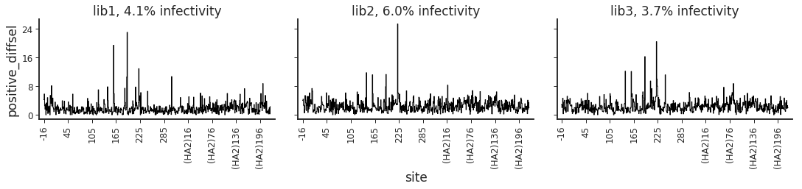


<table border="1" class="dataframe">
  <thead>
    <tr style="text-align: right;">
      <th>sample</th>
      <th>lib1, 4.1% infectivity</th>
      <th>lib2, 6.0% infectivity</th>
      <th>lib3, 3.7% infectivity</th>
    </tr>
    <tr>
      <th>sample</th>
      <th></th>
      <th></th>
      <th></th>
    </tr>
  </thead>
  <tbody>
    <tr>
      <th>lib1, 4.1% infectivity</th>
      <td>1.000</td>
      <td>0.518</td>
      <td>0.539</td>
    </tr>
    <tr>
      <th>lib2, 6.0% infectivity</th>
      <td>0.518</td>
      <td>1.000</td>
      <td>0.614</td>
    </tr>
    <tr>
      <th>lib3, 3.7% infectivity</th>
      <td>0.539</td>
      <td>0.614</td>
      <td>1.000</td>
    </tr>
  </tbody>
</table>


    
    
    ******************* 2015-age-25-prevacc *******************


<table border="1" class="dataframe">
  <thead>
    <tr style="text-align: right;">
      <th>sample</th>
      <th>lib1, 6.9% infectivity</th>
      <th>lib2, 2.3% infectivity</th>
      <th>lib3, 1.6% infectivity</th>
    </tr>
    <tr>
      <th>sample</th>
      <th></th>
      <th></th>
      <th></th>
    </tr>
  </thead>
  <tbody>
    <tr>
      <th>lib1, 6.9% infectivity</th>
      <td>1.000</td>
      <td>0.753</td>
      <td>0.763</td>
    </tr>
    <tr>
      <th>lib2, 2.3% infectivity</th>
      <td>0.753</td>
      <td>1.000</td>
      <td>0.757</td>
    </tr>
    <tr>
      <th>lib3, 1.6% infectivity</th>
      <td>0.763</td>
      <td>0.757</td>
      <td>1.000</td>
    </tr>
  </tbody>
</table>


    
    
    ******************* 2015-age-25-vacc *******************


<table border="1" class="dataframe">
  <thead>
    <tr style="text-align: right;">
      <th>sample</th>
      <th>lib1, 1.5% infectivity</th>
      <th>lib2, 0.81% infectivity</th>
      <th>lib3, 1.6% infectivity</th>
    </tr>
    <tr>
      <th>sample</th>
      <th></th>
      <th></th>
      <th></th>
    </tr>
  </thead>
  <tbody>
    <tr>
      <th>lib1, 1.5% infectivity</th>
      <td>1.000</td>
      <td>0.708</td>
      <td>0.693</td>
    </tr>
    <tr>
      <th>lib2, 0.81% infectivity</th>
      <td>0.708</td>
      <td>1.000</td>
      <td>0.747</td>
    </tr>
    <tr>
      <th>lib3, 1.6% infectivity</th>
      <td>0.693</td>
      <td>0.747</td>
      <td>1.000</td>
    </tr>
  </tbody>
</table>


    
    
    ******************* 2015-age-29-prevacc *******************


<table border="1" class="dataframe">
  <thead>
    <tr style="text-align: right;">
      <th>sample</th>
      <th>lib1, 9.5% infectivity</th>
      <th>lib2, 7.6% infectivity</th>
      <th>lib3, 3.3% infectivity</th>
    </tr>
    <tr>
      <th>sample</th>
      <th></th>
      <th></th>
      <th></th>
    </tr>
  </thead>
  <tbody>
    <tr>
      <th>lib1, 9.5% infectivity</th>
      <td>1.000</td>
      <td>0.356</td>
      <td>0.385</td>
    </tr>
    <tr>
      <th>lib2, 7.6% infectivity</th>
      <td>0.356</td>
      <td>1.000</td>
      <td>0.468</td>
    </tr>
    <tr>
      <th>lib3, 3.3% infectivity</th>
      <td>0.385</td>
      <td>0.468</td>
      <td>1.000</td>
    </tr>
  </tbody>
</table>


    
    
    ******************* 2015-age-29-vacc *******************


<table border="1" class="dataframe">
  <thead>
    <tr style="text-align: right;">
      <th>sample</th>
      <th>lib1, 1.5% infectivity</th>
      <th>lib2, 1.1% infectivity</th>
      <th>lib3, 1.9% infectivity</th>
    </tr>
    <tr>
      <th>sample</th>
      <th></th>
      <th></th>
      <th></th>
    </tr>
  </thead>
  <tbody>
    <tr>
      <th>lib1, 1.5% infectivity</th>
      <td>1.000</td>
      <td>0.457</td>
      <td>0.309</td>
    </tr>
    <tr>
      <th>lib2, 1.1% infectivity</th>
      <td>0.457</td>
      <td>1.000</td>
      <td>0.340</td>
    </tr>
    <tr>
      <th>lib3, 1.9% infectivity</th>
      <td>0.309</td>
      <td>0.340</td>
      <td>1.000</td>
    </tr>
  </tbody>
</table>


    
    
    ******************* 2015-age-48-prevacc *******************


<table border="1" class="dataframe">
  <thead>
    <tr style="text-align: right;">
      <th>sample</th>
      <th>lib1, 14% infectivity</th>
      <th>lib2, 20% infectivity</th>
      <th>lib3, 18% infectivity</th>
    </tr>
    <tr>
      <th>sample</th>
      <th></th>
      <th></th>
      <th></th>
    </tr>
  </thead>
  <tbody>
    <tr>
      <th>lib1, 14% infectivity</th>
      <td>1.000</td>
      <td>0.320</td>
      <td>0.345</td>
    </tr>
    <tr>
      <th>lib2, 20% infectivity</th>
      <td>0.320</td>
      <td>1.000</td>
      <td>0.413</td>
    </tr>
    <tr>
      <th>lib3, 18% infectivity</th>
      <td>0.345</td>
      <td>0.413</td>
      <td>1.000</td>
    </tr>
  </tbody>
</table>


    
    
    ******************* 2015-age-48-vacc *******************


<table border="1" class="dataframe">
  <thead>
    <tr style="text-align: right;">
      <th>sample</th>
      <th>lib1, 4.6% infectivity</th>
      <th>lib2, 4.7% infectivity</th>
      <th>lib3, 4.1% infectivity</th>
    </tr>
    <tr>
      <th>sample</th>
      <th></th>
      <th></th>
      <th></th>
    </tr>
  </thead>
  <tbody>
    <tr>
      <th>lib1, 4.6% infectivity</th>
      <td>1.000</td>
      <td>0.578</td>
      <td>0.668</td>
    </tr>
    <tr>
      <th>lib2, 4.7% infectivity</th>
      <td>0.578</td>
      <td>1.000</td>
      <td>0.571</td>
    </tr>
    <tr>
      <th>lib3, 4.1% infectivity</th>
      <td>0.668</td>
      <td>0.571</td>
      <td>1.000</td>
    </tr>
  </tbody>
</table>


    
    
    ******************* 2015-age-49-prevacc *******************


<table border="1" class="dataframe">
  <thead>
    <tr style="text-align: right;">
      <th>sample</th>
      <th>lib1, 20% infectivity</th>
      <th>lib2, 12% infectivity</th>
      <th>lib3, 28% infectivity</th>
    </tr>
    <tr>
      <th>sample</th>
      <th></th>
      <th></th>
      <th></th>
    </tr>
  </thead>
  <tbody>
    <tr>
      <th>lib1, 20% infectivity</th>
      <td>1.000</td>
      <td>0.394</td>
      <td>0.371</td>
    </tr>
    <tr>
      <th>lib2, 12% infectivity</th>
      <td>0.394</td>
      <td>1.000</td>
      <td>0.376</td>
    </tr>
    <tr>
      <th>lib3, 28% infectivity</th>
      <td>0.371</td>
      <td>0.376</td>
      <td>1.000</td>
    </tr>
  </tbody>
</table>


    
    
    ******************* 2015-age-49-vacc *******************


<table border="1" class="dataframe">
  <thead>
    <tr style="text-align: right;">
      <th>sample</th>
      <th>lib1, 5.5% infectivity</th>
      <th>lib2, 1.1% infectivity</th>
      <th>lib3, 7.8% infectivity</th>
    </tr>
    <tr>
      <th>sample</th>
      <th></th>
      <th></th>
      <th></th>
    </tr>
  </thead>
  <tbody>
    <tr>
      <th>lib1, 5.5% infectivity</th>
      <td>1.000</td>
      <td>0.375</td>
      <td>0.388</td>
    </tr>
    <tr>
      <th>lib2, 1.1% infectivity</th>
      <td>0.375</td>
      <td>1.000</td>
      <td>0.449</td>
    </tr>
    <tr>
      <th>lib3, 7.8% infectivity</th>
      <td>0.388</td>
      <td>0.449</td>
      <td>1.000</td>
    </tr>
  </tbody>
</table>


    
    
    ******************* antibody-4F03 *******************


<table border="1" class="dataframe">
  <thead>
    <tr style="text-align: right;">
      <th>sample</th>
      <th>lib1, 0.78% infectivity</th>
      <th>lib1, 28% infectivity</th>
      <th>lib1, 3.5% infectivity</th>
      <th>lib2, 23% infectivity</th>
      <th>lib2, 3.7% infectivity</th>
      <th>lib2, 4.7% infectivity</th>
      <th>lib3, 0.84% infectivity</th>
      <th>lib3, 24% infectivity</th>
      <th>lib3, 7.2% infectivity</th>
    </tr>
    <tr>
      <th>sample</th>
      <th></th>
      <th></th>
      <th></th>
      <th></th>
      <th></th>
      <th></th>
      <th></th>
      <th></th>
      <th></th>
    </tr>
  </thead>
  <tbody>
    <tr>
      <th>lib1, 0.78% infectivity</th>
      <td>1.000</td>
      <td>0.293</td>
      <td>0.850</td>
      <td>0.412</td>
      <td>0.792</td>
      <td>0.718</td>
      <td>0.768</td>
      <td>0.507</td>
      <td>0.728</td>
    </tr>
    <tr>
      <th>lib1, 28% infectivity</th>
      <td>0.293</td>
      <td>1.000</td>
      <td>0.395</td>
      <td>0.357</td>
      <td>0.368</td>
      <td>0.370</td>
      <td>0.326</td>
      <td>0.379</td>
      <td>0.388</td>
    </tr>
    <tr>
      <th>lib1, 3.5% infectivity</th>
      <td>0.850</td>
      <td>0.395</td>
      <td>1.000</td>
      <td>0.451</td>
      <td>0.745</td>
      <td>0.720</td>
      <td>0.731</td>
      <td>0.578</td>
      <td>0.743</td>
    </tr>
    <tr>
      <th>lib2, 23% infectivity</th>
      <td>0.412</td>
      <td>0.357</td>
      <td>0.451</td>
      <td>1.000</td>
      <td>0.576</td>
      <td>0.630</td>
      <td>0.459</td>
      <td>0.533</td>
      <td>0.506</td>
    </tr>
    <tr>
      <th>lib2, 3.7% infectivity</th>
      <td>0.792</td>
      <td>0.368</td>
      <td>0.745</td>
      <td>0.576</td>
      <td>1.000</td>
      <td>0.819</td>
      <td>0.761</td>
      <td>0.576</td>
      <td>0.744</td>
    </tr>
    <tr>
      <th>lib2, 4.7% infectivity</th>
      <td>0.718</td>
      <td>0.370</td>
      <td>0.720</td>
      <td>0.630</td>
      <td>0.819</td>
      <td>1.000</td>
      <td>0.786</td>
      <td>0.688</td>
      <td>0.806</td>
    </tr>
    <tr>
      <th>lib3, 0.84% infectivity</th>
      <td>0.768</td>
      <td>0.326</td>
      <td>0.731</td>
      <td>0.459</td>
      <td>0.761</td>
      <td>0.786</td>
      <td>1.000</td>
      <td>0.687</td>
      <td>0.846</td>
    </tr>
    <tr>
      <th>lib3, 24% infectivity</th>
      <td>0.507</td>
      <td>0.379</td>
      <td>0.578</td>
      <td>0.533</td>
      <td>0.576</td>
      <td>0.688</td>
      <td>0.687</td>
      <td>1.000</td>
      <td>0.799</td>
    </tr>
    <tr>
      <th>lib3, 7.2% infectivity</th>
      <td>0.728</td>
      <td>0.388</td>
      <td>0.743</td>
      <td>0.506</td>
      <td>0.744</td>
      <td>0.806</td>
      <td>0.846</td>
      <td>0.799</td>
      <td>1.000</td>
    </tr>
  </tbody>
</table>


    
    
    ******************* antibody-5A01 *******************


<table border="1" class="dataframe">
  <thead>
    <tr style="text-align: right;">
      <th>sample</th>
      <th>lib1, 4.3% infectivity</th>
      <th>lib2, 1.4% infectivity</th>
      <th>lib3, 1.0% infectivity</th>
    </tr>
    <tr>
      <th>sample</th>
      <th></th>
      <th></th>
      <th></th>
    </tr>
  </thead>
  <tbody>
    <tr>
      <th>lib1, 4.3% infectivity</th>
      <td>1.000</td>
      <td>0.762</td>
      <td>0.705</td>
    </tr>
    <tr>
      <th>lib2, 1.4% infectivity</th>
      <td>0.762</td>
      <td>1.000</td>
      <td>0.717</td>
    </tr>
    <tr>
      <th>lib3, 1.0% infectivity</th>
      <td>0.705</td>
      <td>0.717</td>
      <td>1.000</td>
    </tr>
  </tbody>
</table>


    
    
    ******************* ferret-Pitt-1-postinf *******************


<table border="1" class="dataframe">
  <thead>
    <tr style="text-align: right;">
      <th>sample</th>
      <th>lib1, 4.4% infectivity</th>
      <th>lib2, 5.3% infectivity</th>
      <th>lib3, 1.7% infectivity</th>
    </tr>
    <tr>
      <th>sample</th>
      <th></th>
      <th></th>
      <th></th>
    </tr>
  </thead>
  <tbody>
    <tr>
      <th>lib1, 4.4% infectivity</th>
      <td>1.000</td>
      <td>0.517</td>
      <td>0.58</td>
    </tr>
    <tr>
      <th>lib2, 5.3% infectivity</th>
      <td>0.517</td>
      <td>1.000</td>
      <td>0.58</td>
    </tr>
    <tr>
      <th>lib3, 1.7% infectivity</th>
      <td>0.580</td>
      <td>0.580</td>
      <td>1.00</td>
    </tr>
  </tbody>
</table>


    
    
    ******************* ferret-Pitt-1-preinf *******************


<table border="1" class="dataframe">
  <thead>
    <tr style="text-align: right;">
      <th>sample</th>
      <th>lib1, 100% infectivity</th>
      <th>lib2, 100% infectivity</th>
      <th>lib3, 100% infectivity</th>
    </tr>
    <tr>
      <th>sample</th>
      <th></th>
      <th></th>
      <th></th>
    </tr>
  </thead>
  <tbody>
    <tr>
      <th>lib1, 100% infectivity</th>
      <td>1.000</td>
      <td>0.248</td>
      <td>0.327</td>
    </tr>
    <tr>
      <th>lib2, 100% infectivity</th>
      <td>0.248</td>
      <td>1.000</td>
      <td>0.231</td>
    </tr>
    <tr>
      <th>lib3, 100% infectivity</th>
      <td>0.327</td>
      <td>0.231</td>
      <td>1.000</td>
    </tr>
  </tbody>
</table>


    
    
    ******************* ferret-Pitt-2-postinf *******************


<table border="1" class="dataframe">
  <thead>
    <tr style="text-align: right;">
      <th>sample</th>
      <th>lib1, 3.5% infectivity</th>
      <th>lib2, 1.9% infectivity</th>
      <th>lib3, 3.0% infectivity</th>
    </tr>
    <tr>
      <th>sample</th>
      <th></th>
      <th></th>
      <th></th>
    </tr>
  </thead>
  <tbody>
    <tr>
      <th>lib1, 3.5% infectivity</th>
      <td>1.000</td>
      <td>0.487</td>
      <td>0.551</td>
    </tr>
    <tr>
      <th>lib2, 1.9% infectivity</th>
      <td>0.487</td>
      <td>1.000</td>
      <td>0.509</td>
    </tr>
    <tr>
      <th>lib3, 3.0% infectivity</th>
      <td>0.551</td>
      <td>0.509</td>
      <td>1.000</td>
    </tr>
  </tbody>
</table>


    
    
    ******************* ferret-Pitt-2-preinf *******************


<table border="1" class="dataframe">
  <thead>
    <tr style="text-align: right;">
      <th>sample</th>
      <th>lib1, 100% infectivity</th>
      <th>lib2, 100% infectivity</th>
      <th>lib3, 100% infectivity</th>
    </tr>
    <tr>
      <th>sample</th>
      <th></th>
      <th></th>
      <th></th>
    </tr>
  </thead>
  <tbody>
    <tr>
      <th>lib1, 100% infectivity</th>
      <td>1.00</td>
      <td>0.260</td>
      <td>0.270</td>
    </tr>
    <tr>
      <th>lib2, 100% infectivity</th>
      <td>0.26</td>
      <td>1.000</td>
      <td>0.328</td>
    </tr>
    <tr>
      <th>lib3, 100% infectivity</th>
      <td>0.27</td>
      <td>0.328</td>
      <td>1.000</td>
    </tr>
  </tbody>
</table>


    
    
    ******************* ferret-Pitt-3-postinf *******************


<table border="1" class="dataframe">
  <thead>
    <tr style="text-align: right;">
      <th>sample</th>
      <th>lib1, 8.8% infectivity</th>
      <th>lib2, 1.7% infectivity</th>
      <th>lib3, 5.8% infectivity</th>
    </tr>
    <tr>
      <th>sample</th>
      <th></th>
      <th></th>
      <th></th>
    </tr>
  </thead>
  <tbody>
    <tr>
      <th>lib1, 8.8% infectivity</th>
      <td>1.000</td>
      <td>0.589</td>
      <td>0.563</td>
    </tr>
    <tr>
      <th>lib2, 1.7% infectivity</th>
      <td>0.589</td>
      <td>1.000</td>
      <td>0.629</td>
    </tr>
    <tr>
      <th>lib3, 5.8% infectivity</th>
      <td>0.563</td>
      <td>0.629</td>
      <td>1.000</td>
    </tr>
  </tbody>
</table>


    
    
    ******************* ferret-Pitt-3-preinf *******************


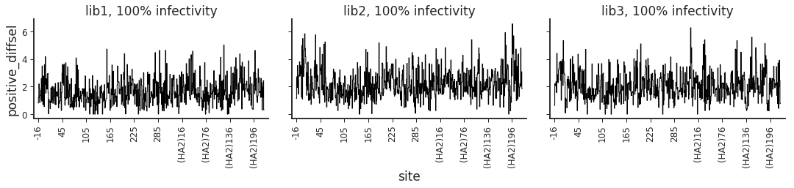


<table border="1" class="dataframe">
  <thead>
    <tr style="text-align: right;">
      <th>sample</th>
      <th>lib1, 100% infectivity</th>
      <th>lib2, 100% infectivity</th>
      <th>lib3, 100% infectivity</th>
    </tr>
    <tr>
      <th>sample</th>
      <th></th>
      <th></th>
      <th></th>
    </tr>
  </thead>
  <tbody>
    <tr>
      <th>lib1, 100% infectivity</th>
      <td>1.000</td>
      <td>0.286</td>
      <td>0.346</td>
    </tr>
    <tr>
      <th>lib2, 100% infectivity</th>
      <td>0.286</td>
      <td>1.000</td>
      <td>0.336</td>
    </tr>
    <tr>
      <th>lib3, 100% infectivity</th>
      <td>0.346</td>
      <td>0.336</td>
      <td>1.000</td>
    </tr>
  </tbody>
</table>


    
    
    ******************* ferret-WHO *******************


<table border="1" class="dataframe">
  <thead>
    <tr style="text-align: right;">
      <th>sample</th>
      <th>lib1, 2.3% infectivity</th>
      <th>lib2, 1.9% infectivity</th>
      <th>lib3, 4.1% infectivity</th>
    </tr>
    <tr>
      <th>sample</th>
      <th></th>
      <th></th>
      <th></th>
    </tr>
  </thead>
  <tbody>
    <tr>
      <th>lib1, 2.3% infectivity</th>
      <td>1.000</td>
      <td>0.502</td>
      <td>0.534</td>
    </tr>
    <tr>
      <th>lib2, 1.9% infectivity</th>
      <td>0.502</td>
      <td>1.000</td>
      <td>0.449</td>
    </tr>
    <tr>
      <th>lib3, 4.1% infectivity</th>
      <td>0.534</td>
      <td>0.449</td>
      <td>1.000</td>
    </tr>
  </tbody>
</table>


    
    
    ******************* ferret-WHO-Victoria2011 *******************


<table border="1" class="dataframe">
  <thead>
    <tr style="text-align: right;">
      <th>sample</th>
      <th>lib1, 1.3% infectivity</th>
      <th>lib2, 3.9% infectivity</th>
      <th>lib3, 3.6% infectivity</th>
    </tr>
    <tr>
      <th>sample</th>
      <th></th>
      <th></th>
      <th></th>
    </tr>
  </thead>
  <tbody>
    <tr>
      <th>lib1, 1.3% infectivity</th>
      <td>1.000</td>
      <td>0.600</td>
      <td>0.618</td>
    </tr>
    <tr>
      <th>lib2, 3.9% infectivity</th>
      <td>0.600</td>
      <td>1.000</td>
      <td>0.631</td>
    </tr>
    <tr>
      <th>lib3, 3.6% infectivity</th>
      <td>0.618</td>
      <td>0.631</td>
      <td>1.000</td>
    </tr>
  </tbody>
</table>


#### Choose samples to retain based on infectivity remaining
From the plots and correlations immediately above, several things are apparent:
 1. Different samples with the **same** virus library tend to be substantially more correlated than samples between different virus libraries.
    This makes sense, as some of the noise probably comes from library composition differences in terms of variant abundance.
    This fact implies that we want to keep just one (or the same number) of samples from each library, so that when we take means / medians across samples they are not disproportionately influenced by a single library.
 2. The "best" concentration of serum appears to be one that leaves about about 1% to 5% of the viral infectivity remaining. 
    This is judged by the fact that samples with this percent infectivity remaining tend to look "cleanest" in the line plots of site differential selection, and also tend to correlate best with samples from another library.
    
Based on the above, we will filter our samples down to those that have closest to the target amount of viral infectivity remaining.
Because we qualitatively estimated above that the best results are obtained when between 1% to 5% of infectivity is remaining, we will target 2% infectivity.
Then for any library / serum with multiple samples, we will retain the one that is closest (in log space) to that target infectivity.
We do this in log space because in linear space, 0% infectivity would be closer to 2% infectivity as would 6% infectivity--even though the latter is clearly preferable if our target is 2%.


```python
target_infectivity = 2
print(f"Choosing samples closest to {target_infectivity:.2f}% infectivity.")
```

    Choosing samples closest to 2.00% infectivity.


Mark the samples to retain by adding a *retained* column to both the *selections* and *sel_df* data frames, and flagging it as *True* only for the sample for that serum and library that has the smallest log-space distance to the target infectivity:


```python
selections = (
    selections
    .assign(retained=lambda x: x.assign(dist=lambda y: (y.percent_infectivity /
                                                        target_infectivity)
                                        .apply(math.log).apply(abs))
            .groupby(['serum_name_formatted', 'library'])
            ['dist']
            .transform(lambda y: y <= y.min())
            )
    )
print(f"Retaining {len(selections.query('retained'))} of {len(selections)}")

sel_df = sel_df.merge(selections[['serum_name_formatted', 'name', 'retained']],
                      validate='many_to_one')
```

    Retaining 78 of 84


Plot the samples to retain and their percent infectivity.
In the plot below, the dashed horizontal line indicates the target percent infectivity, and the colors of the points indicate which sample we retained for each serum / library:


```python
p = (p9.ggplot(selections.assign(xlabel=lambda x: (x['serum_name_formatted'] +
                                                   ', ' + x['library'])),
               p9.aes('xlabel', 'percent_infectivity', color='retained')) +
     p9.geom_point(size=3, alpha=0.7) +
     p9.theme(
         axis_text_x=p9.element_text(angle=90),
         figure_size=(0.25 * len(selections.groupby(['serum_name_formatted',
                                                     'library'])), 2.5)
         ) +
     p9.scale_y_log10(name='percent infectivity') +
     p9.xlab('') +
     p9.scale_color_manual(values=PALETTE) +
     p9.geom_hline(yintercept=target_infectivity, linetype='dashed',
                   alpha=0.7, color=PALETTE[2])
     )

_ = p.draw()
```


#### Listing of retained samples
Here is a small table listing the samples that we retained for each serum, and their percent infectivity remaining:


```python
display(HTML(selections
             .assign(serum_name=lambda x:
                     pd.Categorical(x['serum_name'],
                                    sera['serum_name'],
                                    ordered=True))
             .query('retained')
             .sort_values('serum_name')
             [['serum_group', 'serum_name_formatted', 'library',
               'percent_infectivity']]
             .pivot_table(index=['serum_group', 'serum_name_formatted'],
                          columns='library',
                          values='percent_infectivity')
             .to_html()
             ))
```


<table border="1" class="dataframe">
  <thead>
    <tr style="text-align: right;">
      <th></th>
      <th>library</th>
      <th>lib1</th>
      <th>lib2</th>
      <th>lib3</th>
    </tr>
    <tr>
      <th>serum_group</th>
      <th>serum_name_formatted</th>
      <th></th>
      <th></th>
      <th></th>
    </tr>
  </thead>
  <tbody>
    <tr>
      <th rowspan="8" valign="top">Hensley_sera</th>
      <th>2015-age-25-prevacc</th>
      <td>6.9000</td>
      <td>2.31</td>
      <td>1.5700</td>
    </tr>
    <tr>
      <th>2015-age-25-vacc</th>
      <td>1.5300</td>
      <td>0.81</td>
      <td>1.6400</td>
    </tr>
    <tr>
      <th>2015-age-29-prevacc</th>
      <td>9.4800</td>
      <td>7.57</td>
      <td>3.3000</td>
    </tr>
    <tr>
      <th>2015-age-29-vacc</th>
      <td>1.5400</td>
      <td>1.11</td>
      <td>1.9200</td>
    </tr>
    <tr>
      <th>2015-age-48-prevacc</th>
      <td>13.8200</td>
      <td>20.32</td>
      <td>18.4000</td>
    </tr>
    <tr>
      <th>2015-age-48-vacc</th>
      <td>4.5800</td>
      <td>4.68</td>
      <td>4.0600</td>
    </tr>
    <tr>
      <th>2015-age-49-prevacc</th>
      <td>19.6200</td>
      <td>11.86</td>
      <td>27.7400</td>
    </tr>
    <tr>
      <th>2015-age-49-vacc</th>
      <td>5.4800</td>
      <td>1.09</td>
      <td>7.7900</td>
    </tr>
    <tr>
      <th rowspan="5" valign="top">VIDD_sera</th>
      <th>2009-age-53a</th>
      <td>3.7400</td>
      <td>2.03</td>
      <td>6.2200</td>
    </tr>
    <tr>
      <th>2009-age-53b</th>
      <td>5.9800</td>
      <td>1.73</td>
      <td>1.1200</td>
    </tr>
    <tr>
      <th>2009-age-64</th>
      <td>10.7400</td>
      <td>0.87</td>
      <td>0.2600</td>
    </tr>
    <tr>
      <th>2009-age-65</th>
      <td>1.7700</td>
      <td>5.24</td>
      <td>5.5800</td>
    </tr>
    <tr>
      <th>2010-age-21</th>
      <td>4.0800</td>
      <td>5.95</td>
      <td>3.6800</td>
    </tr>
    <tr>
      <th rowspan="2" valign="top">antibody</th>
      <th>antibody-4F03</th>
      <td>3.4700</td>
      <td>3.71</td>
      <td>0.8400</td>
    </tr>
    <tr>
      <th>antibody-5A01</th>
      <td>4.3200</td>
      <td>1.36</td>
      <td>1.0200</td>
    </tr>
    <tr>
      <th rowspan="8" valign="top">ferret</th>
      <th>ferret-Pitt-1-postinf</th>
      <td>4.3600</td>
      <td>5.35</td>
      <td>1.6900</td>
    </tr>
    <tr>
      <th>ferret-Pitt-1-preinf</th>
      <td>100.0000</td>
      <td>100.00</td>
      <td>100.0000</td>
    </tr>
    <tr>
      <th>ferret-Pitt-2-postinf</th>
      <td>3.4500</td>
      <td>1.88</td>
      <td>3.0400</td>
    </tr>
    <tr>
      <th>ferret-Pitt-2-preinf</th>
      <td>100.0000</td>
      <td>100.00</td>
      <td>100.0000</td>
    </tr>
    <tr>
      <th>ferret-Pitt-3-postinf</th>
      <td>8.7700</td>
      <td>1.70</td>
      <td>5.7800</td>
    </tr>
    <tr>
      <th>ferret-Pitt-3-preinf</th>
      <td>100.0000</td>
      <td>100.00</td>
      <td>100.0000</td>
    </tr>
    <tr>
      <th>ferret-WHO</th>
      <td>2.3200</td>
      <td>1.88</td>
      <td>4.1000</td>
    </tr>
    <tr>
      <th>ferret-WHO-Victoria2011</th>
      <td>1.2600</td>
      <td>3.90</td>
      <td>3.6200</td>
    </tr>
    <tr>
      <th rowspan="3" valign="top">serum_mAb_spike</th>
      <th>2009-age-65-with-hi-4F03</th>
      <td>0.0016</td>
      <td>0.04</td>
      <td>0.0032</td>
    </tr>
    <tr>
      <th>2009-age-65-with-low-4F03</th>
      <td>0.0300</td>
      <td>5.00</td>
      <td>0.2040</td>
    </tr>
    <tr>
      <th>2009-age-65-with-mid-4F03</th>
      <td>0.0037</td>
      <td>0.46</td>
      <td>0.0077</td>
    </tr>
  </tbody>
</table>


### Compute serum average from retained samples
We now compute the "average" selection among the retained samples for each serum.

First, confirm that we have retained just one sample per serum / library:


```python
assert all(len(group) == 1 for _, group in
           (selections
            .query('retained')
            .groupby(['serum_name_formatted', 'library'])
            )
           )
```

We will compute two types of "average" selection, the mean and the median across the samples:


```python
avg_types = ['mean', 'median']
```

Do a sanity check and make sure none of our libraries are named one of the average types:


```python
assert not set(avg_types).intersection(set(selections['library']))
assert not set(avg_types).intersection(set(selections['name_formatted']))
```

Now loop over all sera and compute the average selection for all retained samples for that sera.
Note that the averages are computed on the mutation-level data, and then the site data are computed from those averaged mutation-level data.
The averages (along with the samples used to compute these averages) are then added to a new data frame similar to *selections* that is called *avg_selections*:


```python
# function to compute mutation-level average
mut_avg_func = {'diffsel': dms_tools2.diffsel.avgMutDiffSel,
                'fracsurvive': dms_tools2.fracsurvive.avgMutFracSurvive}

# function to convert mutation-level values to site-level values
mut_to_site_func = {'diffsel': dms_tools2.diffsel.mutToSiteDiffSel,
                    'fracsurvive': dms_tools2.fracsurvive.mutToSiteFracSurvive}

avg_selections = []
for serum_name_formatted, group in (
            selections
            .query('retained')
            [['serum_name_formatted', 'library', 'name_formatted'] +
             list(sera.columns) + selfilecols]
            .groupby('serum_name_formatted')
            ):

    avg_selections.append(group)

    for avg_type in avg_types:
        # build row of data frame with average
        avg_row = group.iloc[0].to_dict(into=collections.OrderedDict)
        avg_row['library'] = avg_type
        avg_row['name_formatted'] = avg_type

        avgdir = config[f"avg{seltype}dir"]
        os.makedirs(avgdir, exist_ok=True)

        avg_row[f"mut{seltype}_file"] = (f"{avgdir}/{serum_name_formatted}-"
                                         f"mut{seltype}-{avg_type}.csv")
        (mut_avg_func[seltype](group[f"mut{seltype}_file"], avg_type)
         .to_csv(avg_row[f"mut{seltype}_file"], index=False))

        avg_row[f"site{seltype}_file"] = (f"{avgdir}/{serum_name_formatted}-"
                                          f"site{seltype}-{avg_type}.csv")
        (mut_to_site_func[seltype](pd.read_csv(avg_row[f"mut{seltype}_file"]))
         .to_csv(avg_row[f"site{seltype}_file"], index=False))

        avg_row = pd.Series(avg_row).to_frame().transpose()
        assert all(avg_row.columns == group.columns)
        avg_selections.append(avg_row)

# put avg_selections in data frame, sort to match config['sera']
avg_selections = (pd.concat(avg_selections)
                  .assign(serum_name=lambda x:
                          pd.Categorical(x['serum_name'],
                                         sera['serum_name'],
                                         ordered=True))
                  .sort_values(['serum_name', 'library'])
                  .assign(serum_name_formatted=lambda x:
                          pd.Categorical(x['serum_name_formatted'],
                                         x['serum_name_formatted'].unique(),
                                         ordered=True))
                  .reset_index(drop=True)
                  )
```

Now the `avg_selections` data frame lists the files giving all the retained library replicates plus the means and medians calculated from them these replicates.

Now we create the data frame `avg_sel_df` which actually holds the site- and mutation-level averages for all sera as well as the samples (one replicate per library) that we used to compute these averages:


```python
avg_sel_df = (dms_tools2.diffsel.df_read_filecols(avg_selections, selfilecols)
              # preserve order of sera as in `avg_selections`
              .assign(serum_name_formatted=lambda x:
                      pd.Categorical(x['serum_name_formatted'],
                                     (avg_selections['serum_name_formatted']
                                      .unique()),
                                     ordered=True))
              )
```

This `avg_sel_df` data frame differs from `sel_df` only in that it includes the averages as a library type, and only has the retained replicates for each library.

### Choose averaging method for downstream use
For the summary plots below, we need to choose whether to represent our "averages" using the mean or the median.
This is done in the next cell.
We are using the *median* as our measure of the average; to instead use the *mean* simply switch the cell below to define `avg_type` as *mean* rather than *median*.

**(This choice of median over mean should be re-visited once we have replicates for all three libraries, but for 1 and 2 libraries the mean and the median are the same so it doesn't matter).**


```python
avg_type = 'median'
unused_avg_types = [x for x in avg_types if x != avg_type]
```

### Identify sites of "significant" selection
We want to identify the sites that are under "significant" immune selection.
The reason is that we can then zoom in on these sites in logo plots.

In [dms_tools2.plot.findSigSel](https://jbloomlab.github.io/dms_tools2/dms_tools2.plot.html#dms_tools2.plot.findSigSel) function, we have defined a heuristic way to do this.
Essentially, this function uses robust regression to fit a gamma distribution to the selection values for each site, and then identifies those that are "outliers" of high selection.

#### Cutoff for significance
First, we define a cutoff for what constitutes significant:


```python
fdr_cutoff = 0.05
```

#### Identify significant sites
Now we use [dms_tools2.plot.findSigSel](https://jbloomlab.github.io/dms_tools2/dms_tools2.plot.html#dms_tools2.plot.findSigSel) to get a dataframe (`sigsites_df`) that lists the "significant" sites for each serum.
Note that the cell below also saves plots showing the fit gamma distribution (you can inspect these separately if you want to look in more detail):


```python
plotfile_template = os.path.join(config[f"avg{seltype}dir"],
                                 'sigsites_{serum}.pdf')

print(f"Identifying sites of significant selection at a FDR of {fdr_cutoff}.\n"
      f"Plots of distribution fitting saved as {plotfile_template}")

sigsites_df = []
for serum_name_formatted, group in (
        avg_sel_df
        .query('library == @avg_type')
        [['serum_group', 'serum_name_formatted', 'isite', 'site',
          site_metric[seltype]]]
        .drop_duplicates()
        .groupby('serum_name_formatted')
        ):
    plotfile = plotfile_template.format(serum=serum_name_formatted)
    df, cutoff, gamma_params = dms_tools2.plot.findSigSel(
            group,
            site_metric[seltype],
            plotfile,
            fdr=fdr_cutoff,
            title=serum_name_formatted
            )
    sigsites_df.append(df)

sigsites_df = pd.concat(sigsites_df, ignore_index=True).query('sig')

print('Here are the first few rows of sigsites_df:')
display(HTML(sigsites_df.head(n=4).to_html(index=False)))
```

    Identifying sites of significant selection at a FDR of 0.05.
    Plots of distribution fitting saved as results/avgdiffsel/sigsites_{serum}.pdf
    Here are the first few rows of sigsites_df:


<table border="1" class="dataframe">
  <thead>
    <tr style="text-align: right;">
      <th>serum_group</th>
      <th>serum_name_formatted</th>
      <th>isite</th>
      <th>site</th>
      <th>positive_diffsel</th>
      <th>P</th>
      <th>Q</th>
      <th>sig</th>
    </tr>
  </thead>
  <tbody>
    <tr>
      <td>antibody</td>
      <td>antibody-5A01</td>
      <td>174</td>
      <td>159</td>
      <td>29.408444</td>
      <td>7.342282e-21</td>
      <td>2.077866e-18</td>
      <td>True</td>
    </tr>
    <tr>
      <td>antibody</td>
      <td>antibody-5A01</td>
      <td>175</td>
      <td>160</td>
      <td>32.811071</td>
      <td>3.346376e-23</td>
      <td>1.894049e-20</td>
      <td>True</td>
    </tr>
    <tr>
      <td>antibody</td>
      <td>antibody-5A01</td>
      <td>208</td>
      <td>193</td>
      <td>13.612415</td>
      <td>5.329409e-10</td>
      <td>7.541114e-08</td>
      <td>True</td>
    </tr>
    <tr>
      <td>antibody</td>
      <td>antibody-5A01</td>
      <td>173</td>
      <td>158</td>
      <td>4.757160</td>
      <td>6.271668e-04</td>
      <td>4.437205e-02</td>
      <td>True</td>
    </tr>
  </tbody>
</table>


#### List significant sites for each serum
Now display lists of the significant sites for each serum:


```python
display(HTML(sigsites_df
             .sort_values('isite')
             .assign(nsites=1)
             .groupby('serum_name_formatted')
             .aggregate({'site': lambda x: ', '.join(list(x)),
                         'nsites': 'sum'})
             .rename(columns={'site': 'significant sites',
                              'nsites': 'number of sites'})
             .to_html()
             ))
```


<table border="1" class="dataframe">
  <thead>
    <tr style="text-align: right;">
      <th></th>
      <th>significant sites</th>
      <th>number of sites</th>
    </tr>
    <tr>
      <th>serum_name_formatted</th>
      <th></th>
      <th></th>
    </tr>
  </thead>
  <tbody>
    <tr>
      <th>antibody-5A01</th>
      <td>157, 158, 159, 160, 193, 222, 227, 244</td>
      <td>8</td>
    </tr>
    <tr>
      <th>antibody-4F03</th>
      <td>80, 81, 83, 121, 122, 220, 244, 259, (HA2)78</td>
      <td>9</td>
    </tr>
    <tr>
      <th>ferret-Pitt-1-preinf</th>
      <td></td>
      <td>0</td>
    </tr>
    <tr>
      <th>ferret-Pitt-1-postinf</th>
      <td>189, 193</td>
      <td>2</td>
    </tr>
    <tr>
      <th>ferret-Pitt-2-preinf</th>
      <td></td>
      <td>0</td>
    </tr>
    <tr>
      <th>ferret-Pitt-2-postinf</th>
      <td>142, 144, 189, 193, 222</td>
      <td>5</td>
    </tr>
    <tr>
      <th>ferret-Pitt-3-preinf</th>
      <td></td>
      <td>0</td>
    </tr>
    <tr>
      <th>ferret-Pitt-3-postinf</th>
      <td>189</td>
      <td>1</td>
    </tr>
    <tr>
      <th>ferret-WHO</th>
      <td>50, 189, 193</td>
      <td>3</td>
    </tr>
    <tr>
      <th>ferret-WHO-Victoria2011</th>
      <td>50, 159, 189, 193, 222, 275</td>
      <td>6</td>
    </tr>
    <tr>
      <th>2010-age-21</th>
      <td>193, 222</td>
      <td>2</td>
    </tr>
    <tr>
      <th>2009-age-53a</th>
      <td>157, 160</td>
      <td>2</td>
    </tr>
    <tr>
      <th>2009-age-53b</th>
      <td>157, 160, 244</td>
      <td>3</td>
    </tr>
    <tr>
      <th>2009-age-64</th>
      <td>159, 222, 244</td>
      <td>3</td>
    </tr>
    <tr>
      <th>2009-age-65</th>
      <td>159, 160, 193</td>
      <td>3</td>
    </tr>
    <tr>
      <th>2015-age-25-prevacc</th>
      <td>145, 159, 160, 192, 193, 210, 218, 220, 222, 223, 224, 279</td>
      <td>12</td>
    </tr>
    <tr>
      <th>2015-age-25-vacc</th>
      <td>145, 159, 160, 161, 192, 193, 207, 220, 222, 224, 225, 244</td>
      <td>12</td>
    </tr>
    <tr>
      <th>2015-age-29-prevacc</th>
      <td>157, 159, 160, 193</td>
      <td>4</td>
    </tr>
    <tr>
      <th>2015-age-29-vacc</th>
      <td>144, 145, 159, 160, 222, 227</td>
      <td>6</td>
    </tr>
    <tr>
      <th>2015-age-48-prevacc</th>
      <td>201</td>
      <td>1</td>
    </tr>
    <tr>
      <th>2015-age-48-vacc</th>
      <td>189</td>
      <td>1</td>
    </tr>
    <tr>
      <th>2015-age-49-prevacc</th>
      <td></td>
      <td>0</td>
    </tr>
    <tr>
      <th>2015-age-49-vacc</th>
      <td></td>
      <td>0</td>
    </tr>
    <tr>
      <th>2009-age-65-with-low-4F03</th>
      <td>80, 121, 159, 160, 193, 244</td>
      <td>6</td>
    </tr>
    <tr>
      <th>2009-age-65-with-mid-4F03</th>
      <td>121</td>
      <td>1</td>
    </tr>
    <tr>
      <th>2009-age-65-with-hi-4F03</th>
      <td></td>
      <td>0</td>
    </tr>
  </tbody>
</table>


#### Get significant sites for each serum group
In the analyses below, we may want to plot the sites that are significant within at least one serum sample for each serum group.
Therefore, we determine the significant sites within each serum group:


```python
sigsites_by_serumgroup = (
    sigsites_df
    [['serum_group', 'isite', 'site']]
    .drop_duplicates()
    .sort_values('isite')
    .groupby('serum_group')
    .aggregate(lambda x: list(x))
    .assign(nsites=lambda x: x['site'].apply(len))
    .sort_values('nsites')
    )

display(HTML(sigsites_by_serumgroup.to_html()))
```


<table border="1" class="dataframe">
  <thead>
    <tr style="text-align: right;">
      <th></th>
      <th>isite</th>
      <th>site</th>
      <th>nsites</th>
    </tr>
    <tr>
      <th>serum_group</th>
      <th></th>
      <th></th>
      <th></th>
    </tr>
  </thead>
  <tbody>
    <tr>
      <th>VIDD_sera</th>
      <td>[172, 174, 175, 208, 237, 259]</td>
      <td>[157, 159, 160, 193, 222, 244]</td>
      <td>6</td>
    </tr>
    <tr>
      <th>serum_mAb_spike</th>
      <td>[95, 136, 174, 175, 208, 259]</td>
      <td>[80, 121, 159, 160, 193, 244]</td>
      <td>6</td>
    </tr>
    <tr>
      <th>ferret</th>
      <td>[65, 157, 159, 174, 204, 208, 237, 290]</td>
      <td>[50, 142, 144, 159, 189, 193, 222, 275]</td>
      <td>8</td>
    </tr>
    <tr>
      <th>antibody</th>
      <td>[95, 96, 98, 136, 137, 172, 173, 174, 175, 208, 235, 237, 242, 259, 274, 422]</td>
      <td>[80, 81, 83, 121, 122, 157, 158, 159, 160, 193, 220, 222, 227, 244, 259, (HA2)78]</td>
      <td>16</td>
    </tr>
    <tr>
      <th>Hensley_sera</th>
      <td>[159, 160, 172, 174, 175, 176, 204, 207, 208, 216, 222, 225, 233, 235, 237, 238, 239, 240, 242, 259, 294]</td>
      <td>[144, 145, 157, 159, 160, 161, 189, 192, 193, 201, 207, 210, 218, 220, 222, 223, 224, 225, 227, 244, 279]</td>
      <td>21</td>
    </tr>
  </tbody>
</table>


### Plot serum-average selection
Now we plot the average (across libraries) selection for each serum.

#### Choose sites to zoom-in on
In the plots, we will zoom in on important sites using logo plots.
The reason that we zoom in on just a subset of sites is to keep the logo plots relatively compact.

The sites we zoom in on will be those identified above as being under "significant" selection.
There are two ways we can do the zooming:
 1. We can zoom in on separate sites for each serum group.
    In this case, for each group we only zoom on sites of significant selection for at least one serum in that group.
    This might be preferable if each serum group targets very different sites.
    To do this, set *zoom_combine_serum_groups* to *False*.
 2. We can zoom in on the same sites for all serum groups.
    In this case, for each group we zoom on all sites that are significant for any serum in any group.
    This might be preferable if we want to compare across sites.
    To do this, set *zoom_combine_serum_groups* to *True*.


```python
zoom_combine_serum_groups = False
```

We also may want to "pad" the sites that we zoom in on by zooming in on this many sites before and after each significant site.
This is useful if you want to give some context to the zoomed sites.
Below, set the amount of padding you want around each significant site; a value of 0 means no padding:


```python
zoom_pad = 0
```

Now build a dict, *zoom_sites* that is keyed first by *serum_group* and then by *isite* and *site*, with values being the list of sites to zoom for that serum group:


```python
zoom_sites = {}
for tup in sigsites_by_serumgroup.reset_index().itertuples(index=False):
    if zoom_combine_serum_groups:
        isites = set(itertools.chain.from_iterable(
                     sigsites_by_serumgroup['isite']))
    else:
        isites = set(tup.isite)
    for isite in list(isites):
        for pad in range(-zoom_pad, zoom_pad + 1):
            isites.add(isite + pad)
    # only keep valid sites
    isites = isites.intersection(set(avg_sel_df['isite']))
    isites = sorted(isites)  # get as sorted list
    # get sites corresponding to each isite
    sites = (avg_sel_df
             [['isite', 'site']]
             .drop_duplicates()
             .sort_values('isite')
             .query('isite in @isites')
             ['site']
             .tolist()
             )
    zoom_sites[tup.serum_group] = {'isite': isites,
                                   'site': sites,
                                   'nsites': len(sites)}
```

Here are the sites we will zoom in on for each serum group:


```python
display(HTML(pd.DataFrame.from_dict(zoom_sites, orient='index').to_html()))
```


<table border="1" class="dataframe">
  <thead>
    <tr style="text-align: right;">
      <th></th>
      <th>isite</th>
      <th>site</th>
      <th>nsites</th>
    </tr>
  </thead>
  <tbody>
    <tr>
      <th>Hensley_sera</th>
      <td>[159, 160, 172, 174, 175, 176, 204, 207, 208, 216, 222, 225, 233, 235, 237, 238, 239, 240, 242, 259, 294]</td>
      <td>[144, 145, 157, 159, 160, 161, 189, 192, 193, 201, 207, 210, 218, 220, 222, 223, 224, 225, 227, 244, 279]</td>
      <td>21</td>
    </tr>
    <tr>
      <th>VIDD_sera</th>
      <td>[172, 174, 175, 208, 237, 259]</td>
      <td>[157, 159, 160, 193, 222, 244]</td>
      <td>6</td>
    </tr>
    <tr>
      <th>antibody</th>
      <td>[95, 96, 98, 136, 137, 172, 173, 174, 175, 208, 235, 237, 242, 259, 274, 422]</td>
      <td>[80, 81, 83, 121, 122, 157, 158, 159, 160, 193, 220, 222, 227, 244, 259, (HA2)78]</td>
      <td>16</td>
    </tr>
    <tr>
      <th>ferret</th>
      <td>[65, 157, 159, 174, 204, 208, 237, 290]</td>
      <td>[50, 142, 144, 159, 189, 193, 222, 275]</td>
      <td>8</td>
    </tr>
    <tr>
      <th>serum_mAb_spike</th>
      <td>[95, 136, 174, 175, 208, 259]</td>
      <td>[80, 121, 159, 160, 193, 244]</td>
      <td>6</td>
    </tr>
  </tbody>
</table>


Add a column (`zoom_site`) to `avg_sel_df` that indicates which sites to zoom in on:


```python
avg_sel_df = pd.concat(
        [df.assign(zoom_site=lambda x: x['isite'].isin(
                            zoom_sites[serum_group]['isite']))
         for serum_group, df in avg_sel_df.groupby('serum_group')],
        ignore_index=True
        )
```

#### Compact plots of replicate-average selection
For each group of sera we make line plots that show the site-level selection and logo plots that zoom in on mutations at the sites of significant selection.
We make these plots using the `facet_plot` command of [dmslogo](https://jbloomlab.github.io/dmslogo/).

We want to label the logo plots with site numbers **and** wildtype residue, so first we create a column that contains this information:


```python
avg_sel_df = avg_sel_df.assign(site_label=lambda x: x['wildtype'] +
                               x['site'].astype('str'))
```

Now we make the line and logo plots.
We also save PDF versions of each plot:


```python
for serum_group, df in avg_sel_df.groupby('serum_group'):

    plotfile = os.path.join(config[f"avg{seltype}dir"],
                            f"{serum_group}_avg.pdf")
    print(f"\n\n{'*' * 72}\nSerum group {serum_group}, saving to {plotfile}\n")

    fig, axes = dmslogo.facet_plot(
            data=df.query('library == @avg_type'),
            x_col='isite',
            show_col='zoom_site',
            gridrow_col='serum_name_formatted',
            share_xlabel=True,
            share_ylabel=True,
            wspace=0.6,
            draw_line_kwargs=dict(
                    height_col=site_metric[seltype],
                    xtick_col='site',
                    ylabel=f"immune selection ({seltype})",
                    ),
            draw_logo_kwargs=dict(
                    letter_col='mutation',
                    letter_height_col=f"mut{seltype}",
                    xtick_col='site_label',
                    xlabel='site',
                    ylabel=f"immune selection ({seltype})",
                    clip_negative_heights=True,
                    ),
            )
    display(fig)
    fig.savefig(plotfile)
    plt.close(fig)
```

    
    
    ************************************************************************
    Serum group Hensley_sera, saving to results/avgdiffsel/Hensley_sera_avg.pdf
    


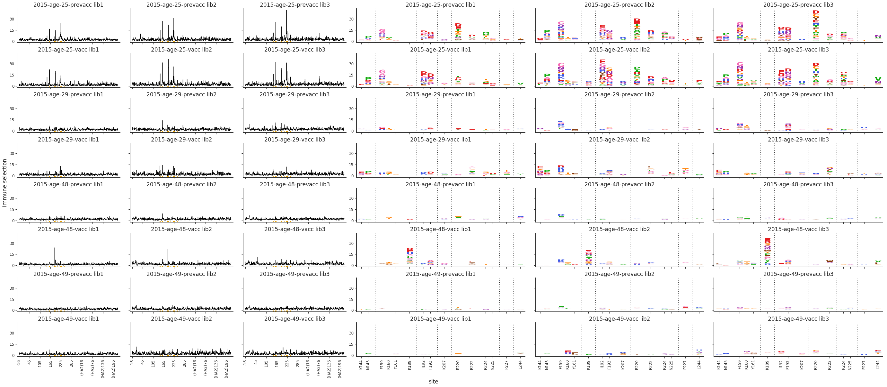


    
    
    ************************************************************************
    Serum group VIDD_sera, saving to results/avgdiffsel/VIDD_sera_avg.pdf
    


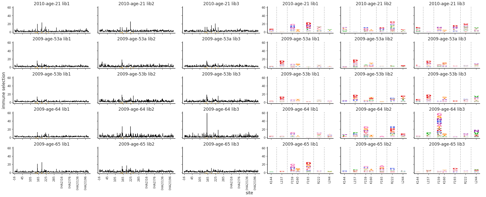


    
    
    ************************************************************************
    Serum group antibody, saving to results/avgdiffsel/antibody_avg.pdf
    


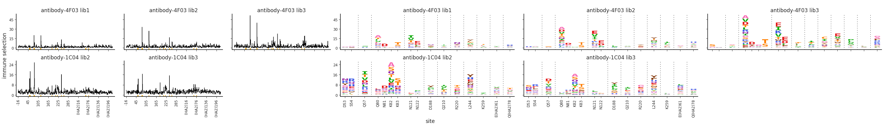


    
    
    ************************************************************************
    Serum group ferret, saving to results/avgdiffsel/ferret_avg.pdf
    


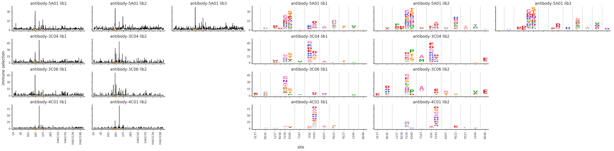


    
    
    ************************************************************************
    Serum group serum_mAb_spike, saving to results/avgdiffsel/serum_mAb_spike_avg.pdf
    


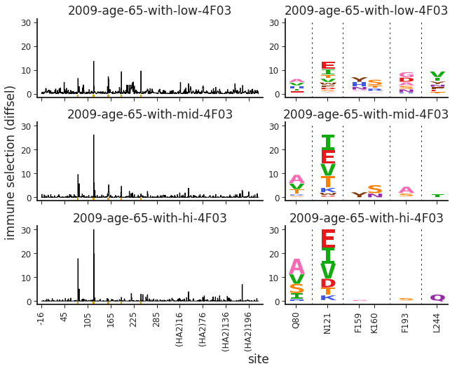


#### Compact plots showing each replicate
The above plots show the average of the retained replicates.
It can also be helpful to look at each replicate that went into the average separately.

The next cell makes compact plots for each replicate separately:


```python
for serum_group, df in avg_sel_df.groupby('serum_group'):

    plotfile = os.path.join(config[f"avg{seltype}dir"],
                            f"{serum_group}_reps.pdf")
    print(f"\n\n{'*' * 72}\nSerum group {serum_group}, saving to {plotfile}\n")

    fig, axes = dmslogo.facet_plot(
            data=df.query('library not in @avg_types'),
            x_col='isite',
            show_col='zoom_site',
            gridrow_col='serum_name_formatted',
            gridcol_col='library',
            share_xlabel=True,
            share_ylabel=True,
            wspace=0.6,
            draw_line_kwargs=dict(
                    height_col=site_metric[seltype],
                    xtick_col='site',
                    ylabel=f"immune selection ({seltype})",
                    ),
            draw_logo_kwargs=dict(
                    letter_col='mutation',
                    letter_height_col=f"mut{seltype}",
                    xtick_col='site_label',
                    xlabel='site',
                    ylabel=f"immune selection ({seltype})",
                    clip_negative_heights=True,
                    ),
            )
    display(fig)
    fig.savefig(plotfile)
    plt.close(fig)
```

    
    
    ************************************************************************
    Serum group Hensley_sera, saving to results/avgdiffsel/Hensley_sera_reps.pdf
    


    
    
    ************************************************************************
    Serum group VIDD_sera, saving to results/avgdiffsel/VIDD_sera_reps.pdf
    


    
    
    ************************************************************************
    Serum group antibody, saving to results/avgdiffsel/antibody_reps.pdf
    


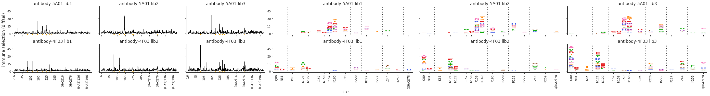


    
    
    ************************************************************************
    Serum group ferret, saving to results/avgdiffsel/ferret_reps.pdf
    


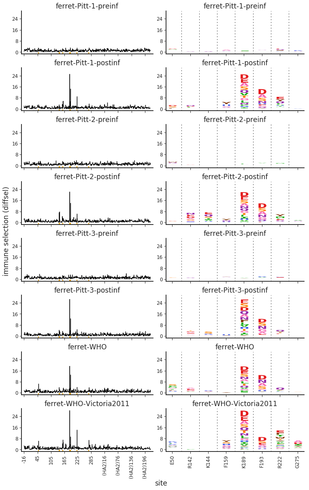


    
    
    ************************************************************************
    Serum group serum_mAb_spike, saving to results/avgdiffsel/serum_mAb_spike_reps.pdf
    


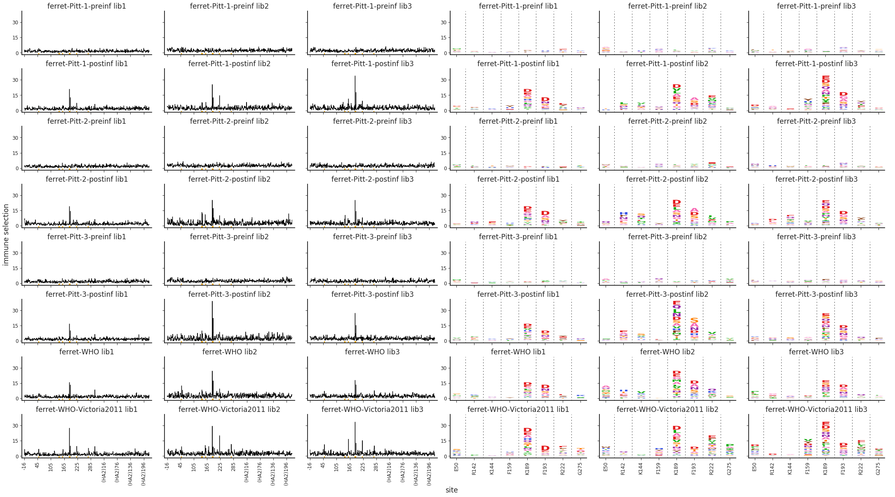


#### Whole-gene logo plots of replicate-average selection
Finally, we make whole-gene logo plots for each serum that shows the replicate-average selection for **all** sites.
We make these whole-gene plots using [dms2_logoplot](https://jbloomlab.github.io/dms_tools2/dms2_logoplot.html).
They are too large to be useful to show visually in this notebook, but the cell below gives the name of the PDF holding each logo plot so you can examine them individually if you'd like.


```python
outdir = config[f"avg{seltype}dir"]  # save plots here

for tup in (avg_selections
            .query('library == @avg_type')
            .itertuples(index=False)
            ):
    name = getattr(tup, "serum_name_formatted")
    plotfile = os.path.join(outdir, f"{name}_{seltype}.pdf")
    datafile = getattr(tup, f"mut{seltype}_file")
    cmds = ['dms2_logoplot',
            '--outdir', outdir,
            f"--{seltype}", datafile,
            '--name', name,
            '--nperline', '71',
            '--overlay1', datafile, 'wildtype', 'wildtype',
            '--underlay', 'yes', 
            '--restrictdiffsel', 'positive',
            '--use_existing', config['use_existing'],
            ]
    print(f"Plotting {name} to {plotfile}")
    subprocess.check_output(cmds)
    assert os.path.isfile(plotfile)
```

    Plotting antibody-5A01 to results/avgdiffsel/antibody-5A01_diffsel.pdf
    Plotting antibody-4F03 to results/avgdiffsel/antibody-4F03_diffsel.pdf
    Plotting ferret-Pitt-1-preinf to results/avgdiffsel/ferret-Pitt-1-preinf_diffsel.pdf
    Plotting ferret-Pitt-1-postinf to results/avgdiffsel/ferret-Pitt-1-postinf_diffsel.pdf
    Plotting ferret-Pitt-2-preinf to results/avgdiffsel/ferret-Pitt-2-preinf_diffsel.pdf
    Plotting ferret-Pitt-2-postinf to results/avgdiffsel/ferret-Pitt-2-postinf_diffsel.pdf
    Plotting ferret-Pitt-3-preinf to results/avgdiffsel/ferret-Pitt-3-preinf_diffsel.pdf
    Plotting ferret-Pitt-3-postinf to results/avgdiffsel/ferret-Pitt-3-postinf_diffsel.pdf
    Plotting ferret-WHO to results/avgdiffsel/ferret-WHO_diffsel.pdf
    Plotting ferret-WHO-Victoria2011 to results/avgdiffsel/ferret-WHO-Victoria2011_diffsel.pdf
    Plotting 2010-age-21 to results/avgdiffsel/2010-age-21_diffsel.pdf
    Plotting 2009-age-53a to results/avgdiffsel/2009-age-53a_diffsel.pdf
    Plotting 2009-age-53b to results/avgdiffsel/2009-age-53b_diffsel.pdf
    Plotting 2009-age-64 to results/avgdiffsel/2009-age-64_diffsel.pdf
    Plotting 2009-age-65 to results/avgdiffsel/2009-age-65_diffsel.pdf
    Plotting 2015-age-25-prevacc to results/avgdiffsel/2015-age-25-prevacc_diffsel.pdf
    Plotting 2015-age-25-vacc to results/avgdiffsel/2015-age-25-vacc_diffsel.pdf
    Plotting 2015-age-29-prevacc to results/avgdiffsel/2015-age-29-prevacc_diffsel.pdf
    Plotting 2015-age-29-vacc to results/avgdiffsel/2015-age-29-vacc_diffsel.pdf
    Plotting 2015-age-48-prevacc to results/avgdiffsel/2015-age-48-prevacc_diffsel.pdf
    Plotting 2015-age-48-vacc to results/avgdiffsel/2015-age-48-vacc_diffsel.pdf
    Plotting 2015-age-49-prevacc to results/avgdiffsel/2015-age-49-prevacc_diffsel.pdf
    Plotting 2015-age-49-vacc to results/avgdiffsel/2015-age-49-vacc_diffsel.pdf
    Plotting 2009-age-65-with-low-4F03 to results/avgdiffsel/2009-age-65-with-low-4F03_diffsel.pdf
    Plotting 2009-age-65-with-mid-4F03 to results/avgdiffsel/2009-age-65-with-mid-4F03_diffsel.pdf
    Plotting 2009-age-65-with-hi-4F03 to results/avgdiffsel/2009-age-65-with-hi-4F03_diffsel.pdf


# Plot figures for paper

In the following section, we will generate the plots and figures that will go into the paper.

First, we will plot the profiles for the serum with monoclonal Ab spike-in as well as the profiles for the individual serum and mAb. Significant sites of escape for the mAb will be in one color, and sites for the serum will be in another color.


```python
spike_samples = ['antibody-4F03', '2009-age-65']
spike_sample_isites = {}

for s in spike_samples:
    l = list((sigsites_df.query('serum_name_formatted == @s')
              [['serum_name_formatted', 'isite', 'site']]
              .drop_duplicates()
              .sort_values('isite'))['isite'])
    spike_sample_isites[s] = l
```


```python
spike_zoom_sites = [x for v in spike_sample_isites.values() 
                    for x in v]
```


```python
avg_sel_df = pd.concat(
        [df.assign(spike_zoom_site=lambda x: x['isite'].isin(
                            spike_zoom_sites))
         for serum_group, df in avg_sel_df.groupby('serum_group')],
        ignore_index=True
        )
```


```python
avg_sel_df['color'] = (avg_sel_df['isite']
                       .apply(lambda x: PALETTE[2] 
                              if x in spike_sample_isites['antibody-4F03'] 
                              else (PALETTE[1] if x in spike_sample_isites['2009-age-65'] 
                                    else 'gray')))
```


```python
spike_ids = {'antibody-4F03': 'mAb', 
             '2009-age-65': 'serum', 
             '2009-age-65-with-low-4F03': 'serum with low mAb', 
             '2009-age-65-with-mid-4F03': 'serum with intermediate mAb', 
             '2009-age-65-with-hi-4F03': 'serum with high mAb'}

avg_sel_df['spike_id'] = (avg_sel_df['serum_name_formatted']
                            .apply(lambda x: spike_ids[x] 
                                   if x in spike_ids.keys() 
                                   else 'none'))

avg_sel_df['spike_group'] = (avg_sel_df['serum_name_formatted']
                                .apply(lambda x: 'spike_group' 
                                   if x in spike_ids.keys() 
                                   else 'not spike_group'))
```


```python
plotfile = os.path.join(config[f"avg{seltype}dir"], "spikein_avg.pdf")

fig, axes = dmslogo.facet_plot(
        data=avg_sel_df.query('spike_group == "spike_group" and library == @avg_type'), 
        x_col='isite', 
        show_col='spike_zoom_site', 
        gridrow_col='spike_id', 
        share_xlabel=True, 
        share_ylabel=True, 
        wspace=0.6,  
        draw_line_kwargs=dict(
                height_col=site_metric[seltype], 
                xtick_col='site', 
                ylabel=f"immune selection ({seltype})",
                ), 
        draw_logo_kwargs=dict(
                letter_col='mutation', 
                letter_height_col=f"mut{seltype}", 
                color_col = 'color',
                xtick_col='site_label', 
                xlabel='site', 
                ylabel=f"immune selection ({seltype})", 
                clip_negative_heights=True,
                ),
        )

display(fig)
fig.savefig(plotfile)
plt.close(fig)
```


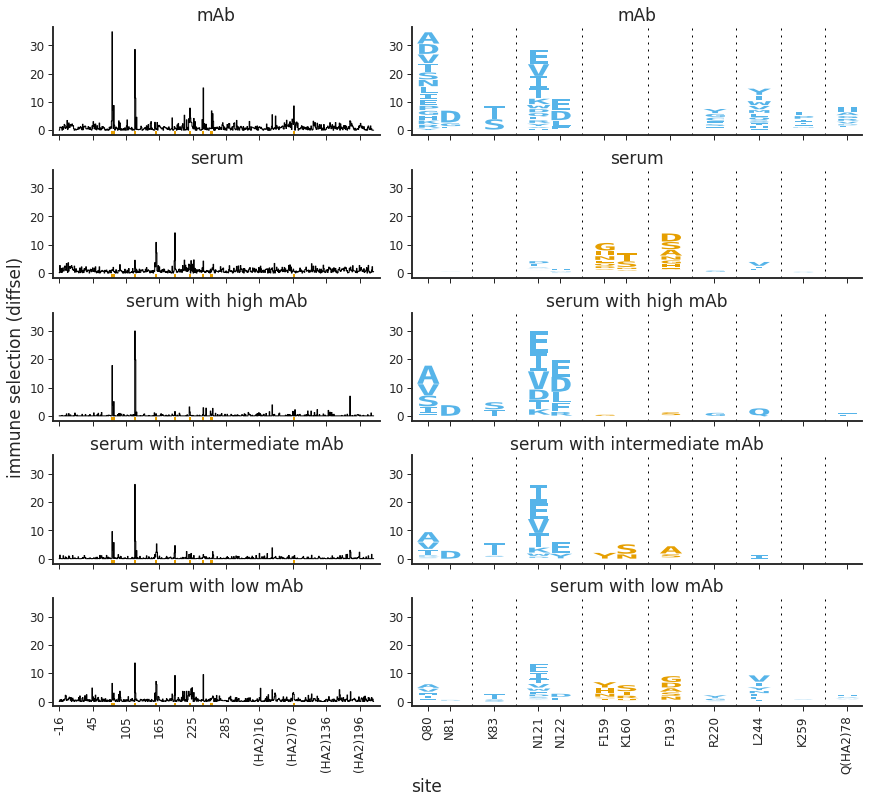


```python

```
