<h1>Table of Contents<span class="tocSkip"></span></h1>
<div class="toc"><ul class="toc-item"><li><span><a href="#Analysis-of-serum-mutational-antigenic-profiling" data-toc-modified-id="Analysis-of-serum-mutational-antigenic-profiling-1">Analysis of serum mutational antigenic profiling</a></span><ul class="toc-item"><li><span><a href="#Configure-analysis" data-toc-modified-id="Configure-analysis-1.1">Configure analysis</a></span><ul class="toc-item"><li><span><a href="#Import-Python-modules-/-packages" data-toc-modified-id="Import-Python-modules-/-packages-1.1.1">Import Python modules / packages</a></span></li><li><span><a href="#Get-config-variables" data-toc-modified-id="Get-config-variables-1.1.2">Get config variables</a></span></li><li><span><a href="#Get-sera-information" data-toc-modified-id="Get-sera-information-1.1.3">Get sera information</a></span></li><li><span><a href="#Get-list-of-samples" data-toc-modified-id="Get-list-of-samples-1.1.4">Get list of samples</a></span></li><li><span><a href="#Download-deep-sequencing-data-if-needed" data-toc-modified-id="Download-deep-sequencing-data-if-needed-1.1.5">Download deep sequencing data if needed</a></span></li></ul></li><li><span><a href="#Align-sequencing-and-count-mutations" data-toc-modified-id="Align-sequencing-and-count-mutations-1.2">Align sequencing and count mutations</a></span><ul class="toc-item"><li><span><a href="#Run-dms2_batch_bcsubamp" data-toc-modified-id="Run-dms2_batch_bcsubamp-1.2.1">Run <code>dms2_batch_bcsubamp</code></a></span></li><li><span><a href="#Plot-sequencing-and-mutation-counts-summaries" data-toc-modified-id="Plot-sequencing-and-mutation-counts-summaries-1.2.2">Plot sequencing and mutation counts summaries</a></span><ul class="toc-item"><li><span><a href="#Reads-and-barcodes-per-sample" data-toc-modified-id="Reads-and-barcodes-per-sample-1.2.2.1">Reads and barcodes per sample</a></span></li><li><span><a href="#Coverage-across-gene" data-toc-modified-id="Coverage-across-gene-1.2.2.2">Coverage across gene</a></span></li><li><span><a href="#Mutation-frequencies" data-toc-modified-id="Mutation-frequencies-1.2.2.3">Mutation frequencies</a></span></li><li><span><a href="#Check-for-oxidative-damage" data-toc-modified-id="Check-for-oxidative-damage-1.2.2.4">Check for oxidative damage</a></span></li></ul></li><li><span><a href="#Renumber-to-standard-HA-numbering" data-toc-modified-id="Renumber-to-standard-HA-numbering-1.2.3">Renumber to standard HA numbering</a></span></li></ul></li><li><span><a href="#Compute-immune-selection-on-mutations" data-toc-modified-id="Compute-immune-selection-on-mutations-1.3">Compute immune selection on mutations</a></span><ul class="toc-item"><li><span><a href="#Samples-to-compare-for-each-selection" data-toc-modified-id="Samples-to-compare-for-each-selection-1.3.1">Samples to compare for each selection</a></span></li><li><span><a href="#Compute-immune-selection" data-toc-modified-id="Compute-immune-selection-1.3.2">Compute immune selection</a></span></li><li><span><a href="#Get-all-selection-information-in-one-data-frame" data-toc-modified-id="Get-all-selection-information-in-one-data-frame-1.3.3">Get all selection information in one data frame</a></span></li></ul></li><li><span><a href="#Analyze-and-plot-immune-selection" data-toc-modified-id="Analyze-and-plot-immune-selection-1.4">Analyze and plot immune selection</a></span><ul class="toc-item"><li><span><a href="#Choose-sample-to-retain-for-each-serum" data-toc-modified-id="Choose-sample-to-retain-for-each-serum-1.4.1">Choose sample to retain for each serum</a></span><ul class="toc-item"><li><span><a href="#Plot-site-level-selection-for-all-samples" data-toc-modified-id="Plot-site-level-selection-for-all-samples-1.4.1.1">Plot site-level selection for all samples</a></span></li><li><span><a href="#Choose-samples-to-retain-based-on-infectivity-remaining" data-toc-modified-id="Choose-samples-to-retain-based-on-infectivity-remaining-1.4.1.2">Choose samples to retain based on infectivity remaining</a></span></li><li><span><a href="#Listing-of-retained-samples" data-toc-modified-id="Listing-of-retained-samples-1.4.1.3">Listing of retained samples</a></span></li></ul></li><li><span><a href="#Compute-serum-average-from-retained-samples" data-toc-modified-id="Compute-serum-average-from-retained-samples-1.4.2">Compute serum average from retained samples</a></span></li><li><span><a href="#Identify-sites-of-&quot;significant&quot;-selection" data-toc-modified-id="Identify-sites-of-&quot;significant&quot;-selection-1.4.3">Identify sites of "significant" selection</a></span><ul class="toc-item"><li><span><a href="#Cutoff-for-significance" data-toc-modified-id="Cutoff-for-significance-1.4.3.1">Cutoff for significance</a></span></li><li><span><a href="#Identify-significant-sites" data-toc-modified-id="Identify-significant-sites-1.4.3.2">Identify significant sites</a></span></li><li><span><a href="#List-significant-sites-for-each-serum" data-toc-modified-id="List-significant-sites-for-each-serum-1.4.3.3">List significant sites for each serum</a></span></li><li><span><a href="#Get-significant-sites-for-each-serum-group" data-toc-modified-id="Get-significant-sites-for-each-serum-group-1.4.3.4">Get significant sites for each serum group</a></span></li></ul></li><li><span><a href="#Line-and-logo-plots-of-average-for-each-serum" data-toc-modified-id="Line-and-logo-plots-of-average-for-each-serum-1.4.4">Line and logo plots of average for each serum</a></span><ul class="toc-item"><li><span><a href="#Choose-sites-to-zoom-in-on" data-toc-modified-id="Choose-sites-to-zoom-in-on-1.4.4.1">Choose sites to zoom-in on</a></span></li><li><span><a href="#Write-tidy-data-frame-with-selection-data" data-toc-modified-id="Write-tidy-data-frame-with-selection-data-1.4.4.2">Write tidy data frame with selection data</a></span></li><li><span><a href="#Compact-&quot;zoom&quot;-plots" data-toc-modified-id="Compact-&quot;zoom&quot;-plots-1.4.4.3">Compact "zoom" plots</a></span></li><li><span><a href="#Whole-gene-logo-plots" data-toc-modified-id="Whole-gene-logo-plots-1.4.4.4">Whole-gene logo plots</a></span></li></ul></li><li><span><a href="#Plots-of-each-replicate-in-averages" data-toc-modified-id="Plots-of-each-replicate-in-averages-1.4.5">Plots of each replicate in averages</a></span><ul class="toc-item"><li><span><a href="#Zoom-plots-showing-each-replicate" data-toc-modified-id="Zoom-plots-showing-each-replicate-1.4.5.1">Zoom plots showing each replicate</a></span></li><li><span><a href="#Plot-replicate-replicate-correlations" data-toc-modified-id="Plot-replicate-replicate-correlations-1.4.5.2">Plot replicate-replicate correlations</a></span></li></ul></li></ul></li><li><span><a href="#Customized-figures-for-paper" data-toc-modified-id="Customized-figures-for-paper-1.5">Customized figures for paper</a></span><ul class="toc-item"><li><span><a href="#Logo-and-line-plot-figures" data-toc-modified-id="Logo-and-line-plot-figures-1.5.1">Logo and line plot figures</a></span></li><li><span><a href="#Replicate-to-replicate-correlations" data-toc-modified-id="Replicate-to-replicate-correlations-1.5.2">Replicate-to-replicate correlations</a></span></li><li><span><a href="#Percent-infectivity-for-each-replicate" data-toc-modified-id="Percent-infectivity-for-each-replicate-1.5.3">Percent infectivity for each replicate</a></span></li></ul></li></ul></li></ul></div>

# Analysis of serum mutational antigenic profiling
This Python Jupyter notebook analyzes mutational antigenic profiling of serum against virus carrying the A/Perth/2009 (H3N2) HA.

## Configure analysis
We first configure the analysis by importing packages and getting information on the samples that we will analyze.

### Import Python modules / packages
Import modules / packages.
In particular, we use:

 - [plotnine](https://plotnine.readthedocs.io) for ggplot2-like plotting syntax
 - [dmslogo](https://jbloomlab.github.io/dmslogo/) to draw sequence logo plots
 - [dms_tools2](https://jbloomlab.github.io/dms_tools2/) for much of the analysis


```python
import os
import math
import collections
import itertools
import warnings
import subprocess

import yaml
import pandas as pd

from IPython.display import display, HTML

import matplotlib.pyplot as plt

from plotnine import *

import dms_tools2
from dms_tools2.ipython_utils import showPDF
from dms_tools2.plot import COLOR_BLIND_PALETTE_GRAY as PALETTE

import dmslogo
```

Turn on interactive matplotlib plotting:


```python
plt.ion()  # turn on interactive plotting
```

Print versions of Bloom lab software:


```python
print(f"Using dms_tools2 version {dms_tools2.__version__}")
print(f"Using dmslogo version {dmslogo.__version__}")
```

    Using dms_tools2 version 2.4.12
    Using dmslogo version 0.2.3


Set data frame display options:


```python
pd.set_option('display.max_colwidth', 200)
```

Ignore warnings that can clutter notebook:


```python
warnings.simplefilter('ignore')
```

### Get config variables
Read the variables from the config file.
These variables specify input / output paths and key parameters for analysis:


```python
configfile = 'config.yaml'

with open(configfile) as f:
    config = yaml.safe_load(f)

print(f"Read the following configuration from {configfile}:")
display(HTML(pd.Series(config)
             .to_frame('value')
             .to_html()
             ))
```

    Read the following configuration from config.yaml:


<table border="1" class="dataframe">
  <thead>
    <tr style="text-align: right;">
      <th></th>
      <th>value</th>
    </tr>
  </thead>
  <tbody>
    <tr>
      <th>serum_info</th>
      <td>data/serum_info.yaml</td>
    </tr>
    <tr>
      <th>sample_list</th>
      <td>data/sample_list.csv</td>
    </tr>
    <tr>
      <th>refseq</th>
      <td>data/Perth09_HA_reference.fa</td>
    </tr>
    <tr>
      <th>renumbering_scheme</th>
      <td>data/H3renumbering_scheme.csv</td>
    </tr>
    <tr>
      <th>seq_data_source</th>
      <td>SRA_accession</td>
    </tr>
    <tr>
      <th>fastq_dir</th>
      <td>results/FASTQ_files</td>
    </tr>
    <tr>
      <th>fastq_dump</th>
      <td>fastq-dump</td>
    </tr>
    <tr>
      <th>ascp</th>
      <td>/app/aspera-connect/3.7.5/bin/ascp</td>
    </tr>
    <tr>
      <th>asperakey</th>
      <td>/app/aspera-connect/3.7.5/etc/asperaweb_id_dsa.openssh</td>
    </tr>
    <tr>
      <th>alignspecs</th>
      <td>1,285,38,40 286,567,33,34 568,852,34,30 853,1137,34,31 1138,1422,36,29 1423,1701,39,44</td>
    </tr>
    <tr>
      <th>R1trim</th>
      <td>200</td>
    </tr>
    <tr>
      <th>R2trim</th>
      <td>165</td>
    </tr>
    <tr>
      <th>ncpus</th>
      <td>16</td>
    </tr>
    <tr>
      <th>use_existing</th>
      <td>yes</td>
    </tr>
    <tr>
      <th>avg_type</th>
      <td>median</td>
    </tr>
    <tr>
      <th>neut_config</th>
      <td>data/neut_assays/neut_config.yaml</td>
    </tr>
    <tr>
      <th>figure_config</th>
      <td>data/figure_config.yaml</td>
    </tr>
    <tr>
      <th>map_on_struct_template</th>
      <td>map_on_struct_template.ipynb</td>
    </tr>
    <tr>
      <th>pdb_id</th>
      <td>4o5n</td>
    </tr>
    <tr>
      <th>site_to_pdb</th>
      <td>data/H3_site_to_PDB_4o5n.csv</td>
    </tr>
    <tr>
      <th>countsdir</th>
      <td>results/codoncounts</td>
    </tr>
    <tr>
      <th>renumbcountsdir</th>
      <td>results/renumbered_codoncounts</td>
    </tr>
    <tr>
      <th>diffseldir</th>
      <td>results/diffsel</td>
    </tr>
    <tr>
      <th>avgdiffseldir</th>
      <td>results/avgdiffsel</td>
    </tr>
    <tr>
      <th>avgdiffsel_sigsites_dir</th>
      <td>results/avgdiffsel/sigsites</td>
    </tr>
    <tr>
      <th>avgdiffsel_zoom_dir</th>
      <td>results/avgdiffsel/zoomed_plots</td>
    </tr>
    <tr>
      <th>avgdiffsel_reps_dir</th>
      <td>results/avgdiffsel/replicates</td>
    </tr>
    <tr>
      <th>avgdiffsel_full_dir</th>
      <td>results/avgdiffsel/full_logo_plots</td>
    </tr>
    <tr>
      <th>neutresultsdir</th>
      <td>results/neutralization_assays</td>
    </tr>
    <tr>
      <th>structsdir</th>
      <td>results/structs</td>
    </tr>
    <tr>
      <th>figsdir</th>
      <td>results/figures</td>
    </tr>
    <tr>
      <th>finalfigsdir</th>
      <td>results/figures/final</td>
    </tr>
    <tr>
      <th>notebookdir</th>
      <td>results/notebooks</td>
    </tr>
  </tbody>
</table>


### Get sera information
Read information on the sera that are being mapped.

For each serum sample below, we get:
  - *serum*: the abbreviation used for that serum in the experiments
  - *serum_description*: description of the serum
  - *serum_group*: group to which the serum belongs
  - *serum_name*: a short informative name
  - *serum_species*: species from which the serum is derived
  - *serum_vaccination*: any relevant information on vaccination status (some serum are paired pre- and post-vaccination)


```python
with open(config['serum_info']) as f:
    sera = (pd.DataFrame(yaml.safe_load(f))
            .transpose()
            .add_prefix('serum_')
            .rename_axis('serum')
            .reset_index()
            )

assert len(sera) == len(sera['serum'].unique()), 'sera not unique'

print(f"Read the following sera information from {config['serum_info']}:")
display(HTML(sera.to_html(index=False)))
```

    Read the following sera information from data/serum_info.yaml:


<table border="1" class="dataframe">
  <thead>
    <tr style="text-align: right;">
      <th>serum</th>
      <th>serum_description</th>
      <th>serum_group</th>
      <th>serum_name</th>
      <th>serum_species</th>
      <th>serum_vaccination</th>
    </tr>
  </thead>
  <tbody>
    <tr>
      <td>mock</td>
      <td>no-serum control</td>
      <td>mock</td>
      <td>no-serum</td>
      <td>NaN</td>
      <td>NaN</td>
    </tr>
    <tr>
      <td>plasmid</td>
      <td>plasmid used as control to estimate sequencing error rate</td>
      <td>plasmid</td>
      <td>plasmid</td>
      <td>NaN</td>
      <td>NaN</td>
    </tr>
    <tr>
      <td>5A01</td>
      <td>site B-targeting monoclonal antibody 5A01 from Seth Zost and Scott Hensley</td>
      <td>antibody_region_B</td>
      <td>antibody-5A01</td>
      <td>NaN</td>
      <td>NaN</td>
    </tr>
    <tr>
      <td>3C04</td>
      <td>site B-targeting monoclonal antibody 3C04 from Seth Zost and Scott Hensley</td>
      <td>antibody_region_B</td>
      <td>antibody-3C04</td>
      <td>NaN</td>
      <td>NaN</td>
    </tr>
    <tr>
      <td>3C06</td>
      <td>site B-targeting monoclonal antibody 3C06 from Seth Zost and Scott Hensley</td>
      <td>antibody_region_B</td>
      <td>antibody-3C06</td>
      <td>NaN</td>
      <td>NaN</td>
    </tr>
    <tr>
      <td>4C01</td>
      <td>site B-targeting monoclonal antibody 4C01 from Seth Zost and Scott Hensley</td>
      <td>antibody_region_B</td>
      <td>antibody-4C01</td>
      <td>NaN</td>
      <td>NaN</td>
    </tr>
    <tr>
      <td>4F03</td>
      <td>lower head-targeting monoclonal antibody 4F03 from Seth Zost and Scott Hensley</td>
      <td>antibody_lower_head</td>
      <td>antibody-4F03</td>
      <td>NaN</td>
      <td>NaN</td>
    </tr>
    <tr>
      <td>1C04</td>
      <td>lower head-targeting monoclonal antibody 1C04 from Seth Zost and Scott Hensley</td>
      <td>antibody_lower_head</td>
      <td>antibody-1C04</td>
      <td>NaN</td>
      <td>NaN</td>
    </tr>
    <tr>
      <td>f9267neg</td>
      <td>Lakdawala lab ferret, before infection</td>
      <td>ferret</td>
      <td>Pitt-1-preinf</td>
      <td>ferret</td>
      <td>pre</td>
    </tr>
    <tr>
      <td>f9267d23</td>
      <td>Lakdawala lab ferret, 23 days after infection by Perth/2009 with our HA</td>
      <td>ferret</td>
      <td>Pitt-1-postinf</td>
      <td>ferret</td>
      <td>post</td>
    </tr>
    <tr>
      <td>f9435neg</td>
      <td>Lakdawala lab ferret, before infection</td>
      <td>ferret</td>
      <td>Pitt-2-preinf</td>
      <td>ferret</td>
      <td>pre</td>
    </tr>
    <tr>
      <td>f9435d23</td>
      <td>Lakdawala lab ferret, 23 days after infection by Perth/2009 with our HA</td>
      <td>ferret</td>
      <td>Pitt-2-postinf</td>
      <td>ferret</td>
      <td>post</td>
    </tr>
    <tr>
      <td>f9437neg</td>
      <td>Lakdawala lab ferret, before infection</td>
      <td>ferret</td>
      <td>Pitt-3-preinf</td>
      <td>ferret</td>
      <td>pre</td>
    </tr>
    <tr>
      <td>f9437d23</td>
      <td>Lakdawala lab ferret, 23 days after infection by Perth/2009 with our HA</td>
      <td>ferret</td>
      <td>Pitt-3-postinf</td>
      <td>ferret</td>
      <td>post</td>
    </tr>
    <tr>
      <td>WHOCCPerth</td>
      <td>ferret infected by Melbourne WHO CC with their Perth/2009 strain</td>
      <td>ferret</td>
      <td>WHO</td>
      <td>ferret</td>
      <td>post</td>
    </tr>
    <tr>
      <td>WHOCCVic</td>
      <td>ferret infected by Melbourne WHO CC with their Victoria/2011 strain</td>
      <td>ferret</td>
      <td>WHO-Victoria2011</td>
      <td>ferret</td>
      <td>post</td>
    </tr>
    <tr>
      <td>VIDD1</td>
      <td>collected at Hutch in 2/2010 from person born in 1989</td>
      <td>VIDD_sera</td>
      <td>2010-age-21</td>
      <td>human</td>
      <td>NaN</td>
    </tr>
    <tr>
      <td>VIDD2</td>
      <td>collected at Hutch in 1/2009 from person born in 1956</td>
      <td>VIDD_sera</td>
      <td>2009-age-53</td>
      <td>human</td>
      <td>NaN</td>
    </tr>
    <tr>
      <td>VIDD3</td>
      <td>second sample collected at Hutch in 3/2009 from person born in 1956</td>
      <td>VIDD_sera</td>
      <td>2009-age-53-plus-2-months</td>
      <td>human</td>
      <td>NaN</td>
    </tr>
    <tr>
      <td>VIDD4</td>
      <td>collected at Hutch in 11/2008 from person born in 1945</td>
      <td>VIDD_sera</td>
      <td>2009-age-64</td>
      <td>human</td>
      <td>NaN</td>
    </tr>
    <tr>
      <td>VIDD5</td>
      <td>collected at Hutch in 6/2009 from person born in 1944</td>
      <td>VIDD_sera</td>
      <td>2009-age-65</td>
      <td>human</td>
      <td>NaN</td>
    </tr>
    <tr>
      <td>557v1</td>
      <td>collected before 2015/2016 vaccine from person born in 1990</td>
      <td>Hensley_sera</td>
      <td>2015-age-25-prevacc</td>
      <td>human</td>
      <td>pre</td>
    </tr>
    <tr>
      <td>557v2</td>
      <td>collected after 2015/2016 vaccine from person born in 1990</td>
      <td>Hensley_sera</td>
      <td>2015-age-25-vacc</td>
      <td>human</td>
      <td>post</td>
    </tr>
    <tr>
      <td>574v1</td>
      <td>collected before 2015/2016 vaccine from person born in 1986</td>
      <td>Hensley_sera</td>
      <td>2015-age-29-prevacc</td>
      <td>human</td>
      <td>pre</td>
    </tr>
    <tr>
      <td>574v2</td>
      <td>collected after 2015/2016 vaccine from person born in 1986</td>
      <td>Hensley_sera</td>
      <td>2015-age-29-vacc</td>
      <td>human</td>
      <td>post</td>
    </tr>
    <tr>
      <td>589v1</td>
      <td>collected before 2015/2016 vaccine from person born in 1967</td>
      <td>Hensley_sera</td>
      <td>2015-age-48-prevacc</td>
      <td>human</td>
      <td>pre</td>
    </tr>
    <tr>
      <td>589v2</td>
      <td>collected after 2015/2016 vaccine from person born in 1967</td>
      <td>Hensley_sera</td>
      <td>2015-age-48-vacc</td>
      <td>human</td>
      <td>post</td>
    </tr>
    <tr>
      <td>571v1</td>
      <td>collected before 2015/2016 vaccine from person born in 1966</td>
      <td>Hensley_sera</td>
      <td>2015-age-49-prevacc</td>
      <td>human</td>
      <td>pre</td>
    </tr>
    <tr>
      <td>571v2</td>
      <td>collected after 2015/2016 vaccine from person born in 1966</td>
      <td>Hensley_sera</td>
      <td>2015-age-49-vacc</td>
      <td>human</td>
      <td>post</td>
    </tr>
    <tr>
      <td>VIDD5andlow4F03</td>
      <td>collected at Hutch in 6/2009 from person b1944 with 4F03 at low stringency</td>
      <td>serum_mAb_spike</td>
      <td>2009-age-65-with-low-4F03</td>
      <td>human</td>
      <td>NaN</td>
    </tr>
    <tr>
      <td>VIDD5andmid4F03</td>
      <td>collected at Hutch in 6/2009 from person b1944 with 4F03 at medium stringency</td>
      <td>serum_mAb_spike</td>
      <td>2009-age-65-with-mid-4F03</td>
      <td>human</td>
      <td>NaN</td>
    </tr>
    <tr>
      <td>VIDD5andhi4F03</td>
      <td>collected at Hutch in 6/2009 from person b1944 with 4F03 at high stringency</td>
      <td>serum_mAb_spike</td>
      <td>2009-age-65-with-hi-4F03</td>
      <td>human</td>
      <td>NaN</td>
    </tr>
  </tbody>
</table>


### Get list of samples
Read information about all of the samples that we have deep sequenced.

For each sample, we have information on the serum to which it corresponds, the virus library, the date of sequencing, the serum dilution, the percent infectivity, and (depending on the value of *seq_data_source* in the config file) either the [Sequence Read Archive (SRA)](https://www.ncbi.nlm.nih.gov/sra) accession or the location of the R1 files on the Hutch server:


```python
samples = pd.read_csv(config['sample_list'])

# don't need any R1 column if we are using SRA accession
if config['seq_data_source'] == 'SRA_accession':
    samples = samples.drop(columns='R1', errors='ignore')

assert len(samples) == len(samples['sample'].unique()), 'non-unique samples'

print(f"Read the following samples from {config['sample_list']}:")
display(HTML(samples.to_html(index=False)))
```

    Read the following samples from data/sample_list.csv:


<table border="1" class="dataframe">
  <thead>
    <tr style="text-align: right;">
      <th>sample</th>
      <th>serum</th>
      <th>library</th>
      <th>date</th>
      <th>serum_dilution</th>
      <th>percent_infectivity</th>
      <th>SRA_accession</th>
    </tr>
  </thead>
  <tbody>
    <tr>
      <td>L2-3C06</td>
      <td>3C06</td>
      <td>lib2</td>
      <td>2018-07-20</td>
      <td>0.55</td>
      <td>0.0100</td>
      <td>SRR7974483</td>
    </tr>
    <tr>
      <td>L4-3C06</td>
      <td>3C06</td>
      <td>lib1</td>
      <td>2018-09-12</td>
      <td>0.1</td>
      <td>0.0688</td>
      <td>SRR7974503</td>
    </tr>
    <tr>
      <td>L2-3C04</td>
      <td>3C04</td>
      <td>lib2</td>
      <td>2018-07-20</td>
      <td>0.65</td>
      <td>0.0331</td>
      <td>SRR7974490</td>
    </tr>
    <tr>
      <td>L4-3C04</td>
      <td>3C04</td>
      <td>lib1</td>
      <td>2018-09-12</td>
      <td>0.1</td>
      <td>0.0777</td>
      <td>SRR7974499</td>
    </tr>
    <tr>
      <td>L2-4C01</td>
      <td>4C01</td>
      <td>lib2</td>
      <td>2018-07-20</td>
      <td>0.60</td>
      <td>0.0185</td>
      <td>SRR7974491</td>
    </tr>
    <tr>
      <td>L4-4C01</td>
      <td>4C01</td>
      <td>lib1</td>
      <td>2018-09-12</td>
      <td>0.2</td>
      <td>0.1190</td>
      <td>SRR7974488</td>
    </tr>
    <tr>
      <td>L2-1C04</td>
      <td>1C04</td>
      <td>lib2</td>
      <td>2018-07-20</td>
      <td>16.0</td>
      <td>10.3190</td>
      <td>SRR7974492</td>
    </tr>
    <tr>
      <td>L3-1C04</td>
      <td>1C04</td>
      <td>lib3</td>
      <td>2018-09-12</td>
      <td>18.0</td>
      <td>7.9040</td>
      <td>SRR7974497</td>
    </tr>
    <tr>
      <td>Lib2mock-mAb</td>
      <td>mock</td>
      <td>lib2</td>
      <td>2018-07-20</td>
      <td>NaN</td>
      <td>100.0000</td>
      <td>SRR7974494</td>
    </tr>
    <tr>
      <td>Lib3mock-mAb</td>
      <td>mock</td>
      <td>lib3</td>
      <td>2018-09-12</td>
      <td>NaN</td>
      <td>100.0000</td>
      <td>SRR7974507</td>
    </tr>
    <tr>
      <td>Lib4mock-mAb</td>
      <td>mock</td>
      <td>lib1</td>
      <td>2018-09-12</td>
      <td>NaN</td>
      <td>100.0000</td>
      <td>SRR7974486</td>
    </tr>
    <tr>
      <td>WTplasmid-mAb-A</td>
      <td>plasmid</td>
      <td>lib2</td>
      <td>2018-07-20</td>
      <td>NaN</td>
      <td>NaN</td>
      <td>SRR7974495</td>
    </tr>
    <tr>
      <td>WTplasmid-mAb-B</td>
      <td>plasmid</td>
      <td>lib3</td>
      <td>2018-09-12</td>
      <td>NaN</td>
      <td>NaN</td>
      <td>SRR7974502</td>
    </tr>
    <tr>
      <td>WTplasmid-mAb-C</td>
      <td>plasmid</td>
      <td>lib1</td>
      <td>2018-09-12</td>
      <td>NaN</td>
      <td>NaN</td>
      <td>SRR7974484</td>
    </tr>
    <tr>
      <td>L4-589v1</td>
      <td>589v1</td>
      <td>lib1</td>
      <td>2018-11-14</td>
      <td>0.0185</td>
      <td>13.8200</td>
      <td>SRR8875142</td>
    </tr>
    <tr>
      <td>L4-571v1</td>
      <td>571v1</td>
      <td>lib1</td>
      <td>2018-11-14</td>
      <td>0.0185</td>
      <td>19.6200</td>
      <td>SRR8875143</td>
    </tr>
    <tr>
      <td>L4-571v2</td>
      <td>571v2</td>
      <td>lib1</td>
      <td>2018-11-14</td>
      <td>0.0185</td>
      <td>5.4800</td>
      <td>SRR8875144</td>
    </tr>
    <tr>
      <td>L4-574v1</td>
      <td>574v1</td>
      <td>lib1</td>
      <td>2018-11-14</td>
      <td>0.0185</td>
      <td>9.4800</td>
      <td>SRR8875145</td>
    </tr>
    <tr>
      <td>L4-WHOCCPerth</td>
      <td>WHOCCPerth</td>
      <td>lib1</td>
      <td>2018-11-14</td>
      <td>0.0185</td>
      <td>2.3200</td>
      <td>SRR8875138</td>
    </tr>
    <tr>
      <td>L4-589v2</td>
      <td>589v2</td>
      <td>lib1</td>
      <td>2018-11-14</td>
      <td>0.000875</td>
      <td>4.5800</td>
      <td>SRR8875139</td>
    </tr>
    <tr>
      <td>L4-557v1</td>
      <td>557v1</td>
      <td>lib1</td>
      <td>2018-11-14</td>
      <td>0.0075</td>
      <td>6.9000</td>
      <td>SRR8875140</td>
    </tr>
    <tr>
      <td>L4-f9267neg</td>
      <td>f9267neg</td>
      <td>lib1</td>
      <td>2018-11-14</td>
      <td>0.00075</td>
      <td>100.0000</td>
      <td>SRR8875141</td>
    </tr>
    <tr>
      <td>L4-f9267d23</td>
      <td>f9267d23</td>
      <td>lib1</td>
      <td>2018-11-14</td>
      <td>0.00075</td>
      <td>4.3600</td>
      <td>SRR8875136</td>
    </tr>
    <tr>
      <td>L4-f9435neg</td>
      <td>f9435neg</td>
      <td>lib1</td>
      <td>2018-11-14</td>
      <td>0.001</td>
      <td>100.0000</td>
      <td>SRR8875137</td>
    </tr>
    <tr>
      <td>L4-f9437neg</td>
      <td>f9437neg</td>
      <td>lib1</td>
      <td>2018-11-14</td>
      <td>0.00225</td>
      <td>100.0000</td>
      <td>SRR8875168</td>
    </tr>
    <tr>
      <td>L4-f9437d23</td>
      <td>f9437d23</td>
      <td>lib1</td>
      <td>2018-11-14</td>
      <td>0.00225</td>
      <td>8.7700</td>
      <td>SRR8875169</td>
    </tr>
    <tr>
      <td>Lib4mock-A</td>
      <td>mock</td>
      <td>lib1</td>
      <td>2018-11-14</td>
      <td>NaN</td>
      <td>100.0000</td>
      <td>SRR8875170</td>
    </tr>
    <tr>
      <td>WTplasmid-A</td>
      <td>plasmid</td>
      <td>lib1</td>
      <td>2018-11-14</td>
      <td>NaN</td>
      <td>NaN</td>
      <td>SRR8875171</td>
    </tr>
    <tr>
      <td>L5-f9267neg</td>
      <td>f9267neg</td>
      <td>lib2</td>
      <td>2019-01-16</td>
      <td>0.00075</td>
      <td>100.0000</td>
      <td>SRR8875172</td>
    </tr>
    <tr>
      <td>L5-f9435neg</td>
      <td>f9435neg</td>
      <td>lib2</td>
      <td>2019-01-16</td>
      <td>0.0025</td>
      <td>100.0000</td>
      <td>SRR8875173</td>
    </tr>
    <tr>
      <td>L5-f9437neg</td>
      <td>f9437neg</td>
      <td>lib2</td>
      <td>2019-01-16</td>
      <td>0.00625</td>
      <td>100.0000</td>
      <td>SRR8875174</td>
    </tr>
    <tr>
      <td>L5-VIDD1</td>
      <td>VIDD1</td>
      <td>lib2</td>
      <td>2019-01-16</td>
      <td>0.0045</td>
      <td>5.9500</td>
      <td>SRR8875175</td>
    </tr>
    <tr>
      <td>L5-WHOCCPerth</td>
      <td>WHOCCPerth</td>
      <td>lib2</td>
      <td>2019-01-16</td>
      <td>0.0075</td>
      <td>1.8800</td>
      <td>SRR8875166</td>
    </tr>
    <tr>
      <td>L5-f9267d23</td>
      <td>f9267d23</td>
      <td>lib2</td>
      <td>2019-01-16</td>
      <td>0.000175</td>
      <td>5.3500</td>
      <td>SRR8875167</td>
    </tr>
    <tr>
      <td>L5-WHOCCVic</td>
      <td>WHOCCVic</td>
      <td>lib2</td>
      <td>2019-01-16</td>
      <td>0.0025</td>
      <td>3.9000</td>
      <td>SRR8875191</td>
    </tr>
    <tr>
      <td>L5-VIDD5</td>
      <td>VIDD5</td>
      <td>lib2</td>
      <td>2019-01-16</td>
      <td>0.000875</td>
      <td>5.2400</td>
      <td>SRR8875190</td>
    </tr>
    <tr>
      <td>L5-VIDD4</td>
      <td>VIDD4</td>
      <td>lib2</td>
      <td>2019-01-16</td>
      <td>0.001675</td>
      <td>0.8700</td>
      <td>SRR8875193</td>
    </tr>
    <tr>
      <td>L5-VIDD2</td>
      <td>VIDD2</td>
      <td>lib2</td>
      <td>2019-01-16</td>
      <td>0.00375</td>
      <td>2.0300</td>
      <td>SRR8875192</td>
    </tr>
    <tr>
      <td>L5-VIDD3</td>
      <td>VIDD3</td>
      <td>lib2</td>
      <td>2019-01-16</td>
      <td>0.0045</td>
      <td>1.7300</td>
      <td>SRR8875187</td>
    </tr>
    <tr>
      <td>L5-f9435d23</td>
      <td>f9435d23</td>
      <td>lib2</td>
      <td>2019-01-16</td>
      <td>0.000625</td>
      <td>1.8800</td>
      <td>SRR8875186</td>
    </tr>
    <tr>
      <td>L5-f9437d23</td>
      <td>f9437d23</td>
      <td>lib2</td>
      <td>2019-01-16</td>
      <td>0.001375</td>
      <td>1.7000</td>
      <td>SRR8875189</td>
    </tr>
    <tr>
      <td>Lib5mock-A</td>
      <td>mock</td>
      <td>lib2</td>
      <td>2019-01-16</td>
      <td>NaN</td>
      <td>100.0000</td>
      <td>SRR8875188</td>
    </tr>
    <tr>
      <td>WTplasmid-B</td>
      <td>plasmid</td>
      <td>lib2</td>
      <td>2019-01-16</td>
      <td>NaN</td>
      <td>NaN</td>
      <td>SRR8875195</td>
    </tr>
    <tr>
      <td>L4-f9435d23</td>
      <td>f9435d23</td>
      <td>lib1</td>
      <td>2019-01-16</td>
      <td>0.0025</td>
      <td>3.4500</td>
      <td>SRR8875194</td>
    </tr>
    <tr>
      <td>L4-VIDD4</td>
      <td>VIDD4</td>
      <td>lib1</td>
      <td>2019-01-16</td>
      <td>0.004</td>
      <td>10.7400</td>
      <td>SRR8875112</td>
    </tr>
    <tr>
      <td>L4-VIDD3</td>
      <td>VIDD3</td>
      <td>lib1</td>
      <td>2019-01-16</td>
      <td>0.0075</td>
      <td>5.9800</td>
      <td>SRR8875113</td>
    </tr>
    <tr>
      <td>L4-WHOCCVic</td>
      <td>WHOCCVic</td>
      <td>lib1</td>
      <td>2019-01-16</td>
      <td>0.00625</td>
      <td>1.2600</td>
      <td>SRR8875110</td>
    </tr>
    <tr>
      <td>L4-VIDD1</td>
      <td>VIDD1</td>
      <td>lib1</td>
      <td>2019-01-16</td>
      <td>0.0175</td>
      <td>4.0800</td>
      <td>SRR8875111</td>
    </tr>
    <tr>
      <td>L4-VIDD2</td>
      <td>VIDD2</td>
      <td>lib1</td>
      <td>2019-01-16</td>
      <td>0.00875</td>
      <td>3.7400</td>
      <td>SRR8875108</td>
    </tr>
    <tr>
      <td>Lib4mock-B</td>
      <td>mock</td>
      <td>lib1</td>
      <td>2019-01-16</td>
      <td>NaN</td>
      <td>100.0000</td>
      <td>SRR8875109</td>
    </tr>
    <tr>
      <td>WTplasmid-C</td>
      <td>plasmid</td>
      <td>lib1</td>
      <td>2019-01-16</td>
      <td>NaN</td>
      <td>NaN</td>
      <td>SRR8875106</td>
    </tr>
    <tr>
      <td>L5-589v1</td>
      <td>589v1</td>
      <td>lib2</td>
      <td>2019-03-06</td>
      <td>0.0175</td>
      <td>20.3200</td>
      <td>SRR8875107</td>
    </tr>
    <tr>
      <td>L5-557v2</td>
      <td>557v2</td>
      <td>lib2</td>
      <td>2019-03-06</td>
      <td>0.0005</td>
      <td>0.8100</td>
      <td>SRR8875114</td>
    </tr>
    <tr>
      <td>L5-571v2</td>
      <td>571v2</td>
      <td>lib2</td>
      <td>2019-03-06</td>
      <td>0.01</td>
      <td>1.0900</td>
      <td>SRR8875115</td>
    </tr>
    <tr>
      <td>L5-574v1</td>
      <td>574v1</td>
      <td>lib2</td>
      <td>2019-03-06</td>
      <td>0.0125</td>
      <td>7.5700</td>
      <td>SRR8875119</td>
    </tr>
    <tr>
      <td>L5-574v2</td>
      <td>574v2</td>
      <td>lib2</td>
      <td>2019-03-06</td>
      <td>0.000875</td>
      <td>1.1100</td>
      <td>SRR8875118</td>
    </tr>
    <tr>
      <td>L5-4F03-c1</td>
      <td>4F03</td>
      <td>lib2</td>
      <td>2019-03-06</td>
      <td>0.3</td>
      <td>22.9900</td>
      <td>SRR8875117</td>
    </tr>
    <tr>
      <td>L5-4F03-c3</td>
      <td>4F03</td>
      <td>lib2</td>
      <td>2019-03-06</td>
      <td>1.5</td>
      <td>3.7100</td>
      <td>SRR8875116</td>
    </tr>
    <tr>
      <td>L6-589v2</td>
      <td>589v2</td>
      <td>lib3</td>
      <td>2019-03-06</td>
      <td>0.000375</td>
      <td>4.0600</td>
      <td>SRR8875123</td>
    </tr>
    <tr>
      <td>L6-557v1</td>
      <td>557v1</td>
      <td>lib3</td>
      <td>2019-03-06</td>
      <td>0.005</td>
      <td>1.5700</td>
      <td>SRR8875122</td>
    </tr>
    <tr>
      <td>L6-557v2</td>
      <td>557v2</td>
      <td>lib3</td>
      <td>2019-03-06</td>
      <td>0.0005</td>
      <td>1.6400</td>
      <td>SRR8875121</td>
    </tr>
    <tr>
      <td>L6-VIDD2</td>
      <td>VIDD2</td>
      <td>lib3</td>
      <td>2019-03-06</td>
      <td>0.00375</td>
      <td>6.2200</td>
      <td>SRR8875120</td>
    </tr>
    <tr>
      <td>L6-VIDD3</td>
      <td>VIDD3</td>
      <td>lib3</td>
      <td>2019-03-06</td>
      <td>0.00625</td>
      <td>1.1200</td>
      <td>SRR8875125</td>
    </tr>
    <tr>
      <td>L6-VIDD1</td>
      <td>VIDD1</td>
      <td>lib3</td>
      <td>2019-03-06</td>
      <td>0.0075</td>
      <td>3.6800</td>
      <td>SRR8875124</td>
    </tr>
    <tr>
      <td>L6-f9267d23</td>
      <td>f9267d23</td>
      <td>lib3</td>
      <td>2019-03-06</td>
      <td>0.000375</td>
      <td>1.6900</td>
      <td>SRR8875132</td>
    </tr>
    <tr>
      <td>L6-f9435d23</td>
      <td>f9435d23</td>
      <td>lib3</td>
      <td>2019-03-06</td>
      <td>0.00125</td>
      <td>3.0400</td>
      <td>SRR8875133</td>
    </tr>
    <tr>
      <td>L6-WHOCCPerth</td>
      <td>WHOCCPerth</td>
      <td>lib3</td>
      <td>2019-03-06</td>
      <td>0.0075</td>
      <td>4.1000</td>
      <td>SRR8875134</td>
    </tr>
    <tr>
      <td>L6-WHOCCVic</td>
      <td>WHOCCVic</td>
      <td>lib3</td>
      <td>2019-03-06</td>
      <td>0.0025</td>
      <td>3.6200</td>
      <td>SRR8875135</td>
    </tr>
    <tr>
      <td>Lib5mock-B</td>
      <td>mock</td>
      <td>lib2</td>
      <td>2019-03-06</td>
      <td>NaN</td>
      <td>100.0000</td>
      <td>SRR8875128</td>
    </tr>
    <tr>
      <td>Lib6mock-A</td>
      <td>mock</td>
      <td>lib3</td>
      <td>2019-03-06</td>
      <td>NaN</td>
      <td>100.0000</td>
      <td>SRR8875129</td>
    </tr>
    <tr>
      <td>WTplasmid-D</td>
      <td>plasmid</td>
      <td>lib2</td>
      <td>2019-03-06</td>
      <td>NaN</td>
      <td>NaN</td>
      <td>SRR8875130</td>
    </tr>
    <tr>
      <td>WTplasmid-E</td>
      <td>plasmid</td>
      <td>lib3</td>
      <td>2019-03-06</td>
      <td>NaN</td>
      <td>NaN</td>
      <td>SRR8875131</td>
    </tr>
    <tr>
      <td>L5-589v2</td>
      <td>589v2</td>
      <td>lib2</td>
      <td>2019-03-06</td>
      <td>0.000375</td>
      <td>4.6800</td>
      <td>SRR8875126</td>
    </tr>
    <tr>
      <td>L5-557v1</td>
      <td>557v1</td>
      <td>lib2</td>
      <td>2019-03-06</td>
      <td>0.005</td>
      <td>2.3100</td>
      <td>SRR8875127</td>
    </tr>
    <tr>
      <td>L5-571v1</td>
      <td>571v1</td>
      <td>lib2</td>
      <td>2019-03-06</td>
      <td>0.0185</td>
      <td>11.8600</td>
      <td>SRR8875149</td>
    </tr>
    <tr>
      <td>L5-5A01</td>
      <td>5A01</td>
      <td>lib2</td>
      <td>2019-03-06</td>
      <td>0.025</td>
      <td>1.3600</td>
      <td>SRR8875148</td>
    </tr>
    <tr>
      <td>L5-4F03-c2</td>
      <td>4F03</td>
      <td>lib2</td>
      <td>2019-03-06</td>
      <td>0.7</td>
      <td>4.7100</td>
      <td>SRR8875151</td>
    </tr>
    <tr>
      <td>L5-VIDD5-low4F03</td>
      <td>VIDD5andlow4F03</td>
      <td>lib2</td>
      <td>2019-03-06</td>
      <td>0.000875+0.3</td>
      <td>5.0000</td>
      <td>SRR8875150</td>
    </tr>
    <tr>
      <td>L5-VIDD5-mid4F03</td>
      <td>VIDD5andmid4F03</td>
      <td>lib2</td>
      <td>2019-03-06</td>
      <td>0.000875+0.7</td>
      <td>0.4600</td>
      <td>SRR8875153</td>
    </tr>
    <tr>
      <td>L5-VIDD5-hi4F03</td>
      <td>VIDD5andhi4F03</td>
      <td>lib2</td>
      <td>2019-03-06</td>
      <td>0.000875+1.5</td>
      <td>0.0400</td>
      <td>SRR8875152</td>
    </tr>
    <tr>
      <td>L4-574v2</td>
      <td>574v2</td>
      <td>lib1</td>
      <td>2019-03-06</td>
      <td>0.002</td>
      <td>1.5400</td>
      <td>SRR8875155</td>
    </tr>
    <tr>
      <td>L4-557v2</td>
      <td>557v2</td>
      <td>lib1</td>
      <td>2019-03-06</td>
      <td>0.00125</td>
      <td>1.5300</td>
      <td>SRR8875154</td>
    </tr>
    <tr>
      <td>L4-5A01</td>
      <td>5A01</td>
      <td>lib1</td>
      <td>2019-03-06</td>
      <td>0.07</td>
      <td>4.3200</td>
      <td>SRR8875147</td>
    </tr>
    <tr>
      <td>L4-4F03-c2</td>
      <td>4F03</td>
      <td>lib1</td>
      <td>2019-03-06</td>
      <td>1.0</td>
      <td>3.4700</td>
      <td>SRR8875146</td>
    </tr>
    <tr>
      <td>L4-4F03-c3</td>
      <td>4F03</td>
      <td>lib1</td>
      <td>2019-03-06</td>
      <td>2.0</td>
      <td>0.7800</td>
      <td>SRR8875160</td>
    </tr>
    <tr>
      <td>Lib4mock-C</td>
      <td>mock</td>
      <td>lib1</td>
      <td>2019-03-06</td>
      <td>NaN</td>
      <td>100.0000</td>
      <td>SRR8875161</td>
    </tr>
    <tr>
      <td>WTplasmid-F</td>
      <td>plasmid</td>
      <td>lib1</td>
      <td>2019-03-06</td>
      <td>NaN</td>
      <td>NaN</td>
      <td>SRR8875158</td>
    </tr>
    <tr>
      <td>L6-589v1</td>
      <td>589v1</td>
      <td>lib3</td>
      <td>2019-03-26</td>
      <td>0.0175</td>
      <td>18.4000</td>
      <td>SRR8875159</td>
    </tr>
    <tr>
      <td>L6-571v1</td>
      <td>571v1</td>
      <td>lib3</td>
      <td>2019-03-26</td>
      <td>0.0185</td>
      <td>27.7400</td>
      <td>SRR8875164</td>
    </tr>
    <tr>
      <td>L6-571v2</td>
      <td>571v2</td>
      <td>lib3</td>
      <td>2019-03-26</td>
      <td>0.005</td>
      <td>7.7900</td>
      <td>SRR8875165</td>
    </tr>
    <tr>
      <td>L6-574v1</td>
      <td>574v1</td>
      <td>lib3</td>
      <td>2019-03-26</td>
      <td>0.015</td>
      <td>3.3000</td>
      <td>SRR8875162</td>
    </tr>
    <tr>
      <td>L6-574v2</td>
      <td>574v2</td>
      <td>lib3</td>
      <td>2019-03-26</td>
      <td>0.00075</td>
      <td>1.9200</td>
      <td>SRR8875163</td>
    </tr>
    <tr>
      <td>L6-f9267neg</td>
      <td>f9267neg</td>
      <td>lib3</td>
      <td>2019-03-26</td>
      <td>0.00075</td>
      <td>100.0000</td>
      <td>SRR8875156</td>
    </tr>
    <tr>
      <td>L6-f9435neg</td>
      <td>f9435neg</td>
      <td>lib3</td>
      <td>2019-03-26</td>
      <td>0.0025</td>
      <td>100.0000</td>
      <td>SRR8875157</td>
    </tr>
    <tr>
      <td>L6-f9437neg</td>
      <td>f9437neg</td>
      <td>lib3</td>
      <td>2019-03-26</td>
      <td>0.00625</td>
      <td>100.0000</td>
      <td>SRR8875183</td>
    </tr>
    <tr>
      <td>L6-5A01</td>
      <td>5A01</td>
      <td>lib3</td>
      <td>2019-03-26</td>
      <td>0.025</td>
      <td>1.0200</td>
      <td>SRR8875182</td>
    </tr>
    <tr>
      <td>Lib6mock-B</td>
      <td>mock</td>
      <td>lib3</td>
      <td>2019-03-26</td>
      <td>NaN</td>
      <td>100.0000</td>
      <td>SRR8875181</td>
    </tr>
    <tr>
      <td>L4-4F03-c1</td>
      <td>4F03</td>
      <td>lib1</td>
      <td>2019-03-26</td>
      <td>0.3</td>
      <td>28.2400</td>
      <td>SRR8875180</td>
    </tr>
    <tr>
      <td>L6-VIDD5</td>
      <td>VIDD5</td>
      <td>lib3</td>
      <td>2019-03-26</td>
      <td>0.002</td>
      <td>5.5800</td>
      <td>SRR8875179</td>
    </tr>
    <tr>
      <td>L6-VIDD4</td>
      <td>VIDD4</td>
      <td>lib3</td>
      <td>2019-03-26</td>
      <td>0.00375</td>
      <td>0.2600</td>
      <td>SRR8875178</td>
    </tr>
    <tr>
      <td>L6-f9437d23</td>
      <td>f9437d23</td>
      <td>lib3</td>
      <td>2019-03-26</td>
      <td>0.00175</td>
      <td>5.7800</td>
      <td>SRR8875177</td>
    </tr>
    <tr>
      <td>L6-4F03-c1</td>
      <td>4F03</td>
      <td>lib3</td>
      <td>2019-03-26</td>
      <td>0.3</td>
      <td>23.9100</td>
      <td>SRR8875176</td>
    </tr>
    <tr>
      <td>L6-4F03-c3</td>
      <td>4F03</td>
      <td>lib3</td>
      <td>2019-03-26</td>
      <td>1.4</td>
      <td>0.8400</td>
      <td>SRR8875185</td>
    </tr>
    <tr>
      <td>L4-VIDD5</td>
      <td>VIDD5</td>
      <td>lib1</td>
      <td>2019-03-26</td>
      <td>0.003375</td>
      <td>1.7700</td>
      <td>SRR8875184</td>
    </tr>
    <tr>
      <td>L4-VIDD5-low4F03</td>
      <td>VIDD5andlow4F03</td>
      <td>lib1</td>
      <td>2019-03-26</td>
      <td>0.003375+0.3</td>
      <td>0.0300</td>
      <td>SRR8875196</td>
    </tr>
    <tr>
      <td>L4-VIDD5-mid4F03</td>
      <td>VIDD5andmid4F03</td>
      <td>lib1</td>
      <td>2019-03-26</td>
      <td>0.003375+1</td>
      <td>0.0037</td>
      <td>SRR8875197</td>
    </tr>
    <tr>
      <td>L4-VIDD5-hi4F03</td>
      <td>VIDD5andhi4F03</td>
      <td>lib1</td>
      <td>2019-03-26</td>
      <td>0.003375+2</td>
      <td>0.0016</td>
      <td>SRR8875198</td>
    </tr>
    <tr>
      <td>L6-4F03-c2</td>
      <td>4F03</td>
      <td>lib3</td>
      <td>2019-03-26</td>
      <td>0.75</td>
      <td>7.1600</td>
      <td>SRR8875199</td>
    </tr>
    <tr>
      <td>L6-VIDD5-low4F03</td>
      <td>VIDD5andlow4F03</td>
      <td>lib3</td>
      <td>2019-03-26</td>
      <td>0.002+0.3</td>
      <td>0.2040</td>
      <td>SRR8875200</td>
    </tr>
    <tr>
      <td>L6-VIDD5-mid4F03</td>
      <td>VIDD5andmid4F03</td>
      <td>lib3</td>
      <td>2019-03-26</td>
      <td>0.002+0.75</td>
      <td>0.0077</td>
      <td>SRR8875201</td>
    </tr>
    <tr>
      <td>L6-VIDD5-hi4F03</td>
      <td>VIDD5andhi4F03</td>
      <td>lib3</td>
      <td>2019-03-26</td>
      <td>0.002+1.4</td>
      <td>0.0032</td>
      <td>SRR8875202</td>
    </tr>
    <tr>
      <td>Lib4mock-D</td>
      <td>mock</td>
      <td>lib1</td>
      <td>2019-03-26</td>
      <td>NaN</td>
      <td>100.0000</td>
      <td>SRR8875203</td>
    </tr>
    <tr>
      <td>WTplasmid-G</td>
      <td>plasmid</td>
      <td>lib1</td>
      <td>2019-03-26</td>
      <td>NaN</td>
      <td>NaN</td>
      <td>SRR8875204</td>
    </tr>
    <tr>
      <td>WTplasmid-H</td>
      <td>plasmid</td>
      <td>lib3</td>
      <td>2019-03-26</td>
      <td>NaN</td>
      <td>NaN</td>
      <td>SRR8875205</td>
    </tr>
  </tbody>
</table>


Check that the serum for all samples are in our set of sera:


```python
unknown_sera = set(samples['serum']) - set(sera['serum'])
if unknown_sera:
    raise ValueError(f"samples include unknown sera: {unknown_sera}")
else:
    print('We have information for all sera used for the samples.')
```

    We have information for all sera used for the samples.


### Download deep sequencing data if needed
The config file specifies whether we get the data from existing *R1* files on the Hutch server, or download the data from the [Sequence Read Archive](https://www.ncbi.nlm.nih.gov/sra) (SRA) using [dms_tools2.sra.fastqFromSRA](https://jbloomlab.github.io/dms_tools2/dms_tools2.sra.html):


```python
if config['seq_data_source'] == 'SRA_accession':
    
    # are we using Aspera for rapid downloads?
    if config['ascp'] and config['asperakey']:
        aspera = (config['ascp'], config['asperakey'])
    else:
        aspera = None
        
    # do the downloads
    print(f"Downloading FASTQ files to {config['fastq_dir']} (takes a while)...")
    os.makedirs(config['fastq_dir'], exist_ok=True)
    samples = samples.rename(columns={'sample': 'name',
                                      'SRA_accession': 'run'})
    dms_tools2.sra.fastqFromSRA(
            samples=samples,
            fastq_dump=config['fastq_dump'],
            fastqdir=config['fastq_dir'],
            aspera=aspera,
            ncpus=config['ncpus'],
            )
    samples = samples.rename(columns={'name': 'sample',
                                      'run': 'SRA_accession'})
    print('Completed downloading files.')
        
elif config['seq_data_source'] != 'R1':
    raise ValueError('invalid value of `seq_data_source`')
```

    Downloading FASTQ files to results/FASTQ_files (takes a while)...
    Completed downloading files.


## Align sequencing and count mutations
The samples were sequenced using [barcoded subamplicon sequencing](https://jbloomlab.github.io/dms_tools2/bcsubamp.html) to obtain high accuracy.
So we need to process these data to determine the counts of each codon mutation in each sample.

First, create the directory used for the results of this part of the analysis:


```python
os.makedirs(config['countsdir'], exist_ok=True)

print(f"Results from counting mutations go to {config['countsdir']}")
```

    Results from counting mutations go to results/codoncounts


### Run `dms2_batch_bcsubamp`
We process the sequencing data by using [dms2_batch_bcsubamp](https://jbloomlab.github.io/dms_tools2/dms2_batch_bcsubamp.html#dms2-batch-bcsubamp) to generate "codon counts" files that give the counts of each codon mutation for each sample.

First, write the batch file used as input by this program:


```python
bcsubamp_batchfile = os.path.join(config['countsdir'], 'batch.csv')

(samples
 .rename(columns={'sample': 'name'})
 [['name', 'R1']]
 .to_csv(bcsubamp_batchfile)
 )

print(f"Creating batch file {bcsubamp_batchfile}")
```

    Creating batch file results/codoncounts/batch.csv


Now run the program:


```python
cmds = ['dms2_batch_bcsubamp',
        '--batchfile', bcsubamp_batchfile,
        '--refseq', config['refseq'],
        '--alignspecs'] + config['alignspecs'].split() + [
        '--R1trim', str(config['R1trim']),
        '--R2trim', str(config['R2trim']),
        '--outdir', config['countsdir'],
        '--fastqdir', config['fastq_dir'],
        '--summaryprefix', 'summary',
        '--ncpus', str(config['ncpus']),
        '--use_existing', config['use_existing'],
        ]

print(f"Running dms2_batch_bcsubamp with this command:\n{' '.join(cmds)}")
subprocess.check_output(cmds)
print('Completed running dms2_batch_bcsubamp.')
```

    Running dms2_batch_bcsubamp with this command:
    dms2_batch_bcsubamp --batchfile results/codoncounts/batch.csv --refseq data/Perth09_HA_reference.fa --alignspecs 1,285,38,40 286,567,33,34 568,852,34,30 853,1137,34,31 1138,1422,36,29 1423,1701,39,44 --R1trim 200 --R2trim 165 --outdir results/codoncounts --fastqdir results/FASTQ_files --summaryprefix summary --ncpus 16 --use_existing yes
    Completed running dms2_batch_bcsubamp.


Confirm that all the expected counts files exist:


```python
assert all(os.path.isfile(f) for f in
           config['countsdir'] + '/' + samples['sample'] + '_codoncounts.csv'
           ), 'missing counts files'
```

### Plot sequencing and mutation counts summaries
Running [dms2_batch_bcsubamp](https://jbloomlab.github.io/dms_tools2/dms2_batch_bcsubamp.html#dms2-batch-bcsubamp) created some summary plots.
The prefix on those plots should be as follows:


```python
countsplotprefix = os.path.join(config['countsdir'], 'summary_')
```

#### Reads and barcodes per sample
Total sequencing reads per sample:


```python
showPDF(countsplotprefix + 'readstats.pdf')
```


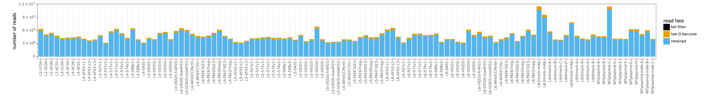


Distribution of sequencing reads per barcode on subamplicons:


```python
showPDF(countsplotprefix + 'readsperbc.pdf')
```


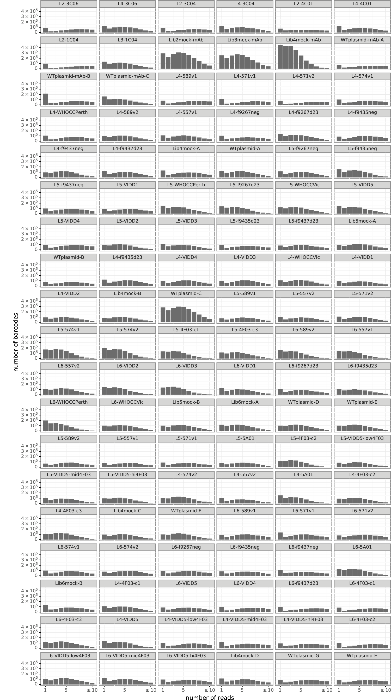


Number of barcoded subamplicons that align and have sufficient reads:


```python
showPDF(countsplotprefix + 'bcstats.pdf')
```


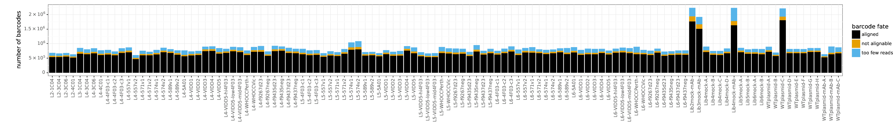


#### Coverage across gene
Depth of valid barcoded subamplicons covering each site in the gene:


```python
showPDF(countsplotprefix + 'depth.pdf')
```


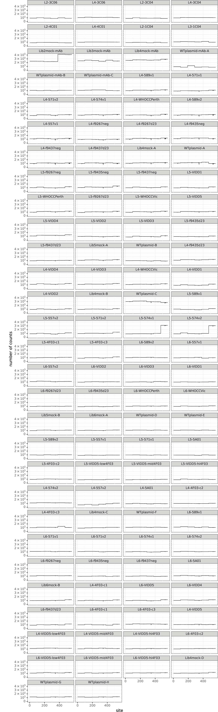


#### Mutation frequencies
The average mutation frequency for each sample, stratifying by codon mutation type:


```python
showPDF(countsplotprefix + 'codonmuttypes.pdf')
```


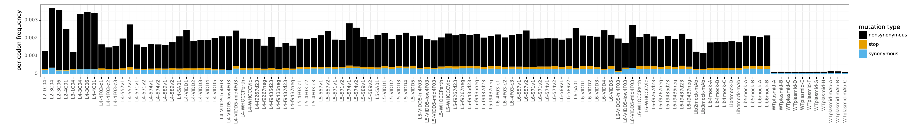


Average mutation frequency per sample, stratifying by number of nucleotide changes per codon mutation:


```python
showPDF(countsplotprefix + 'codonntchanges.pdf')
```


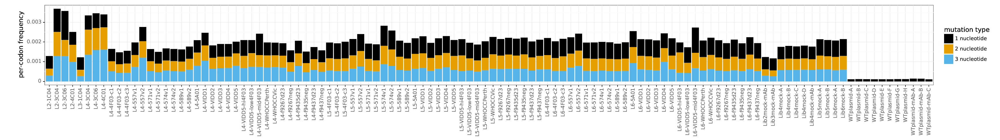


Per-codon mutation frequencies across all sites in gene for each sample:


```python
showPDF(countsplotprefix + 'mutfreq.pdf')
```


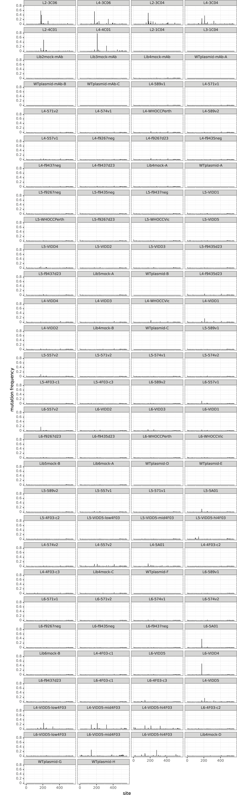


#### Check for oxidative damage
Sometimes there is oxidative damage which manifests as an enrichment of `G`->`T` and `C`->`A` mutations among the single-nucleotide codon mutations.
Check for this by plotting frequencies of different single-nucleotide mutation types:


```python
showPDF(countsplotprefix + 'singlentchanges.pdf')
```


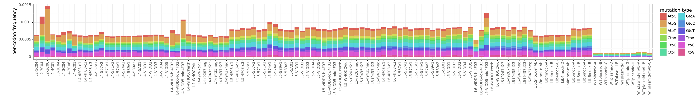


### Renumber to standard HA numbering
The above alignments use sequential 1, 2, ... numbering of the codons.
This is not the standard numbering scheme used for HA, so we use [dms_tools2.utils.renumbSites](https://jbloomlab.github.io/dms_tools2/dms_tools2.utils.html#dms_tools2.utils.renumberSites) to renumber to the standard HA numbering scheme:


```python
dms_tools2.utils.renumberSites(
    renumbfile=config['renumbering_scheme'],
    infiles=list(config['countsdir'] + '/' + samples['sample'] +
                 '_codoncounts.csv'),
    missing='drop',
    outdir=config['renumbcountsdir'])

assert all(os.path.isfile(f) for f in
           config['renumbcountsdir'] + '/' + samples['sample'] +
           '_codoncounts.csv'
           ), 'missing renumbered counts files'

print(f"Renumbered codon counts are in {config['renumbcountsdir']}")
```

    Renumbered codon counts are in results/renumbered_codoncounts


## Compute immune selection on mutations
We will now determine the immune selection on each mutation by comparing its frequency in each serum-selected sample to an appropriate mock-selected control.
Specifically, we will quantify the immune selection as the *differential selection (diffsel)*, which is essentially the log enrichment of each mutation relative to wildtype in the immune-selected versus mock sample.
See [Doud et al (2017)](https://journals.plos.org/plospathogens/article?id=10.1371/journal.ppat.1006271) for the paper introducing this metric, and see [here](https://jbloomlab.github.io/dms_tools2/diffsel.html) for a more detailed description.

### Samples to compare for each selection
In order to quantify the immune selection, we need to compare each selected sample to the appropriate controls.
Specifically, for each selection, we define three samples:
 - *sel*: the immune-selected sample
 - *mock*: the appropriate mock-selected control for that date and library
 - *err*: the appropriate wildtype plasmid control to estimate sequencing error rates.
 
We call each combination of three such samples a "selection".
For each selection, we also record:
  - *serum_name_formatted*: a version of *serum_name* that also indicates species if non-human
  - *name*: a string indicating the library and the percent infectivity remaining. So for instance, *lib1-5* indicates library 1 with 5% infectivity remaining.
  
Below we construct the data frame with this information on the selections:


```python
selections = (

    # get all immune selected (sel) samples
    samples
    .query('(serum != "mock") & (serum != "plasmid")')
    .rename(columns={'sample': 'sel'})

    # add mock sample for that date and library
    .merge(samples
           .query('serum == "mock"')
           [['sample', 'library', 'date']]
           .rename(columns={'sample': 'mock'})
           )

    # add plasmid sample as error control (err) for that date and library
    .merge(samples
           .query('serum == "plasmid"')
           [['sample', 'library', 'date']]
           .rename(columns={'sample': 'err'})
           )

    # add information about sera
    .merge(sera, validate='many_to_one')

    # add informative names for serum and samples
    .assign(
        serum_name_formatted=lambda x:
            x['serum_species'].map(lambda s: '' if pd.isnull(s) or s == 'human'
                                   else s + '-') + x['serum_name'],
        name_formatted=lambda x:
            x['library'] + ', ' + x['percent_infectivity'].apply(
                dms_tools2.utils.sigFigStr, nsig=2) + '% infectivity',
        name=lambda x:
            x['library'] + '-' + x['percent_infectivity'].apply(
                dms_tools2.utils.sigFigStr, nsig=2)
        )

    # drop unneeded columns
    .drop(['R1', 'R2', 'SRA_accession'], axis='columns', errors='ignore')

    # re-order columns a bit so key ones are displayed first
    .set_index(['serum_name_formatted', 'name', 'sel', 'mock', 'err'])
    .reset_index()
    )

# make sure no duplicated serum / names
assert len(selections) == len(selections.groupby(['serum_name_formatted',
                                                  'name']))

print(f"Tabulated information for {len(selections)} selections:")
display(HTML(selections.to_html(index=False)))
```

    Tabulated information for 92 selections:


<table border="1" class="dataframe">
  <thead>
    <tr style="text-align: right;">
      <th>serum_name_formatted</th>
      <th>name</th>
      <th>sel</th>
      <th>mock</th>
      <th>err</th>
      <th>serum</th>
      <th>library</th>
      <th>date</th>
      <th>serum_dilution</th>
      <th>percent_infectivity</th>
      <th>serum_description</th>
      <th>serum_group</th>
      <th>serum_name</th>
      <th>serum_species</th>
      <th>serum_vaccination</th>
      <th>name_formatted</th>
    </tr>
  </thead>
  <tbody>
    <tr>
      <td>antibody-3C06</td>
      <td>lib2-0.010</td>
      <td>L2-3C06</td>
      <td>Lib2mock-mAb</td>
      <td>WTplasmid-mAb-A</td>
      <td>3C06</td>
      <td>lib2</td>
      <td>2018-07-20</td>
      <td>0.55</td>
      <td>0.0100</td>
      <td>site B-targeting monoclonal antibody 3C06 from Seth Zost and Scott Hensley</td>
      <td>antibody_region_B</td>
      <td>antibody-3C06</td>
      <td>NaN</td>
      <td>NaN</td>
      <td>lib2, 0.010% infectivity</td>
    </tr>
    <tr>
      <td>antibody-3C06</td>
      <td>lib1-0.069</td>
      <td>L4-3C06</td>
      <td>Lib4mock-mAb</td>
      <td>WTplasmid-mAb-C</td>
      <td>3C06</td>
      <td>lib1</td>
      <td>2018-09-12</td>
      <td>0.1</td>
      <td>0.0688</td>
      <td>site B-targeting monoclonal antibody 3C06 from Seth Zost and Scott Hensley</td>
      <td>antibody_region_B</td>
      <td>antibody-3C06</td>
      <td>NaN</td>
      <td>NaN</td>
      <td>lib1, 0.069% infectivity</td>
    </tr>
    <tr>
      <td>antibody-3C04</td>
      <td>lib2-0.033</td>
      <td>L2-3C04</td>
      <td>Lib2mock-mAb</td>
      <td>WTplasmid-mAb-A</td>
      <td>3C04</td>
      <td>lib2</td>
      <td>2018-07-20</td>
      <td>0.65</td>
      <td>0.0331</td>
      <td>site B-targeting monoclonal antibody 3C04 from Seth Zost and Scott Hensley</td>
      <td>antibody_region_B</td>
      <td>antibody-3C04</td>
      <td>NaN</td>
      <td>NaN</td>
      <td>lib2, 0.033% infectivity</td>
    </tr>
    <tr>
      <td>antibody-3C04</td>
      <td>lib1-0.078</td>
      <td>L4-3C04</td>
      <td>Lib4mock-mAb</td>
      <td>WTplasmid-mAb-C</td>
      <td>3C04</td>
      <td>lib1</td>
      <td>2018-09-12</td>
      <td>0.1</td>
      <td>0.0777</td>
      <td>site B-targeting monoclonal antibody 3C04 from Seth Zost and Scott Hensley</td>
      <td>antibody_region_B</td>
      <td>antibody-3C04</td>
      <td>NaN</td>
      <td>NaN</td>
      <td>lib1, 0.078% infectivity</td>
    </tr>
    <tr>
      <td>antibody-4C01</td>
      <td>lib2-0.018</td>
      <td>L2-4C01</td>
      <td>Lib2mock-mAb</td>
      <td>WTplasmid-mAb-A</td>
      <td>4C01</td>
      <td>lib2</td>
      <td>2018-07-20</td>
      <td>0.60</td>
      <td>0.0185</td>
      <td>site B-targeting monoclonal antibody 4C01 from Seth Zost and Scott Hensley</td>
      <td>antibody_region_B</td>
      <td>antibody-4C01</td>
      <td>NaN</td>
      <td>NaN</td>
      <td>lib2, 0.018% infectivity</td>
    </tr>
    <tr>
      <td>antibody-4C01</td>
      <td>lib1-0.12</td>
      <td>L4-4C01</td>
      <td>Lib4mock-mAb</td>
      <td>WTplasmid-mAb-C</td>
      <td>4C01</td>
      <td>lib1</td>
      <td>2018-09-12</td>
      <td>0.2</td>
      <td>0.1190</td>
      <td>site B-targeting monoclonal antibody 4C01 from Seth Zost and Scott Hensley</td>
      <td>antibody_region_B</td>
      <td>antibody-4C01</td>
      <td>NaN</td>
      <td>NaN</td>
      <td>lib1, 0.12% infectivity</td>
    </tr>
    <tr>
      <td>antibody-1C04</td>
      <td>lib2-10</td>
      <td>L2-1C04</td>
      <td>Lib2mock-mAb</td>
      <td>WTplasmid-mAb-A</td>
      <td>1C04</td>
      <td>lib2</td>
      <td>2018-07-20</td>
      <td>16.0</td>
      <td>10.3190</td>
      <td>lower head-targeting monoclonal antibody 1C04 from Seth Zost and Scott Hensley</td>
      <td>antibody_lower_head</td>
      <td>antibody-1C04</td>
      <td>NaN</td>
      <td>NaN</td>
      <td>lib2, 10% infectivity</td>
    </tr>
    <tr>
      <td>antibody-1C04</td>
      <td>lib3-7.9</td>
      <td>L3-1C04</td>
      <td>Lib3mock-mAb</td>
      <td>WTplasmid-mAb-B</td>
      <td>1C04</td>
      <td>lib3</td>
      <td>2018-09-12</td>
      <td>18.0</td>
      <td>7.9040</td>
      <td>lower head-targeting monoclonal antibody 1C04 from Seth Zost and Scott Hensley</td>
      <td>antibody_lower_head</td>
      <td>antibody-1C04</td>
      <td>NaN</td>
      <td>NaN</td>
      <td>lib3, 7.9% infectivity</td>
    </tr>
    <tr>
      <td>2015-age-48-prevacc</td>
      <td>lib1-14</td>
      <td>L4-589v1</td>
      <td>Lib4mock-A</td>
      <td>WTplasmid-A</td>
      <td>589v1</td>
      <td>lib1</td>
      <td>2018-11-14</td>
      <td>0.0185</td>
      <td>13.8200</td>
      <td>collected before 2015/2016 vaccine from person born in 1967</td>
      <td>Hensley_sera</td>
      <td>2015-age-48-prevacc</td>
      <td>human</td>
      <td>pre</td>
      <td>lib1, 14% infectivity</td>
    </tr>
    <tr>
      <td>2015-age-48-prevacc</td>
      <td>lib2-20</td>
      <td>L5-589v1</td>
      <td>Lib5mock-B</td>
      <td>WTplasmid-D</td>
      <td>589v1</td>
      <td>lib2</td>
      <td>2019-03-06</td>
      <td>0.0175</td>
      <td>20.3200</td>
      <td>collected before 2015/2016 vaccine from person born in 1967</td>
      <td>Hensley_sera</td>
      <td>2015-age-48-prevacc</td>
      <td>human</td>
      <td>pre</td>
      <td>lib2, 20% infectivity</td>
    </tr>
    <tr>
      <td>2015-age-48-prevacc</td>
      <td>lib3-18</td>
      <td>L6-589v1</td>
      <td>Lib6mock-B</td>
      <td>WTplasmid-H</td>
      <td>589v1</td>
      <td>lib3</td>
      <td>2019-03-26</td>
      <td>0.0175</td>
      <td>18.4000</td>
      <td>collected before 2015/2016 vaccine from person born in 1967</td>
      <td>Hensley_sera</td>
      <td>2015-age-48-prevacc</td>
      <td>human</td>
      <td>pre</td>
      <td>lib3, 18% infectivity</td>
    </tr>
    <tr>
      <td>2015-age-49-prevacc</td>
      <td>lib1-20</td>
      <td>L4-571v1</td>
      <td>Lib4mock-A</td>
      <td>WTplasmid-A</td>
      <td>571v1</td>
      <td>lib1</td>
      <td>2018-11-14</td>
      <td>0.0185</td>
      <td>19.6200</td>
      <td>collected before 2015/2016 vaccine from person born in 1966</td>
      <td>Hensley_sera</td>
      <td>2015-age-49-prevacc</td>
      <td>human</td>
      <td>pre</td>
      <td>lib1, 20% infectivity</td>
    </tr>
    <tr>
      <td>2015-age-49-prevacc</td>
      <td>lib2-12</td>
      <td>L5-571v1</td>
      <td>Lib5mock-B</td>
      <td>WTplasmid-D</td>
      <td>571v1</td>
      <td>lib2</td>
      <td>2019-03-06</td>
      <td>0.0185</td>
      <td>11.8600</td>
      <td>collected before 2015/2016 vaccine from person born in 1966</td>
      <td>Hensley_sera</td>
      <td>2015-age-49-prevacc</td>
      <td>human</td>
      <td>pre</td>
      <td>lib2, 12% infectivity</td>
    </tr>
    <tr>
      <td>2015-age-49-prevacc</td>
      <td>lib3-28</td>
      <td>L6-571v1</td>
      <td>Lib6mock-B</td>
      <td>WTplasmid-H</td>
      <td>571v1</td>
      <td>lib3</td>
      <td>2019-03-26</td>
      <td>0.0185</td>
      <td>27.7400</td>
      <td>collected before 2015/2016 vaccine from person born in 1966</td>
      <td>Hensley_sera</td>
      <td>2015-age-49-prevacc</td>
      <td>human</td>
      <td>pre</td>
      <td>lib3, 28% infectivity</td>
    </tr>
    <tr>
      <td>2015-age-49-vacc</td>
      <td>lib1-5.5</td>
      <td>L4-571v2</td>
      <td>Lib4mock-A</td>
      <td>WTplasmid-A</td>
      <td>571v2</td>
      <td>lib1</td>
      <td>2018-11-14</td>
      <td>0.0185</td>
      <td>5.4800</td>
      <td>collected after 2015/2016 vaccine from person born in 1966</td>
      <td>Hensley_sera</td>
      <td>2015-age-49-vacc</td>
      <td>human</td>
      <td>post</td>
      <td>lib1, 5.5% infectivity</td>
    </tr>
    <tr>
      <td>2015-age-49-vacc</td>
      <td>lib2-1.1</td>
      <td>L5-571v2</td>
      <td>Lib5mock-B</td>
      <td>WTplasmid-D</td>
      <td>571v2</td>
      <td>lib2</td>
      <td>2019-03-06</td>
      <td>0.01</td>
      <td>1.0900</td>
      <td>collected after 2015/2016 vaccine from person born in 1966</td>
      <td>Hensley_sera</td>
      <td>2015-age-49-vacc</td>
      <td>human</td>
      <td>post</td>
      <td>lib2, 1.1% infectivity</td>
    </tr>
    <tr>
      <td>2015-age-49-vacc</td>
      <td>lib3-7.8</td>
      <td>L6-571v2</td>
      <td>Lib6mock-B</td>
      <td>WTplasmid-H</td>
      <td>571v2</td>
      <td>lib3</td>
      <td>2019-03-26</td>
      <td>0.005</td>
      <td>7.7900</td>
      <td>collected after 2015/2016 vaccine from person born in 1966</td>
      <td>Hensley_sera</td>
      <td>2015-age-49-vacc</td>
      <td>human</td>
      <td>post</td>
      <td>lib3, 7.8% infectivity</td>
    </tr>
    <tr>
      <td>2015-age-29-prevacc</td>
      <td>lib1-9.5</td>
      <td>L4-574v1</td>
      <td>Lib4mock-A</td>
      <td>WTplasmid-A</td>
      <td>574v1</td>
      <td>lib1</td>
      <td>2018-11-14</td>
      <td>0.0185</td>
      <td>9.4800</td>
      <td>collected before 2015/2016 vaccine from person born in 1986</td>
      <td>Hensley_sera</td>
      <td>2015-age-29-prevacc</td>
      <td>human</td>
      <td>pre</td>
      <td>lib1, 9.5% infectivity</td>
    </tr>
    <tr>
      <td>2015-age-29-prevacc</td>
      <td>lib2-7.6</td>
      <td>L5-574v1</td>
      <td>Lib5mock-B</td>
      <td>WTplasmid-D</td>
      <td>574v1</td>
      <td>lib2</td>
      <td>2019-03-06</td>
      <td>0.0125</td>
      <td>7.5700</td>
      <td>collected before 2015/2016 vaccine from person born in 1986</td>
      <td>Hensley_sera</td>
      <td>2015-age-29-prevacc</td>
      <td>human</td>
      <td>pre</td>
      <td>lib2, 7.6% infectivity</td>
    </tr>
    <tr>
      <td>2015-age-29-prevacc</td>
      <td>lib3-3.3</td>
      <td>L6-574v1</td>
      <td>Lib6mock-B</td>
      <td>WTplasmid-H</td>
      <td>574v1</td>
      <td>lib3</td>
      <td>2019-03-26</td>
      <td>0.015</td>
      <td>3.3000</td>
      <td>collected before 2015/2016 vaccine from person born in 1986</td>
      <td>Hensley_sera</td>
      <td>2015-age-29-prevacc</td>
      <td>human</td>
      <td>pre</td>
      <td>lib3, 3.3% infectivity</td>
    </tr>
    <tr>
      <td>ferret-WHO</td>
      <td>lib1-2.3</td>
      <td>L4-WHOCCPerth</td>
      <td>Lib4mock-A</td>
      <td>WTplasmid-A</td>
      <td>WHOCCPerth</td>
      <td>lib1</td>
      <td>2018-11-14</td>
      <td>0.0185</td>
      <td>2.3200</td>
      <td>ferret infected by Melbourne WHO CC with their Perth/2009 strain</td>
      <td>ferret</td>
      <td>WHO</td>
      <td>ferret</td>
      <td>post</td>
      <td>lib1, 2.3% infectivity</td>
    </tr>
    <tr>
      <td>ferret-WHO</td>
      <td>lib2-1.9</td>
      <td>L5-WHOCCPerth</td>
      <td>Lib5mock-A</td>
      <td>WTplasmid-B</td>
      <td>WHOCCPerth</td>
      <td>lib2</td>
      <td>2019-01-16</td>
      <td>0.0075</td>
      <td>1.8800</td>
      <td>ferret infected by Melbourne WHO CC with their Perth/2009 strain</td>
      <td>ferret</td>
      <td>WHO</td>
      <td>ferret</td>
      <td>post</td>
      <td>lib2, 1.9% infectivity</td>
    </tr>
    <tr>
      <td>ferret-WHO</td>
      <td>lib3-4.1</td>
      <td>L6-WHOCCPerth</td>
      <td>Lib6mock-A</td>
      <td>WTplasmid-E</td>
      <td>WHOCCPerth</td>
      <td>lib3</td>
      <td>2019-03-06</td>
      <td>0.0075</td>
      <td>4.1000</td>
      <td>ferret infected by Melbourne WHO CC with their Perth/2009 strain</td>
      <td>ferret</td>
      <td>WHO</td>
      <td>ferret</td>
      <td>post</td>
      <td>lib3, 4.1% infectivity</td>
    </tr>
    <tr>
      <td>2015-age-48-vacc</td>
      <td>lib1-4.6</td>
      <td>L4-589v2</td>
      <td>Lib4mock-A</td>
      <td>WTplasmid-A</td>
      <td>589v2</td>
      <td>lib1</td>
      <td>2018-11-14</td>
      <td>0.000875</td>
      <td>4.5800</td>
      <td>collected after 2015/2016 vaccine from person born in 1967</td>
      <td>Hensley_sera</td>
      <td>2015-age-48-vacc</td>
      <td>human</td>
      <td>post</td>
      <td>lib1, 4.6% infectivity</td>
    </tr>
    <tr>
      <td>2015-age-48-vacc</td>
      <td>lib2-4.7</td>
      <td>L5-589v2</td>
      <td>Lib5mock-B</td>
      <td>WTplasmid-D</td>
      <td>589v2</td>
      <td>lib2</td>
      <td>2019-03-06</td>
      <td>0.000375</td>
      <td>4.6800</td>
      <td>collected after 2015/2016 vaccine from person born in 1967</td>
      <td>Hensley_sera</td>
      <td>2015-age-48-vacc</td>
      <td>human</td>
      <td>post</td>
      <td>lib2, 4.7% infectivity</td>
    </tr>
    <tr>
      <td>2015-age-48-vacc</td>
      <td>lib3-4.1</td>
      <td>L6-589v2</td>
      <td>Lib6mock-A</td>
      <td>WTplasmid-E</td>
      <td>589v2</td>
      <td>lib3</td>
      <td>2019-03-06</td>
      <td>0.000375</td>
      <td>4.0600</td>
      <td>collected after 2015/2016 vaccine from person born in 1967</td>
      <td>Hensley_sera</td>
      <td>2015-age-48-vacc</td>
      <td>human</td>
      <td>post</td>
      <td>lib3, 4.1% infectivity</td>
    </tr>
    <tr>
      <td>2015-age-25-prevacc</td>
      <td>lib1-6.9</td>
      <td>L4-557v1</td>
      <td>Lib4mock-A</td>
      <td>WTplasmid-A</td>
      <td>557v1</td>
      <td>lib1</td>
      <td>2018-11-14</td>
      <td>0.0075</td>
      <td>6.9000</td>
      <td>collected before 2015/2016 vaccine from person born in 1990</td>
      <td>Hensley_sera</td>
      <td>2015-age-25-prevacc</td>
      <td>human</td>
      <td>pre</td>
      <td>lib1, 6.9% infectivity</td>
    </tr>
    <tr>
      <td>2015-age-25-prevacc</td>
      <td>lib2-2.3</td>
      <td>L5-557v1</td>
      <td>Lib5mock-B</td>
      <td>WTplasmid-D</td>
      <td>557v1</td>
      <td>lib2</td>
      <td>2019-03-06</td>
      <td>0.005</td>
      <td>2.3100</td>
      <td>collected before 2015/2016 vaccine from person born in 1990</td>
      <td>Hensley_sera</td>
      <td>2015-age-25-prevacc</td>
      <td>human</td>
      <td>pre</td>
      <td>lib2, 2.3% infectivity</td>
    </tr>
    <tr>
      <td>2015-age-25-prevacc</td>
      <td>lib3-1.6</td>
      <td>L6-557v1</td>
      <td>Lib6mock-A</td>
      <td>WTplasmid-E</td>
      <td>557v1</td>
      <td>lib3</td>
      <td>2019-03-06</td>
      <td>0.005</td>
      <td>1.5700</td>
      <td>collected before 2015/2016 vaccine from person born in 1990</td>
      <td>Hensley_sera</td>
      <td>2015-age-25-prevacc</td>
      <td>human</td>
      <td>pre</td>
      <td>lib3, 1.6% infectivity</td>
    </tr>
    <tr>
      <td>ferret-Pitt-1-preinf</td>
      <td>lib1-100</td>
      <td>L4-f9267neg</td>
      <td>Lib4mock-A</td>
      <td>WTplasmid-A</td>
      <td>f9267neg</td>
      <td>lib1</td>
      <td>2018-11-14</td>
      <td>0.00075</td>
      <td>100.0000</td>
      <td>Lakdawala lab ferret, before infection</td>
      <td>ferret</td>
      <td>Pitt-1-preinf</td>
      <td>ferret</td>
      <td>pre</td>
      <td>lib1, 100% infectivity</td>
    </tr>
    <tr>
      <td>ferret-Pitt-1-preinf</td>
      <td>lib2-100</td>
      <td>L5-f9267neg</td>
      <td>Lib5mock-A</td>
      <td>WTplasmid-B</td>
      <td>f9267neg</td>
      <td>lib2</td>
      <td>2019-01-16</td>
      <td>0.00075</td>
      <td>100.0000</td>
      <td>Lakdawala lab ferret, before infection</td>
      <td>ferret</td>
      <td>Pitt-1-preinf</td>
      <td>ferret</td>
      <td>pre</td>
      <td>lib2, 100% infectivity</td>
    </tr>
    <tr>
      <td>ferret-Pitt-1-preinf</td>
      <td>lib3-100</td>
      <td>L6-f9267neg</td>
      <td>Lib6mock-B</td>
      <td>WTplasmid-H</td>
      <td>f9267neg</td>
      <td>lib3</td>
      <td>2019-03-26</td>
      <td>0.00075</td>
      <td>100.0000</td>
      <td>Lakdawala lab ferret, before infection</td>
      <td>ferret</td>
      <td>Pitt-1-preinf</td>
      <td>ferret</td>
      <td>pre</td>
      <td>lib3, 100% infectivity</td>
    </tr>
    <tr>
      <td>ferret-Pitt-1-postinf</td>
      <td>lib1-4.4</td>
      <td>L4-f9267d23</td>
      <td>Lib4mock-A</td>
      <td>WTplasmid-A</td>
      <td>f9267d23</td>
      <td>lib1</td>
      <td>2018-11-14</td>
      <td>0.00075</td>
      <td>4.3600</td>
      <td>Lakdawala lab ferret, 23 days after infection by Perth/2009 with our HA</td>
      <td>ferret</td>
      <td>Pitt-1-postinf</td>
      <td>ferret</td>
      <td>post</td>
      <td>lib1, 4.4% infectivity</td>
    </tr>
    <tr>
      <td>ferret-Pitt-1-postinf</td>
      <td>lib2-5.3</td>
      <td>L5-f9267d23</td>
      <td>Lib5mock-A</td>
      <td>WTplasmid-B</td>
      <td>f9267d23</td>
      <td>lib2</td>
      <td>2019-01-16</td>
      <td>0.000175</td>
      <td>5.3500</td>
      <td>Lakdawala lab ferret, 23 days after infection by Perth/2009 with our HA</td>
      <td>ferret</td>
      <td>Pitt-1-postinf</td>
      <td>ferret</td>
      <td>post</td>
      <td>lib2, 5.3% infectivity</td>
    </tr>
    <tr>
      <td>ferret-Pitt-1-postinf</td>
      <td>lib3-1.7</td>
      <td>L6-f9267d23</td>
      <td>Lib6mock-A</td>
      <td>WTplasmid-E</td>
      <td>f9267d23</td>
      <td>lib3</td>
      <td>2019-03-06</td>
      <td>0.000375</td>
      <td>1.6900</td>
      <td>Lakdawala lab ferret, 23 days after infection by Perth/2009 with our HA</td>
      <td>ferret</td>
      <td>Pitt-1-postinf</td>
      <td>ferret</td>
      <td>post</td>
      <td>lib3, 1.7% infectivity</td>
    </tr>
    <tr>
      <td>ferret-Pitt-2-preinf</td>
      <td>lib1-100</td>
      <td>L4-f9435neg</td>
      <td>Lib4mock-A</td>
      <td>WTplasmid-A</td>
      <td>f9435neg</td>
      <td>lib1</td>
      <td>2018-11-14</td>
      <td>0.001</td>
      <td>100.0000</td>
      <td>Lakdawala lab ferret, before infection</td>
      <td>ferret</td>
      <td>Pitt-2-preinf</td>
      <td>ferret</td>
      <td>pre</td>
      <td>lib1, 100% infectivity</td>
    </tr>
    <tr>
      <td>ferret-Pitt-2-preinf</td>
      <td>lib2-100</td>
      <td>L5-f9435neg</td>
      <td>Lib5mock-A</td>
      <td>WTplasmid-B</td>
      <td>f9435neg</td>
      <td>lib2</td>
      <td>2019-01-16</td>
      <td>0.0025</td>
      <td>100.0000</td>
      <td>Lakdawala lab ferret, before infection</td>
      <td>ferret</td>
      <td>Pitt-2-preinf</td>
      <td>ferret</td>
      <td>pre</td>
      <td>lib2, 100% infectivity</td>
    </tr>
    <tr>
      <td>ferret-Pitt-2-preinf</td>
      <td>lib3-100</td>
      <td>L6-f9435neg</td>
      <td>Lib6mock-B</td>
      <td>WTplasmid-H</td>
      <td>f9435neg</td>
      <td>lib3</td>
      <td>2019-03-26</td>
      <td>0.0025</td>
      <td>100.0000</td>
      <td>Lakdawala lab ferret, before infection</td>
      <td>ferret</td>
      <td>Pitt-2-preinf</td>
      <td>ferret</td>
      <td>pre</td>
      <td>lib3, 100% infectivity</td>
    </tr>
    <tr>
      <td>ferret-Pitt-3-preinf</td>
      <td>lib1-100</td>
      <td>L4-f9437neg</td>
      <td>Lib4mock-A</td>
      <td>WTplasmid-A</td>
      <td>f9437neg</td>
      <td>lib1</td>
      <td>2018-11-14</td>
      <td>0.00225</td>
      <td>100.0000</td>
      <td>Lakdawala lab ferret, before infection</td>
      <td>ferret</td>
      <td>Pitt-3-preinf</td>
      <td>ferret</td>
      <td>pre</td>
      <td>lib1, 100% infectivity</td>
    </tr>
    <tr>
      <td>ferret-Pitt-3-preinf</td>
      <td>lib2-100</td>
      <td>L5-f9437neg</td>
      <td>Lib5mock-A</td>
      <td>WTplasmid-B</td>
      <td>f9437neg</td>
      <td>lib2</td>
      <td>2019-01-16</td>
      <td>0.00625</td>
      <td>100.0000</td>
      <td>Lakdawala lab ferret, before infection</td>
      <td>ferret</td>
      <td>Pitt-3-preinf</td>
      <td>ferret</td>
      <td>pre</td>
      <td>lib2, 100% infectivity</td>
    </tr>
    <tr>
      <td>ferret-Pitt-3-preinf</td>
      <td>lib3-100</td>
      <td>L6-f9437neg</td>
      <td>Lib6mock-B</td>
      <td>WTplasmid-H</td>
      <td>f9437neg</td>
      <td>lib3</td>
      <td>2019-03-26</td>
      <td>0.00625</td>
      <td>100.0000</td>
      <td>Lakdawala lab ferret, before infection</td>
      <td>ferret</td>
      <td>Pitt-3-preinf</td>
      <td>ferret</td>
      <td>pre</td>
      <td>lib3, 100% infectivity</td>
    </tr>
    <tr>
      <td>ferret-Pitt-3-postinf</td>
      <td>lib1-8.8</td>
      <td>L4-f9437d23</td>
      <td>Lib4mock-A</td>
      <td>WTplasmid-A</td>
      <td>f9437d23</td>
      <td>lib1</td>
      <td>2018-11-14</td>
      <td>0.00225</td>
      <td>8.7700</td>
      <td>Lakdawala lab ferret, 23 days after infection by Perth/2009 with our HA</td>
      <td>ferret</td>
      <td>Pitt-3-postinf</td>
      <td>ferret</td>
      <td>post</td>
      <td>lib1, 8.8% infectivity</td>
    </tr>
    <tr>
      <td>ferret-Pitt-3-postinf</td>
      <td>lib2-1.7</td>
      <td>L5-f9437d23</td>
      <td>Lib5mock-A</td>
      <td>WTplasmid-B</td>
      <td>f9437d23</td>
      <td>lib2</td>
      <td>2019-01-16</td>
      <td>0.001375</td>
      <td>1.7000</td>
      <td>Lakdawala lab ferret, 23 days after infection by Perth/2009 with our HA</td>
      <td>ferret</td>
      <td>Pitt-3-postinf</td>
      <td>ferret</td>
      <td>post</td>
      <td>lib2, 1.7% infectivity</td>
    </tr>
    <tr>
      <td>ferret-Pitt-3-postinf</td>
      <td>lib3-5.8</td>
      <td>L6-f9437d23</td>
      <td>Lib6mock-B</td>
      <td>WTplasmid-H</td>
      <td>f9437d23</td>
      <td>lib3</td>
      <td>2019-03-26</td>
      <td>0.00175</td>
      <td>5.7800</td>
      <td>Lakdawala lab ferret, 23 days after infection by Perth/2009 with our HA</td>
      <td>ferret</td>
      <td>Pitt-3-postinf</td>
      <td>ferret</td>
      <td>post</td>
      <td>lib3, 5.8% infectivity</td>
    </tr>
    <tr>
      <td>2010-age-21</td>
      <td>lib2-6.0</td>
      <td>L5-VIDD1</td>
      <td>Lib5mock-A</td>
      <td>WTplasmid-B</td>
      <td>VIDD1</td>
      <td>lib2</td>
      <td>2019-01-16</td>
      <td>0.0045</td>
      <td>5.9500</td>
      <td>collected at Hutch in 2/2010 from person born in 1989</td>
      <td>VIDD_sera</td>
      <td>2010-age-21</td>
      <td>human</td>
      <td>NaN</td>
      <td>lib2, 6.0% infectivity</td>
    </tr>
    <tr>
      <td>2010-age-21</td>
      <td>lib1-4.1</td>
      <td>L4-VIDD1</td>
      <td>Lib4mock-B</td>
      <td>WTplasmid-C</td>
      <td>VIDD1</td>
      <td>lib1</td>
      <td>2019-01-16</td>
      <td>0.0175</td>
      <td>4.0800</td>
      <td>collected at Hutch in 2/2010 from person born in 1989</td>
      <td>VIDD_sera</td>
      <td>2010-age-21</td>
      <td>human</td>
      <td>NaN</td>
      <td>lib1, 4.1% infectivity</td>
    </tr>
    <tr>
      <td>2010-age-21</td>
      <td>lib3-3.7</td>
      <td>L6-VIDD1</td>
      <td>Lib6mock-A</td>
      <td>WTplasmid-E</td>
      <td>VIDD1</td>
      <td>lib3</td>
      <td>2019-03-06</td>
      <td>0.0075</td>
      <td>3.6800</td>
      <td>collected at Hutch in 2/2010 from person born in 1989</td>
      <td>VIDD_sera</td>
      <td>2010-age-21</td>
      <td>human</td>
      <td>NaN</td>
      <td>lib3, 3.7% infectivity</td>
    </tr>
    <tr>
      <td>ferret-WHO-Victoria2011</td>
      <td>lib2-3.9</td>
      <td>L5-WHOCCVic</td>
      <td>Lib5mock-A</td>
      <td>WTplasmid-B</td>
      <td>WHOCCVic</td>
      <td>lib2</td>
      <td>2019-01-16</td>
      <td>0.0025</td>
      <td>3.9000</td>
      <td>ferret infected by Melbourne WHO CC with their Victoria/2011 strain</td>
      <td>ferret</td>
      <td>WHO-Victoria2011</td>
      <td>ferret</td>
      <td>post</td>
      <td>lib2, 3.9% infectivity</td>
    </tr>
    <tr>
      <td>ferret-WHO-Victoria2011</td>
      <td>lib1-1.3</td>
      <td>L4-WHOCCVic</td>
      <td>Lib4mock-B</td>
      <td>WTplasmid-C</td>
      <td>WHOCCVic</td>
      <td>lib1</td>
      <td>2019-01-16</td>
      <td>0.00625</td>
      <td>1.2600</td>
      <td>ferret infected by Melbourne WHO CC with their Victoria/2011 strain</td>
      <td>ferret</td>
      <td>WHO-Victoria2011</td>
      <td>ferret</td>
      <td>post</td>
      <td>lib1, 1.3% infectivity</td>
    </tr>
    <tr>
      <td>ferret-WHO-Victoria2011</td>
      <td>lib3-3.6</td>
      <td>L6-WHOCCVic</td>
      <td>Lib6mock-A</td>
      <td>WTplasmid-E</td>
      <td>WHOCCVic</td>
      <td>lib3</td>
      <td>2019-03-06</td>
      <td>0.0025</td>
      <td>3.6200</td>
      <td>ferret infected by Melbourne WHO CC with their Victoria/2011 strain</td>
      <td>ferret</td>
      <td>WHO-Victoria2011</td>
      <td>ferret</td>
      <td>post</td>
      <td>lib3, 3.6% infectivity</td>
    </tr>
    <tr>
      <td>2009-age-65</td>
      <td>lib2-5.2</td>
      <td>L5-VIDD5</td>
      <td>Lib5mock-A</td>
      <td>WTplasmid-B</td>
      <td>VIDD5</td>
      <td>lib2</td>
      <td>2019-01-16</td>
      <td>0.000875</td>
      <td>5.2400</td>
      <td>collected at Hutch in 6/2009 from person born in 1944</td>
      <td>VIDD_sera</td>
      <td>2009-age-65</td>
      <td>human</td>
      <td>NaN</td>
      <td>lib2, 5.2% infectivity</td>
    </tr>
    <tr>
      <td>2009-age-65</td>
      <td>lib3-5.6</td>
      <td>L6-VIDD5</td>
      <td>Lib6mock-B</td>
      <td>WTplasmid-H</td>
      <td>VIDD5</td>
      <td>lib3</td>
      <td>2019-03-26</td>
      <td>0.002</td>
      <td>5.5800</td>
      <td>collected at Hutch in 6/2009 from person born in 1944</td>
      <td>VIDD_sera</td>
      <td>2009-age-65</td>
      <td>human</td>
      <td>NaN</td>
      <td>lib3, 5.6% infectivity</td>
    </tr>
    <tr>
      <td>2009-age-65</td>
      <td>lib1-1.8</td>
      <td>L4-VIDD5</td>
      <td>Lib4mock-D</td>
      <td>WTplasmid-G</td>
      <td>VIDD5</td>
      <td>lib1</td>
      <td>2019-03-26</td>
      <td>0.003375</td>
      <td>1.7700</td>
      <td>collected at Hutch in 6/2009 from person born in 1944</td>
      <td>VIDD_sera</td>
      <td>2009-age-65</td>
      <td>human</td>
      <td>NaN</td>
      <td>lib1, 1.8% infectivity</td>
    </tr>
    <tr>
      <td>2009-age-64</td>
      <td>lib2-0.87</td>
      <td>L5-VIDD4</td>
      <td>Lib5mock-A</td>
      <td>WTplasmid-B</td>
      <td>VIDD4</td>
      <td>lib2</td>
      <td>2019-01-16</td>
      <td>0.001675</td>
      <td>0.8700</td>
      <td>collected at Hutch in 11/2008 from person born in 1945</td>
      <td>VIDD_sera</td>
      <td>2009-age-64</td>
      <td>human</td>
      <td>NaN</td>
      <td>lib2, 0.87% infectivity</td>
    </tr>
    <tr>
      <td>2009-age-64</td>
      <td>lib1-11</td>
      <td>L4-VIDD4</td>
      <td>Lib4mock-B</td>
      <td>WTplasmid-C</td>
      <td>VIDD4</td>
      <td>lib1</td>
      <td>2019-01-16</td>
      <td>0.004</td>
      <td>10.7400</td>
      <td>collected at Hutch in 11/2008 from person born in 1945</td>
      <td>VIDD_sera</td>
      <td>2009-age-64</td>
      <td>human</td>
      <td>NaN</td>
      <td>lib1, 11% infectivity</td>
    </tr>
    <tr>
      <td>2009-age-64</td>
      <td>lib3-0.26</td>
      <td>L6-VIDD4</td>
      <td>Lib6mock-B</td>
      <td>WTplasmid-H</td>
      <td>VIDD4</td>
      <td>lib3</td>
      <td>2019-03-26</td>
      <td>0.00375</td>
      <td>0.2600</td>
      <td>collected at Hutch in 11/2008 from person born in 1945</td>
      <td>VIDD_sera</td>
      <td>2009-age-64</td>
      <td>human</td>
      <td>NaN</td>
      <td>lib3, 0.26% infectivity</td>
    </tr>
    <tr>
      <td>2009-age-53</td>
      <td>lib2-2.0</td>
      <td>L5-VIDD2</td>
      <td>Lib5mock-A</td>
      <td>WTplasmid-B</td>
      <td>VIDD2</td>
      <td>lib2</td>
      <td>2019-01-16</td>
      <td>0.00375</td>
      <td>2.0300</td>
      <td>collected at Hutch in 1/2009 from person born in 1956</td>
      <td>VIDD_sera</td>
      <td>2009-age-53</td>
      <td>human</td>
      <td>NaN</td>
      <td>lib2, 2.0% infectivity</td>
    </tr>
    <tr>
      <td>2009-age-53</td>
      <td>lib1-3.7</td>
      <td>L4-VIDD2</td>
      <td>Lib4mock-B</td>
      <td>WTplasmid-C</td>
      <td>VIDD2</td>
      <td>lib1</td>
      <td>2019-01-16</td>
      <td>0.00875</td>
      <td>3.7400</td>
      <td>collected at Hutch in 1/2009 from person born in 1956</td>
      <td>VIDD_sera</td>
      <td>2009-age-53</td>
      <td>human</td>
      <td>NaN</td>
      <td>lib1, 3.7% infectivity</td>
    </tr>
    <tr>
      <td>2009-age-53</td>
      <td>lib3-6.2</td>
      <td>L6-VIDD2</td>
      <td>Lib6mock-A</td>
      <td>WTplasmid-E</td>
      <td>VIDD2</td>
      <td>lib3</td>
      <td>2019-03-06</td>
      <td>0.00375</td>
      <td>6.2200</td>
      <td>collected at Hutch in 1/2009 from person born in 1956</td>
      <td>VIDD_sera</td>
      <td>2009-age-53</td>
      <td>human</td>
      <td>NaN</td>
      <td>lib3, 6.2% infectivity</td>
    </tr>
    <tr>
      <td>2009-age-53-plus-2-months</td>
      <td>lib2-1.7</td>
      <td>L5-VIDD3</td>
      <td>Lib5mock-A</td>
      <td>WTplasmid-B</td>
      <td>VIDD3</td>
      <td>lib2</td>
      <td>2019-01-16</td>
      <td>0.0045</td>
      <td>1.7300</td>
      <td>second sample collected at Hutch in 3/2009 from person born in 1956</td>
      <td>VIDD_sera</td>
      <td>2009-age-53-plus-2-months</td>
      <td>human</td>
      <td>NaN</td>
      <td>lib2, 1.7% infectivity</td>
    </tr>
    <tr>
      <td>2009-age-53-plus-2-months</td>
      <td>lib1-6.0</td>
      <td>L4-VIDD3</td>
      <td>Lib4mock-B</td>
      <td>WTplasmid-C</td>
      <td>VIDD3</td>
      <td>lib1</td>
      <td>2019-01-16</td>
      <td>0.0075</td>
      <td>5.9800</td>
      <td>second sample collected at Hutch in 3/2009 from person born in 1956</td>
      <td>VIDD_sera</td>
      <td>2009-age-53-plus-2-months</td>
      <td>human</td>
      <td>NaN</td>
      <td>lib1, 6.0% infectivity</td>
    </tr>
    <tr>
      <td>2009-age-53-plus-2-months</td>
      <td>lib3-1.1</td>
      <td>L6-VIDD3</td>
      <td>Lib6mock-A</td>
      <td>WTplasmid-E</td>
      <td>VIDD3</td>
      <td>lib3</td>
      <td>2019-03-06</td>
      <td>0.00625</td>
      <td>1.1200</td>
      <td>second sample collected at Hutch in 3/2009 from person born in 1956</td>
      <td>VIDD_sera</td>
      <td>2009-age-53-plus-2-months</td>
      <td>human</td>
      <td>NaN</td>
      <td>lib3, 1.1% infectivity</td>
    </tr>
    <tr>
      <td>ferret-Pitt-2-postinf</td>
      <td>lib2-1.9</td>
      <td>L5-f9435d23</td>
      <td>Lib5mock-A</td>
      <td>WTplasmid-B</td>
      <td>f9435d23</td>
      <td>lib2</td>
      <td>2019-01-16</td>
      <td>0.000625</td>
      <td>1.8800</td>
      <td>Lakdawala lab ferret, 23 days after infection by Perth/2009 with our HA</td>
      <td>ferret</td>
      <td>Pitt-2-postinf</td>
      <td>ferret</td>
      <td>post</td>
      <td>lib2, 1.9% infectivity</td>
    </tr>
    <tr>
      <td>ferret-Pitt-2-postinf</td>
      <td>lib1-3.5</td>
      <td>L4-f9435d23</td>
      <td>Lib4mock-B</td>
      <td>WTplasmid-C</td>
      <td>f9435d23</td>
      <td>lib1</td>
      <td>2019-01-16</td>
      <td>0.0025</td>
      <td>3.4500</td>
      <td>Lakdawala lab ferret, 23 days after infection by Perth/2009 with our HA</td>
      <td>ferret</td>
      <td>Pitt-2-postinf</td>
      <td>ferret</td>
      <td>post</td>
      <td>lib1, 3.5% infectivity</td>
    </tr>
    <tr>
      <td>ferret-Pitt-2-postinf</td>
      <td>lib3-3.0</td>
      <td>L6-f9435d23</td>
      <td>Lib6mock-A</td>
      <td>WTplasmid-E</td>
      <td>f9435d23</td>
      <td>lib3</td>
      <td>2019-03-06</td>
      <td>0.00125</td>
      <td>3.0400</td>
      <td>Lakdawala lab ferret, 23 days after infection by Perth/2009 with our HA</td>
      <td>ferret</td>
      <td>Pitt-2-postinf</td>
      <td>ferret</td>
      <td>post</td>
      <td>lib3, 3.0% infectivity</td>
    </tr>
    <tr>
      <td>2015-age-25-vacc</td>
      <td>lib2-0.81</td>
      <td>L5-557v2</td>
      <td>Lib5mock-B</td>
      <td>WTplasmid-D</td>
      <td>557v2</td>
      <td>lib2</td>
      <td>2019-03-06</td>
      <td>0.0005</td>
      <td>0.8100</td>
      <td>collected after 2015/2016 vaccine from person born in 1990</td>
      <td>Hensley_sera</td>
      <td>2015-age-25-vacc</td>
      <td>human</td>
      <td>post</td>
      <td>lib2, 0.81% infectivity</td>
    </tr>
    <tr>
      <td>2015-age-25-vacc</td>
      <td>lib3-1.6</td>
      <td>L6-557v2</td>
      <td>Lib6mock-A</td>
      <td>WTplasmid-E</td>
      <td>557v2</td>
      <td>lib3</td>
      <td>2019-03-06</td>
      <td>0.0005</td>
      <td>1.6400</td>
      <td>collected after 2015/2016 vaccine from person born in 1990</td>
      <td>Hensley_sera</td>
      <td>2015-age-25-vacc</td>
      <td>human</td>
      <td>post</td>
      <td>lib3, 1.6% infectivity</td>
    </tr>
    <tr>
      <td>2015-age-25-vacc</td>
      <td>lib1-1.5</td>
      <td>L4-557v2</td>
      <td>Lib4mock-C</td>
      <td>WTplasmid-F</td>
      <td>557v2</td>
      <td>lib1</td>
      <td>2019-03-06</td>
      <td>0.00125</td>
      <td>1.5300</td>
      <td>collected after 2015/2016 vaccine from person born in 1990</td>
      <td>Hensley_sera</td>
      <td>2015-age-25-vacc</td>
      <td>human</td>
      <td>post</td>
      <td>lib1, 1.5% infectivity</td>
    </tr>
    <tr>
      <td>2015-age-29-vacc</td>
      <td>lib2-1.1</td>
      <td>L5-574v2</td>
      <td>Lib5mock-B</td>
      <td>WTplasmid-D</td>
      <td>574v2</td>
      <td>lib2</td>
      <td>2019-03-06</td>
      <td>0.000875</td>
      <td>1.1100</td>
      <td>collected after 2015/2016 vaccine from person born in 1986</td>
      <td>Hensley_sera</td>
      <td>2015-age-29-vacc</td>
      <td>human</td>
      <td>post</td>
      <td>lib2, 1.1% infectivity</td>
    </tr>
    <tr>
      <td>2015-age-29-vacc</td>
      <td>lib1-1.5</td>
      <td>L4-574v2</td>
      <td>Lib4mock-C</td>
      <td>WTplasmid-F</td>
      <td>574v2</td>
      <td>lib1</td>
      <td>2019-03-06</td>
      <td>0.002</td>
      <td>1.5400</td>
      <td>collected after 2015/2016 vaccine from person born in 1986</td>
      <td>Hensley_sera</td>
      <td>2015-age-29-vacc</td>
      <td>human</td>
      <td>post</td>
      <td>lib1, 1.5% infectivity</td>
    </tr>
    <tr>
      <td>2015-age-29-vacc</td>
      <td>lib3-1.9</td>
      <td>L6-574v2</td>
      <td>Lib6mock-B</td>
      <td>WTplasmid-H</td>
      <td>574v2</td>
      <td>lib3</td>
      <td>2019-03-26</td>
      <td>0.00075</td>
      <td>1.9200</td>
      <td>collected after 2015/2016 vaccine from person born in 1986</td>
      <td>Hensley_sera</td>
      <td>2015-age-29-vacc</td>
      <td>human</td>
      <td>post</td>
      <td>lib3, 1.9% infectivity</td>
    </tr>
    <tr>
      <td>antibody-4F03</td>
      <td>lib2-23</td>
      <td>L5-4F03-c1</td>
      <td>Lib5mock-B</td>
      <td>WTplasmid-D</td>
      <td>4F03</td>
      <td>lib2</td>
      <td>2019-03-06</td>
      <td>0.3</td>
      <td>22.9900</td>
      <td>lower head-targeting monoclonal antibody 4F03 from Seth Zost and Scott Hensley</td>
      <td>antibody_lower_head</td>
      <td>antibody-4F03</td>
      <td>NaN</td>
      <td>NaN</td>
      <td>lib2, 23% infectivity</td>
    </tr>
    <tr>
      <td>antibody-4F03</td>
      <td>lib2-3.7</td>
      <td>L5-4F03-c3</td>
      <td>Lib5mock-B</td>
      <td>WTplasmid-D</td>
      <td>4F03</td>
      <td>lib2</td>
      <td>2019-03-06</td>
      <td>1.5</td>
      <td>3.7100</td>
      <td>lower head-targeting monoclonal antibody 4F03 from Seth Zost and Scott Hensley</td>
      <td>antibody_lower_head</td>
      <td>antibody-4F03</td>
      <td>NaN</td>
      <td>NaN</td>
      <td>lib2, 3.7% infectivity</td>
    </tr>
    <tr>
      <td>antibody-4F03</td>
      <td>lib2-4.7</td>
      <td>L5-4F03-c2</td>
      <td>Lib5mock-B</td>
      <td>WTplasmid-D</td>
      <td>4F03</td>
      <td>lib2</td>
      <td>2019-03-06</td>
      <td>0.7</td>
      <td>4.7100</td>
      <td>lower head-targeting monoclonal antibody 4F03 from Seth Zost and Scott Hensley</td>
      <td>antibody_lower_head</td>
      <td>antibody-4F03</td>
      <td>NaN</td>
      <td>NaN</td>
      <td>lib2, 4.7% infectivity</td>
    </tr>
    <tr>
      <td>antibody-4F03</td>
      <td>lib1-3.5</td>
      <td>L4-4F03-c2</td>
      <td>Lib4mock-C</td>
      <td>WTplasmid-F</td>
      <td>4F03</td>
      <td>lib1</td>
      <td>2019-03-06</td>
      <td>1.0</td>
      <td>3.4700</td>
      <td>lower head-targeting monoclonal antibody 4F03 from Seth Zost and Scott Hensley</td>
      <td>antibody_lower_head</td>
      <td>antibody-4F03</td>
      <td>NaN</td>
      <td>NaN</td>
      <td>lib1, 3.5% infectivity</td>
    </tr>
    <tr>
      <td>antibody-4F03</td>
      <td>lib1-0.78</td>
      <td>L4-4F03-c3</td>
      <td>Lib4mock-C</td>
      <td>WTplasmid-F</td>
      <td>4F03</td>
      <td>lib1</td>
      <td>2019-03-06</td>
      <td>2.0</td>
      <td>0.7800</td>
      <td>lower head-targeting monoclonal antibody 4F03 from Seth Zost and Scott Hensley</td>
      <td>antibody_lower_head</td>
      <td>antibody-4F03</td>
      <td>NaN</td>
      <td>NaN</td>
      <td>lib1, 0.78% infectivity</td>
    </tr>
    <tr>
      <td>antibody-4F03</td>
      <td>lib3-24</td>
      <td>L6-4F03-c1</td>
      <td>Lib6mock-B</td>
      <td>WTplasmid-H</td>
      <td>4F03</td>
      <td>lib3</td>
      <td>2019-03-26</td>
      <td>0.3</td>
      <td>23.9100</td>
      <td>lower head-targeting monoclonal antibody 4F03 from Seth Zost and Scott Hensley</td>
      <td>antibody_lower_head</td>
      <td>antibody-4F03</td>
      <td>NaN</td>
      <td>NaN</td>
      <td>lib3, 24% infectivity</td>
    </tr>
    <tr>
      <td>antibody-4F03</td>
      <td>lib3-0.84</td>
      <td>L6-4F03-c3</td>
      <td>Lib6mock-B</td>
      <td>WTplasmid-H</td>
      <td>4F03</td>
      <td>lib3</td>
      <td>2019-03-26</td>
      <td>1.4</td>
      <td>0.8400</td>
      <td>lower head-targeting monoclonal antibody 4F03 from Seth Zost and Scott Hensley</td>
      <td>antibody_lower_head</td>
      <td>antibody-4F03</td>
      <td>NaN</td>
      <td>NaN</td>
      <td>lib3, 0.84% infectivity</td>
    </tr>
    <tr>
      <td>antibody-4F03</td>
      <td>lib3-7.2</td>
      <td>L6-4F03-c2</td>
      <td>Lib6mock-B</td>
      <td>WTplasmid-H</td>
      <td>4F03</td>
      <td>lib3</td>
      <td>2019-03-26</td>
      <td>0.75</td>
      <td>7.1600</td>
      <td>lower head-targeting monoclonal antibody 4F03 from Seth Zost and Scott Hensley</td>
      <td>antibody_lower_head</td>
      <td>antibody-4F03</td>
      <td>NaN</td>
      <td>NaN</td>
      <td>lib3, 7.2% infectivity</td>
    </tr>
    <tr>
      <td>antibody-4F03</td>
      <td>lib1-28</td>
      <td>L4-4F03-c1</td>
      <td>Lib4mock-D</td>
      <td>WTplasmid-G</td>
      <td>4F03</td>
      <td>lib1</td>
      <td>2019-03-26</td>
      <td>0.3</td>
      <td>28.2400</td>
      <td>lower head-targeting monoclonal antibody 4F03 from Seth Zost and Scott Hensley</td>
      <td>antibody_lower_head</td>
      <td>antibody-4F03</td>
      <td>NaN</td>
      <td>NaN</td>
      <td>lib1, 28% infectivity</td>
    </tr>
    <tr>
      <td>antibody-5A01</td>
      <td>lib2-1.4</td>
      <td>L5-5A01</td>
      <td>Lib5mock-B</td>
      <td>WTplasmid-D</td>
      <td>5A01</td>
      <td>lib2</td>
      <td>2019-03-06</td>
      <td>0.025</td>
      <td>1.3600</td>
      <td>site B-targeting monoclonal antibody 5A01 from Seth Zost and Scott Hensley</td>
      <td>antibody_region_B</td>
      <td>antibody-5A01</td>
      <td>NaN</td>
      <td>NaN</td>
      <td>lib2, 1.4% infectivity</td>
    </tr>
    <tr>
      <td>antibody-5A01</td>
      <td>lib1-4.3</td>
      <td>L4-5A01</td>
      <td>Lib4mock-C</td>
      <td>WTplasmid-F</td>
      <td>5A01</td>
      <td>lib1</td>
      <td>2019-03-06</td>
      <td>0.07</td>
      <td>4.3200</td>
      <td>site B-targeting monoclonal antibody 5A01 from Seth Zost and Scott Hensley</td>
      <td>antibody_region_B</td>
      <td>antibody-5A01</td>
      <td>NaN</td>
      <td>NaN</td>
      <td>lib1, 4.3% infectivity</td>
    </tr>
    <tr>
      <td>antibody-5A01</td>
      <td>lib3-1.0</td>
      <td>L6-5A01</td>
      <td>Lib6mock-B</td>
      <td>WTplasmid-H</td>
      <td>5A01</td>
      <td>lib3</td>
      <td>2019-03-26</td>
      <td>0.025</td>
      <td>1.0200</td>
      <td>site B-targeting monoclonal antibody 5A01 from Seth Zost and Scott Hensley</td>
      <td>antibody_region_B</td>
      <td>antibody-5A01</td>
      <td>NaN</td>
      <td>NaN</td>
      <td>lib3, 1.0% infectivity</td>
    </tr>
    <tr>
      <td>2009-age-65-with-low-4F03</td>
      <td>lib2-5.0</td>
      <td>L5-VIDD5-low4F03</td>
      <td>Lib5mock-B</td>
      <td>WTplasmid-D</td>
      <td>VIDD5andlow4F03</td>
      <td>lib2</td>
      <td>2019-03-06</td>
      <td>0.000875+0.3</td>
      <td>5.0000</td>
      <td>collected at Hutch in 6/2009 from person b1944 with 4F03 at low stringency</td>
      <td>serum_mAb_spike</td>
      <td>2009-age-65-with-low-4F03</td>
      <td>human</td>
      <td>NaN</td>
      <td>lib2, 5.0% infectivity</td>
    </tr>
    <tr>
      <td>2009-age-65-with-low-4F03</td>
      <td>lib3-0.20</td>
      <td>L6-VIDD5-low4F03</td>
      <td>Lib6mock-B</td>
      <td>WTplasmid-H</td>
      <td>VIDD5andlow4F03</td>
      <td>lib3</td>
      <td>2019-03-26</td>
      <td>0.002+0.3</td>
      <td>0.2040</td>
      <td>collected at Hutch in 6/2009 from person b1944 with 4F03 at low stringency</td>
      <td>serum_mAb_spike</td>
      <td>2009-age-65-with-low-4F03</td>
      <td>human</td>
      <td>NaN</td>
      <td>lib3, 0.20% infectivity</td>
    </tr>
    <tr>
      <td>2009-age-65-with-low-4F03</td>
      <td>lib1-0.030</td>
      <td>L4-VIDD5-low4F03</td>
      <td>Lib4mock-D</td>
      <td>WTplasmid-G</td>
      <td>VIDD5andlow4F03</td>
      <td>lib1</td>
      <td>2019-03-26</td>
      <td>0.003375+0.3</td>
      <td>0.0300</td>
      <td>collected at Hutch in 6/2009 from person b1944 with 4F03 at low stringency</td>
      <td>serum_mAb_spike</td>
      <td>2009-age-65-with-low-4F03</td>
      <td>human</td>
      <td>NaN</td>
      <td>lib1, 0.030% infectivity</td>
    </tr>
    <tr>
      <td>2009-age-65-with-mid-4F03</td>
      <td>lib2-0.46</td>
      <td>L5-VIDD5-mid4F03</td>
      <td>Lib5mock-B</td>
      <td>WTplasmid-D</td>
      <td>VIDD5andmid4F03</td>
      <td>lib2</td>
      <td>2019-03-06</td>
      <td>0.000875+0.7</td>
      <td>0.4600</td>
      <td>collected at Hutch in 6/2009 from person b1944 with 4F03 at medium stringency</td>
      <td>serum_mAb_spike</td>
      <td>2009-age-65-with-mid-4F03</td>
      <td>human</td>
      <td>NaN</td>
      <td>lib2, 0.46% infectivity</td>
    </tr>
    <tr>
      <td>2009-age-65-with-mid-4F03</td>
      <td>lib3-0.0077</td>
      <td>L6-VIDD5-mid4F03</td>
      <td>Lib6mock-B</td>
      <td>WTplasmid-H</td>
      <td>VIDD5andmid4F03</td>
      <td>lib3</td>
      <td>2019-03-26</td>
      <td>0.002+0.75</td>
      <td>0.0077</td>
      <td>collected at Hutch in 6/2009 from person b1944 with 4F03 at medium stringency</td>
      <td>serum_mAb_spike</td>
      <td>2009-age-65-with-mid-4F03</td>
      <td>human</td>
      <td>NaN</td>
      <td>lib3, 0.0077% infectivity</td>
    </tr>
    <tr>
      <td>2009-age-65-with-mid-4F03</td>
      <td>lib1-0.0037</td>
      <td>L4-VIDD5-mid4F03</td>
      <td>Lib4mock-D</td>
      <td>WTplasmid-G</td>
      <td>VIDD5andmid4F03</td>
      <td>lib1</td>
      <td>2019-03-26</td>
      <td>0.003375+1</td>
      <td>0.0037</td>
      <td>collected at Hutch in 6/2009 from person b1944 with 4F03 at medium stringency</td>
      <td>serum_mAb_spike</td>
      <td>2009-age-65-with-mid-4F03</td>
      <td>human</td>
      <td>NaN</td>
      <td>lib1, 0.0037% infectivity</td>
    </tr>
    <tr>
      <td>2009-age-65-with-hi-4F03</td>
      <td>lib2-0.040</td>
      <td>L5-VIDD5-hi4F03</td>
      <td>Lib5mock-B</td>
      <td>WTplasmid-D</td>
      <td>VIDD5andhi4F03</td>
      <td>lib2</td>
      <td>2019-03-06</td>
      <td>0.000875+1.5</td>
      <td>0.0400</td>
      <td>collected at Hutch in 6/2009 from person b1944 with 4F03 at high stringency</td>
      <td>serum_mAb_spike</td>
      <td>2009-age-65-with-hi-4F03</td>
      <td>human</td>
      <td>NaN</td>
      <td>lib2, 0.040% infectivity</td>
    </tr>
    <tr>
      <td>2009-age-65-with-hi-4F03</td>
      <td>lib3-0.0032</td>
      <td>L6-VIDD5-hi4F03</td>
      <td>Lib6mock-B</td>
      <td>WTplasmid-H</td>
      <td>VIDD5andhi4F03</td>
      <td>lib3</td>
      <td>2019-03-26</td>
      <td>0.002+1.4</td>
      <td>0.0032</td>
      <td>collected at Hutch in 6/2009 from person b1944 with 4F03 at high stringency</td>
      <td>serum_mAb_spike</td>
      <td>2009-age-65-with-hi-4F03</td>
      <td>human</td>
      <td>NaN</td>
      <td>lib3, 0.0032% infectivity</td>
    </tr>
    <tr>
      <td>2009-age-65-with-hi-4F03</td>
      <td>lib1-0.0016</td>
      <td>L4-VIDD5-hi4F03</td>
      <td>Lib4mock-D</td>
      <td>WTplasmid-G</td>
      <td>VIDD5andhi4F03</td>
      <td>lib1</td>
      <td>2019-03-26</td>
      <td>0.003375+2</td>
      <td>0.0016</td>
      <td>collected at Hutch in 6/2009 from person b1944 with 4F03 at high stringency</td>
      <td>serum_mAb_spike</td>
      <td>2009-age-65-with-hi-4F03</td>
      <td>human</td>
      <td>NaN</td>
      <td>lib1, 0.0016% infectivity</td>
    </tr>
  </tbody>
</table>


### Compute immune selection
Now we run [dms2_batch_diffsel](https://jbloomlab.github.io/dms_tools2/dms2_batch_diffsel.html) to compute the immune selection.
We then add to our `selections` data frame the name of the files holding the computed site (*site*) and mutation (*mut*) level selection for each sample.
  
The next cell does all of this:


```python
outdir = config['diffseldir']
os.makedirs(outdir, exist_ok=True)

# write batch file used by program
batchfile = os.path.join(outdir, 'batch.csv')
(selections
 .rename(columns={'serum_name_formatted': 'group'})
 .to_csv(batchfile, index=False)
 )

cmds = ['dms2_batch_diffsel',
        '--summaryprefix', 'summary',
        '--batchfile', batchfile,
        '--outdir', outdir,
        '--indir', config['renumbcountsdir'],
        '--use_existing', config['use_existing'],
        '--ncpus', str(config['ncpus'])
        ]

print(f"Computing diffsel using dms2_batch_diffsel with command:\n{' '.join(cmds)}")
subprocess.check_output(cmds)

selfilecols = []
for selfile in ['mutdiffsel', 'sitediffsel']:
    selfilecol = selfile + '_file'
    selfilecols.append(selfilecol)
    selections[selfilecol] = (outdir + '/' + selections['serum_name_formatted']
                              + '-' + selections['name'] + '_' +
                              selfile + '.csv')
    assert all(selections[selfilecol].map(os.path.isfile)), 'missing files'
    print(f"Created {len(selections[selfilecol])} {selfile} files, adding to "
          f"`selections` data frame in column {selfilecol}")
```

    Computing diffsel using dms2_batch_diffsel with command:
    dms2_batch_diffsel --summaryprefix summary --batchfile results/diffsel/batch.csv --outdir results/diffsel --indir results/renumbered_codoncounts --use_existing yes --ncpus 16
    Created 92 mutdiffsel files, adding to `selections` data frame in column mutdiffsel_file
    Created 92 sitediffsel files, adding to `selections` data frame in column sitediffsel_file


### Get all selection information in one data frame
For further processing, we want to create a dataframe that holds all of the selection information at the site and mutation levels for all samples.
We create such a dataframe, *sel_df*, by reading the files in *selections* into the data frame using [dms_tools2.diffsel.df_read_filecols](https://jbloomlab.github.io/dms_tools2/dms_tools2.diffsel.html#dms_tools2.diffsel.df_read_filecols):


```python
sel_df = (dms_tools2.diffsel.df_read_filecols(selections, selfilecols)
          .drop(columns=selfilecols)
          )
```

Now *sel_df* is a very large data frame, but it has all the information we want to plot.
Here are the first few rows:


```python
print(f"sel_df has {len(sel_df)} rows. Here are the first few:")
display(HTML(sel_df.head(n=5).to_html(index=False)))
```

    sel_df has 1041440 rows. Here are the first few:


<table border="1" class="dataframe">
  <thead>
    <tr style="text-align: right;">
      <th>serum_name_formatted</th>
      <th>name</th>
      <th>sel</th>
      <th>mock</th>
      <th>err</th>
      <th>serum</th>
      <th>library</th>
      <th>date</th>
      <th>serum_dilution</th>
      <th>percent_infectivity</th>
      <th>serum_description</th>
      <th>serum_group</th>
      <th>serum_name</th>
      <th>serum_species</th>
      <th>serum_vaccination</th>
      <th>name_formatted</th>
      <th>site</th>
      <th>wildtype</th>
      <th>mutation</th>
      <th>mutdiffsel</th>
      <th>abs_diffsel</th>
      <th>positive_diffsel</th>
      <th>negative_diffsel</th>
      <th>max_diffsel</th>
      <th>min_diffsel</th>
      <th>isite</th>
    </tr>
  </thead>
  <tbody>
    <tr>
      <td>antibody-3C06</td>
      <td>lib2-0.010</td>
      <td>L2-3C06</td>
      <td>Lib2mock-mAb</td>
      <td>WTplasmid-mAb-A</td>
      <td>3C06</td>
      <td>lib2</td>
      <td>2018-07-20</td>
      <td>0.55</td>
      <td>0.01</td>
      <td>site B-targeting monoclonal antibody 3C06 from Seth Zost and Scott Hensley</td>
      <td>antibody_region_B</td>
      <td>antibody-3C06</td>
      <td>NaN</td>
      <td>NaN</td>
      <td>lib2, 0.010% infectivity</td>
      <td>167</td>
      <td>T</td>
      <td>A</td>
      <td>12.307415</td>
      <td>26.366193</td>
      <td>24.254047</td>
      <td>-2.112146</td>
      <td>12.307415</td>
      <td>-2.112146</td>
      <td>182</td>
    </tr>
    <tr>
      <td>antibody-3C06</td>
      <td>lib2-0.010</td>
      <td>L2-3C06</td>
      <td>Lib2mock-mAb</td>
      <td>WTplasmid-mAb-A</td>
      <td>3C06</td>
      <td>lib2</td>
      <td>2018-07-20</td>
      <td>0.55</td>
      <td>0.01</td>
      <td>site B-targeting monoclonal antibody 3C06 from Seth Zost and Scott Hensley</td>
      <td>antibody_region_B</td>
      <td>antibody-3C06</td>
      <td>NaN</td>
      <td>NaN</td>
      <td>lib2, 0.010% infectivity</td>
      <td>167</td>
      <td>T</td>
      <td>Q</td>
      <td>1.227785</td>
      <td>26.366193</td>
      <td>24.254047</td>
      <td>-2.112146</td>
      <td>12.307415</td>
      <td>-2.112146</td>
      <td>182</td>
    </tr>
    <tr>
      <td>antibody-3C06</td>
      <td>lib2-0.010</td>
      <td>L2-3C06</td>
      <td>Lib2mock-mAb</td>
      <td>WTplasmid-mAb-A</td>
      <td>3C06</td>
      <td>lib2</td>
      <td>2018-07-20</td>
      <td>0.55</td>
      <td>0.01</td>
      <td>site B-targeting monoclonal antibody 3C06 from Seth Zost and Scott Hensley</td>
      <td>antibody_region_B</td>
      <td>antibody-3C06</td>
      <td>NaN</td>
      <td>NaN</td>
      <td>lib2, 0.010% infectivity</td>
      <td>167</td>
      <td>T</td>
      <td>G</td>
      <td>1.189062</td>
      <td>26.366193</td>
      <td>24.254047</td>
      <td>-2.112146</td>
      <td>12.307415</td>
      <td>-2.112146</td>
      <td>182</td>
    </tr>
    <tr>
      <td>antibody-3C06</td>
      <td>lib2-0.010</td>
      <td>L2-3C06</td>
      <td>Lib2mock-mAb</td>
      <td>WTplasmid-mAb-A</td>
      <td>3C06</td>
      <td>lib2</td>
      <td>2018-07-20</td>
      <td>0.55</td>
      <td>0.01</td>
      <td>site B-targeting monoclonal antibody 3C06 from Seth Zost and Scott Hensley</td>
      <td>antibody_region_B</td>
      <td>antibody-3C06</td>
      <td>NaN</td>
      <td>NaN</td>
      <td>lib2, 0.010% infectivity</td>
      <td>167</td>
      <td>T</td>
      <td>V</td>
      <td>1.085952</td>
      <td>26.366193</td>
      <td>24.254047</td>
      <td>-2.112146</td>
      <td>12.307415</td>
      <td>-2.112146</td>
      <td>182</td>
    </tr>
    <tr>
      <td>antibody-3C06</td>
      <td>lib2-0.010</td>
      <td>L2-3C06</td>
      <td>Lib2mock-mAb</td>
      <td>WTplasmid-mAb-A</td>
      <td>3C06</td>
      <td>lib2</td>
      <td>2018-07-20</td>
      <td>0.55</td>
      <td>0.01</td>
      <td>site B-targeting monoclonal antibody 3C06 from Seth Zost and Scott Hensley</td>
      <td>antibody_region_B</td>
      <td>antibody-3C06</td>
      <td>NaN</td>
      <td>NaN</td>
      <td>lib2, 0.010% infectivity</td>
      <td>167</td>
      <td>T</td>
      <td>W</td>
      <td>0.742358</td>
      <td>26.366193</td>
      <td>24.254047</td>
      <td>-2.112146</td>
      <td>12.307415</td>
      <td>-2.112146</td>
      <td>182</td>
    </tr>
  </tbody>
</table>


## Analyze and plot immune selection

### Choose sample to retain for each serum
For some serum, we have multiple samples.
These include the samples from multiple library replicates, but sometimes also several samples for the same library replicate at different serum concentrations that yield different percent viral infectivity remaining.

Which of these samples do we want to retain?
We probably want just one sample per library (so we don't over-weight some libraries in our results), and we need to select the serum concentration (percent viral infectivity remaining) that is "best" in terms of giving reproducible results between replicates with maximal signal to noise.

#### Plot site-level selection for all samples
We first plot the site-level selection for all samples.
To do this, we look over all sites and use the `facet_plot` command of [dmslogo](https://jbloomlab.github.io/dmslogo/) to plot the site-level selection for all samples for each serum.
We also compute the correlation between samples for each serum:


```python
for serum_name, serum_sel_df in sel_df.groupby('serum_name_formatted'):

    print(f"\n\n******************* {serum_name} *******************")

    fig, ax = dmslogo.facet_plot(
                serum_sel_df,
                x_col='isite',
                gridcol_col='name_formatted',
                show_col=None,
                wspace=0.6,
                draw_line_kwargs=dict(
                        xtick_col='site',
                        height_col='positive_diffsel',
                        ylabel='positive_diffsel',
                        )
                )
    display(fig)
    plt.close(fig)

    corr_df = (serum_sel_df
               .rename(columns={'name_formatted': 'sample'})
               .pivot_table(values='positive_diffsel',
                            columns='sample',
                            index=['site'])
               .corr()
               .round(3)
               )
    display(HTML(corr_df.to_html()))
```

    
    
    ******************* 2009-age-53 *******************


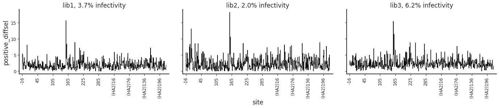


<table border="1" class="dataframe">
  <thead>
    <tr style="text-align: right;">
      <th>sample</th>
      <th>lib1, 3.7% infectivity</th>
      <th>lib2, 2.0% infectivity</th>
      <th>lib3, 6.2% infectivity</th>
    </tr>
    <tr>
      <th>sample</th>
      <th></th>
      <th></th>
      <th></th>
    </tr>
  </thead>
  <tbody>
    <tr>
      <th>lib1, 3.7% infectivity</th>
      <td>1.000</td>
      <td>0.439</td>
      <td>0.396</td>
    </tr>
    <tr>
      <th>lib2, 2.0% infectivity</th>
      <td>0.439</td>
      <td>1.000</td>
      <td>0.380</td>
    </tr>
    <tr>
      <th>lib3, 6.2% infectivity</th>
      <td>0.396</td>
      <td>0.380</td>
      <td>1.000</td>
    </tr>
  </tbody>
</table>


    
    
    ******************* 2009-age-53-plus-2-months *******************


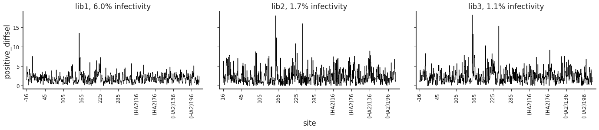


<table border="1" class="dataframe">
  <thead>
    <tr style="text-align: right;">
      <th>sample</th>
      <th>lib1, 6.0% infectivity</th>
      <th>lib2, 1.7% infectivity</th>
      <th>lib3, 1.1% infectivity</th>
    </tr>
    <tr>
      <th>sample</th>
      <th></th>
      <th></th>
      <th></th>
    </tr>
  </thead>
  <tbody>
    <tr>
      <th>lib1, 6.0% infectivity</th>
      <td>1.000</td>
      <td>0.446</td>
      <td>0.451</td>
    </tr>
    <tr>
      <th>lib2, 1.7% infectivity</th>
      <td>0.446</td>
      <td>1.000</td>
      <td>0.434</td>
    </tr>
    <tr>
      <th>lib3, 1.1% infectivity</th>
      <td>0.451</td>
      <td>0.434</td>
      <td>1.000</td>
    </tr>
  </tbody>
</table>


    
    
    ******************* 2009-age-64 *******************


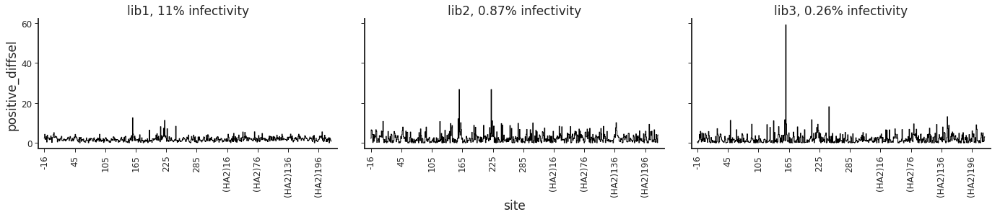


<table border="1" class="dataframe">
  <thead>
    <tr style="text-align: right;">
      <th>sample</th>
      <th>lib1, 11% infectivity</th>
      <th>lib2, 0.87% infectivity</th>
      <th>lib3, 0.26% infectivity</th>
    </tr>
    <tr>
      <th>sample</th>
      <th></th>
      <th></th>
      <th></th>
    </tr>
  </thead>
  <tbody>
    <tr>
      <th>lib1, 11% infectivity</th>
      <td>1.000</td>
      <td>0.498</td>
      <td>0.473</td>
    </tr>
    <tr>
      <th>lib2, 0.87% infectivity</th>
      <td>0.498</td>
      <td>1.000</td>
      <td>0.438</td>
    </tr>
    <tr>
      <th>lib3, 0.26% infectivity</th>
      <td>0.473</td>
      <td>0.438</td>
      <td>1.000</td>
    </tr>
  </tbody>
</table>


    
    
    ******************* 2009-age-65 *******************


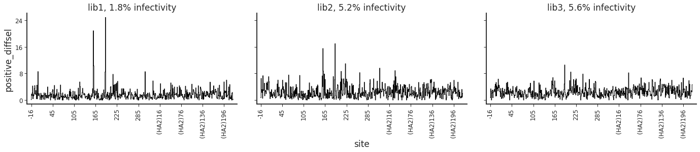


<table border="1" class="dataframe">
  <thead>
    <tr style="text-align: right;">
      <th>sample</th>
      <th>lib1, 1.8% infectivity</th>
      <th>lib2, 5.2% infectivity</th>
      <th>lib3, 5.6% infectivity</th>
    </tr>
    <tr>
      <th>sample</th>
      <th></th>
      <th></th>
      <th></th>
    </tr>
  </thead>
  <tbody>
    <tr>
      <th>lib1, 1.8% infectivity</th>
      <td>1.000</td>
      <td>0.491</td>
      <td>0.356</td>
    </tr>
    <tr>
      <th>lib2, 5.2% infectivity</th>
      <td>0.491</td>
      <td>1.000</td>
      <td>0.370</td>
    </tr>
    <tr>
      <th>lib3, 5.6% infectivity</th>
      <td>0.356</td>
      <td>0.370</td>
      <td>1.000</td>
    </tr>
  </tbody>
</table>


    
    
    ******************* 2009-age-65-with-hi-4F03 *******************


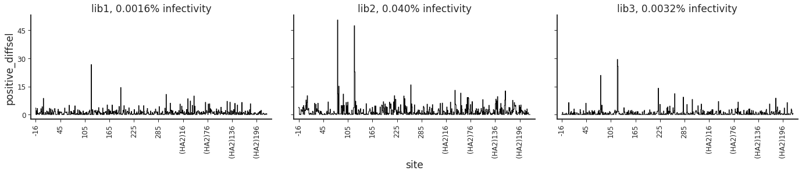


<table border="1" class="dataframe">
  <thead>
    <tr style="text-align: right;">
      <th>sample</th>
      <th>lib1, 0.0016% infectivity</th>
      <th>lib2, 0.040% infectivity</th>
      <th>lib3, 0.0032% infectivity</th>
    </tr>
    <tr>
      <th>sample</th>
      <th></th>
      <th></th>
      <th></th>
    </tr>
  </thead>
  <tbody>
    <tr>
      <th>lib1, 0.0016% infectivity</th>
      <td>1.000</td>
      <td>0.327</td>
      <td>0.346</td>
    </tr>
    <tr>
      <th>lib2, 0.040% infectivity</th>
      <td>0.327</td>
      <td>1.000</td>
      <td>0.632</td>
    </tr>
    <tr>
      <th>lib3, 0.0032% infectivity</th>
      <td>0.346</td>
      <td>0.632</td>
      <td>1.000</td>
    </tr>
  </tbody>
</table>


    
    
    ******************* 2009-age-65-with-low-4F03 *******************


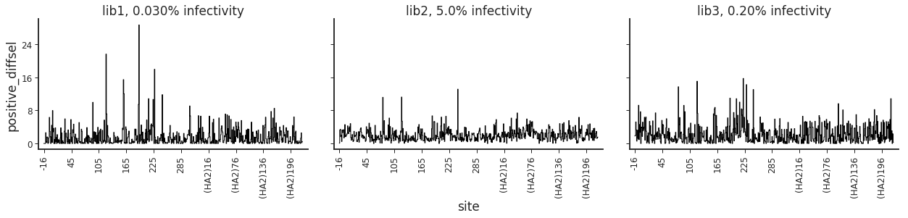


<table border="1" class="dataframe">
  <thead>
    <tr style="text-align: right;">
      <th>sample</th>
      <th>lib1, 0.030% infectivity</th>
      <th>lib2, 5.0% infectivity</th>
      <th>lib3, 0.20% infectivity</th>
    </tr>
    <tr>
      <th>sample</th>
      <th></th>
      <th></th>
      <th></th>
    </tr>
  </thead>
  <tbody>
    <tr>
      <th>lib1, 0.030% infectivity</th>
      <td>1.000</td>
      <td>0.409</td>
      <td>0.381</td>
    </tr>
    <tr>
      <th>lib2, 5.0% infectivity</th>
      <td>0.409</td>
      <td>1.000</td>
      <td>0.500</td>
    </tr>
    <tr>
      <th>lib3, 0.20% infectivity</th>
      <td>0.381</td>
      <td>0.500</td>
      <td>1.000</td>
    </tr>
  </tbody>
</table>


    
    
    ******************* 2009-age-65-with-mid-4F03 *******************


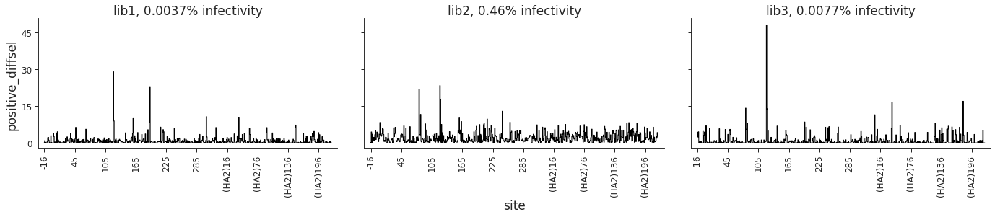


<table border="1" class="dataframe">
  <thead>
    <tr style="text-align: right;">
      <th>sample</th>
      <th>lib1, 0.0037% infectivity</th>
      <th>lib2, 0.46% infectivity</th>
      <th>lib3, 0.0077% infectivity</th>
    </tr>
    <tr>
      <th>sample</th>
      <th></th>
      <th></th>
      <th></th>
    </tr>
  </thead>
  <tbody>
    <tr>
      <th>lib1, 0.0037% infectivity</th>
      <td>1.000</td>
      <td>0.407</td>
      <td>0.476</td>
    </tr>
    <tr>
      <th>lib2, 0.46% infectivity</th>
      <td>0.407</td>
      <td>1.000</td>
      <td>0.512</td>
    </tr>
    <tr>
      <th>lib3, 0.0077% infectivity</th>
      <td>0.476</td>
      <td>0.512</td>
      <td>1.000</td>
    </tr>
  </tbody>
</table>


    
    
    ******************* 2010-age-21 *******************


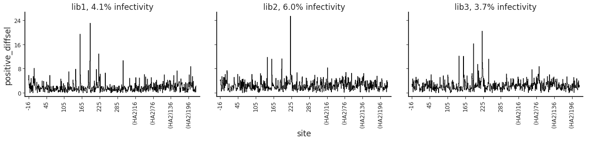


<table border="1" class="dataframe">
  <thead>
    <tr style="text-align: right;">
      <th>sample</th>
      <th>lib1, 4.1% infectivity</th>
      <th>lib2, 6.0% infectivity</th>
      <th>lib3, 3.7% infectivity</th>
    </tr>
    <tr>
      <th>sample</th>
      <th></th>
      <th></th>
      <th></th>
    </tr>
  </thead>
  <tbody>
    <tr>
      <th>lib1, 4.1% infectivity</th>
      <td>1.000</td>
      <td>0.518</td>
      <td>0.539</td>
    </tr>
    <tr>
      <th>lib2, 6.0% infectivity</th>
      <td>0.518</td>
      <td>1.000</td>
      <td>0.614</td>
    </tr>
    <tr>
      <th>lib3, 3.7% infectivity</th>
      <td>0.539</td>
      <td>0.614</td>
      <td>1.000</td>
    </tr>
  </tbody>
</table>


    
    
    ******************* 2015-age-25-prevacc *******************


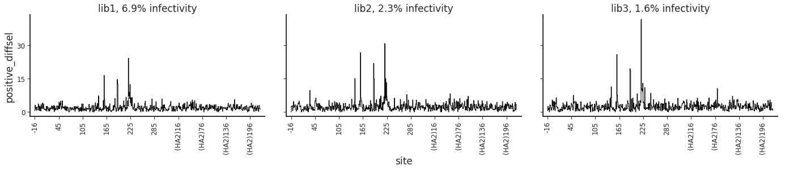


<table border="1" class="dataframe">
  <thead>
    <tr style="text-align: right;">
      <th>sample</th>
      <th>lib1, 6.9% infectivity</th>
      <th>lib2, 2.3% infectivity</th>
      <th>lib3, 1.6% infectivity</th>
    </tr>
    <tr>
      <th>sample</th>
      <th></th>
      <th></th>
      <th></th>
    </tr>
  </thead>
  <tbody>
    <tr>
      <th>lib1, 6.9% infectivity</th>
      <td>1.000</td>
      <td>0.753</td>
      <td>0.763</td>
    </tr>
    <tr>
      <th>lib2, 2.3% infectivity</th>
      <td>0.753</td>
      <td>1.000</td>
      <td>0.757</td>
    </tr>
    <tr>
      <th>lib3, 1.6% infectivity</th>
      <td>0.763</td>
      <td>0.757</td>
      <td>1.000</td>
    </tr>
  </tbody>
</table>


    
    
    ******************* 2015-age-25-vacc *******************


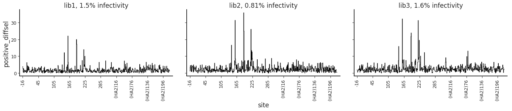


<table border="1" class="dataframe">
  <thead>
    <tr style="text-align: right;">
      <th>sample</th>
      <th>lib1, 1.5% infectivity</th>
      <th>lib2, 0.81% infectivity</th>
      <th>lib3, 1.6% infectivity</th>
    </tr>
    <tr>
      <th>sample</th>
      <th></th>
      <th></th>
      <th></th>
    </tr>
  </thead>
  <tbody>
    <tr>
      <th>lib1, 1.5% infectivity</th>
      <td>1.000</td>
      <td>0.708</td>
      <td>0.693</td>
    </tr>
    <tr>
      <th>lib2, 0.81% infectivity</th>
      <td>0.708</td>
      <td>1.000</td>
      <td>0.747</td>
    </tr>
    <tr>
      <th>lib3, 1.6% infectivity</th>
      <td>0.693</td>
      <td>0.747</td>
      <td>1.000</td>
    </tr>
  </tbody>
</table>


    
    
    ******************* 2015-age-29-prevacc *******************


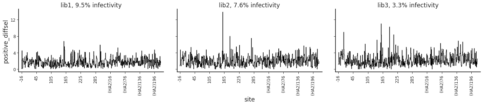


<table border="1" class="dataframe">
  <thead>
    <tr style="text-align: right;">
      <th>sample</th>
      <th>lib1, 9.5% infectivity</th>
      <th>lib2, 7.6% infectivity</th>
      <th>lib3, 3.3% infectivity</th>
    </tr>
    <tr>
      <th>sample</th>
      <th></th>
      <th></th>
      <th></th>
    </tr>
  </thead>
  <tbody>
    <tr>
      <th>lib1, 9.5% infectivity</th>
      <td>1.000</td>
      <td>0.356</td>
      <td>0.385</td>
    </tr>
    <tr>
      <th>lib2, 7.6% infectivity</th>
      <td>0.356</td>
      <td>1.000</td>
      <td>0.468</td>
    </tr>
    <tr>
      <th>lib3, 3.3% infectivity</th>
      <td>0.385</td>
      <td>0.468</td>
      <td>1.000</td>
    </tr>
  </tbody>
</table>


    
    
    ******************* 2015-age-29-vacc *******************


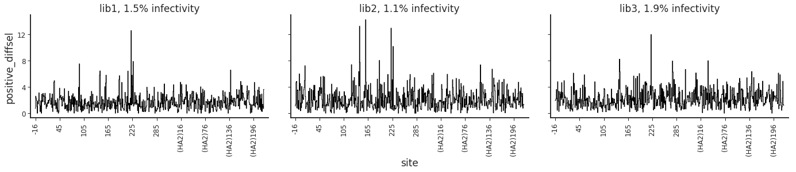


<table border="1" class="dataframe">
  <thead>
    <tr style="text-align: right;">
      <th>sample</th>
      <th>lib1, 1.5% infectivity</th>
      <th>lib2, 1.1% infectivity</th>
      <th>lib3, 1.9% infectivity</th>
    </tr>
    <tr>
      <th>sample</th>
      <th></th>
      <th></th>
      <th></th>
    </tr>
  </thead>
  <tbody>
    <tr>
      <th>lib1, 1.5% infectivity</th>
      <td>1.000</td>
      <td>0.457</td>
      <td>0.309</td>
    </tr>
    <tr>
      <th>lib2, 1.1% infectivity</th>
      <td>0.457</td>
      <td>1.000</td>
      <td>0.340</td>
    </tr>
    <tr>
      <th>lib3, 1.9% infectivity</th>
      <td>0.309</td>
      <td>0.340</td>
      <td>1.000</td>
    </tr>
  </tbody>
</table>


    
    
    ******************* 2015-age-48-prevacc *******************


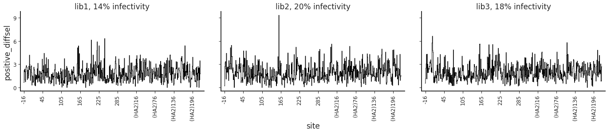


<table border="1" class="dataframe">
  <thead>
    <tr style="text-align: right;">
      <th>sample</th>
      <th>lib1, 14% infectivity</th>
      <th>lib2, 20% infectivity</th>
      <th>lib3, 18% infectivity</th>
    </tr>
    <tr>
      <th>sample</th>
      <th></th>
      <th></th>
      <th></th>
    </tr>
  </thead>
  <tbody>
    <tr>
      <th>lib1, 14% infectivity</th>
      <td>1.000</td>
      <td>0.320</td>
      <td>0.345</td>
    </tr>
    <tr>
      <th>lib2, 20% infectivity</th>
      <td>0.320</td>
      <td>1.000</td>
      <td>0.413</td>
    </tr>
    <tr>
      <th>lib3, 18% infectivity</th>
      <td>0.345</td>
      <td>0.413</td>
      <td>1.000</td>
    </tr>
  </tbody>
</table>


    
    
    ******************* 2015-age-48-vacc *******************


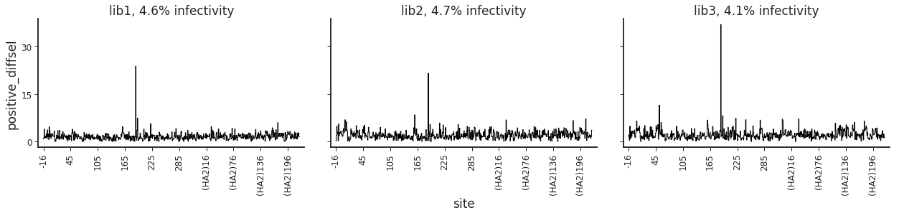


<table border="1" class="dataframe">
  <thead>
    <tr style="text-align: right;">
      <th>sample</th>
      <th>lib1, 4.6% infectivity</th>
      <th>lib2, 4.7% infectivity</th>
      <th>lib3, 4.1% infectivity</th>
    </tr>
    <tr>
      <th>sample</th>
      <th></th>
      <th></th>
      <th></th>
    </tr>
  </thead>
  <tbody>
    <tr>
      <th>lib1, 4.6% infectivity</th>
      <td>1.000</td>
      <td>0.578</td>
      <td>0.668</td>
    </tr>
    <tr>
      <th>lib2, 4.7% infectivity</th>
      <td>0.578</td>
      <td>1.000</td>
      <td>0.571</td>
    </tr>
    <tr>
      <th>lib3, 4.1% infectivity</th>
      <td>0.668</td>
      <td>0.571</td>
      <td>1.000</td>
    </tr>
  </tbody>
</table>


    
    
    ******************* 2015-age-49-prevacc *******************


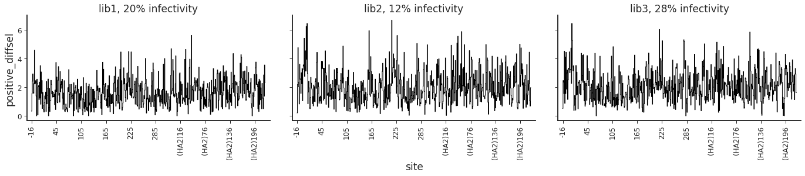


<table border="1" class="dataframe">
  <thead>
    <tr style="text-align: right;">
      <th>sample</th>
      <th>lib1, 20% infectivity</th>
      <th>lib2, 12% infectivity</th>
      <th>lib3, 28% infectivity</th>
    </tr>
    <tr>
      <th>sample</th>
      <th></th>
      <th></th>
      <th></th>
    </tr>
  </thead>
  <tbody>
    <tr>
      <th>lib1, 20% infectivity</th>
      <td>1.000</td>
      <td>0.394</td>
      <td>0.371</td>
    </tr>
    <tr>
      <th>lib2, 12% infectivity</th>
      <td>0.394</td>
      <td>1.000</td>
      <td>0.376</td>
    </tr>
    <tr>
      <th>lib3, 28% infectivity</th>
      <td>0.371</td>
      <td>0.376</td>
      <td>1.000</td>
    </tr>
  </tbody>
</table>


    
    
    ******************* 2015-age-49-vacc *******************


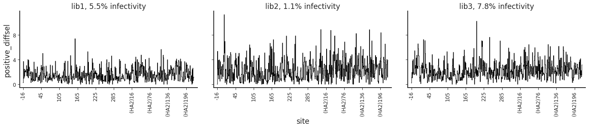


<table border="1" class="dataframe">
  <thead>
    <tr style="text-align: right;">
      <th>sample</th>
      <th>lib1, 5.5% infectivity</th>
      <th>lib2, 1.1% infectivity</th>
      <th>lib3, 7.8% infectivity</th>
    </tr>
    <tr>
      <th>sample</th>
      <th></th>
      <th></th>
      <th></th>
    </tr>
  </thead>
  <tbody>
    <tr>
      <th>lib1, 5.5% infectivity</th>
      <td>1.000</td>
      <td>0.375</td>
      <td>0.388</td>
    </tr>
    <tr>
      <th>lib2, 1.1% infectivity</th>
      <td>0.375</td>
      <td>1.000</td>
      <td>0.449</td>
    </tr>
    <tr>
      <th>lib3, 7.8% infectivity</th>
      <td>0.388</td>
      <td>0.449</td>
      <td>1.000</td>
    </tr>
  </tbody>
</table>


    
    
    ******************* antibody-1C04 *******************


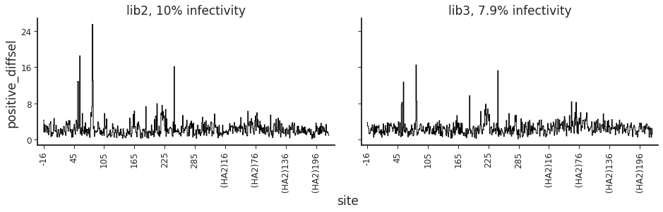


<table border="1" class="dataframe">
  <thead>
    <tr style="text-align: right;">
      <th>sample</th>
      <th>lib2, 10% infectivity</th>
      <th>lib3, 7.9% infectivity</th>
    </tr>
    <tr>
      <th>sample</th>
      <th></th>
      <th></th>
    </tr>
  </thead>
  <tbody>
    <tr>
      <th>lib2, 10% infectivity</th>
      <td>1.000</td>
      <td>0.732</td>
    </tr>
    <tr>
      <th>lib3, 7.9% infectivity</th>
      <td>0.732</td>
      <td>1.000</td>
    </tr>
  </tbody>
</table>


    
    
    ******************* antibody-3C04 *******************


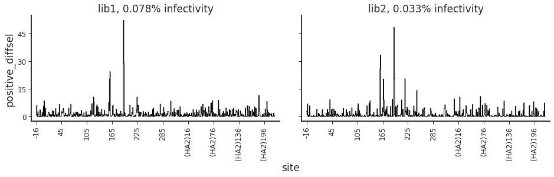


<table border="1" class="dataframe">
  <thead>
    <tr style="text-align: right;">
      <th>sample</th>
      <th>lib1, 0.078% infectivity</th>
      <th>lib2, 0.033% infectivity</th>
    </tr>
    <tr>
      <th>sample</th>
      <th></th>
      <th></th>
    </tr>
  </thead>
  <tbody>
    <tr>
      <th>lib1, 0.078% infectivity</th>
      <td>1.000</td>
      <td>0.647</td>
    </tr>
    <tr>
      <th>lib2, 0.033% infectivity</th>
      <td>0.647</td>
      <td>1.000</td>
    </tr>
  </tbody>
</table>


    
    
    ******************* antibody-3C06 *******************


<table border="1" class="dataframe">
  <thead>
    <tr style="text-align: right;">
      <th>sample</th>
      <th>lib1, 0.069% infectivity</th>
      <th>lib2, 0.010% infectivity</th>
    </tr>
    <tr>
      <th>sample</th>
      <th></th>
      <th></th>
    </tr>
  </thead>
  <tbody>
    <tr>
      <th>lib1, 0.069% infectivity</th>
      <td>1.000</td>
      <td>0.576</td>
    </tr>
    <tr>
      <th>lib2, 0.010% infectivity</th>
      <td>0.576</td>
      <td>1.000</td>
    </tr>
  </tbody>
</table>


    
    
    ******************* antibody-4C01 *******************


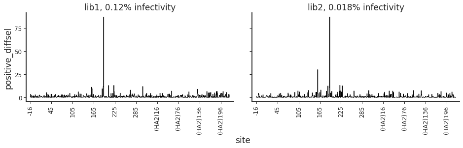


<table border="1" class="dataframe">
  <thead>
    <tr style="text-align: right;">
      <th>sample</th>
      <th>lib1, 0.12% infectivity</th>
      <th>lib2, 0.018% infectivity</th>
    </tr>
    <tr>
      <th>sample</th>
      <th></th>
      <th></th>
    </tr>
  </thead>
  <tbody>
    <tr>
      <th>lib1, 0.12% infectivity</th>
      <td>1.000</td>
      <td>0.822</td>
    </tr>
    <tr>
      <th>lib2, 0.018% infectivity</th>
      <td>0.822</td>
      <td>1.000</td>
    </tr>
  </tbody>
</table>


    
    
    ******************* antibody-4F03 *******************


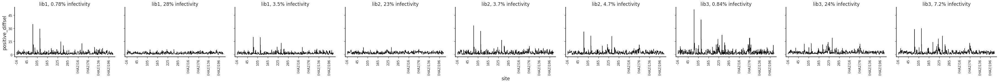


<table border="1" class="dataframe">
  <thead>
    <tr style="text-align: right;">
      <th>sample</th>
      <th>lib1, 0.78% infectivity</th>
      <th>lib1, 28% infectivity</th>
      <th>lib1, 3.5% infectivity</th>
      <th>lib2, 23% infectivity</th>
      <th>lib2, 3.7% infectivity</th>
      <th>lib2, 4.7% infectivity</th>
      <th>lib3, 0.84% infectivity</th>
      <th>lib3, 24% infectivity</th>
      <th>lib3, 7.2% infectivity</th>
    </tr>
    <tr>
      <th>sample</th>
      <th></th>
      <th></th>
      <th></th>
      <th></th>
      <th></th>
      <th></th>
      <th></th>
      <th></th>
      <th></th>
    </tr>
  </thead>
  <tbody>
    <tr>
      <th>lib1, 0.78% infectivity</th>
      <td>1.000</td>
      <td>0.293</td>
      <td>0.850</td>
      <td>0.412</td>
      <td>0.792</td>
      <td>0.718</td>
      <td>0.768</td>
      <td>0.507</td>
      <td>0.728</td>
    </tr>
    <tr>
      <th>lib1, 28% infectivity</th>
      <td>0.293</td>
      <td>1.000</td>
      <td>0.395</td>
      <td>0.357</td>
      <td>0.368</td>
      <td>0.370</td>
      <td>0.326</td>
      <td>0.379</td>
      <td>0.388</td>
    </tr>
    <tr>
      <th>lib1, 3.5% infectivity</th>
      <td>0.850</td>
      <td>0.395</td>
      <td>1.000</td>
      <td>0.451</td>
      <td>0.745</td>
      <td>0.720</td>
      <td>0.731</td>
      <td>0.578</td>
      <td>0.743</td>
    </tr>
    <tr>
      <th>lib2, 23% infectivity</th>
      <td>0.412</td>
      <td>0.357</td>
      <td>0.451</td>
      <td>1.000</td>
      <td>0.576</td>
      <td>0.630</td>
      <td>0.459</td>
      <td>0.533</td>
      <td>0.506</td>
    </tr>
    <tr>
      <th>lib2, 3.7% infectivity</th>
      <td>0.792</td>
      <td>0.368</td>
      <td>0.745</td>
      <td>0.576</td>
      <td>1.000</td>
      <td>0.819</td>
      <td>0.761</td>
      <td>0.576</td>
      <td>0.744</td>
    </tr>
    <tr>
      <th>lib2, 4.7% infectivity</th>
      <td>0.718</td>
      <td>0.370</td>
      <td>0.720</td>
      <td>0.630</td>
      <td>0.819</td>
      <td>1.000</td>
      <td>0.786</td>
      <td>0.688</td>
      <td>0.806</td>
    </tr>
    <tr>
      <th>lib3, 0.84% infectivity</th>
      <td>0.768</td>
      <td>0.326</td>
      <td>0.731</td>
      <td>0.459</td>
      <td>0.761</td>
      <td>0.786</td>
      <td>1.000</td>
      <td>0.687</td>
      <td>0.846</td>
    </tr>
    <tr>
      <th>lib3, 24% infectivity</th>
      <td>0.507</td>
      <td>0.379</td>
      <td>0.578</td>
      <td>0.533</td>
      <td>0.576</td>
      <td>0.688</td>
      <td>0.687</td>
      <td>1.000</td>
      <td>0.799</td>
    </tr>
    <tr>
      <th>lib3, 7.2% infectivity</th>
      <td>0.728</td>
      <td>0.388</td>
      <td>0.743</td>
      <td>0.506</td>
      <td>0.744</td>
      <td>0.806</td>
      <td>0.846</td>
      <td>0.799</td>
      <td>1.000</td>
    </tr>
  </tbody>
</table>


    
    
    ******************* antibody-5A01 *******************


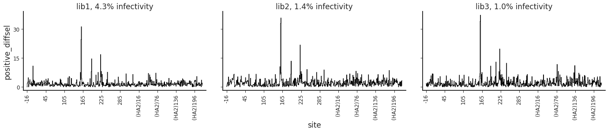


<table border="1" class="dataframe">
  <thead>
    <tr style="text-align: right;">
      <th>sample</th>
      <th>lib1, 4.3% infectivity</th>
      <th>lib2, 1.4% infectivity</th>
      <th>lib3, 1.0% infectivity</th>
    </tr>
    <tr>
      <th>sample</th>
      <th></th>
      <th></th>
      <th></th>
    </tr>
  </thead>
  <tbody>
    <tr>
      <th>lib1, 4.3% infectivity</th>
      <td>1.000</td>
      <td>0.762</td>
      <td>0.705</td>
    </tr>
    <tr>
      <th>lib2, 1.4% infectivity</th>
      <td>0.762</td>
      <td>1.000</td>
      <td>0.717</td>
    </tr>
    <tr>
      <th>lib3, 1.0% infectivity</th>
      <td>0.705</td>
      <td>0.717</td>
      <td>1.000</td>
    </tr>
  </tbody>
</table>


    
    
    ******************* ferret-Pitt-1-postinf *******************


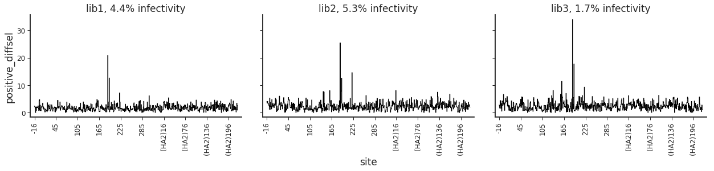


<table border="1" class="dataframe">
  <thead>
    <tr style="text-align: right;">
      <th>sample</th>
      <th>lib1, 4.4% infectivity</th>
      <th>lib2, 5.3% infectivity</th>
      <th>lib3, 1.7% infectivity</th>
    </tr>
    <tr>
      <th>sample</th>
      <th></th>
      <th></th>
      <th></th>
    </tr>
  </thead>
  <tbody>
    <tr>
      <th>lib1, 4.4% infectivity</th>
      <td>1.000</td>
      <td>0.517</td>
      <td>0.58</td>
    </tr>
    <tr>
      <th>lib2, 5.3% infectivity</th>
      <td>0.517</td>
      <td>1.000</td>
      <td>0.58</td>
    </tr>
    <tr>
      <th>lib3, 1.7% infectivity</th>
      <td>0.580</td>
      <td>0.580</td>
      <td>1.00</td>
    </tr>
  </tbody>
</table>


    
    
    ******************* ferret-Pitt-1-preinf *******************


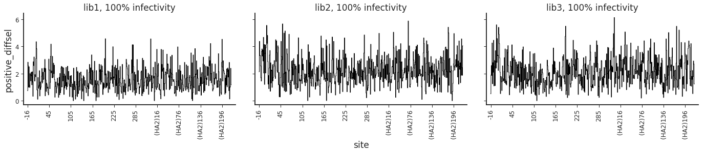


<table border="1" class="dataframe">
  <thead>
    <tr style="text-align: right;">
      <th>sample</th>
      <th>lib1, 100% infectivity</th>
      <th>lib2, 100% infectivity</th>
      <th>lib3, 100% infectivity</th>
    </tr>
    <tr>
      <th>sample</th>
      <th></th>
      <th></th>
      <th></th>
    </tr>
  </thead>
  <tbody>
    <tr>
      <th>lib1, 100% infectivity</th>
      <td>1.000</td>
      <td>0.248</td>
      <td>0.327</td>
    </tr>
    <tr>
      <th>lib2, 100% infectivity</th>
      <td>0.248</td>
      <td>1.000</td>
      <td>0.231</td>
    </tr>
    <tr>
      <th>lib3, 100% infectivity</th>
      <td>0.327</td>
      <td>0.231</td>
      <td>1.000</td>
    </tr>
  </tbody>
</table>


    
    
    ******************* ferret-Pitt-2-postinf *******************


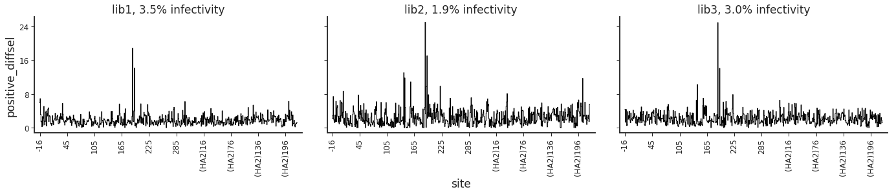


<table border="1" class="dataframe">
  <thead>
    <tr style="text-align: right;">
      <th>sample</th>
      <th>lib1, 3.5% infectivity</th>
      <th>lib2, 1.9% infectivity</th>
      <th>lib3, 3.0% infectivity</th>
    </tr>
    <tr>
      <th>sample</th>
      <th></th>
      <th></th>
      <th></th>
    </tr>
  </thead>
  <tbody>
    <tr>
      <th>lib1, 3.5% infectivity</th>
      <td>1.000</td>
      <td>0.487</td>
      <td>0.551</td>
    </tr>
    <tr>
      <th>lib2, 1.9% infectivity</th>
      <td>0.487</td>
      <td>1.000</td>
      <td>0.509</td>
    </tr>
    <tr>
      <th>lib3, 3.0% infectivity</th>
      <td>0.551</td>
      <td>0.509</td>
      <td>1.000</td>
    </tr>
  </tbody>
</table>


    
    
    ******************* ferret-Pitt-2-preinf *******************


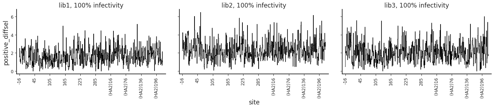


<table border="1" class="dataframe">
  <thead>
    <tr style="text-align: right;">
      <th>sample</th>
      <th>lib1, 100% infectivity</th>
      <th>lib2, 100% infectivity</th>
      <th>lib3, 100% infectivity</th>
    </tr>
    <tr>
      <th>sample</th>
      <th></th>
      <th></th>
      <th></th>
    </tr>
  </thead>
  <tbody>
    <tr>
      <th>lib1, 100% infectivity</th>
      <td>1.00</td>
      <td>0.260</td>
      <td>0.270</td>
    </tr>
    <tr>
      <th>lib2, 100% infectivity</th>
      <td>0.26</td>
      <td>1.000</td>
      <td>0.328</td>
    </tr>
    <tr>
      <th>lib3, 100% infectivity</th>
      <td>0.27</td>
      <td>0.328</td>
      <td>1.000</td>
    </tr>
  </tbody>
</table>


    
    
    ******************* ferret-Pitt-3-postinf *******************


<table border="1" class="dataframe">
  <thead>
    <tr style="text-align: right;">
      <th>sample</th>
      <th>lib1, 8.8% infectivity</th>
      <th>lib2, 1.7% infectivity</th>
      <th>lib3, 5.8% infectivity</th>
    </tr>
    <tr>
      <th>sample</th>
      <th></th>
      <th></th>
      <th></th>
    </tr>
  </thead>
  <tbody>
    <tr>
      <th>lib1, 8.8% infectivity</th>
      <td>1.000</td>
      <td>0.589</td>
      <td>0.563</td>
    </tr>
    <tr>
      <th>lib2, 1.7% infectivity</th>
      <td>0.589</td>
      <td>1.000</td>
      <td>0.629</td>
    </tr>
    <tr>
      <th>lib3, 5.8% infectivity</th>
      <td>0.563</td>
      <td>0.629</td>
      <td>1.000</td>
    </tr>
  </tbody>
</table>


    
    
    ******************* ferret-Pitt-3-preinf *******************


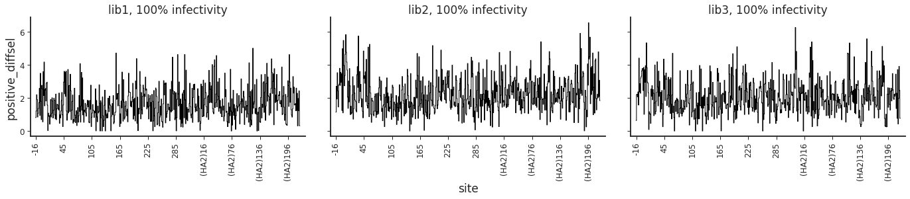


<table border="1" class="dataframe">
  <thead>
    <tr style="text-align: right;">
      <th>sample</th>
      <th>lib1, 100% infectivity</th>
      <th>lib2, 100% infectivity</th>
      <th>lib3, 100% infectivity</th>
    </tr>
    <tr>
      <th>sample</th>
      <th></th>
      <th></th>
      <th></th>
    </tr>
  </thead>
  <tbody>
    <tr>
      <th>lib1, 100% infectivity</th>
      <td>1.000</td>
      <td>0.286</td>
      <td>0.346</td>
    </tr>
    <tr>
      <th>lib2, 100% infectivity</th>
      <td>0.286</td>
      <td>1.000</td>
      <td>0.336</td>
    </tr>
    <tr>
      <th>lib3, 100% infectivity</th>
      <td>0.346</td>
      <td>0.336</td>
      <td>1.000</td>
    </tr>
  </tbody>
</table>


    
    
    ******************* ferret-WHO *******************


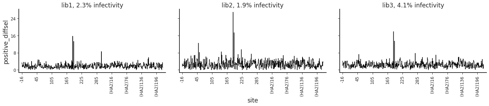


<table border="1" class="dataframe">
  <thead>
    <tr style="text-align: right;">
      <th>sample</th>
      <th>lib1, 2.3% infectivity</th>
      <th>lib2, 1.9% infectivity</th>
      <th>lib3, 4.1% infectivity</th>
    </tr>
    <tr>
      <th>sample</th>
      <th></th>
      <th></th>
      <th></th>
    </tr>
  </thead>
  <tbody>
    <tr>
      <th>lib1, 2.3% infectivity</th>
      <td>1.000</td>
      <td>0.502</td>
      <td>0.534</td>
    </tr>
    <tr>
      <th>lib2, 1.9% infectivity</th>
      <td>0.502</td>
      <td>1.000</td>
      <td>0.449</td>
    </tr>
    <tr>
      <th>lib3, 4.1% infectivity</th>
      <td>0.534</td>
      <td>0.449</td>
      <td>1.000</td>
    </tr>
  </tbody>
</table>


    
    
    ******************* ferret-WHO-Victoria2011 *******************


<table border="1" class="dataframe">
  <thead>
    <tr style="text-align: right;">
      <th>sample</th>
      <th>lib1, 1.3% infectivity</th>
      <th>lib2, 3.9% infectivity</th>
      <th>lib3, 3.6% infectivity</th>
    </tr>
    <tr>
      <th>sample</th>
      <th></th>
      <th></th>
      <th></th>
    </tr>
  </thead>
  <tbody>
    <tr>
      <th>lib1, 1.3% infectivity</th>
      <td>1.000</td>
      <td>0.600</td>
      <td>0.618</td>
    </tr>
    <tr>
      <th>lib2, 3.9% infectivity</th>
      <td>0.600</td>
      <td>1.000</td>
      <td>0.631</td>
    </tr>
    <tr>
      <th>lib3, 3.6% infectivity</th>
      <td>0.618</td>
      <td>0.631</td>
      <td>1.000</td>
    </tr>
  </tbody>
</table>


#### Choose samples to retain based on infectivity remaining
From the plots and correlations immediately above, several things are apparent:
 1. Different samples with the **same** virus library tend to be substantially more correlated than samples between different virus libraries.
    This makes sense, as some of the noise probably comes from library composition differences in terms of variant abundance.
    This fact implies that we want to keep just one (or the same number) of samples from each library, so that when we take means / medians across samples they are not disproportionately influenced by a single library.
 2. The "best" concentration of serum appears to be one that leaves about about 1% to 5% of the viral infectivity remaining. 
    This is judged by the fact that samples with this percent infectivity remaining tend to look "cleanest" in the line plots of site differential selection, and also tend to correlate best with samples from another library.
    
Based on the above, we will filter our samples down to those that have closest to the target amount of viral infectivity remaining.
Because we qualitatively estimated above that the best results are obtained when between 1% to 5% of infectivity is remaining, we will target 2% infectivity.
Then for any library / serum with multiple samples, we will retain the one that is closest (in log space) to that target infectivity.
We do this in log space because in linear space, 0% infectivity would be closer to 2% infectivity as would 6% infectivity--even though the latter is clearly preferable if our target is 2%.


```python
target_infectivity = 2
print(f"Choosing samples closest to {target_infectivity:.2f}% infectivity.")
```

    Choosing samples closest to 2.00% infectivity.


Mark the samples to retain by adding a *retained* column to both the *selections* and *sel_df* data frames, and flagging it as *True* only for the sample for that serum and library that has the smallest log-space distance to the target infectivity:


```python
selections = (
    selections
    .assign(retained=lambda x: x.assign(dist=lambda y: (y.percent_infectivity /
                                                        target_infectivity)
                                        .apply(math.log).apply(abs))
            .groupby(['serum_name_formatted', 'library'])
            ['dist']
            .transform(lambda y: y <= y.min())
            )
    )
print(f"Retaining {len(selections.query('retained'))} of {len(selections)}")

sel_df = sel_df.merge(selections[['serum_name_formatted', 'name', 'retained']],
                      validate='many_to_one')
```

    Retaining 86 of 92


Plot the samples to retain and their percent infectivity.
In the plot below, the dashed horizontal line indicates the target percent infectivity, and the colors of the points indicate which sample we retained for each serum / library:


```python
p = (ggplot(selections.assign(xlabel=lambda x: (x['serum_name_formatted'] +
                                                ', ' + x['library'])),
               aes('xlabel', 'percent_infectivity', color='retained')) +
     geom_point(size=3, alpha=0.7) +
     theme(
         axis_text_x=element_text(angle=90),
         figure_size=(0.25 * len(selections.groupby(['serum_name_formatted',
                                                     'library'])), 2.5)
         ) +
     scale_y_log10(name='percent infectivity') +
     xlab('') +
     scale_color_manual(values=PALETTE) +
     geom_hline(yintercept=target_infectivity, linetype='dashed',
                   alpha=0.7, color=PALETTE[2])
     )

_ = p.draw()
```


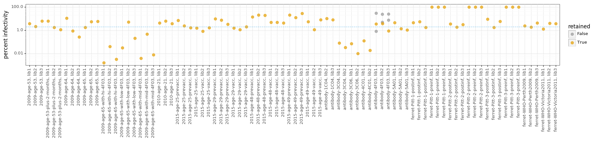


#### Listing of retained samples
Here is a small table listing the samples that we retained for each serum, and their percent infectivity remaining:


```python
display(HTML(selections
             .assign(serum_name=lambda x:
                     pd.Categorical(x['serum_name'],
                                    sera['serum_name'],
                                    ordered=True))
             .query('retained')
             .sort_values('serum_name')
             [['serum_group', 'serum_name_formatted', 'library',
               'percent_infectivity']]
             .pivot_table(index=['serum_group', 'serum_name_formatted'],
                          columns='library',
                          values='percent_infectivity')
             .to_html()
             ))
```


<table border="1" class="dataframe">
  <thead>
    <tr style="text-align: right;">
      <th></th>
      <th>library</th>
      <th>lib1</th>
      <th>lib2</th>
      <th>lib3</th>
    </tr>
    <tr>
      <th>serum_group</th>
      <th>serum_name_formatted</th>
      <th></th>
      <th></th>
      <th></th>
    </tr>
  </thead>
  <tbody>
    <tr>
      <th rowspan="8" valign="top">Hensley_sera</th>
      <th>2015-age-25-prevacc</th>
      <td>6.9000</td>
      <td>2.3100</td>
      <td>1.5700</td>
    </tr>
    <tr>
      <th>2015-age-25-vacc</th>
      <td>1.5300</td>
      <td>0.8100</td>
      <td>1.6400</td>
    </tr>
    <tr>
      <th>2015-age-29-prevacc</th>
      <td>9.4800</td>
      <td>7.5700</td>
      <td>3.3000</td>
    </tr>
    <tr>
      <th>2015-age-29-vacc</th>
      <td>1.5400</td>
      <td>1.1100</td>
      <td>1.9200</td>
    </tr>
    <tr>
      <th>2015-age-48-prevacc</th>
      <td>13.8200</td>
      <td>20.3200</td>
      <td>18.4000</td>
    </tr>
    <tr>
      <th>2015-age-48-vacc</th>
      <td>4.5800</td>
      <td>4.6800</td>
      <td>4.0600</td>
    </tr>
    <tr>
      <th>2015-age-49-prevacc</th>
      <td>19.6200</td>
      <td>11.8600</td>
      <td>27.7400</td>
    </tr>
    <tr>
      <th>2015-age-49-vacc</th>
      <td>5.4800</td>
      <td>1.0900</td>
      <td>7.7900</td>
    </tr>
    <tr>
      <th rowspan="5" valign="top">VIDD_sera</th>
      <th>2009-age-53</th>
      <td>3.7400</td>
      <td>2.0300</td>
      <td>6.2200</td>
    </tr>
    <tr>
      <th>2009-age-53-plus-2-months</th>
      <td>5.9800</td>
      <td>1.7300</td>
      <td>1.1200</td>
    </tr>
    <tr>
      <th>2009-age-64</th>
      <td>10.7400</td>
      <td>0.8700</td>
      <td>0.2600</td>
    </tr>
    <tr>
      <th>2009-age-65</th>
      <td>1.7700</td>
      <td>5.2400</td>
      <td>5.5800</td>
    </tr>
    <tr>
      <th>2010-age-21</th>
      <td>4.0800</td>
      <td>5.9500</td>
      <td>3.6800</td>
    </tr>
    <tr>
      <th rowspan="2" valign="top">antibody_lower_head</th>
      <th>antibody-1C04</th>
      <td>NaN</td>
      <td>10.3190</td>
      <td>7.9040</td>
    </tr>
    <tr>
      <th>antibody-4F03</th>
      <td>3.4700</td>
      <td>3.7100</td>
      <td>0.8400</td>
    </tr>
    <tr>
      <th rowspan="4" valign="top">antibody_region_B</th>
      <th>antibody-3C04</th>
      <td>0.0777</td>
      <td>0.0331</td>
      <td>NaN</td>
    </tr>
    <tr>
      <th>antibody-3C06</th>
      <td>0.0688</td>
      <td>0.0100</td>
      <td>NaN</td>
    </tr>
    <tr>
      <th>antibody-4C01</th>
      <td>0.1190</td>
      <td>0.0185</td>
      <td>NaN</td>
    </tr>
    <tr>
      <th>antibody-5A01</th>
      <td>4.3200</td>
      <td>1.3600</td>
      <td>1.0200</td>
    </tr>
    <tr>
      <th rowspan="8" valign="top">ferret</th>
      <th>ferret-Pitt-1-postinf</th>
      <td>4.3600</td>
      <td>5.3500</td>
      <td>1.6900</td>
    </tr>
    <tr>
      <th>ferret-Pitt-1-preinf</th>
      <td>100.0000</td>
      <td>100.0000</td>
      <td>100.0000</td>
    </tr>
    <tr>
      <th>ferret-Pitt-2-postinf</th>
      <td>3.4500</td>
      <td>1.8800</td>
      <td>3.0400</td>
    </tr>
    <tr>
      <th>ferret-Pitt-2-preinf</th>
      <td>100.0000</td>
      <td>100.0000</td>
      <td>100.0000</td>
    </tr>
    <tr>
      <th>ferret-Pitt-3-postinf</th>
      <td>8.7700</td>
      <td>1.7000</td>
      <td>5.7800</td>
    </tr>
    <tr>
      <th>ferret-Pitt-3-preinf</th>
      <td>100.0000</td>
      <td>100.0000</td>
      <td>100.0000</td>
    </tr>
    <tr>
      <th>ferret-WHO</th>
      <td>2.3200</td>
      <td>1.8800</td>
      <td>4.1000</td>
    </tr>
    <tr>
      <th>ferret-WHO-Victoria2011</th>
      <td>1.2600</td>
      <td>3.9000</td>
      <td>3.6200</td>
    </tr>
    <tr>
      <th rowspan="3" valign="top">serum_mAb_spike</th>
      <th>2009-age-65-with-hi-4F03</th>
      <td>0.0016</td>
      <td>0.0400</td>
      <td>0.0032</td>
    </tr>
    <tr>
      <th>2009-age-65-with-low-4F03</th>
      <td>0.0300</td>
      <td>5.0000</td>
      <td>0.2040</td>
    </tr>
    <tr>
      <th>2009-age-65-with-mid-4F03</th>
      <td>0.0037</td>
      <td>0.4600</td>
      <td>0.0077</td>
    </tr>
  </tbody>
</table>


### Compute serum average from retained samples
We now compute the average selection among the retained samples for each serum.

First, confirm that we have retained just one sample per serum / library:


```python
assert all(len(group) == 1 for _, group in
           (selections
            .query('retained')
            .groupby(['serum_name_formatted', 'library'])
            )
           )
```

We can compute the "average" selection using either the mean or the median; which one to use is specified in the config file:


```python
avg_type = config['avg_type']
print(f"Computing across replicate averages as the {avg_type}")
```

    Computing across replicate averages as the median


Do a sanity check and make sure none of our libraries are named the same as the average type:


```python
assert all(avg_type not in selections[col].values for col in ['library', 'name_formatted'])
```

Now loop over all sera and compute the average selection for all retained samples for that sera.
Note that the averages are computed on the mutation-level data, and then the site data are computed from those averaged mutation-level data.
The averages (along with the samples used to compute these averages) are then added to a new data frame similar to *selections* that is called *avg_selections*:


```python
avgdir = config['avgdiffseldir']
os.makedirs(avgdir, exist_ok=True)

avg_selections = []
for serum_name_formatted, group in (
            selections
            .query('retained')
            [['serum_name_formatted', 'library', 'name_formatted'] +
             list(sera.columns) + selfilecols]
            .groupby('serum_name_formatted')
            ):

    avg_selections.append(group)

    # build row of data frame with average
    avg_row = group.iloc[0].to_dict(into=collections.OrderedDict)
    avg_row['library'] = avg_type
    avg_row['name_formatted'] = avg_type

    avg_row['mutdiffsel_file'] = (f"{avgdir}/{serum_name_formatted}-"
                                  f"mutdiffsel-{avg_type}.csv")
    (dms_tools2.diffsel.avgMutDiffSel(group['mutdiffsel_file'], avg_type)
     .to_csv(avg_row['mutdiffsel_file'], index=False))

    avg_row['sitediffsel_file'] = (f"{avgdir}/{serum_name_formatted}-"
                                   f"sitediffsel-{avg_type}.csv")
    (dms_tools2.diffsel.mutToSiteDiffSel(pd.read_csv(avg_row['mutdiffsel_file']))
     .to_csv(avg_row['sitediffsel_file'], index=False))

    avg_row = pd.Series(avg_row).to_frame().transpose()
    assert all(avg_row.columns == group.columns)
    avg_selections.append(avg_row)

# put avg_selections in data frame, sort to match config['sera']
avg_selections = (pd.concat(avg_selections)
                  .assign(serum_name=lambda x:
                          pd.Categorical(x['serum_name'],
                                         sera['serum_name'],
                                         ordered=True))
                  .sort_values(['serum_name', 'library'])
                  .assign(serum_name_formatted=lambda x:
                          pd.Categorical(x['serum_name_formatted'],
                                         x['serum_name_formatted'].unique(),
                                         ordered=True))
                  .reset_index(drop=True)
                  )
```

Now the `avg_selections` data frame lists the files giving all the retained library replicates plus the average calculated from them these replicates.

Now we create the data frame `avg_sel_df` which actually holds the site- and mutation-level averages for all sera as well as the samples (one replicate per library) that we used to compute these averages:


```python
avg_sel_df = (dms_tools2.diffsel.df_read_filecols(avg_selections, selfilecols)
              .drop(columns=selfilecols)
              # preserve order of sera as in `avg_selections`
              .assign(serum_name_formatted=lambda x:
                      pd.Categorical(x['serum_name_formatted'],
                                     (avg_selections['serum_name_formatted']
                                      .unique()),
                                     ordered=True))
              )
```

This `avg_sel_df` data frame differs from `sel_df` only in that it includes the averages as a library type, and only has the retained replicates for each library.

### Identify sites of "significant" selection
We want to identify the sites that are under "significant" immune selection.
The reason is that we can then zoom in on these sites in logo plots.

In [dms_tools2.plot.findSigSel](https://jbloomlab.github.io/dms_tools2/dms_tools2.plot.html#dms_tools2.plot.findSigSel) function, we have implemented a heuristic way to do this.
Essentially, this function fits a gamma distribution to the selection values for each site, and then identifies those that are "outliers" of high selection.

#### Cutoff for significance
First, we define a cutoff for what constitutes significant:


```python
fdr_cutoff = 0.05
```

#### Identify significant sites
Now we use [dms_tools2.plot.findSigSel](https://jbloomlab.github.io/dms_tools2/dms_tools2.plot.html#dms_tools2.plot.findSigSel) to get a dataframe (`sigsites_df`) that lists the "significant" sites for each serum.
That function finds these sites by fitting a gamma distribution to the data and then finding sites that are far outside the range of the distribution (thereby computing a heuristic P-value).
It has two methods, *robust_hist* and *mle*; we use both and take any sites found by either method.

Because the pre-vaccination and pre-infection serum generally have weak signal and the vaccination at most boosts existing specificities in the human samples that we have, we will ignore the pre-vaccination samples when identifying significant sites.

The cell below also saves plots showing the fit gamma distribution (you can inspect these separately if you want to look in more detail):


```python
os.makedirs(config['avgdiffsel_sigsites_dir'], exist_ok=True)

plotfile_template = os.path.join(config['avgdiffsel_sigsites_dir'],
                                 'sigsites_{serum}_{method}.pdf')

print(f"Identifying sites of significant selection at a FDR of {fdr_cutoff}.\n"
      f"Plots of distribution fitting saved as {plotfile_template}")

sigsites_df = []
sigsites_cols = ['serum_group', 'serum_name_formatted', 'isite', 'site',
                 'positive_diffsel']
for serum_name_formatted, group in (
        avg_sel_df
        .query('serum_vaccination != "pre"')
        .query('library == @avg_type')
        [sigsites_cols]
        .drop_duplicates()
        .groupby('serum_name_formatted', observed=True)
        ):
    
    for method in ['robust_hist', 'mle']:
        plotfile = plotfile_template.format(serum=serum_name_formatted,
                                            method=method)
        df, _, _ = dms_tools2.plot.findSigSel(
                group,
                'positive_diffsel',
                plotfile,
                fdr=fdr_cutoff,
                title=serum_name_formatted,
                method=method
                )
        sigsites_df.append(df)

sigsites_df = (pd.concat(sigsites_df, ignore_index=True)
               .groupby(sigsites_cols)
               .aggregate({'sig': 'sum'})
               .reset_index()
               .assign(sig=lambda x: x['sig'].astype(bool))
               .query('sig')
               )

print('Here are the first few rows of sigsites_df:')
display(HTML(sigsites_df.head(n=4).to_html(index=False)))
```

    Identifying sites of significant selection at a FDR of 0.05.
    Plots of distribution fitting saved as results/avgdiffsel/sigsites/sigsites_{serum}_{method}.pdf
    Here are the first few rows of sigsites_df:


<table border="1" class="dataframe">
  <thead>
    <tr style="text-align: right;">
      <th>serum_group</th>
      <th>serum_name_formatted</th>
      <th>isite</th>
      <th>site</th>
      <th>positive_diffsel</th>
      <th>sig</th>
    </tr>
  </thead>
  <tbody>
    <tr>
      <td>Hensley_sera</td>
      <td>2015-age-25-vacc</td>
      <td>160</td>
      <td>145</td>
      <td>14.630931</td>
      <td>True</td>
    </tr>
    <tr>
      <td>Hensley_sera</td>
      <td>2015-age-25-vacc</td>
      <td>174</td>
      <td>159</td>
      <td>26.089489</td>
      <td>True</td>
    </tr>
    <tr>
      <td>Hensley_sera</td>
      <td>2015-age-25-vacc</td>
      <td>175</td>
      <td>160</td>
      <td>6.151038</td>
      <td>True</td>
    </tr>
    <tr>
      <td>Hensley_sera</td>
      <td>2015-age-25-vacc</td>
      <td>176</td>
      <td>161</td>
      <td>5.219629</td>
      <td>True</td>
    </tr>
  </tbody>
</table>


#### List significant sites for each serum
Now display lists of the significant sites for each serum (we did not determine significant sites for pre-vaccination samples as described above):


```python
display(HTML(sigsites_df
             .sort_values('isite')
             .assign(nsites=1)
             .groupby('serum_name_formatted')
             .aggregate({'site': lambda x: ', '.join(list(x)),
                         'nsites': 'sum'})
             .rename(columns={'site': 'significant sites',
                              'nsites': 'number of sites'})
             .to_html()
             ))
```


<table border="1" class="dataframe">
  <thead>
    <tr style="text-align: right;">
      <th></th>
      <th>significant sites</th>
      <th>number of sites</th>
    </tr>
    <tr>
      <th>serum_name_formatted</th>
      <th></th>
      <th></th>
    </tr>
  </thead>
  <tbody>
    <tr>
      <th>antibody-5A01</th>
      <td>157, 158, 159, 160, 193, 222, 227, 244</td>
      <td>8</td>
    </tr>
    <tr>
      <th>antibody-3C04</th>
      <td>159, 160, 192, 193</td>
      <td>4</td>
    </tr>
    <tr>
      <th>antibody-3C06</th>
      <td>137, 145, 159, 160, 167, 193, 207, 244, 246</td>
      <td>9</td>
    </tr>
    <tr>
      <th>antibody-4C01</th>
      <td>193</td>
      <td>1</td>
    </tr>
    <tr>
      <th>antibody-4F03</th>
      <td>80, 81, 83, 121, 122, 220, 244, 259, (HA2)78</td>
      <td>9</td>
    </tr>
    <tr>
      <th>antibody-1C04</th>
      <td>53, 54, 57, 82, 83, 188, 210, 220, 244, (HA2)61</td>
      <td>10</td>
    </tr>
    <tr>
      <th>ferret-Pitt-1-preinf</th>
      <td></td>
      <td>0</td>
    </tr>
    <tr>
      <th>ferret-Pitt-1-postinf</th>
      <td>189, 193, 222</td>
      <td>3</td>
    </tr>
    <tr>
      <th>ferret-Pitt-2-preinf</th>
      <td></td>
      <td>0</td>
    </tr>
    <tr>
      <th>ferret-Pitt-2-postinf</th>
      <td>142, 144, 189, 193, 222</td>
      <td>5</td>
    </tr>
    <tr>
      <th>ferret-Pitt-3-preinf</th>
      <td></td>
      <td>0</td>
    </tr>
    <tr>
      <th>ferret-Pitt-3-postinf</th>
      <td>189, 193</td>
      <td>2</td>
    </tr>
    <tr>
      <th>ferret-WHO</th>
      <td>50, 189, 193</td>
      <td>3</td>
    </tr>
    <tr>
      <th>ferret-WHO-Victoria2011</th>
      <td>50, 159, 189, 193, 222, 275</td>
      <td>6</td>
    </tr>
    <tr>
      <th>2010-age-21</th>
      <td>144, 159, 193, 222</td>
      <td>4</td>
    </tr>
    <tr>
      <th>2009-age-53</th>
      <td>157, 160</td>
      <td>2</td>
    </tr>
    <tr>
      <th>2009-age-53-plus-2-months</th>
      <td>157, 160, 244</td>
      <td>3</td>
    </tr>
    <tr>
      <th>2009-age-64</th>
      <td>159, 222, 244</td>
      <td>3</td>
    </tr>
    <tr>
      <th>2009-age-65</th>
      <td>159, 160, 193</td>
      <td>3</td>
    </tr>
    <tr>
      <th>2015-age-25-prevacc</th>
      <td></td>
      <td>0</td>
    </tr>
    <tr>
      <th>2015-age-25-vacc</th>
      <td>145, 159, 160, 161, 192, 193, 207, 220, 222, 224, 225, 244</td>
      <td>12</td>
    </tr>
    <tr>
      <th>2015-age-29-prevacc</th>
      <td></td>
      <td>0</td>
    </tr>
    <tr>
      <th>2015-age-29-vacc</th>
      <td>144, 145, 159, 160, 222, 227</td>
      <td>6</td>
    </tr>
    <tr>
      <th>2015-age-48-prevacc</th>
      <td></td>
      <td>0</td>
    </tr>
    <tr>
      <th>2015-age-48-vacc</th>
      <td>189</td>
      <td>1</td>
    </tr>
    <tr>
      <th>2015-age-49-prevacc</th>
      <td></td>
      <td>0</td>
    </tr>
    <tr>
      <th>2015-age-49-vacc</th>
      <td></td>
      <td>0</td>
    </tr>
    <tr>
      <th>2009-age-65-with-low-4F03</th>
      <td>80, 121, 159, 160, 193, 244</td>
      <td>6</td>
    </tr>
    <tr>
      <th>2009-age-65-with-mid-4F03</th>
      <td>121</td>
      <td>1</td>
    </tr>
    <tr>
      <th>2009-age-65-with-hi-4F03</th>
      <td></td>
      <td>0</td>
    </tr>
  </tbody>
</table>


#### Get significant sites for each serum group
In the analyses below, we may want to plot the sites that are significant within at least one serum sample for each serum group.
Therefore, we determine the significant sites within each serum group:


```python
sigsites_by_serumgroup = (
    sigsites_df
    [['serum_group', 'isite', 'site']]
    .drop_duplicates()
    .sort_values('isite')
    .groupby('serum_group')
    .aggregate(lambda x: list(x))
    .assign(nsites=lambda x: x['site'].apply(len))
    .sort_values('nsites')
    )

display(HTML(sigsites_by_serumgroup.to_html()))
```


<table border="1" class="dataframe">
  <thead>
    <tr style="text-align: right;">
      <th></th>
      <th>isite</th>
      <th>site</th>
      <th>nsites</th>
    </tr>
    <tr>
      <th>serum_group</th>
      <th></th>
      <th></th>
      <th></th>
    </tr>
  </thead>
  <tbody>
    <tr>
      <th>serum_mAb_spike</th>
      <td>[95, 136, 174, 175, 208, 259]</td>
      <td>[80, 121, 159, 160, 193, 244]</td>
      <td>6</td>
    </tr>
    <tr>
      <th>VIDD_sera</th>
      <td>[159, 172, 174, 175, 208, 237, 259]</td>
      <td>[144, 157, 159, 160, 193, 222, 244]</td>
      <td>7</td>
    </tr>
    <tr>
      <th>ferret</th>
      <td>[65, 157, 159, 174, 204, 208, 237, 290]</td>
      <td>[50, 142, 144, 159, 189, 193, 222, 275]</td>
      <td>8</td>
    </tr>
    <tr>
      <th>antibody_region_B</th>
      <td>[152, 160, 172, 173, 174, 175, 182, 207, 208, 222, 237, 242, 259, 261]</td>
      <td>[137, 145, 157, 158, 159, 160, 167, 192, 193, 207, 222, 227, 244, 246]</td>
      <td>14</td>
    </tr>
    <tr>
      <th>Hensley_sera</th>
      <td>[159, 160, 174, 175, 176, 204, 207, 208, 222, 235, 237, 239, 240, 242, 259]</td>
      <td>[144, 145, 159, 160, 161, 189, 192, 193, 207, 220, 222, 224, 225, 227, 244]</td>
      <td>15</td>
    </tr>
    <tr>
      <th>antibody_lower_head</th>
      <td>[68, 69, 72, 95, 96, 97, 98, 136, 137, 203, 225, 235, 259, 274, 405, 422]</td>
      <td>[53, 54, 57, 80, 81, 82, 83, 121, 122, 188, 210, 220, 244, 259, (HA2)61, (HA2)78]</td>
      <td>16</td>
    </tr>
  </tbody>
</table>


### Line and logo plots of average for each serum
Now we plot the average (across libraries) selection for each serum.

#### Choose sites to zoom-in on
In the plots, we will zoom in on important sites using logo plots.
The reason that we zoom in on just a subset of sites is to keep the logo plots relatively compact.

The sites we zoom in on will be those identified above as being under "significant" selection for all sera in that serum group.

We also may want to "pad" the sites that we zoom in on by zooming in on this many sites before and after each significant site.
This is useful if you want to give some context to the zoomed sites.
Below, set the amount of padding you want around each significant site; a value of 0 means no padding:


```python
zoom_pad = 0
```

Now build a dict, *zoom_sites* that is keyed first by *serum_group* and then by *isite* and *site*, with values being the list of sites to zoom for that serum group:


```python
zoom_sites = {}
for tup in sigsites_by_serumgroup.reset_index().itertuples(index=False):
    isites = set(tup.isite)
    for isite in list(isites):
        for pad in range(-zoom_pad, zoom_pad + 1):
            isites.add(isite + pad)
    # only keep valid sites
    isites = isites.intersection(set(avg_sel_df['isite']))
    isites = sorted(isites)  # get as sorted list
    # get sites corresponding to each isite
    sites = (avg_sel_df
             [['isite', 'site']]
             .drop_duplicates()
             .sort_values('isite')
             .query('isite in @isites')
             ['site']
             .tolist()
             )
    zoom_sites[tup.serum_group] = {'isite': isites,
                                   'site': sites,
                                   'nsites': len(sites)}
```

Here are the sites we will zoom in on for each serum group:


```python
display(HTML(pd.DataFrame.from_dict(zoom_sites, orient='index').to_html()))
```


<table border="1" class="dataframe">
  <thead>
    <tr style="text-align: right;">
      <th></th>
      <th>isite</th>
      <th>site</th>
      <th>nsites</th>
    </tr>
  </thead>
  <tbody>
    <tr>
      <th>Hensley_sera</th>
      <td>[159, 160, 174, 175, 176, 204, 207, 208, 222, 235, 237, 239, 240, 242, 259]</td>
      <td>[144, 145, 159, 160, 161, 189, 192, 193, 207, 220, 222, 224, 225, 227, 244]</td>
      <td>15</td>
    </tr>
    <tr>
      <th>VIDD_sera</th>
      <td>[159, 172, 174, 175, 208, 237, 259]</td>
      <td>[144, 157, 159, 160, 193, 222, 244]</td>
      <td>7</td>
    </tr>
    <tr>
      <th>antibody_lower_head</th>
      <td>[68, 69, 72, 95, 96, 97, 98, 136, 137, 203, 225, 235, 259, 274, 405, 422]</td>
      <td>[53, 54, 57, 80, 81, 82, 83, 121, 122, 188, 210, 220, 244, 259, (HA2)61, (HA2)78]</td>
      <td>16</td>
    </tr>
    <tr>
      <th>antibody_region_B</th>
      <td>[152, 160, 172, 173, 174, 175, 182, 207, 208, 222, 237, 242, 259, 261]</td>
      <td>[137, 145, 157, 158, 159, 160, 167, 192, 193, 207, 222, 227, 244, 246]</td>
      <td>14</td>
    </tr>
    <tr>
      <th>ferret</th>
      <td>[65, 157, 159, 174, 204, 208, 237, 290]</td>
      <td>[50, 142, 144, 159, 189, 193, 222, 275]</td>
      <td>8</td>
    </tr>
    <tr>
      <th>serum_mAb_spike</th>
      <td>[95, 136, 174, 175, 208, 259]</td>
      <td>[80, 121, 159, 160, 193, 244]</td>
      <td>6</td>
    </tr>
  </tbody>
</table>


Add a column (`zoom_site`) to `avg_sel_df` that indicates which sites to zoom in on:


```python
avg_sel_df = pd.concat(
        [df.assign(zoom_site=lambda x: x['isite'].isin(
                            zoom_sites[serum_group]['isite']))
         for serum_group, df in avg_sel_df.groupby('serum_group')],
        ignore_index=True
        )
```

#### Write tidy data frame with selection data
We now have all the information used to display the data in the tidy data frame `avg_sel_df`, which has the selection for every mutation for each antibody averaged across this replicates.
We write this data frame to a CSV file, getting rid of some unneeded columns:


```python
avg_sel_df_file = os.path.join(config['avgdiffseldir'],
                                'avg_sel_tidy.csv')
print(f"Writing average selection information to {avg_sel_df_file}")

(avg_sel_df
 .query('library == @avg_type')
 .drop(columns=['library', 'name_formatted', 'serum_description',
                'serum_name', 'serum_species'])
 .to_csv(avg_sel_df_file, index=False, float_format='%.5g')
 )
```

    Writing average selection information to results/avgdiffsel/avg_sel_tidy.csv


#### Compact "zoom" plots
For each group of sera we make line plots that show the site-level selection and logo plots that zoom in on mutations at the sites of significant selection.
We make these plots using the `facet_plot` command of [dmslogo](https://jbloomlab.github.io/dmslogo/).

We want to label the logo plots with site numbers **and** wildtype residue, so first we create a column that contains this information:


```python
avg_sel_df = avg_sel_df.assign(site_label=lambda x: x['wildtype'] +
                               x['site'].astype('str'))
```

We will use axes with shared ylimits across rows for all plots **except** for the *antibody* serum group:


```python
share_ylim_across_rows = {serum_group: ('antibody' not in serum_group)
                          for serum_group in avg_sel_df['serum_group'].unique()}
```

Now we make the line and logo plots.
We also save PDF versions of each plot:


```python
os.makedirs(config['avgdiffsel_zoom_dir'], exist_ok=True)

for serum_group, df in avg_sel_df.groupby('serum_group'):

    plotfile = os.path.join(config['avgdiffsel_zoom_dir'],
                            f"{serum_group}_avg.pdf")
    print(f"\n\n{'*' * 72}\nSerum group {serum_group}, saving to {plotfile}\n")

    fig, axes = dmslogo.facet_plot(
            data=df.query('library == @avg_type'),
            x_col='isite',
            show_col='zoom_site',
            gridrow_col='serum_name_formatted',
            share_xlabel=True,
            share_ylabel=True,
            share_ylim_across_rows=share_ylim_across_rows[serum_group],
            wspace=0.6,
            draw_line_kwargs=dict(
                    height_col='positive_diffsel',
                    xtick_col='site',
                    ylabel='immune selection',
                    ),
            draw_logo_kwargs=dict(
                    letter_col='mutation',
                    letter_height_col='mutdiffsel',
                    xtick_col='site_label',
                    xlabel='site',
                    ylabel='immune selection',
                    clip_negative_heights=True,
                    ),
            )
    display(fig)
    fig.savefig(plotfile)
    plt.close(fig)
```

    
    
    ************************************************************************
    Serum group Hensley_sera, saving to results/avgdiffsel/zoomed_plots/Hensley_sera_avg.pdf
    


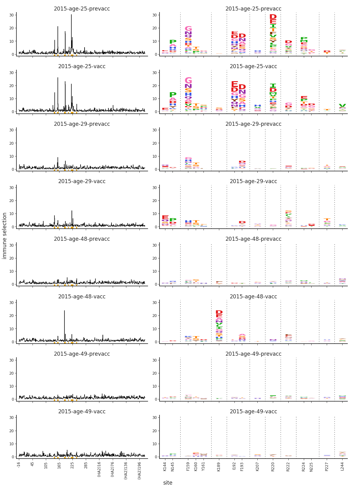


    
    
    ************************************************************************
    Serum group VIDD_sera, saving to results/avgdiffsel/zoomed_plots/VIDD_sera_avg.pdf
    


    
    
    ************************************************************************
    Serum group antibody_lower_head, saving to results/avgdiffsel/zoomed_plots/antibody_lower_head_avg.pdf
    


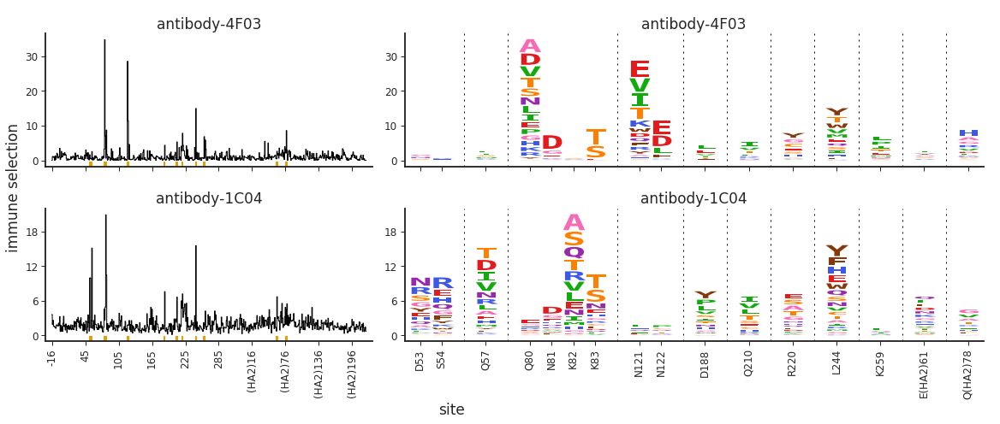


    
    
    ************************************************************************
    Serum group antibody_region_B, saving to results/avgdiffsel/zoomed_plots/antibody_region_B_avg.pdf
    


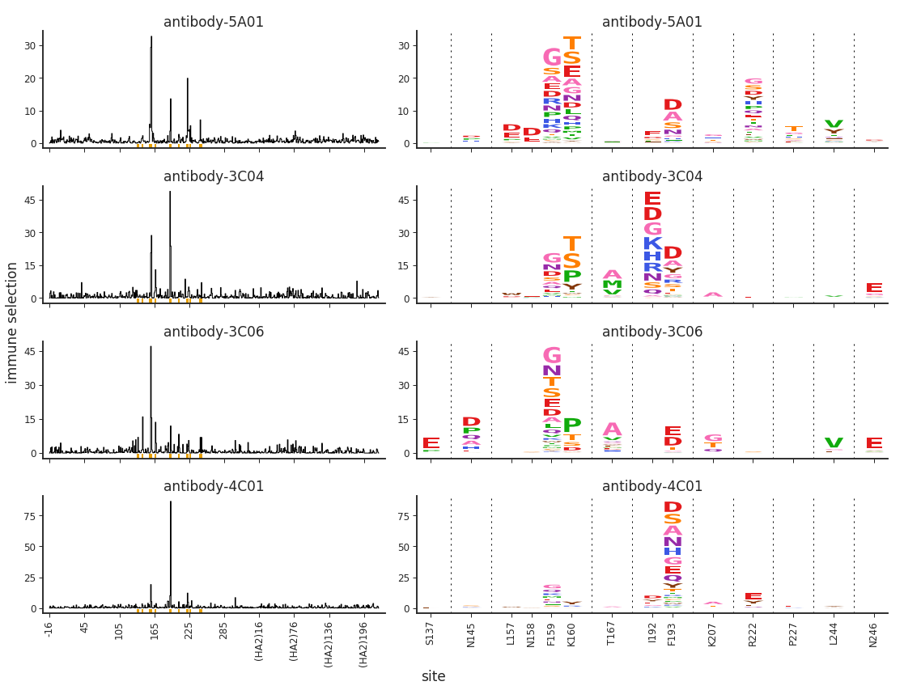


    
    
    ************************************************************************
    Serum group ferret, saving to results/avgdiffsel/zoomed_plots/ferret_avg.pdf
    


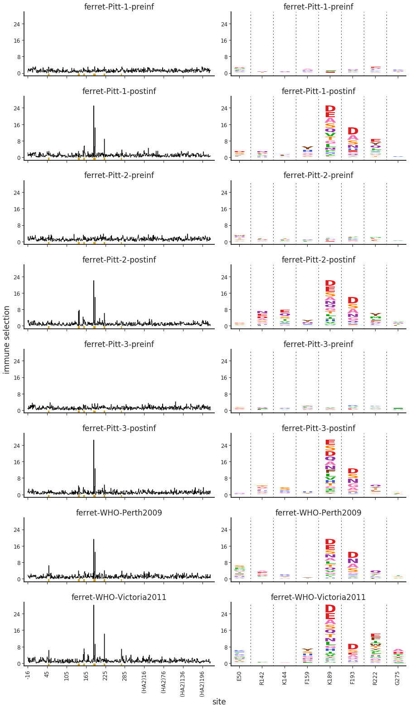


    
    
    ************************************************************************
    Serum group serum_mAb_spike, saving to results/avgdiffsel/zoomed_plots/serum_mAb_spike_avg.pdf
    


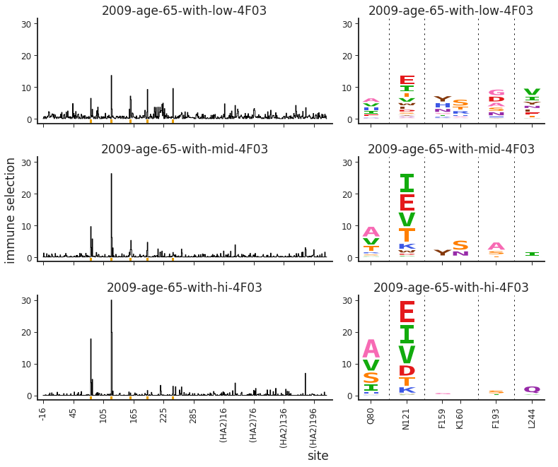


#### Whole-gene logo plots
Finally, we make whole-gene logo plots for each serum that shows the replicate-average selection for **all** sites.
We make these whole-gene plots using [dms2_logoplot](https://jbloomlab.github.io/dms_tools2/dms2_logoplot.html).
They are too large to be useful to show visually in this notebook, but the cell below gives the name of the PDF holding each logo plot so you can examine them individually if you'd like.


```python
outdir = config['avgdiffsel_full_dir']  # save plots here
os.makedirs(outdir, exist_ok=True)

for tup in (avg_selections
            .query('library == @avg_type')
            .itertuples(index=False)
            ):
    name = getattr(tup, "serum_name_formatted")
    plotfile = os.path.join(outdir, f"{name}_diffsel.pdf")
    if os.path.isfile(plotfile) and config['use_existing'] == 'yes':
        print(f"{plotfile} already exists.")
        continue
    datafile = getattr(tup, 'mutdiffsel_file')
    cmds = ['dms2_logoplot',
            '--outdir', outdir,
            '--diffsel', datafile,
            '--name', name,
            '--nperline', '95',
            '--overlay1', datafile, 'wildtype', 'wildtype',
            '--underlay', 'yes', 
            '--restrictdiffsel', 'positive',
            '--use_existing', config['use_existing'],
            ]
    print(f"Plotting {name} to {plotfile}")
    subprocess.check_output(cmds)
    assert os.path.isfile(plotfile)
```

    results/avgdiffsel/full_logo_plots/antibody-5A01_diffsel.pdf already exists.
    results/avgdiffsel/full_logo_plots/antibody-3C04_diffsel.pdf already exists.
    results/avgdiffsel/full_logo_plots/antibody-3C06_diffsel.pdf already exists.
    results/avgdiffsel/full_logo_plots/antibody-4C01_diffsel.pdf already exists.
    results/avgdiffsel/full_logo_plots/antibody-4F03_diffsel.pdf already exists.
    results/avgdiffsel/full_logo_plots/antibody-1C04_diffsel.pdf already exists.
    results/avgdiffsel/full_logo_plots/ferret-Pitt-1-preinf_diffsel.pdf already exists.
    results/avgdiffsel/full_logo_plots/ferret-Pitt-1-postinf_diffsel.pdf already exists.
    results/avgdiffsel/full_logo_plots/ferret-Pitt-2-preinf_diffsel.pdf already exists.
    results/avgdiffsel/full_logo_plots/ferret-Pitt-2-postinf_diffsel.pdf already exists.
    results/avgdiffsel/full_logo_plots/ferret-Pitt-3-preinf_diffsel.pdf already exists.
    results/avgdiffsel/full_logo_plots/ferret-Pitt-3-postinf_diffsel.pdf already exists.
    results/avgdiffsel/full_logo_plots/ferret-WHO_diffsel.pdf already exists.
    results/avgdiffsel/full_logo_plots/ferret-WHO-Victoria2011_diffsel.pdf already exists.
    results/avgdiffsel/full_logo_plots/2010-age-21_diffsel.pdf already exists.
    results/avgdiffsel/full_logo_plots/2009-age-53_diffsel.pdf already exists.
    results/avgdiffsel/full_logo_plots/2009-age-53-plus-2-months_diffsel.pdf already exists.
    results/avgdiffsel/full_logo_plots/2009-age-64_diffsel.pdf already exists.
    results/avgdiffsel/full_logo_plots/2009-age-65_diffsel.pdf already exists.
    results/avgdiffsel/full_logo_plots/2015-age-25-prevacc_diffsel.pdf already exists.
    results/avgdiffsel/full_logo_plots/2015-age-25-vacc_diffsel.pdf already exists.
    results/avgdiffsel/full_logo_plots/2015-age-29-prevacc_diffsel.pdf already exists.
    results/avgdiffsel/full_logo_plots/2015-age-29-vacc_diffsel.pdf already exists.
    results/avgdiffsel/full_logo_plots/2015-age-48-prevacc_diffsel.pdf already exists.
    results/avgdiffsel/full_logo_plots/2015-age-48-vacc_diffsel.pdf already exists.
    results/avgdiffsel/full_logo_plots/2015-age-49-prevacc_diffsel.pdf already exists.
    results/avgdiffsel/full_logo_plots/2015-age-49-vacc_diffsel.pdf already exists.
    results/avgdiffsel/full_logo_plots/2009-age-65-with-low-4F03_diffsel.pdf already exists.
    results/avgdiffsel/full_logo_plots/2009-age-65-with-mid-4F03_diffsel.pdf already exists.
    results/avgdiffsel/full_logo_plots/2009-age-65-with-hi-4F03_diffsel.pdf already exists.


### Plots of each replicate in averages
In the above section, we plotted the average for each serum.
Here we also show some data for the replicates that went into this average.

#### Zoom plots showing each replicate
Here we make line and zoomed logo plots for each replicate that goes into the average:


```python
os.makedirs(config['avgdiffsel_reps_dir'], exist_ok=True)

for serum_group, df in avg_sel_df.groupby('serum_group'):

    plotfile = os.path.join(config['avgdiffsel_reps_dir'],
                            f"{serum_group}_reps.pdf")
    svgplotfile = os.path.splitext(plotfile)[0] + '.svg'
    print(f"\n\n{'*' * 72}\n{serum_group}, saving to {plotfile} and {svgplotfile}\n")

    fig, axes = dmslogo.facet_plot(
            data=df.query('library != @avg_type'),
            x_col='isite',
            show_col='zoom_site',
            gridrow_col='serum_name_formatted',
            gridcol_col='library',
            share_xlabel=True,
            share_ylabel=True,
            share_ylim_across_rows=share_ylim_across_rows[serum_group],
            wspace=0.6,
            draw_line_kwargs=dict(
                    height_col='positive_diffsel',
                    xtick_col='site',
                    ylabel='immune selection',
                    ),
            draw_logo_kwargs=dict(
                    letter_col='mutation',
                    letter_height_col='mutdiffsel',
                    xtick_col='site_label',
                    xlabel='site',
                    ylabel='immune selection',
                    clip_negative_heights=True,
                    ),
            )
    display(fig)
    fig.savefig(plotfile)
    fig.savefig(svgplotfile)
    plt.close(fig)
```

    
    
    ************************************************************************
    Hensley_sera, saving to results/avgdiffsel/replicates/Hensley_sera_reps.pdf and results/avgdiffsel/replicates/Hensley_sera_reps.svg
    


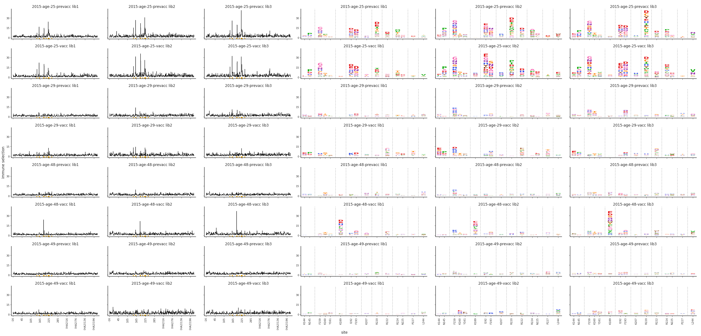


    
    
    ************************************************************************
    VIDD_sera, saving to results/avgdiffsel/replicates/VIDD_sera_reps.pdf and results/avgdiffsel/replicates/VIDD_sera_reps.svg
    


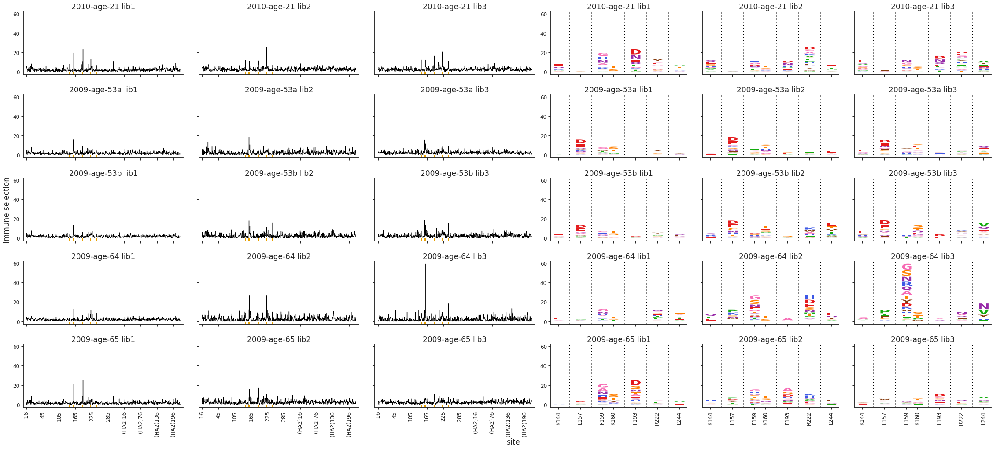


    
    
    ************************************************************************
    antibody_lower_head, saving to results/avgdiffsel/replicates/antibody_lower_head_reps.pdf and results/avgdiffsel/replicates/antibody_lower_head_reps.svg
    


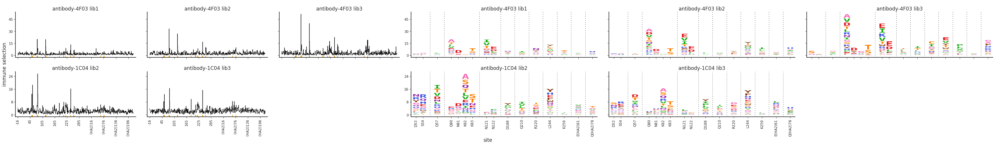


    
    
    ************************************************************************
    antibody_region_B, saving to results/avgdiffsel/replicates/antibody_region_B_reps.pdf and results/avgdiffsel/replicates/antibody_region_B_reps.svg
    


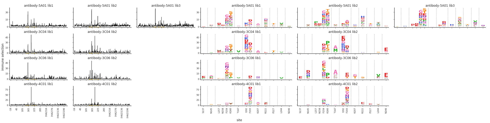


    
    
    ************************************************************************
    ferret, saving to results/avgdiffsel/replicates/ferret_reps.pdf and results/avgdiffsel/replicates/ferret_reps.svg
    


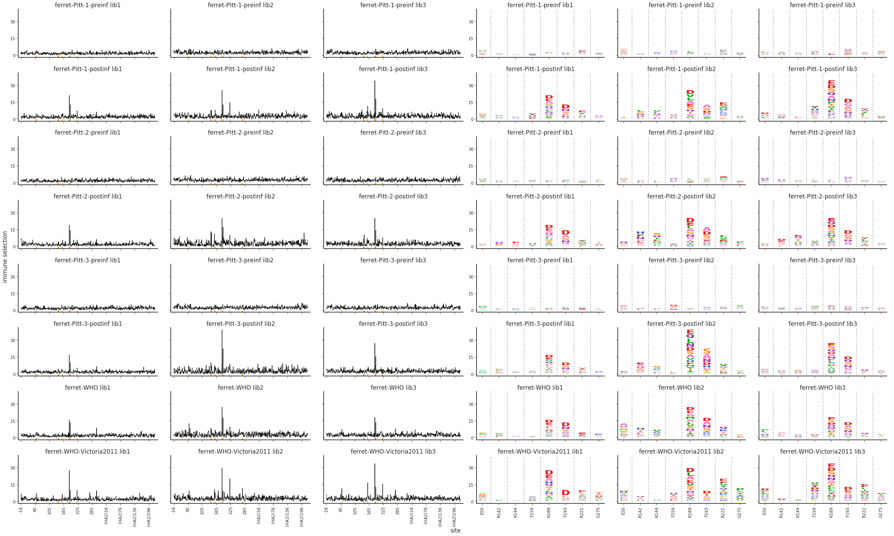


    
    
    ************************************************************************
    serum_mAb_spike, saving to results/avgdiffsel/replicates/serum_mAb_spike_reps.pdf and results/avgdiffsel/replicates/serum_mAb_spike_reps.svg
    


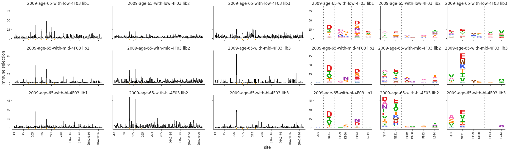


#### Plot replicate-replicate correlations
Now we plot the correlation among the replicates that we retained for each serum.
First, we make a tidy data frame with the correlations between all pairs of replicates for the same serum:


```python
corr_df = []

serum_names = avg_sel_df['serum_name_formatted'].unique()
libraries = [lib for lib in avg_sel_df['library'].unique() if lib != avg_type]

for serum_name, serum_sel_df in avg_sel_df.groupby('serum_name_formatted'):

    corr_df.append(
               serum_sel_df
               .query('library in @libraries')
               .pivot_table(values='positive_diffsel',
                            columns='library',
                            index=['site'])
               .corr(method='pearson')
               .reset_index()
               .melt(id_vars='library',
                     var_name='lib_B',
                     value_name='correlation')
               .rename(columns={'library': 'lib_A'})
               .query('lib_A <= lib_B')
               .assign(serum_name=serum_name)
               )

corr_df = (pd.concat(corr_df, ignore_index=True)
           .assign(serum_name=lambda x: pd.Categorical(x['serum_name'],
                                                       serum_names,
                                                       ordered=True),
                   lib_A=lambda x: pd.Categorical(x['lib_A'],
                                                  libraries,
                                                  ordered=True),
                   lib_B=lambda x: pd.Categorical(x['lib_B'],
                                                  reversed(libraries),
                                                  ordered=True),
                   corr_str=lambda x: x['correlation'].apply('{:.2f}'.format)
                   )
           )

print('Here are the first few lines of the tidy correlation data frame:')
display(HTML(corr_df.head().to_html(index=False)))
```

    Here are the first few lines of the tidy correlation data frame:


<table border="1" class="dataframe">
  <thead>
    <tr style="text-align: right;">
      <th>lib_A</th>
      <th>lib_B</th>
      <th>correlation</th>
      <th>serum_name</th>
      <th>corr_str</th>
    </tr>
  </thead>
  <tbody>
    <tr>
      <td>lib1</td>
      <td>lib1</td>
      <td>1.000000</td>
      <td>antibody-5A01</td>
      <td>1.00</td>
    </tr>
    <tr>
      <td>lib1</td>
      <td>lib2</td>
      <td>0.762430</td>
      <td>antibody-5A01</td>
      <td>0.76</td>
    </tr>
    <tr>
      <td>lib2</td>
      <td>lib2</td>
      <td>1.000000</td>
      <td>antibody-5A01</td>
      <td>1.00</td>
    </tr>
    <tr>
      <td>lib1</td>
      <td>lib3</td>
      <td>0.705409</td>
      <td>antibody-5A01</td>
      <td>0.71</td>
    </tr>
    <tr>
      <td>lib2</td>
      <td>lib3</td>
      <td>0.717227</td>
      <td>antibody-5A01</td>
      <td>0.72</td>
    </tr>
  </tbody>
</table>


Now we use [plotnine](https://plotnine.readthedocs.io) to plot a correlation matrix for each serum, and then save to a file as well as showing it:


```python
ncol = 5
nsera = len(corr_df['serum_name'].unique())

corr_plot = (
    ggplot(corr_df, aes('lib_A', 'lib_B',
                        fill='correlation', label='corr_str')) +
    geom_tile(color='white', size=0.5) +
    geom_text() +
    facet_wrap('~ serum_name', ncol=ncol) +
    theme(figure_size=(2.55 * ncol, 2.55 * math.ceil(nsera / ncol)),
          panel_grid_major=element_blank()
          ) +
    scale_fill_continuous(limits=(0, 1)) +
    xlab('') +
    ylab('')
    )

_ = corr_plot.draw()

rep_corr_plot = os.path.join(config['avgdiffsel_reps_dir'], 'rep_corr_matrix.pdf')
print(f"Saving plot to {rep_corr_plot}")
corr_plot.save(rep_corr_plot)
```

    Saving plot to results/avgdiffsel/replicates/rep_corr_matrix.pdf


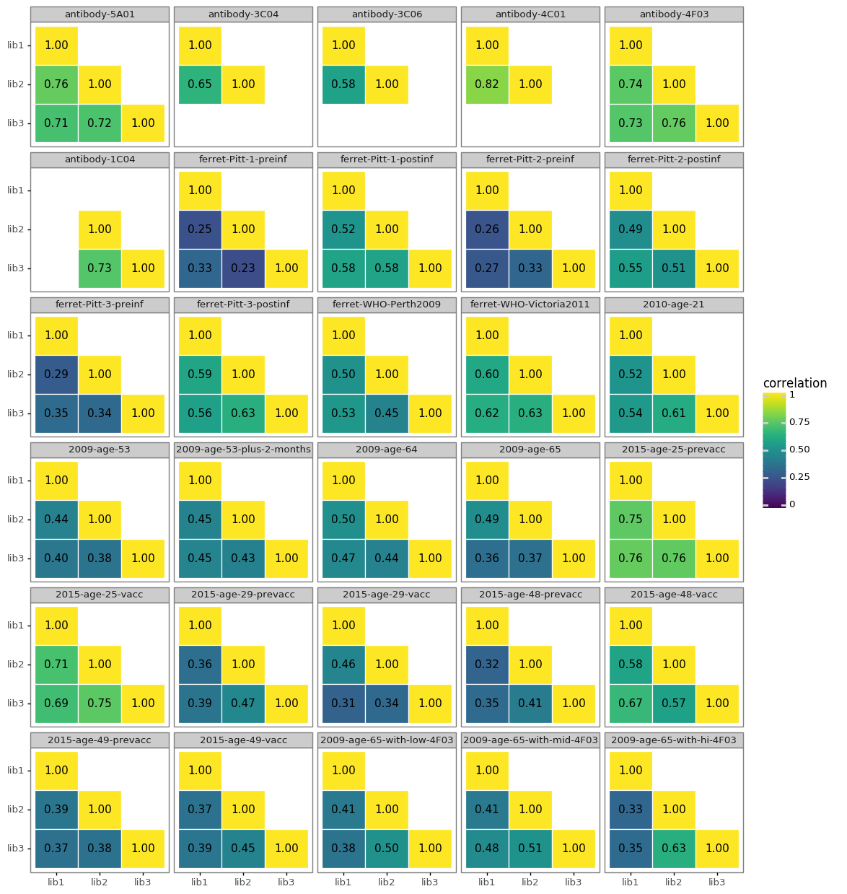


## Customized figures for paper

In the following section, we will generate additional customized paper figures not created above.

These go in the following directory:


```python
print(f"Putting additional figures in {config['figsdir']}")
os.makedirs(config['figsdir'], exist_ok=True)
```

    Putting additional figures in results/figures


We will save each of these figures with the following extensions:


```python
fig_extensions = ['.pdf', '.svg']
```

### Logo and line plot figures
Now we are going to make versions of the zoomed logo plots that are slightly different than the ones above.
We read in colors for specific mutations from a YAML file; these colors match those used to plot the neutralization curves.
We also plot a slightly different set of sites: not just the "significant" ones, but also others of interest (these are sites of strong selection in ferrets).

First, get data frames with sites to zoom on and how to color them, and how to color specific mutations:


```python
with open(config['figure_config']) as f:
    fig_config = yaml.safe_load(f)

zoom_sites = []
mutation_colors = []
for figure, fig_d in fig_config['figures'].items():
    # process zoom sites
    site_color_map = collections.defaultdict(lambda: fig_config['default_logo_color'])
    if 'site_colors' in fig_d:
        for r, c in fig_d['site_colors'].items():
            site_color_map[str(r)] = c
    zoom_sites.append(
        pd.DataFrame({'figure': figure,
                      'sera': fig_d['sera'],
                      'dummy': 0})
        .merge(pd.DataFrame({'site': avg_sel_df['site'].unique(),
                             'dummy': 0}))
        .drop(columns='dummy')
        .assign(zoom=lambda x: x['site'].isin([str(r) for r in fig_d['sites']]),
                color=lambda x: x['site'].map(site_color_map)
                )
        )
    # process colors
    muts = [mut for mut in fig_d['colors'] if mut not in {'wt', 'syn'}]
    mutation_colors.append(
        pd.DataFrame({'figure': figure,
                      'sera': fig_d['sera'],
                      'dummy': 0})
        .merge(pd.DataFrame({'site': [mut[1 : -1] for mut in muts],
                             'mutation': [mut[-1] for mut in muts],
                             'color': [fig_d['colors'][mut][0] for mut in muts],
                             'dummy': 0}))
        .drop(columns='dummy')
        )

zoom_sites = pd.concat(zoom_sites)
mutation_colors = pd.concat(mutation_colors)
```

Merge the zoom and mutation-color data frames with the data on all of the immune selection values:


```python
colored_zoom_df = (
    avg_sel_df
    .query('library == @avg_type')
    [['serum_name_formatted', 'isite', 'site', 'mutation',
      'positive_diffsel', 'mutdiffsel', 'site_label']]
    .rename(columns={'serum_name_formatted': 'sera'})
    .merge(zoom_sites,
           on=['sera', 'site'],
           how='left')
    .assign(zoom=lambda x: x['zoom'].fillna(False))
    .merge(mutation_colors,
           on=['figure', 'sera', 'site', 'mutation'],
           how='left')
    .assign(color=lambda x: x['color_x'].where(x['color_y'].isna(), x['color_y']))
    .drop(columns=['color_x', 'color_y'])
    )
```

Make the zoomed logo plots:


```python
for figure, df in colored_zoom_df.groupby('figure'):
        
    if 'sera_names' in fig_config['figures'][figure]:
        name_map = fig_config['figures'][figure]['sera_names']
    else:
        name_map = {s: s.replace('-', ' ') for s in df.sera.unique()}
    df = df.assign(sera_names=lambda x: pd.Categorical(x.sera.map(name_map),
                                                       x.sera.map(name_map).unique(),
                                                       ordered=True))
        
    fig, axes = dmslogo.facet_plot(
            data=df,
            x_col='isite',
            show_col='zoom',
            gridrow_col='sera_names',
            share_xlabel=True,
            share_ylabel=True,
            share_ylim_across_rows=share_ylim_across_rows[serum_group],
            wspace=0.6,
            rmargin=0.7,
            draw_line_kwargs=dict(
                    height_col='positive_diffsel',
                    xtick_col='site',
                    ylabel='immune selection',
                    show_color=PALETTE[-2],
                    ),
            draw_logo_kwargs=dict(
                    letter_col='mutation',
                    letter_height_col='mutdiffsel',
                    color_col='color',
                    xtick_col='site_label',
                    xlabel='site',
                    ylabel='immune selection',
                    clip_negative_heights=True,
                    ),
            )
    display(fig)
    for ext in fig_extensions:
        plotfile = os.path.join(config['figsdir'], f"{figure}_logo{ext}")
        print(f"Saving figure to {plotfile}")
        fig.savefig(plotfile)
    plt.close(fig)
```


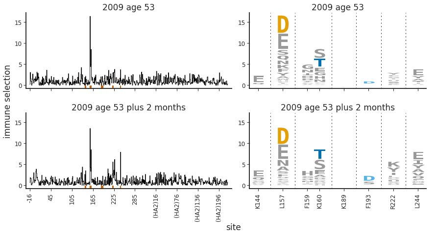


    Saving figure to results/figures/2009_age_53_samples_logo.pdf
    Saving figure to results/figures/2009_age_53_samples_logo.svg


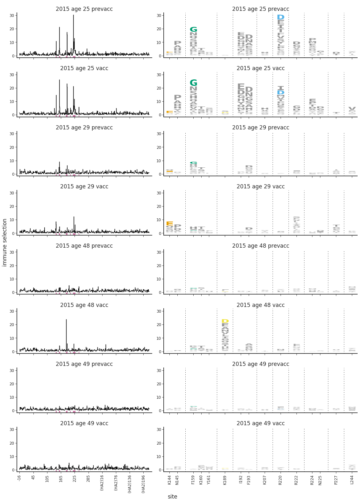


    Saving figure to results/figures/Hensley_sera_logo.pdf
    Saving figure to results/figures/Hensley_sera_logo.svg


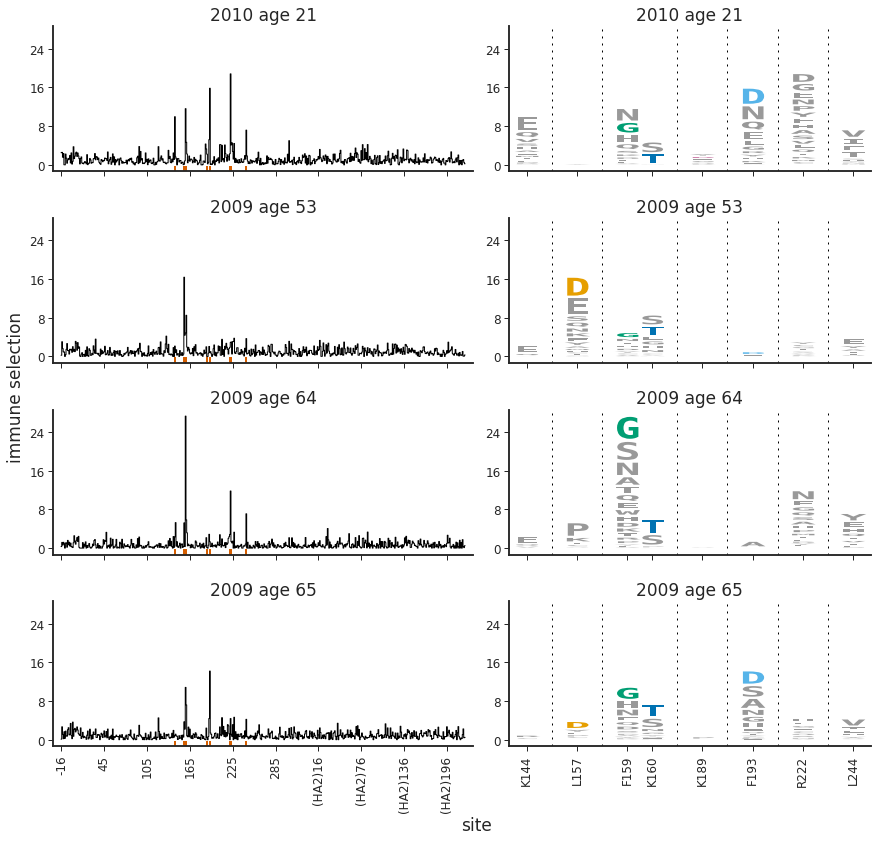


    Saving figure to results/figures/VIDD_sera_logo.pdf
    Saving figure to results/figures/VIDD_sera_logo.svg


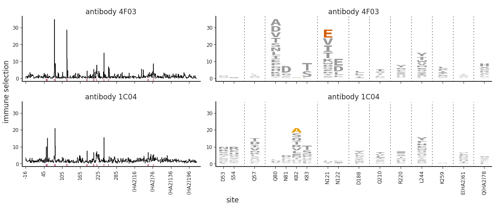


    Saving figure to results/figures/antibody_lower_head_logo.pdf
    Saving figure to results/figures/antibody_lower_head_logo.svg


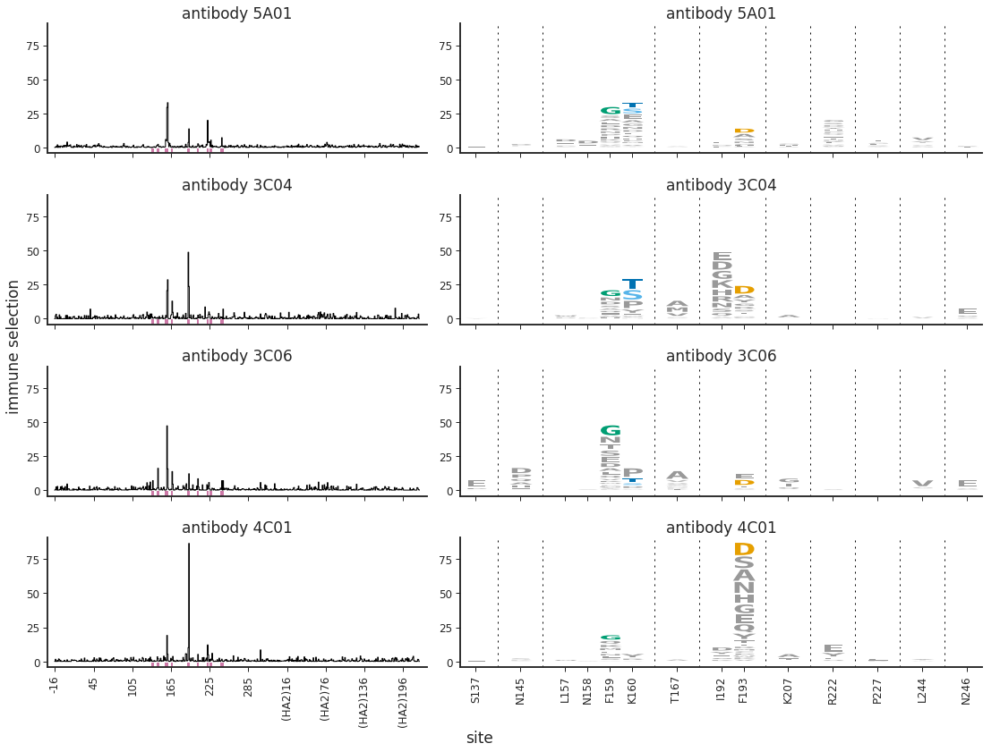


    Saving figure to results/figures/antibody_region_B_logo.pdf
    Saving figure to results/figures/antibody_region_B_logo.svg


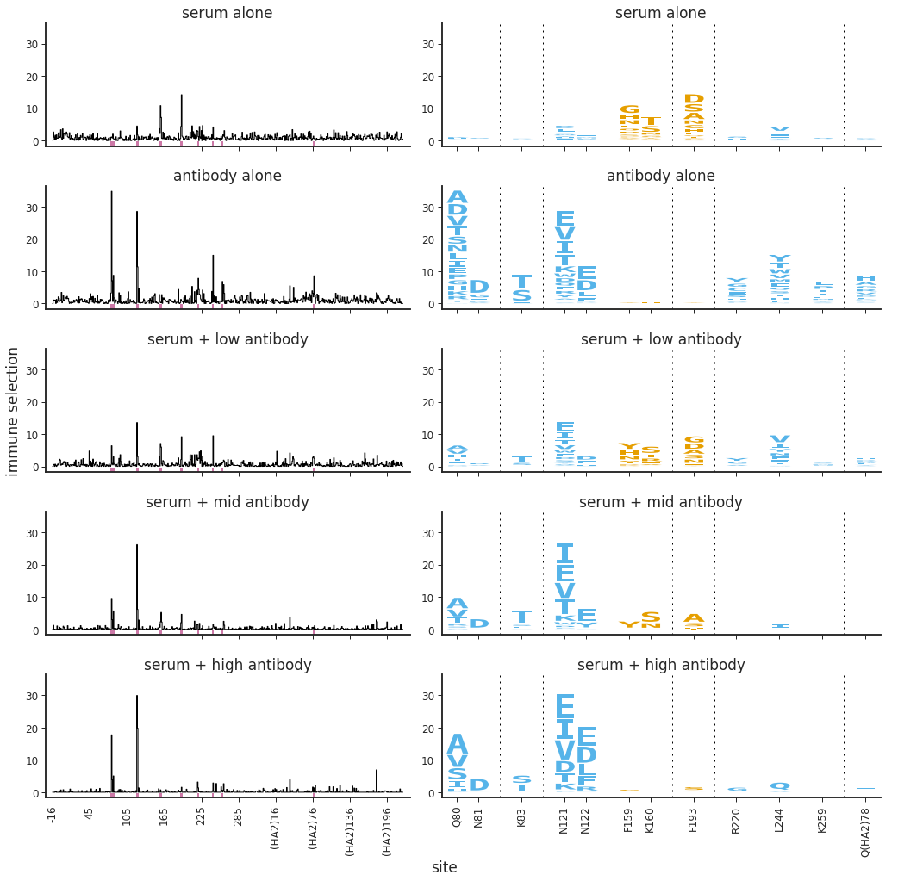


    Saving figure to results/figures/antibody_spikein_logo.pdf
    Saving figure to results/figures/antibody_spikein_logo.svg


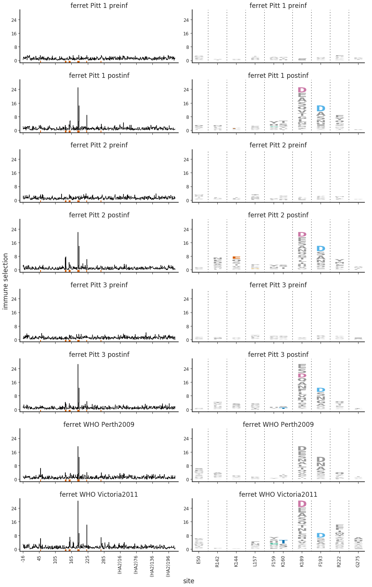


    Saving figure to results/figures/ferret_logo.pdf
    Saving figure to results/figures/ferret_logo.svg


### Replicate-to-replicate correlations
Plot replicate-replicate correlations for the sera in each figure:


```python
for figure, fig_d in fig_config['figures'].items():

    sera = fig_d['sera']
    
    if len(sera) == 5:
        ncol = 5
    else:
        ncol = 4

    fig_corr_df = (corr_df
                   .query('serum_name in @sera')
                   .assign(serum_name=lambda x: x['serum_name'].str.replace('-', ' '))
                   )
    fig_corr_plot = (
        ggplot(fig_corr_df, aes('lib_A', 'lib_B',
                            fill='correlation', label='corr_str')) +
        geom_tile(color='white', size=0.5) +
        geom_text() +
        facet_wrap('~ serum_name', ncol=ncol) +
        theme(figure_size=(2.55 * min(len(sera), ncol), 2.55 * math.ceil(len(sera) / ncol)),
              panel_grid_major=element_blank()
              ) +
        scale_fill_continuous(limits=(0, 1)) +
        xlab('') +
        ylab('')
        )

    print(fig_corr_plot)
    
    for ext in fig_extensions:
        plotfile = os.path.join(config['figsdir'], f"{figure}_rep_corr{ext}")
        print(f"Saving figure to {plotfile}")
        fig_corr_plot.save(plotfile)
```


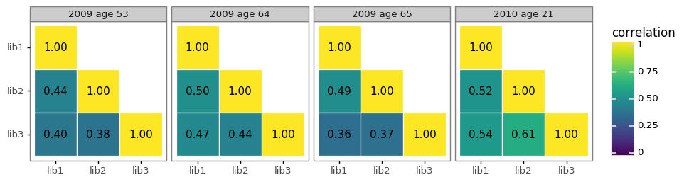


    <ggplot: (-9223363289516592163)>
    Saving figure to results/figures/VIDD_sera_rep_corr.pdf
    Saving figure to results/figures/VIDD_sera_rep_corr.svg


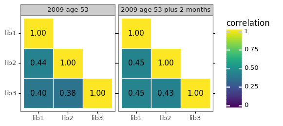


    <ggplot: (8747323927139)>
    Saving figure to results/figures/2009_age_53_samples_rep_corr.pdf
    Saving figure to results/figures/2009_age_53_samples_rep_corr.svg


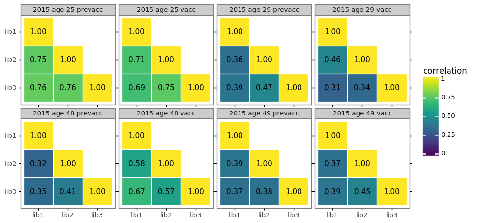


    <ggplot: (-9223363289498422731)>
    Saving figure to results/figures/Hensley_sera_rep_corr.pdf
    Saving figure to results/figures/Hensley_sera_rep_corr.svg


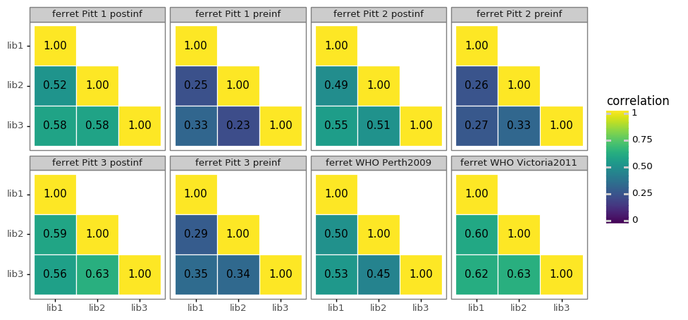


    <ggplot: (8747329016517)>
    Saving figure to results/figures/ferret_rep_corr.pdf
    Saving figure to results/figures/ferret_rep_corr.svg


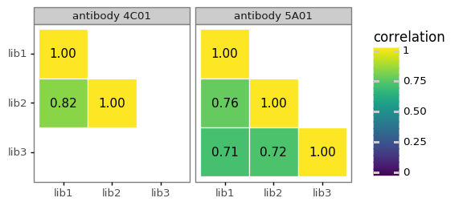


    <ggplot: (8747633669184)>
    Saving figure to results/figures/antibody_region_B_rep_corr.pdf
    Saving figure to results/figures/antibody_region_B_rep_corr.svg


    <ggplot: (8747339611512)>
    Saving figure to results/figures/antibody_lower_head_rep_corr.pdf
    Saving figure to results/figures/antibody_lower_head_rep_corr.svg


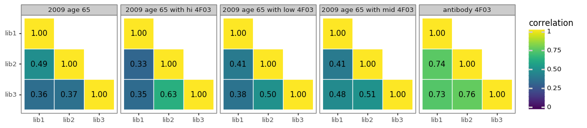


    <ggplot: (8747635128945)>
    Saving figure to results/figures/antibody_spikein_rep_corr.pdf
    Saving figure to results/figures/antibody_spikein_rep_corr.svg


### Percent infectivity for each replicate
Plot the percent infectivity remaining for the library for each selection.


```python
def format_label(x):
    if x == 100:
        lab = '100'
    else:
        lab = '{0:#.2g}'.format(x)
    if lab[-1] == '.':
        lab = lab[: -1]
    return lab + '%'
        

for figure, fig_d in fig_config['figures'].items():

    sera = fig_d['sera']

    df = (selections
          .query('retained')
          .query('serum_name_formatted in @sera')
          [['serum_name_formatted', 'library', 'percent_infectivity']]
          .assign(serum=lambda x: x['serum_name_formatted'].str.replace('-', ' '),
                  label=lambda x: x['percent_infectivity'].apply(format_label)
                  )
          )
    ymax = max(100, 10**math.ceil(math.log10(df['percent_infectivity'].max())))
    ymin = min(0.1, 10**math.floor(math.log10(df['percent_infectivity'].min())))
    yextent = math.log10(ymax / ymin)
    if df['percent_infectivity'].max() > 50:
        nudge_y = -0.1 * yextent
    else:
        nudge_y = 0.1 * yextent
    if len(sera) == 5:
        ncol = 5
    else:
        ncol = 4
        
    plot_percent_infectivity = (
        ggplot(df, aes('library', 'percent_infectivity', label='label', color='library')) +
        geom_point(size=3) +
        geom_text(size=10, nudge_y=nudge_y) +
        facet_wrap('~ serum', ncol=ncol) +
        scale_y_log10(limits=(ymin, ymax), name='percent infectivity') +
        theme(figure_size=(2.55 * min(ncol, len(sera)), 2.55 * math.ceil(len(sera) / ncol))) +
        scale_color_manual(values=PALETTE[1: ], guide=False)
        )
    print(plot_percent_infectivity)
    
    for ext in fig_extensions:
        plotfile = os.path.join(config['figsdir'], f"{figure}_percent_infectivity{ext}")
        print(f"Saving figure to {plotfile}")
        plot_percent_infectivity.save(plotfile)
```


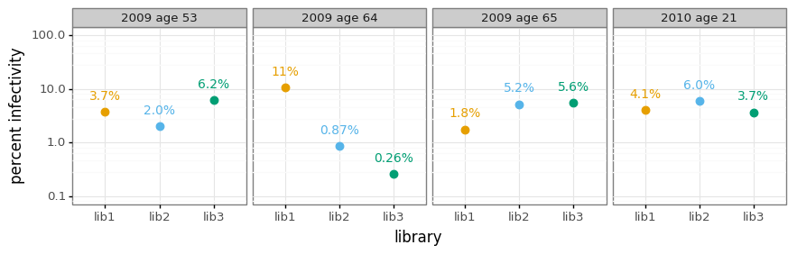


    <ggplot: (-9223363289512648416)>
    Saving figure to results/figures/VIDD_sera_percent_infectivity.pdf
    Saving figure to results/figures/VIDD_sera_percent_infectivity.svg


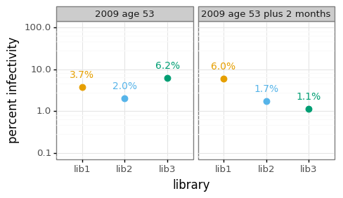


    <ggplot: (-9223363289530759950)>
    Saving figure to results/figures/2009_age_53_samples_percent_infectivity.pdf
    Saving figure to results/figures/2009_age_53_samples_percent_infectivity.svg


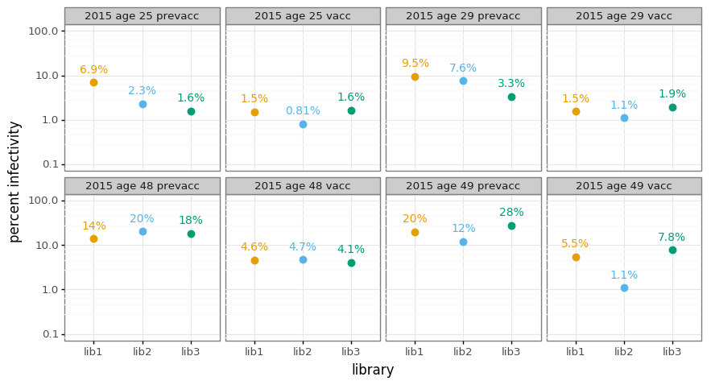


    <ggplot: (-9223363289513026991)>
    Saving figure to results/figures/Hensley_sera_percent_infectivity.pdf
    Saving figure to results/figures/Hensley_sera_percent_infectivity.svg


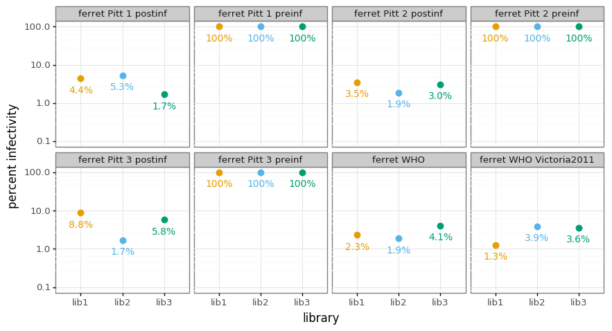


    <ggplot: (8747339812623)>
    Saving figure to results/figures/ferret_percent_infectivity.pdf
    Saving figure to results/figures/ferret_percent_infectivity.svg


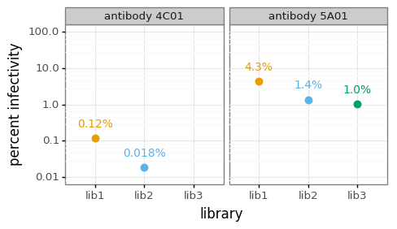


    <ggplot: (8747634141132)>
    Saving figure to results/figures/antibody_region_B_percent_infectivity.pdf
    Saving figure to results/figures/antibody_region_B_percent_infectivity.svg


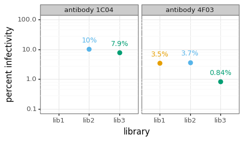


    <ggplot: (-9223363289459246269)>
    Saving figure to results/figures/antibody_lower_head_percent_infectivity.pdf
    Saving figure to results/figures/antibody_lower_head_percent_infectivity.svg


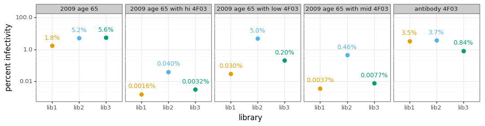


    <ggplot: (8747358104994)>
    Saving figure to results/figures/antibody_spikein_percent_infectivity.pdf
    Saving figure to results/figures/antibody_spikein_percent_infectivity.svg


```python

```
