# Plot neutralization curves

In this notebook we will create neutralization plots from GFP-based neutralization assays. 
The GFP-based neutralization assay system is described in detail in [Bloom et al (2010)](http://science.sciencemag.org/content/328/5983/1272.long) and [Hooper and Bloom (2013)](https://jvi.asm.org/content/87/23/12531).

In brief, we generate by reverse genetics influenza viruses that carry GFP in the PB1 segment. We then quantified using a plate reader the GFP signal produced by MDCK-SIAT1-CMV-PB1 cells infected with PB1flank-eGFP virus that had been incubated with various dilutions of antibody or serum. The neutralization curves represent the mean and standard deviation of three measurements, with each replicate in a separate column of a 96-well plate.


```python
import os
import warnings

from IPython.display import display, HTML

import numpy

import pandas as pd

from plotnine import *

import yaml

import neutcurve
from neutcurve.colorschemes import CBPALETTE
import neutcurve.parse_excel

print(f"Using neutcurve version {neutcurve.__version__}")
```

    Using neutcurve version 0.1.0


```python
pd.set_option('display.float_format', '{:.3g}'.format)
```


```python
# Hide warnings that can clutter output
warnings.simplefilter('ignore')
```

## Configuration and setup
Read general configuration from [config.yaml](config.yaml):


```python
with open('config.yaml') as f:
    config = yaml.safe_load(f)
```

Read the neutralization assay configuration from the specified file:


```python
print(f"Reading neutralization assay setup from {config['neut_config']}")

with open(config['neut_config']) as f:
    neut_config = yaml.safe_load(f)
```

    Reading neutralization assay setup from data/neut_assays/neut_config.yaml


Get the output directory:


```python
outdir = config['neutresultsdir']
os.makedirs(outdir, exist_ok=True)
print(f"Output will be written to {outdir}")
```

    Output will be written to results/neutralization_assays


## Read neutralization data

Next, for each dict in _neut_config_, we use `neutcurve.parse_excel.parseRachelStyle2019` to create a tidy data frame appropriate for passing to `neutcurve.CurveFits`. We then concatenate all the tidy data frames to get our neutralization data:


```python
neutdata = []  # store all data frame, then concatenate at end

for sampledict in neut_config:
    assert len(sampledict) == 1
    sampleset, kwargs = list(sampledict.items())[0]
    print(f"Parsing data for {sampleset}...")
    neutdata.append(neutcurve.parse_excel.parseRachelStyle2019(**kwargs))

neutdata = pd.concat(neutdata)
print(f"Read data for {len(neutdata.groupby('serum'))} sera and "
      f"{len(neutdata.groupby(['serum', 'virus']))} serum / virus pairs.")
```

    Parsing data for VIDD1...
    Parsing data for VIDD2...
    Parsing data for VIDD3...
    Parsing data for VIDD4...
    Parsing data for VIDD5...
    Parsing data for 557v1...
    Parsing data for 557v2...
    Parsing data for 574v1...
    Parsing data for 574v2...
    Parsing data for 589v2...
    Parsing data for 571v2...
    Parsing data for ferret-Pitt-1-postinf...
    Parsing data for ferret-Pitt-2-postinf...
    Parsing data for ferret-Pitt-3-postinf...
    Parsing data for ferret-WHO-Victoria2011...
    Parsing data for antibody-5A01...
    Parsing data for antibody-3C06...
    Parsing data for antibody-3C04...
    Parsing data for antibody-4C01...
    Parsing data for antibody-4F03...
    Parsing data for antibody-1C04...
    Read data for 21 sera and 85 serum / virus pairs.


Write the neutralization data to a CSV file in our output directory:


```python
neutdatafile = os.path.join(outdir, 'neutdata.csv')
neutdata.to_csv(neutdatafile, index=False)
print(f"Wrote neutralization data to {neutdatafile}")
```

    Wrote neutralization data to results/neutralization_assays/neutdata.csv


## Fit and plot neutralization curves

Now we fit the neutralization curves with a neutcurve.CurveFits:


```python
fits = neutcurve.CurveFits(neutdata)
```

Make plots for each serum sample:


```python
for s in neutdata['serum'].unique():
    if 'antibody' not in s:
        fig, axes = fits.plotSera(sera=[s], 
                                  xlabel='serum dilution', 
                                  widthscale=1.5, 
                                  heightscale=1.3)
    else:
        fig, axes = fits.plotSera(sera=[s], 
                                  xlabel='concentration ($\mu$g/ml)', 
                                  widthscale=1.5, 
                                  heightscale=1.3)
```


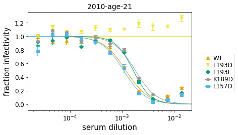


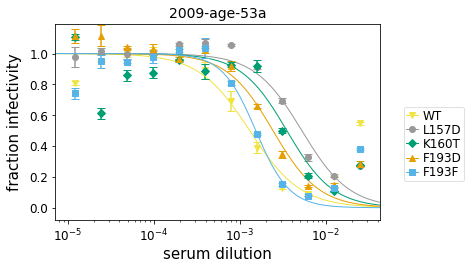


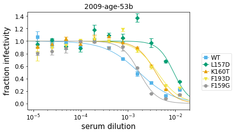


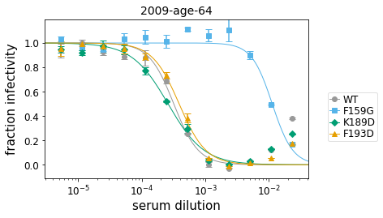


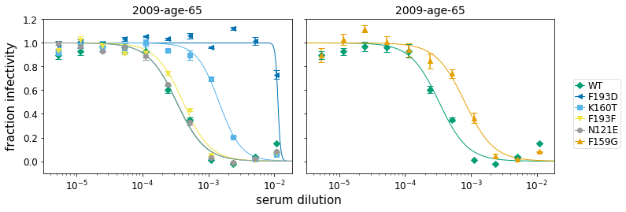


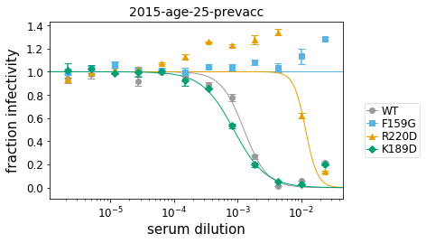


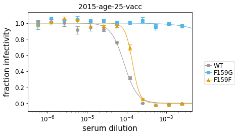


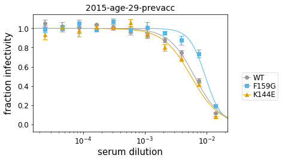


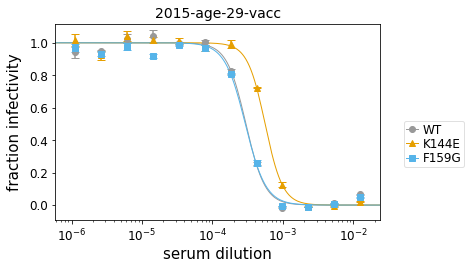


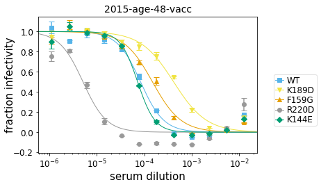


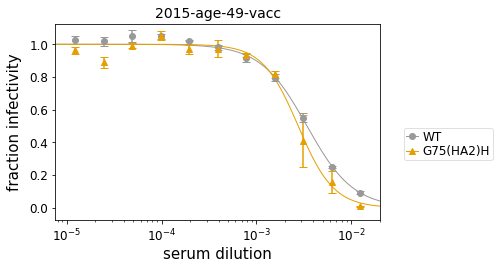


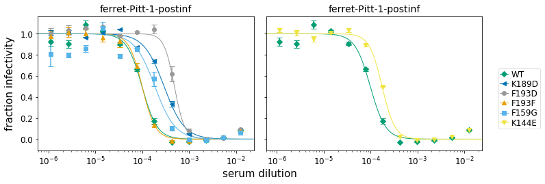


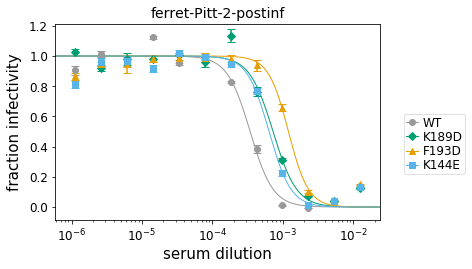


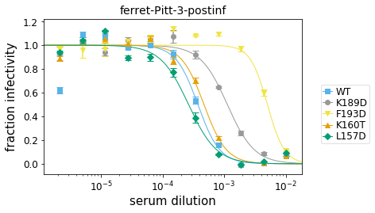


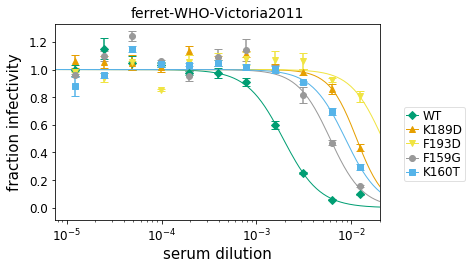


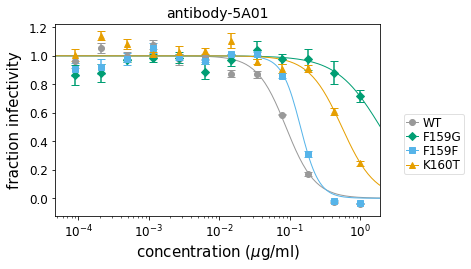


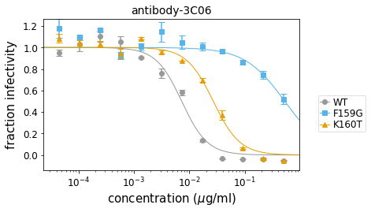


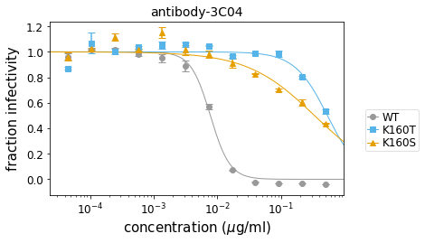


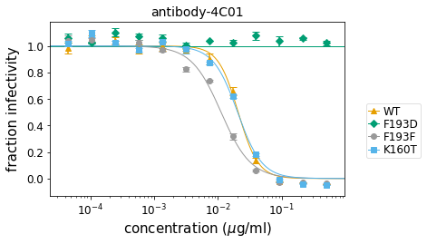


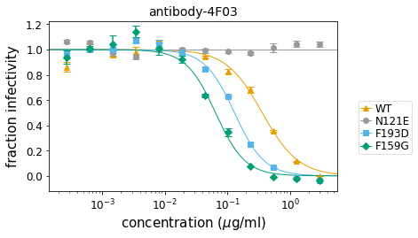


```python
fitparams = fits.fitParams()
```


```python
display(HTML(fitparams.to_html(index=False)))
```


<table border="1" class="dataframe">
  <thead>
    <tr style="text-align: right;">
      <th>serum</th>
      <th>virus</th>
      <th>replicate</th>
      <th>nreplicates</th>
      <th>ic50</th>
      <th>ic50_bound</th>
      <th>ic50_str</th>
      <th>midpoint</th>
      <th>slope</th>
      <th>top</th>
      <th>bottom</th>
    </tr>
  </thead>
  <tbody>
    <tr>
      <td>2010-age-21</td>
      <td>WT</td>
      <td>average</td>
      <td>3</td>
      <td>0.00119</td>
      <td>interpolated</td>
      <td>0.00119</td>
      <td>0.00119</td>
      <td>1.87</td>
      <td>1</td>
      <td>0</td>
    </tr>
    <tr>
      <td>2010-age-21</td>
      <td>F193D</td>
      <td>average</td>
      <td>3</td>
      <td>0.0265</td>
      <td>lower</td>
      <td>&gt;0.0265</td>
      <td>0.0266</td>
      <td>33.6</td>
      <td>1</td>
      <td>0</td>
    </tr>
    <tr>
      <td>2010-age-21</td>
      <td>F193F</td>
      <td>average</td>
      <td>3</td>
      <td>0.00164</td>
      <td>interpolated</td>
      <td>0.00164</td>
      <td>0.00164</td>
      <td>2.54</td>
      <td>1</td>
      <td>0</td>
    </tr>
    <tr>
      <td>2010-age-21</td>
      <td>K189D</td>
      <td>average</td>
      <td>3</td>
      <td>0.00181</td>
      <td>interpolated</td>
      <td>0.00181</td>
      <td>0.00181</td>
      <td>1.98</td>
      <td>1</td>
      <td>0</td>
    </tr>
    <tr>
      <td>2010-age-21</td>
      <td>L157D</td>
      <td>average</td>
      <td>3</td>
      <td>0.00107</td>
      <td>interpolated</td>
      <td>0.00107</td>
      <td>0.00107</td>
      <td>2.05</td>
      <td>1</td>
      <td>0</td>
    </tr>
    <tr>
      <td>2009-age-53a</td>
      <td>WT</td>
      <td>average</td>
      <td>3</td>
      <td>0.0013</td>
      <td>interpolated</td>
      <td>0.0013</td>
      <td>0.0013</td>
      <td>1.46</td>
      <td>1</td>
      <td>0</td>
    </tr>
    <tr>
      <td>2009-age-53a</td>
      <td>L157D</td>
      <td>average</td>
      <td>3</td>
      <td>0.00525</td>
      <td>interpolated</td>
      <td>0.00525</td>
      <td>0.00525</td>
      <td>1.58</td>
      <td>1</td>
      <td>0</td>
    </tr>
    <tr>
      <td>2009-age-53a</td>
      <td>K160T</td>
      <td>average</td>
      <td>3</td>
      <td>0.00352</td>
      <td>interpolated</td>
      <td>0.00352</td>
      <td>0.00352</td>
      <td>1.63</td>
      <td>1</td>
      <td>0</td>
    </tr>
    <tr>
      <td>2009-age-53a</td>
      <td>F193D</td>
      <td>average</td>
      <td>3</td>
      <td>0.00243</td>
      <td>interpolated</td>
      <td>0.00243</td>
      <td>0.00243</td>
      <td>1.63</td>
      <td>1</td>
      <td>0</td>
    </tr>
    <tr>
      <td>2009-age-53a</td>
      <td>F193F</td>
      <td>average</td>
      <td>3</td>
      <td>0.00153</td>
      <td>interpolated</td>
      <td>0.00153</td>
      <td>0.00153</td>
      <td>2.23</td>
      <td>1</td>
      <td>0</td>
    </tr>
    <tr>
      <td>2009-age-53b</td>
      <td>WT</td>
      <td>average</td>
      <td>3</td>
      <td>0.0027</td>
      <td>interpolated</td>
      <td>0.0027</td>
      <td>0.0027</td>
      <td>0.672</td>
      <td>1</td>
      <td>0</td>
    </tr>
    <tr>
      <td>2009-age-53b</td>
      <td>L157D</td>
      <td>average</td>
      <td>3</td>
      <td>0.0118</td>
      <td>interpolated</td>
      <td>0.0118</td>
      <td>0.0118</td>
      <td>1.77</td>
      <td>1</td>
      <td>0</td>
    </tr>
    <tr>
      <td>2009-age-53b</td>
      <td>K160T</td>
      <td>average</td>
      <td>3</td>
      <td>0.00413</td>
      <td>interpolated</td>
      <td>0.00413</td>
      <td>0.00413</td>
      <td>1.72</td>
      <td>1</td>
      <td>0</td>
    </tr>
    <tr>
      <td>2009-age-53b</td>
      <td>F193D</td>
      <td>average</td>
      <td>3</td>
      <td>0.00471</td>
      <td>interpolated</td>
      <td>0.00471</td>
      <td>0.00471</td>
      <td>1.45</td>
      <td>1</td>
      <td>0</td>
    </tr>
    <tr>
      <td>2009-age-53b</td>
      <td>F159G</td>
      <td>average</td>
      <td>3</td>
      <td>0.00175</td>
      <td>interpolated</td>
      <td>0.00175</td>
      <td>0.00175</td>
      <td>2.2</td>
      <td>1</td>
      <td>0</td>
    </tr>
    <tr>
      <td>2009-age-64</td>
      <td>WT</td>
      <td>average</td>
      <td>3</td>
      <td>0.000318</td>
      <td>interpolated</td>
      <td>0.000318</td>
      <td>0.000318</td>
      <td>2.25</td>
      <td>1</td>
      <td>0</td>
    </tr>
    <tr>
      <td>2009-age-64</td>
      <td>F159G</td>
      <td>average</td>
      <td>3</td>
      <td>0.0113</td>
      <td>interpolated</td>
      <td>0.0113</td>
      <td>0.0113</td>
      <td>2.68</td>
      <td>1</td>
      <td>0</td>
    </tr>
    <tr>
      <td>2009-age-64</td>
      <td>K189D</td>
      <td>average</td>
      <td>3</td>
      <td>0.000259</td>
      <td>interpolated</td>
      <td>0.000259</td>
      <td>0.000259</td>
      <td>1.53</td>
      <td>1</td>
      <td>0</td>
    </tr>
    <tr>
      <td>2009-age-64</td>
      <td>F193D</td>
      <td>average</td>
      <td>3</td>
      <td>0.000386</td>
      <td>interpolated</td>
      <td>0.000386</td>
      <td>0.000386</td>
      <td>2.06</td>
      <td>1</td>
      <td>0</td>
    </tr>
    <tr>
      <td>2009-age-65</td>
      <td>WT</td>
      <td>average</td>
      <td>3</td>
      <td>0.000328</td>
      <td>interpolated</td>
      <td>0.000328</td>
      <td>0.000328</td>
      <td>2</td>
      <td>1</td>
      <td>0</td>
    </tr>
    <tr>
      <td>2009-age-65</td>
      <td>F193D</td>
      <td>average</td>
      <td>3</td>
      <td>0.0205</td>
      <td>interpolated</td>
      <td>0.0205</td>
      <td>0.0205</td>
      <td>2.13</td>
      <td>1</td>
      <td>0</td>
    </tr>
    <tr>
      <td>2009-age-65</td>
      <td>K160T</td>
      <td>average</td>
      <td>3</td>
      <td>0.00145</td>
      <td>interpolated</td>
      <td>0.00145</td>
      <td>0.00145</td>
      <td>2.53</td>
      <td>1</td>
      <td>0</td>
    </tr>
    <tr>
      <td>2009-age-65</td>
      <td>F193F</td>
      <td>average</td>
      <td>3</td>
      <td>0.000412</td>
      <td>interpolated</td>
      <td>0.000412</td>
      <td>0.000412</td>
      <td>2.1</td>
      <td>1</td>
      <td>0</td>
    </tr>
    <tr>
      <td>2009-age-65</td>
      <td>N121E</td>
      <td>average</td>
      <td>3</td>
      <td>0.000332</td>
      <td>interpolated</td>
      <td>0.000332</td>
      <td>0.000332</td>
      <td>1.99</td>
      <td>1</td>
      <td>0</td>
    </tr>
    <tr>
      <td>2009-age-65</td>
      <td>F159G</td>
      <td>average</td>
      <td>3</td>
      <td>0.000805</td>
      <td>interpolated</td>
      <td>0.000805</td>
      <td>0.000805</td>
      <td>1.95</td>
      <td>1</td>
      <td>0</td>
    </tr>
    <tr>
      <td>2015-age-25-prevacc</td>
      <td>WT</td>
      <td>average</td>
      <td>3</td>
      <td>0.00126</td>
      <td>interpolated</td>
      <td>0.00126</td>
      <td>0.00126</td>
      <td>2.39</td>
      <td>1</td>
      <td>0</td>
    </tr>
    <tr>
      <td>2015-age-25-prevacc</td>
      <td>F159G</td>
      <td>average</td>
      <td>3</td>
      <td>0.0238</td>
      <td>lower</td>
      <td>&gt;0.0238</td>
      <td>888</td>
      <td>3.12</td>
      <td>1</td>
      <td>0</td>
    </tr>
    <tr>
      <td>2015-age-25-prevacc</td>
      <td>R220D</td>
      <td>average</td>
      <td>3</td>
      <td>0.0117</td>
      <td>interpolated</td>
      <td>0.0117</td>
      <td>0.0117</td>
      <td>4.63</td>
      <td>1</td>
      <td>0</td>
    </tr>
    <tr>
      <td>2015-age-25-prevacc</td>
      <td>K189D</td>
      <td>average</td>
      <td>3</td>
      <td>0.000871</td>
      <td>interpolated</td>
      <td>0.000871</td>
      <td>0.000871</td>
      <td>1.73</td>
      <td>1</td>
      <td>0</td>
    </tr>
    <tr>
      <td>2015-age-25-vacc</td>
      <td>WT</td>
      <td>average</td>
      <td>3</td>
      <td>8.54e-05</td>
      <td>interpolated</td>
      <td>8.54e-05</td>
      <td>8.54e-05</td>
      <td>2.61</td>
      <td>1</td>
      <td>0</td>
    </tr>
    <tr>
      <td>2015-age-25-vacc</td>
      <td>F159G</td>
      <td>average</td>
      <td>3</td>
      <td>0.0025</td>
      <td>lower</td>
      <td>&gt;0.0025</td>
      <td>0.0558</td>
      <td>1.06</td>
      <td>1</td>
      <td>0</td>
    </tr>
    <tr>
      <td>2015-age-25-vacc</td>
      <td>F159F</td>
      <td>average</td>
      <td>3</td>
      <td>0.000141</td>
      <td>interpolated</td>
      <td>0.000141</td>
      <td>0.000141</td>
      <td>4.7</td>
      <td>1</td>
      <td>0</td>
    </tr>
    <tr>
      <td>2015-age-29-prevacc</td>
      <td>WT</td>
      <td>average</td>
      <td>3</td>
      <td>0.00665</td>
      <td>interpolated</td>
      <td>0.00665</td>
      <td>0.00665</td>
      <td>1.68</td>
      <td>1</td>
      <td>0</td>
    </tr>
    <tr>
      <td>2015-age-29-prevacc</td>
      <td>F159G</td>
      <td>average</td>
      <td>3</td>
      <td>0.00969</td>
      <td>interpolated</td>
      <td>0.00969</td>
      <td>0.00969</td>
      <td>2.73</td>
      <td>1</td>
      <td>0</td>
    </tr>
    <tr>
      <td>2015-age-29-prevacc</td>
      <td>K144E</td>
      <td>average</td>
      <td>3</td>
      <td>0.00568</td>
      <td>interpolated</td>
      <td>0.00568</td>
      <td>0.00568</td>
      <td>1.8</td>
      <td>1</td>
      <td>0</td>
    </tr>
    <tr>
      <td>2015-age-29-vacc</td>
      <td>WT</td>
      <td>average</td>
      <td>3</td>
      <td>0.000299</td>
      <td>interpolated</td>
      <td>0.000299</td>
      <td>0.000299</td>
      <td>3.21</td>
      <td>1</td>
      <td>0</td>
    </tr>
    <tr>
      <td>2015-age-29-vacc</td>
      <td>K144E</td>
      <td>average</td>
      <td>3</td>
      <td>0.000559</td>
      <td>interpolated</td>
      <td>0.000559</td>
      <td>0.000559</td>
      <td>3.47</td>
      <td>1</td>
      <td>0</td>
    </tr>
    <tr>
      <td>2015-age-29-vacc</td>
      <td>F159G</td>
      <td>average</td>
      <td>3</td>
      <td>0.000293</td>
      <td>interpolated</td>
      <td>0.000293</td>
      <td>0.000293</td>
      <td>2.98</td>
      <td>1</td>
      <td>0</td>
    </tr>
    <tr>
      <td>2015-age-48-vacc</td>
      <td>WT</td>
      <td>average</td>
      <td>3</td>
      <td>8.33e-05</td>
      <td>interpolated</td>
      <td>8.33e-05</td>
      <td>8.33e-05</td>
      <td>1.78</td>
      <td>1</td>
      <td>0</td>
    </tr>
    <tr>
      <td>2015-age-48-vacc</td>
      <td>K189D</td>
      <td>average</td>
      <td>3</td>
      <td>0.000414</td>
      <td>interpolated</td>
      <td>0.000414</td>
      <td>0.000414</td>
      <td>1.26</td>
      <td>1</td>
      <td>0</td>
    </tr>
    <tr>
      <td>2015-age-48-vacc</td>
      <td>F159G</td>
      <td>average</td>
      <td>3</td>
      <td>0.000149</td>
      <td>interpolated</td>
      <td>0.000149</td>
      <td>0.000149</td>
      <td>1.45</td>
      <td>1</td>
      <td>0</td>
    </tr>
    <tr>
      <td>2015-age-48-vacc</td>
      <td>R220D</td>
      <td>average</td>
      <td>3</td>
      <td>5.11e-06</td>
      <td>interpolated</td>
      <td>5.11e-06</td>
      <td>5.11e-06</td>
      <td>1.75</td>
      <td>1</td>
      <td>0</td>
    </tr>
    <tr>
      <td>2015-age-48-vacc</td>
      <td>K144E</td>
      <td>average</td>
      <td>3</td>
      <td>7.23e-05</td>
      <td>interpolated</td>
      <td>7.23e-05</td>
      <td>7.23e-05</td>
      <td>2.39</td>
      <td>1</td>
      <td>0</td>
    </tr>
    <tr>
      <td>2015-age-49-vacc</td>
      <td>WT</td>
      <td>average</td>
      <td>3</td>
      <td>0.00353</td>
      <td>interpolated</td>
      <td>0.00353</td>
      <td>0.00353</td>
      <td>1.58</td>
      <td>1</td>
      <td>0</td>
    </tr>
    <tr>
      <td>2015-age-49-vacc</td>
      <td>G75(HA2)H</td>
      <td>average</td>
      <td>3</td>
      <td>0.00277</td>
      <td>interpolated</td>
      <td>0.00277</td>
      <td>0.00277</td>
      <td>2.29</td>
      <td>1</td>
      <td>0</td>
    </tr>
    <tr>
      <td>ferret-Pitt-1-postinf</td>
      <td>WT</td>
      <td>average</td>
      <td>3</td>
      <td>9.84e-05</td>
      <td>interpolated</td>
      <td>9.84e-05</td>
      <td>9.84e-05</td>
      <td>2.66</td>
      <td>1</td>
      <td>0</td>
    </tr>
    <tr>
      <td>ferret-Pitt-1-postinf</td>
      <td>K189D</td>
      <td>average</td>
      <td>3</td>
      <td>0.000292</td>
      <td>interpolated</td>
      <td>0.000292</td>
      <td>0.000292</td>
      <td>2.01</td>
      <td>1</td>
      <td>0</td>
    </tr>
    <tr>
      <td>ferret-Pitt-1-postinf</td>
      <td>F193D</td>
      <td>average</td>
      <td>3</td>
      <td>0.000484</td>
      <td>interpolated</td>
      <td>0.000484</td>
      <td>0.000484</td>
      <td>3.94</td>
      <td>1</td>
      <td>0</td>
    </tr>
    <tr>
      <td>ferret-Pitt-1-postinf</td>
      <td>F193F</td>
      <td>average</td>
      <td>3</td>
      <td>9.9e-05</td>
      <td>interpolated</td>
      <td>9.9e-05</td>
      <td>9.9e-05</td>
      <td>3.07</td>
      <td>1</td>
      <td>0</td>
    </tr>
    <tr>
      <td>ferret-Pitt-1-postinf</td>
      <td>F159G</td>
      <td>average</td>
      <td>3</td>
      <td>0.000186</td>
      <td>interpolated</td>
      <td>0.000186</td>
      <td>0.000186</td>
      <td>2.01</td>
      <td>1</td>
      <td>0</td>
    </tr>
    <tr>
      <td>ferret-Pitt-1-postinf</td>
      <td>K144E</td>
      <td>average</td>
      <td>3</td>
      <td>0.000176</td>
      <td>interpolated</td>
      <td>0.000176</td>
      <td>0.000176</td>
      <td>3.17</td>
      <td>1</td>
      <td>0</td>
    </tr>
    <tr>
      <td>ferret-Pitt-2-postinf</td>
      <td>WT</td>
      <td>average</td>
      <td>3</td>
      <td>0.000343</td>
      <td>interpolated</td>
      <td>0.000343</td>
      <td>0.000343</td>
      <td>2.67</td>
      <td>1</td>
      <td>0</td>
    </tr>
    <tr>
      <td>ferret-Pitt-2-postinf</td>
      <td>K189D</td>
      <td>average</td>
      <td>3</td>
      <td>0.000724</td>
      <td>interpolated</td>
      <td>0.000724</td>
      <td>0.000724</td>
      <td>2.6</td>
      <td>1</td>
      <td>0</td>
    </tr>
    <tr>
      <td>ferret-Pitt-2-postinf</td>
      <td>F193D</td>
      <td>average</td>
      <td>3</td>
      <td>0.0012</td>
      <td>interpolated</td>
      <td>0.0012</td>
      <td>0.0012</td>
      <td>3.06</td>
      <td>1</td>
      <td>0</td>
    </tr>
    <tr>
      <td>ferret-Pitt-2-postinf</td>
      <td>K144E</td>
      <td>average</td>
      <td>3</td>
      <td>0.000636</td>
      <td>interpolated</td>
      <td>0.000636</td>
      <td>0.000636</td>
      <td>2.8</td>
      <td>1</td>
      <td>0</td>
    </tr>
    <tr>
      <td>ferret-Pitt-3-postinf</td>
      <td>WT</td>
      <td>average</td>
      <td>3</td>
      <td>0.000375</td>
      <td>interpolated</td>
      <td>0.000375</td>
      <td>0.000375</td>
      <td>2.43</td>
      <td>1</td>
      <td>0</td>
    </tr>
    <tr>
      <td>ferret-Pitt-3-postinf</td>
      <td>K189D</td>
      <td>average</td>
      <td>3</td>
      <td>0.00114</td>
      <td>interpolated</td>
      <td>0.00114</td>
      <td>0.00114</td>
      <td>1.92</td>
      <td>1</td>
      <td>0</td>
    </tr>
    <tr>
      <td>ferret-Pitt-3-postinf</td>
      <td>F193D</td>
      <td>average</td>
      <td>3</td>
      <td>0.00514</td>
      <td>interpolated</td>
      <td>0.00514</td>
      <td>0.00514</td>
      <td>2.83</td>
      <td>1</td>
      <td>0</td>
    </tr>
    <tr>
      <td>ferret-Pitt-3-postinf</td>
      <td>K160T</td>
      <td>average</td>
      <td>3</td>
      <td>0.000471</td>
      <td>interpolated</td>
      <td>0.000471</td>
      <td>0.000471</td>
      <td>2.37</td>
      <td>1</td>
      <td>0</td>
    </tr>
    <tr>
      <td>ferret-Pitt-3-postinf</td>
      <td>L157D</td>
      <td>average</td>
      <td>3</td>
      <td>0.000265</td>
      <td>interpolated</td>
      <td>0.000265</td>
      <td>0.000265</td>
      <td>1.9</td>
      <td>1</td>
      <td>0</td>
    </tr>
    <tr>
      <td>ferret-WHO-Victoria2011</td>
      <td>WT</td>
      <td>average</td>
      <td>3</td>
      <td>0.00193</td>
      <td>interpolated</td>
      <td>0.00193</td>
      <td>0.00193</td>
      <td>2.16</td>
      <td>1</td>
      <td>0</td>
    </tr>
    <tr>
      <td>ferret-WHO-Victoria2011</td>
      <td>K189D</td>
      <td>average</td>
      <td>3</td>
      <td>0.0138</td>
      <td>interpolated</td>
      <td>0.0138</td>
      <td>0.0138</td>
      <td>1.84</td>
      <td>1</td>
      <td>0</td>
    </tr>
    <tr>
      <td>ferret-WHO-Victoria2011</td>
      <td>F193D</td>
      <td>average</td>
      <td>3</td>
      <td>0.025</td>
      <td>lower</td>
      <td>&gt;0.025</td>
      <td>0.0256</td>
      <td>2.08</td>
      <td>1</td>
      <td>0</td>
    </tr>
    <tr>
      <td>ferret-WHO-Victoria2011</td>
      <td>F159G</td>
      <td>average</td>
      <td>3</td>
      <td>0.00632</td>
      <td>interpolated</td>
      <td>0.00632</td>
      <td>0.00632</td>
      <td>2.09</td>
      <td>1</td>
      <td>0</td>
    </tr>
    <tr>
      <td>ferret-WHO-Victoria2011</td>
      <td>K160T</td>
      <td>average</td>
      <td>3</td>
      <td>0.00962</td>
      <td>interpolated</td>
      <td>0.00962</td>
      <td>0.00962</td>
      <td>1.78</td>
      <td>1</td>
      <td>0</td>
    </tr>
    <tr>
      <td>antibody-5A01</td>
      <td>WT</td>
      <td>average</td>
      <td>3</td>
      <td>0.0884</td>
      <td>interpolated</td>
      <td>0.0884</td>
      <td>0.0884</td>
      <td>2.1</td>
      <td>1</td>
      <td>0</td>
    </tr>
    <tr>
      <td>antibody-5A01</td>
      <td>F159G</td>
      <td>average</td>
      <td>3</td>
      <td>1</td>
      <td>lower</td>
      <td>&gt;1</td>
      <td>1.94</td>
      <td>1.38</td>
      <td>1</td>
      <td>0</td>
    </tr>
    <tr>
      <td>antibody-5A01</td>
      <td>F159F</td>
      <td>average</td>
      <td>3</td>
      <td>0.142</td>
      <td>interpolated</td>
      <td>0.142</td>
      <td>0.142</td>
      <td>3.3</td>
      <td>1</td>
      <td>0</td>
    </tr>
    <tr>
      <td>antibody-5A01</td>
      <td>K160T</td>
      <td>average</td>
      <td>3</td>
      <td>0.549</td>
      <td>interpolated</td>
      <td>0.549</td>
      <td>0.549</td>
      <td>1.85</td>
      <td>1</td>
      <td>0</td>
    </tr>
    <tr>
      <td>antibody-3C06</td>
      <td>WT</td>
      <td>average</td>
      <td>3</td>
      <td>0.00726</td>
      <td>interpolated</td>
      <td>0.00726</td>
      <td>0.00726</td>
      <td>1.88</td>
      <td>1</td>
      <td>0</td>
    </tr>
    <tr>
      <td>antibody-3C06</td>
      <td>F159G</td>
      <td>average</td>
      <td>3</td>
      <td>0.5</td>
      <td>lower</td>
      <td>&gt;0.5</td>
      <td>0.521</td>
      <td>1.21</td>
      <td>1</td>
      <td>0</td>
    </tr>
    <tr>
      <td>antibody-3C06</td>
      <td>K160T</td>
      <td>average</td>
      <td>3</td>
      <td>0.0269</td>
      <td>interpolated</td>
      <td>0.0269</td>
      <td>0.0269</td>
      <td>1.81</td>
      <td>1</td>
      <td>0</td>
    </tr>
    <tr>
      <td>antibody-3C04</td>
      <td>WT</td>
      <td>average</td>
      <td>3</td>
      <td>0.00774</td>
      <td>interpolated</td>
      <td>0.00774</td>
      <td>0.00774</td>
      <td>2.83</td>
      <td>1</td>
      <td>0</td>
    </tr>
    <tr>
      <td>antibody-3C04</td>
      <td>K160T</td>
      <td>average</td>
      <td>3</td>
      <td>0.5</td>
      <td>lower</td>
      <td>&gt;0.5</td>
      <td>0.531</td>
      <td>1.69</td>
      <td>1</td>
      <td>0</td>
    </tr>
    <tr>
      <td>antibody-3C04</td>
      <td>K160S</td>
      <td>average</td>
      <td>3</td>
      <td>0.333</td>
      <td>interpolated</td>
      <td>0.333</td>
      <td>0.333</td>
      <td>0.824</td>
      <td>1</td>
      <td>0</td>
    </tr>
    <tr>
      <td>antibody-4C01</td>
      <td>WT</td>
      <td>average</td>
      <td>3</td>
      <td>0.0207</td>
      <td>interpolated</td>
      <td>0.0207</td>
      <td>0.0207</td>
      <td>2.77</td>
      <td>1</td>
      <td>0</td>
    </tr>
    <tr>
      <td>antibody-4C01</td>
      <td>F193D</td>
      <td>average</td>
      <td>3</td>
      <td>0.5</td>
      <td>lower</td>
      <td>&gt;0.5</td>
      <td>7.28</td>
      <td>16.8</td>
      <td>1</td>
      <td>0</td>
    </tr>
    <tr>
      <td>antibody-4C01</td>
      <td>F193F</td>
      <td>average</td>
      <td>3</td>
      <td>0.0112</td>
      <td>interpolated</td>
      <td>0.0112</td>
      <td>0.0112</td>
      <td>1.87</td>
      <td>1</td>
      <td>0</td>
    </tr>
    <tr>
      <td>antibody-4C01</td>
      <td>K160T</td>
      <td>average</td>
      <td>3</td>
      <td>0.0202</td>
      <td>interpolated</td>
      <td>0.0202</td>
      <td>0.0202</td>
      <td>2.27</td>
      <td>1</td>
      <td>0</td>
    </tr>
    <tr>
      <td>antibody-4F03</td>
      <td>WT</td>
      <td>average</td>
      <td>3</td>
      <td>0.362</td>
      <td>interpolated</td>
      <td>0.362</td>
      <td>0.362</td>
      <td>1.5</td>
      <td>1</td>
      <td>0</td>
    </tr>
    <tr>
      <td>antibody-4F03</td>
      <td>N121E</td>
      <td>average</td>
      <td>3</td>
      <td>3</td>
      <td>lower</td>
      <td>&gt;3</td>
      <td>6.22e+06</td>
      <td>1.98</td>
      <td>1</td>
      <td>0</td>
    </tr>
    <tr>
      <td>antibody-4F03</td>
      <td>F193D</td>
      <td>average</td>
      <td>3</td>
      <td>0.13</td>
      <td>interpolated</td>
      <td>0.13</td>
      <td>0.13</td>
      <td>1.82</td>
      <td>1</td>
      <td>0</td>
    </tr>
    <tr>
      <td>antibody-4F03</td>
      <td>F159G</td>
      <td>average</td>
      <td>3</td>
      <td>0.0649</td>
      <td>interpolated</td>
      <td>0.0649</td>
      <td>0.0649</td>
      <td>1.83</td>
      <td>1</td>
      <td>0</td>
    </tr>
    <tr>
      <td>antibody-1C04</td>
      <td>WT</td>
      <td>average</td>
      <td>3</td>
      <td>0.0868</td>
      <td>interpolated</td>
      <td>0.0868</td>
      <td>0.0868</td>
      <td>1.44</td>
      <td>1</td>
      <td>0</td>
    </tr>
    <tr>
      <td>antibody-1C04</td>
      <td>K82A</td>
      <td>average</td>
      <td>3</td>
      <td>5</td>
      <td>lower</td>
      <td>&gt;5</td>
      <td>767</td>
      <td>4.87</td>
      <td>1</td>
      <td>0</td>
    </tr>
  </tbody>
</table>


```python

```
